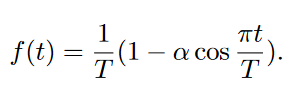

<!--
Based on the journaling method created by Intelligent Change:
- [Intelligent Change: Our Story](https://www.intelligentchange.com/pages/our-story)
- [The Five Minute Journal](https://www.intelligentchange.com/products/the-five-minute-journal)
-->

## **待做事项**

### **重要紧急**
- [x]  每日Arxiv
  - [x]  今日无相关论文更新
- [x]  每日论文阅读
  - [x]  重新读了一下A Image is Worth Multiple Words 论文的方法部分。
- [x]  整理StyleInversion实验结果。
- [x]  去看其他的文章，别人是如何inversion 纹理的。
- [x]  纹理的inversion是否需要mask背景
- [ ]  尝试猫狗数据的shape实验，是否可以直接用animal 
- [ ]  椅子的实验是否可以直接用object
- [ ]  6个实验的模型已经训练好，现在开始测试吧

### **不重要紧急**

### **重要不紧急**

### **不重要不紧急**

## **工作笔记**
* 在阅读Concept Decomposition文章时，注意到了一个时间步采样策略 ，这个策略参考自Revision文章。有助于 **improves stability and content separation**
  *   
  * 我还注意到了文章中提到的sub-concept学习的时候，需要满足一致性和区分性。即左儿子节点生成的图像应该都是一个sub-concept，而左右儿子节点之间应该是不同的，也就是区分性。文章直接用的是 生成图像然后用CLIP计算图像相似度实现的。

## **问题记录**

## **今日总结**

