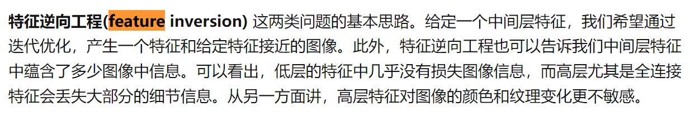

## **待做事项**

### **重要紧急**
- [x]  每日Arxiv
- [x]  每日论文阅读
- [ ] 浏览NIPS2023论文list，和自己相关的文章有多少  
- [ ]  实验安排
  - [x]  ViT-32 Mask CLS Embed实验
    - [x]  MLP Update
    - [x]  MLP No Update
    - [ ]  但需要注意的是loss weight=100似乎有点大
    - [ ]  是否5000 training step会带来过拟合，但是1000或者早一点会更好。
  - [ ]  Color Token实验单独
  - [ ]  Color+Shape联合实验
- [ ]  职业规划大赛事项
- [ ]  

### **不重要紧急**

- [ ] 学院填表 

### **重要不紧急**

### **不重要不紧急**

## **工作笔记**
* 什么是feature inversion
  *   

* E4T这篇论文在提取视觉特征的时候，参考了论文Splicing vit features for semantic appearance transfer.CVPR2022。
* 关于目前shapeinversion和Appearance inversion的思考：
  * 其实从最近的实验结果来看，原始的E4T是能够重建出和原图几乎一致的图像的。这个一致包括了Structure和Appearance。那也就是说，我们现在的*s的embedding的构造，以及模型的学习是能够覆盖到Structure和Appearance的，那我们现在要做的事情就是如何从这个这套原始的方案中，解析出纯净的Structure和Appearance的Inversion。
    * 之前马老师提出来的Mask Embedding Loss，我看结果如果只是使用这个loss，其实最终的生成结果都是不错的了，structure保持的也很好了。那同样的思路，是否就是说我们在E4T重建图像的基础上，引入不同aspect-aware的Reg Loss来约束，就能得到我们想要的每个Aspect。
    * 但是如果二者放到一块来学习，二者之间应该还要有个斥力，毕竟structure和Style关注的特征是不同的。

## **问题记录**

1.
2.
3.

## **今日总结**

1.
2.
3.
