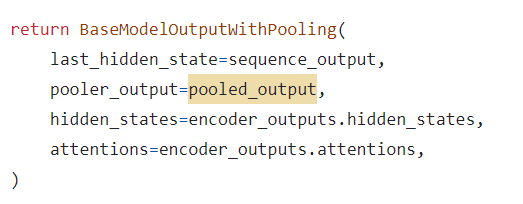

## **待做事项**

### **重要紧急**
- [x]  每日Arxiv
- [x]  每日论文阅读
- [ ]  实验安排
  - [ ]  shape encoder是否可以去掉Unet部分，直接就是Mask输入至ViT-B-32
  - [ ]  shape 和 embedding之间是直接相加，能否cross-attention，进行query
  - [ ]  mask的embedding和*s的embedding之间是否可以做cross-attention，然后在注入到SD中。
  - [x]  shape appearance joint inversion 初版代码完成
  - [x]  对应上代码的tuning_shapeinv代码写完
  - [x]  inference shape appearance 代码写完
  - [x]  检查上述代码的正确性
  - [x] 更正代码后的二次实验进行
    - [ ] 实验结果测试
    - [ ] 单个token分别测试，效果如何 
      - [ ] 一起domain tuning，单个inference
      - [ ] 分别domain tuning，分别inference
  - [ ] 基于DINO，单独的appearance结果的inversion
    - [ ]   
  

### **不重要紧急**

- [ ] 学业奖学金填表，今天搞定

### **重要不紧急**

### **不重要不紧急**

## **工作笔记**
* self-attention的K和V 与保持图像的Appearance有关

## **问题记录**

1.
2.
3.

## **今日总结**

1.
2.
3.
