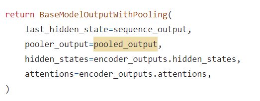

<!--
Based on the journaling method created by Intelligent Change:
- [Intelligent Change: Our Story](https://www.intelligentchange.com/pages/our-story)
- [The Five Minute Journal](https://www.intelligentchange.com/products/the-five-minute-journal)
-->

## **待做事项**

### **重要紧急**
- [x]  每日Arxiv
- [x]  每日论文阅读
- [x]  实验安排
  - [x]  Appearance实验
    - [x]  基于DINO，单独的appearance结果的inversion
    - [x]   
    - [x] 两组实验 (DINO输入的图像都是无背景的)
      - [x] 无attn loss，仅有appearance mse 
      - [x] 有attn loss，也有appearance mse
  - [ ] Appearance实验推理，看效果
    - [ ] 跑错了代码，重新开始
- [x]  Mask Loss 代码正确性检查
  - [X]  正确无误 
- [ ] 阅读并整理slicing ViT系列文章
- [ ] Splicing ViT论文中使用的是deepest layer，需要确定我现在的用法是否是正确的

### **不重要紧急**

- [x] 学院填表 
  - [x] 1式两份，所有签名需要手写，只填写推荐意见及之前的几栏。注意不要调整格式，整个表要打印在一页纸上。各位在下周五之前放到水务405 152工位，或者南五A270寝室
  - [x] 询问老师时间，电子签名

### **重要不紧急**

- [ ] 学习Huggingface Accelerate新技术

### **不重要不紧急**

- [ ] 整理电脑文件

## **工作笔记**
* 

## **问题记录**

1.
2.
3.

## **今日总结**

1.
2.
3.
