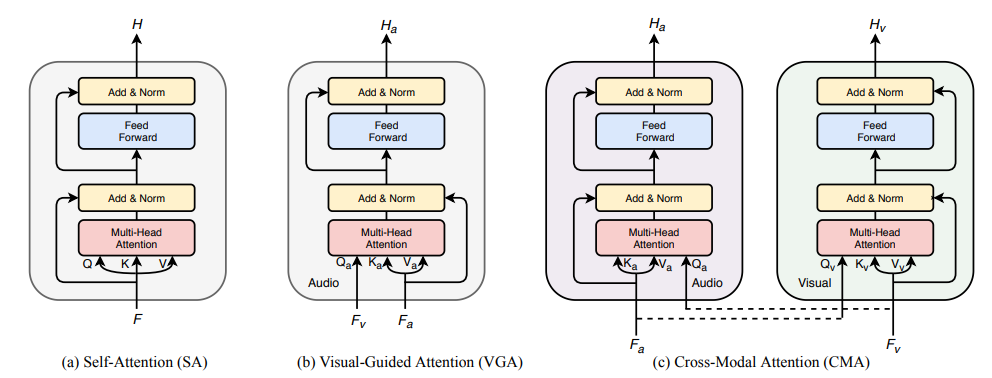

<!--
Based on the journaling method created by Intelligent Change:
- [Intelligent Change: Our Story](https://www.intelligentchange.com/pages/our-story)
- [The Five Minute Journal](https://www.intelligentchange.com/products/the-five-minute-journal)
-->

## **待做事项**

### **重要紧急**
- [x]  每日Arxiv
- [ ]  每日论文阅读
- [ ]  实验安排
  - [ ]  我们怀疑DINO-CLS-Feature和Domain-feature之间存在GAP
    - [x]  写了一个新的MLP Filter模块，用来处理Domain-feature
    - [x]  写了一个新的MLP Filter模块，用来处理DINO-CLS-Feature
    - [x]  测试MLP-Filter For DINO
    - [x]  测试MLP-Filter For Domain-feature
  - [ ]  Cross-feature Attention 
    - [x]  我们先写一个最基础的版本
    - [ ]  检查一下代码，搞一个清爽的版本出来
    - [ ]  然后其他的架构可以参考https://arxiv.org/pdf/2008.05789.pdf
      - [ ]    
- [ ] 关于各种self-attention的架构设计，这个talk可以参考看一下
  - [ ] https://www.bilibili.com/video/BV14u4y1n7XT/?spm_id_from=333.999.0.0&vd_source=45b600ad98b8c54b21b9561915c1ba61

### **不重要紧急**

### **重要不紧急**

### **不重要不紧急**

## **工作笔记**
* 

## **问题记录**

1.
2.
3.

## **今日总结**

1.
2.
3.
