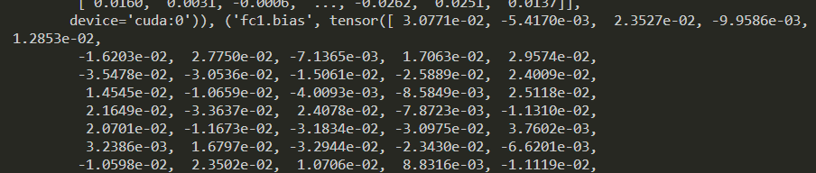
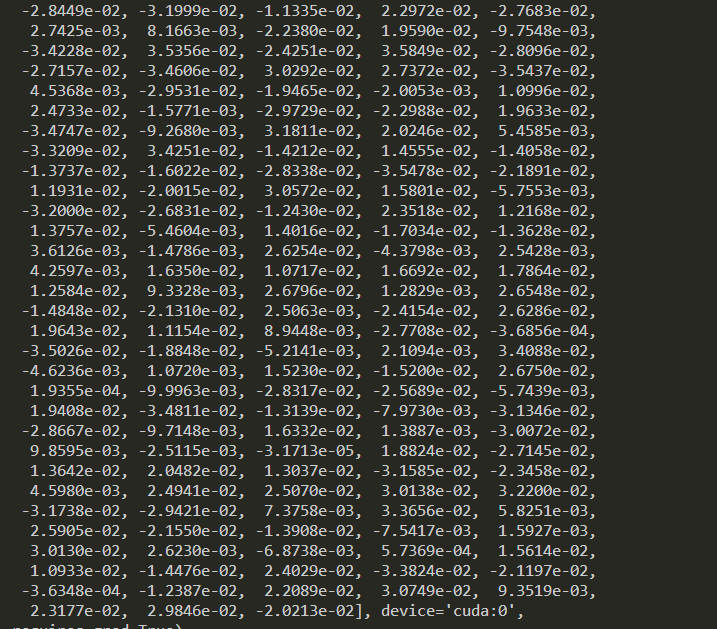
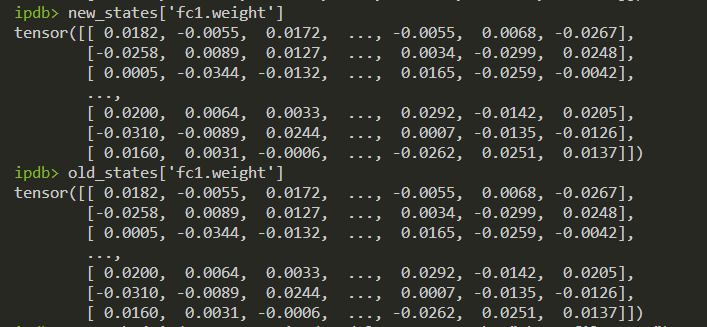

<!--
Based on the journaling method created by Intelligent Change:
- [Intelligent Change: Our Story](https://www.intelligentchange.com/pages/our-story)
- [The Five Minute Journal](https://www.intelligentchange.com/products/the-five-minute-journal)
-->

## **待做事项**

### **重要紧急**
- [x]  每日Arxiv
- [x]  每日论文阅读
- [ ]  实验安排
  - [ ]  teacher_e4t_model_name_or_path 需要在添加命令行参数

### **不重要紧急**

- [ ] 学院填表 

### **重要不紧急**

- [ ] 学习Huggingface Accelerate新技术

### **不重要不紧急**

- [ ] 整理电脑文件

  

  

## **工作笔记**
* 个人会议
  * 结论：X-Atten——Maskloss可以帮助E4T很好的聚合shape和appearance信息，但这个信息是hybrid
  * 我们目前想去解决这个问题是通过两种方式
    * 外部监督
    * 内部监督
    * 内外混合监督

## **问题记录**

1.
2.
3.

## **今日总结**

1.
2.
3.

  
