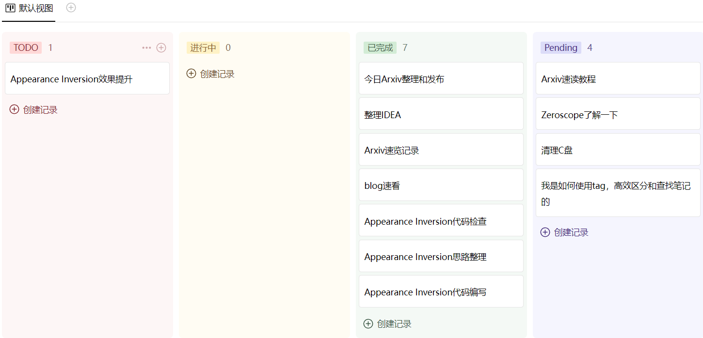

<!--
Based on the journaling method created by Intelligent Change:
- [Intelligent Change: Our Story](https://www.intelligentchange.com/pages/our-story)
- [The Five Minute Journal](https://www.intelligentchange.com/products/the-five-minute-journal)
-->

## **工作笔记**

* 认真的排查，Appearance Inversion的代码
  - [x] teacher model的训练，应该没有任何问题 
  - [x] Appearance Student Model pre-training代码 
    - [x] 数据加载没有问题
  - [x] Appearance Student Model Pretraining 代码没有问题
  - [x] Appearance Student Inversion 推理代码是否有问题
  - [ ] 需要检查，tuning student的时候，appearance学到了吗
  - [ ] 如果学到了，那就执行
    - [ ] inference的时候，将学到的*a应用到固定的区域上。

* IDEA
Panacea: Panoramic and Controllable Video Generation for Autonomous Driving

  

是否可以利用生成模型，去生成更复杂的数据，你比如这里是文本指定的左右方向，天气，季节等。这样的信息还是比较常见的，简单的。

是否可以生成一些特例数据，比如车祸现场，拥堵的路口。核心思想就是针对自动驾驶的特定问题去生成数据。

## **问题记录**
- [ ] student训练的时候，采用的是单一文本，是否引入多个文本，能够带来更好的效果
- [x] 推理生成的时候 提供了原图，是否应该去掉背景

## **今日总结**

  

今天主要完成的事情有：
* 20231128+20231129 Arxiv追踪和总结。同时掌握了使用Copilot快速浏览论文的方法。使用[[04_Resources.06_提示词汇总]]，即可。
* 检查Appearance Inversion的代码，实现了先生成reference image的appearance 图，然后基于此图，进行appearance inversion的方案。效果一般，还需要多分析
* 思考了一个Idea，关于自动驾驶视频生成的
* 记录并了解了产业界视频生成的主要产品。包括Gen2，Pika，SVD，pixelDance等等。