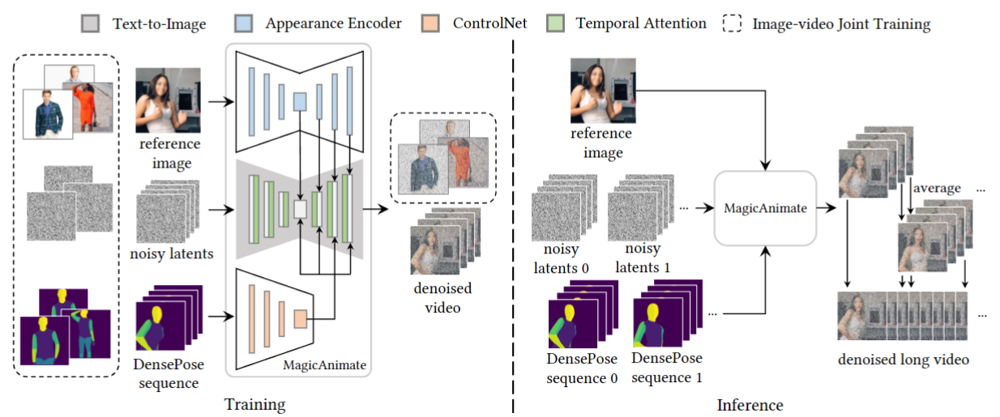
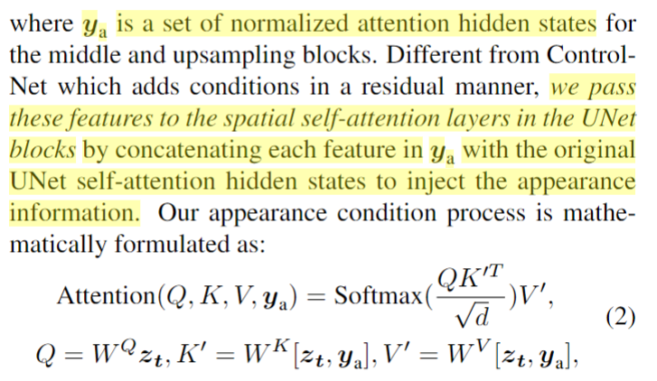

<!--
Based on the journaling method created by Intelligent Change:
- [Intelligent Change: Our Story](https://www.intelligentchange.com/pages/our-story)
- [The Five Minute Journal](https://www.intelligentchange.com/products/the-five-minute-journal)
-->

## **工作笔记**
今天打算做的实验：

**效仿MagicAnimate，加入Appearance Encoder**

  

这里面，作者为了保持appearance的一致，加入了Appearance Encoder，实际上就是UNet的Trainable Copy。

  

## **问题记录**

## **今日总结**

