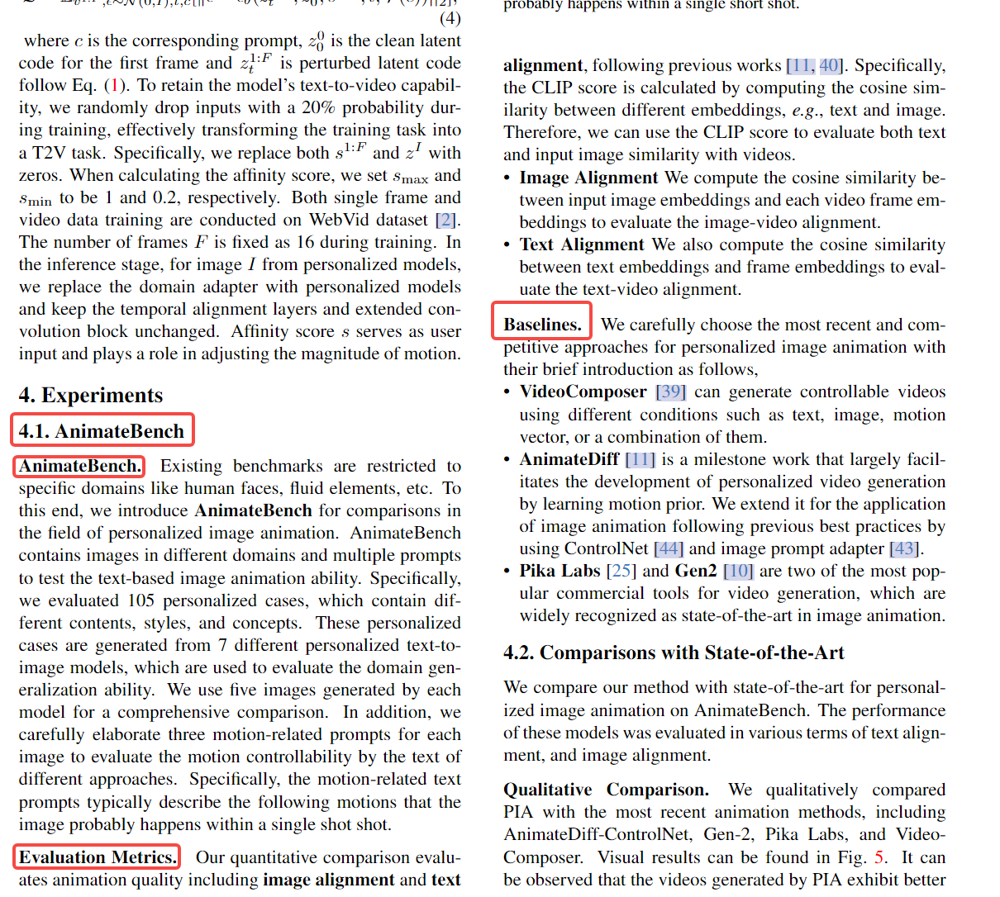

Overview应该包括内容：
* benchmark的基本信息
* 比较的baseline包括：
  * prospect和P+
* 我们采用的指标
  * 原始的指标和我们新设计的指标

目前还没有专门用于评估shape和appearance属性定制化的数据集，为了更好的推动属性定制化的发展和公平对比，我们提出了一个Subconcept benchmark。它由多张类别的图像组成，包括动物，建筑，人类等。这个benchmark可以用来做子属性定制化的定性和定量评估。

  

这篇论文的结构还挺不错的。

目前，评估形状和外观属性定制的专用数据集相对匮乏。为了实现对属性定制技术的公正比较，我们提出了一个新颖的基准，名为Subconcept Benchmark。他主要包括两个子数据集，shape图像数据共30张，appearance图像数据共30张。该基准包含来自不同领域的图像，包括动物、建筑、人物等。这个基准可以用于对子属性定制的定性和定量评估。

P+通过跨DDPM的16个Cross-attention layers上反转参考图实现多种子概念的定制化。然而P+受限于使用多张参考图。

Prospect通过将总采样时间步例如1000划分为10个子阶段从而实现多种子概念的定制化。然而这样的划分策略依赖于人类经验，可能会导致学习不充分。

P+ achieves attribute customization by inverting the reference image using 16 cross-attention layers across DDPM. However, its limitation lies in the requirement of multiple reference images.

Prospect achieves attribute customization by dividing the total sampling time steps, such as 1000, into 10 sub-stages. 
However, Prospect's human-guided division strategy may limit the model's ability to accurately customize certain attributes