## Title
* ESCDiff：Learning to extract sub-concept for example-driven text to image generation
* Shape and Appearance Inversion for Example-driven Text to Image Generation 


## Related Work
* CONFORM: Contrast is All You Need For High-Fidelity Text-to-Image Diffusion Models
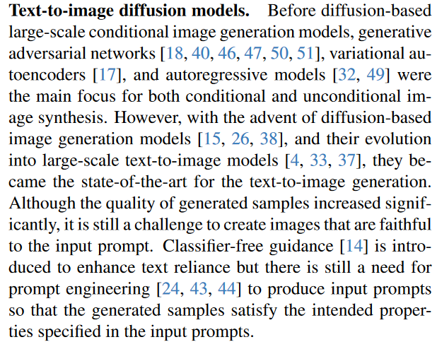  
* PortraitBooth: A Versatile Portrait Model for Fast Identity-preserved Personalization
  * 关于文本提示的缺点
     

* Compositional Inversion for Stable Diffusion Models
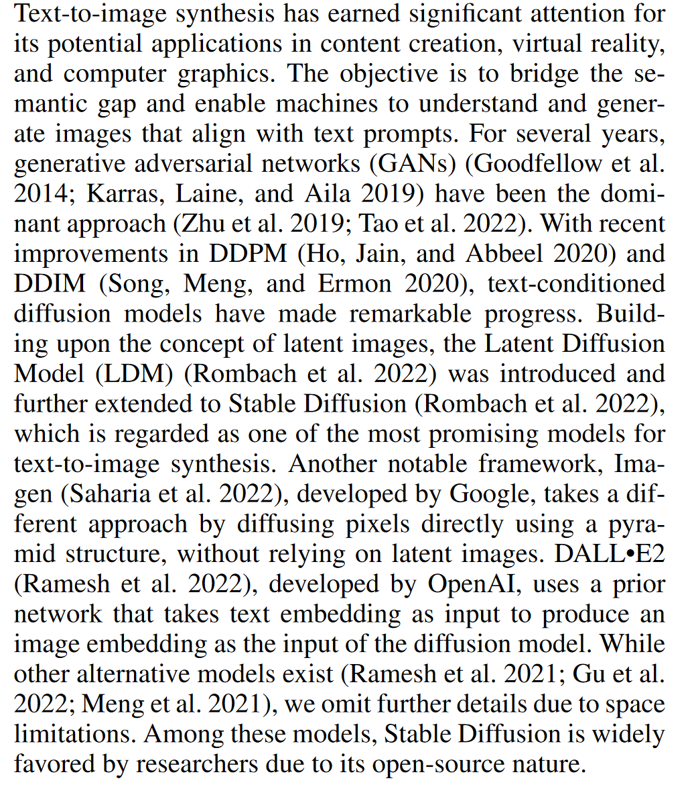  


* ELITE: Encoding Visual Concepts into Textual Embeddings for Customized Text-to-Image Generation
  

* E4T
  *   
  *   


* 中文粗写

```txt
文本引导的图像生成的发展取得了巨大的成功，早期的文本到图像的生成模型主要是利用基于生成对抗网络的结构，结合CLIP。然而，GANs的训练不稳定容易引起模型坍塌问题，同时GANs受限于结构化的场景例如人脸编辑，并且difficult to train at scale.

最近，基于Diffusion的生成模型成为了SOTA for Text-to-image generation 由于其前所未有的高质量和可控的生成能力。

即使这些方法在文本到图像合成领域取得了显著进展，但是这些方法仅仅利用文本在图像生成时，仍然缺乏细粒度的控制，同时也无法清晰的表述清楚用户真正的意图。

在本文中，我们的目的是希望模型能够从给定的输入参考图中学习用户感兴趣的图像内容，并利用其合成满足用户意图的新的图像，进而消除文本内在的不确定性和模糊性。

```
---

Related Work之 定制化图像生成

* PortraitBooth: A Versatile Portrait Model for Fast Identity-preserved Personalization
  *   


* Learning Disentangled Identifiers for Action-Customized Text-to-Image Generation  
  * 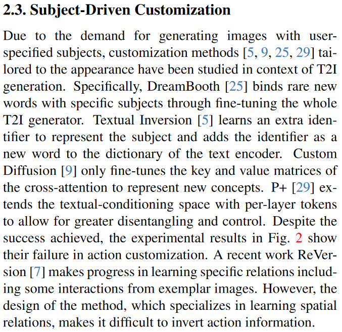  


* Break-A-Scene: Extracting Multiple Concepts from a Single Image
  * 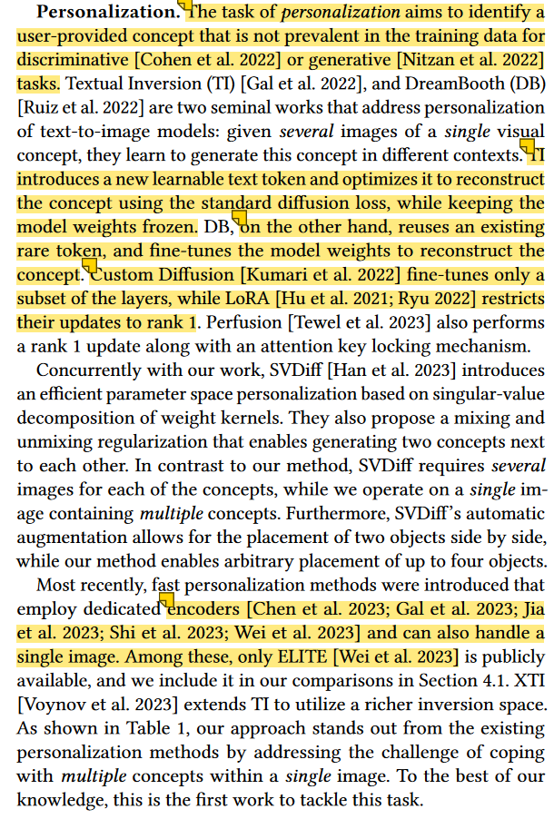  


* Encoder-based Domain Tuning for Fast Personalization of Text-to-Image Models
  *   
  *   


定制化视觉内容生成的目的是理解并识别用户提供的在训练数据中并不常见的视觉概念，并生成特定于这些概念的多样性的图像。当前的定制化生成工作主要分为两类，一类是基于微调的，另外一类是基于Encoder的。基于微调的方法的目的是优化文本embedding或者部分网络层来联系用户提供的新视觉概念。代表性的工作包括Textual Inversion，DreamBooth和Custom-Diffusion。
然而，这些方法都需要目标概念的多个图像，并且训练cost较高例如在高端 GPU 上持续数十分钟。

* Custom visual content generation aims to comprehend and identify uncommon visual concepts provided by users, generating diverse images specific to these concepts. Current approaches in customized generation primarily fall into two categories: fine-tuning-based and encoder-based methods. Fine-tuning approaches focus on optimizing text embeddings or specific network layers to relate to newly provided visual concepts. However, the fine-tuning-based approach necessitate multiple images of the target concept and entail high training costs, such as several minutes of continuous computation on high-end GPUs.


基于Encoder的方法的核心是用一个Encoder来从用户提供的新概念图像上直接地学习并提取表示这个图像概念的embedding，从而加速定制化过程。代表性工作主要包括ELITE，E4T，InstantBooth，FastComposer。即使这些方法可以实现秒级别的快速定制化，但是却无法完成细粒度视觉概念的精准反转和定制，例如shape和appearance。

* Encoder-based methods employ an encoder to directly learn and extract embeddings from user-provided images, thereby accelerating the customization process. Notable works in this field comprise ELITE, E4T, InstantBooth, and FastComposer. While these approaches enable rapid customization, they struggle to precisely reverse and customize fine-grained visual elements like shape and appearance.

子属性的反转和定制是一个重要的研究领域。其目的是实现给定图像子概念或子属性的定制而不是全局图像概念的定制，子概念主要包括shape，appearance等。当前的子属性定制化工作要么是划分多个子采样阶段，要么是划分不同的cross-attention层来学习特定的属性。然而这些方法需要人工精细的划分，这有可能会导致子属性纠缠在一起，无法实现高质量的属性定制。

* The exploration of sub-concept inversion and customization represents a pivotal area of study. Its aim is to customize specific image sub-concepts or sub-attributes rather than the entire image concept. Sub-concepts primarily include aspects such as shape and appearance. Current endeavors in sub-attribute customization involve either inverting a reference image across 16 cross-attention layers within the DDPM model, exemplified in methods like P+, or dividing the denoising process into multiple sub-timestep stages to learn different sub-concepts, as demonstrated in works like Prospect. However, these methods also exhibit limitations.  P+ requires multiple images to achieve sub-concept customization, while Prospect's division of the original 1000-step sampling into 10 stages relies solely on human empirical experience, resulting in insufficient learning of sub-concepts. Another shared drawback is the substantial time required—around 15-20 minutes—by both methods to accomplish sub-concept customization. 


---

## Method

### 总起段

* Encoder-based Domain Tuning for Fast Personalization of Text-to-Image Models
  * 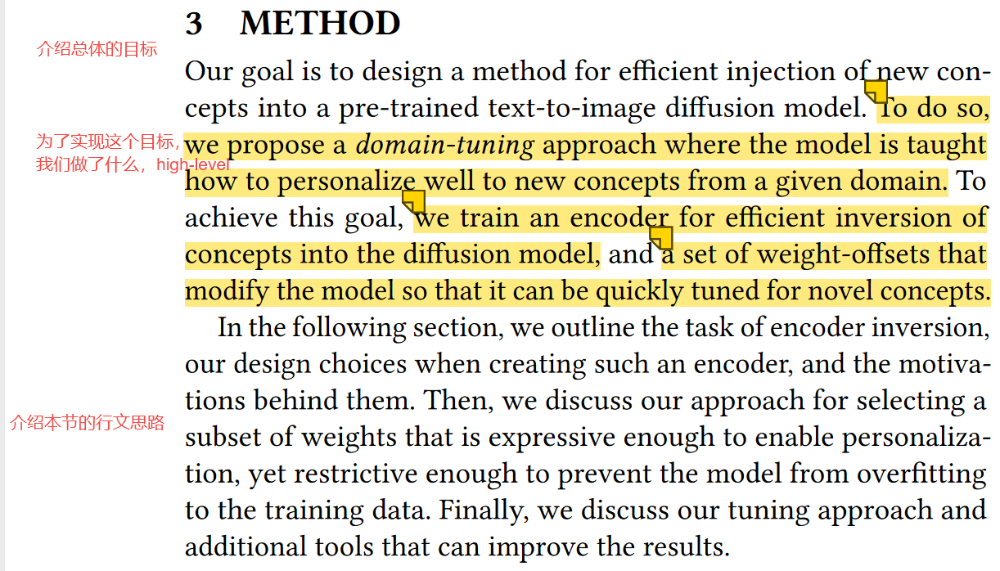  


* ELITE: Encoding Visual Concepts into Textual Embeddings for Customized Text-to-Image Generation
  * 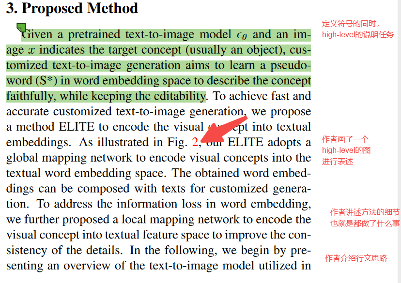  
  *   


* DreamBooth: Fine Tuning Text-to-Image Diffusion Models for Subject-Driven Generation
  *   
* AnyDoor: Zero-shot Object-level Image Customization
  * 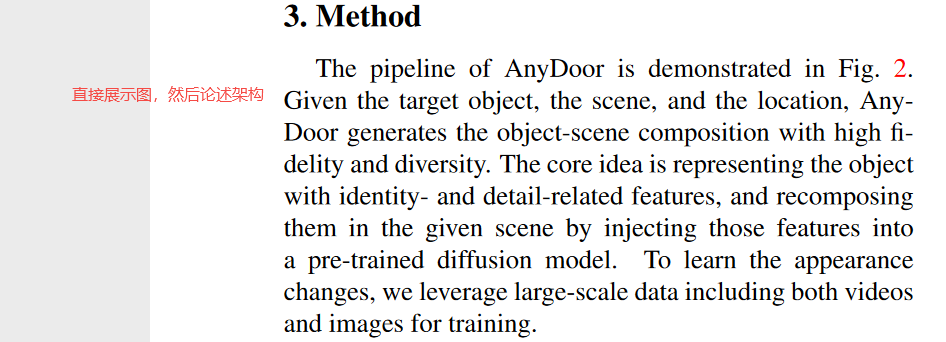  


### 中文写逻辑
总起段逻辑：
* 我们的目标是什么？
* 为了实现这样的目标，我们做的事情
  * 总体架构，文图并茂，global-level图需要新画
  * 细粒度来说，我们做了那些事情
* 行文思路介绍

初版内容：
* 我们的目标是设计一个方法，在仅仅给定一张图像的情况下，能够高效地实现用户提供的图像的子属性或者子概念的定制化，进而实现属级别的可控的文本到图像的生成。
  * Our goal is to develop a method that efficiently customizes sub-attributes, such as shape and appearance, within a single user-provided image, enabling precise control at the attribute level for text-to-image generation. 

* 为了实现这样的目标，我们提出了一个新的方法 ESCDiffusion，如图1所示，我们的方法采用了一个预训练的编码器编码参考图的视觉特征，这些特征分别经过shape filter模块和appearance filter模块提取shape相关和appearance相关的特征，并且和对应的单词embedding进行融合后，作为条件分别注入到shape Diffusion model和appearance Diffusion model，通过微调shape Diffusion model和appearance Diffusion model实现子属性即shape和appearance的学习和定制化。
  * To achieve our goal, we propose ESCDiffusion, a new method shown in Figure 1. We use a pre-trained encoder to capture visual features from the reference image. These features are processed separately by the shape and appearance filter modules to extract shape and appearance details. We then combine these features with word embeddings and separately inject them into the shape Diffusion model and the appearance Diffusion model. Fine-tuning these models helps to learn and customize specific attributes like shape and appearance.


* 在接下来的section中，我们首先在section 3.1中介绍text-to-image diffusion模型和Concept Inversion的背景。 然后我们在section 3.2中介绍我们的方法架构。接下来再section 3.3中介绍我们的属性-aware的微调策略。最后我们将介绍技术细节在section 3.4.


### Preliminary
* ELITE: Encoding Visual Concepts into Textual Embeddings for Customized Text-to-Image Generation
  * 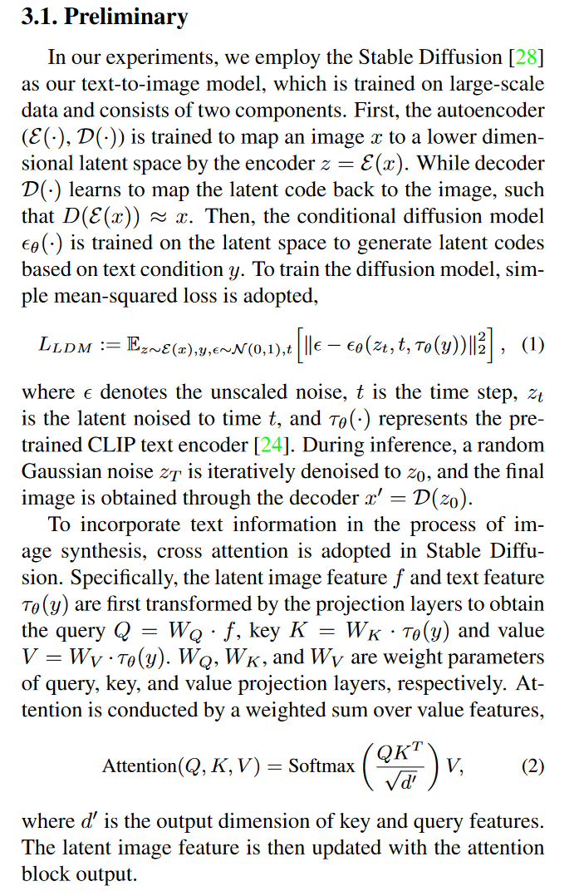  
* ReVersion: Diffusion-Based Relation Inversion from Images
  * 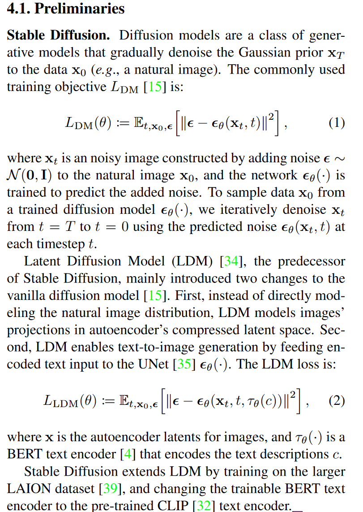  
  *   
  * 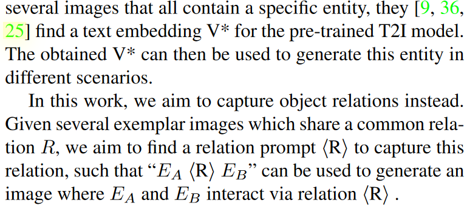  

* PortraitBooth: A Versatile Portrait Model for Fast Identity-preserved Personalization
  *   
  *   
* CONFORM: Contrast is All You Need For High-Fidelity Text-to-Image Diffusion Models
  *   

* Learning Disentangled Identifiers for Action-Customized Text-to-Image Generation
  * 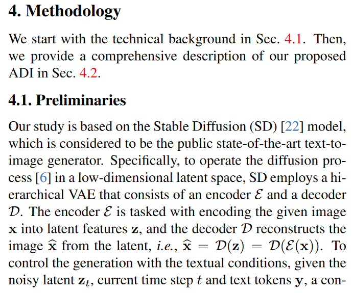  
  *   


* 中文写
  * DIffusion素材
当然，以下是Markdown格式的内容：


The diffusion model, a subclass of generative models, operates by progressively denoising a Gaussian prior `x_T` to reconstruct the original data `x_0`, such as natural images. The training objective `L_{DM}(\theta)` is defined as:

$$
L_{DM}(\theta) := \mathbb{E}_{t,x_0,\epsilon} \left[ \lVert \epsilon - \theta(x_t, t) \rVert^2 \right], \ \text{(1)}
$$

Here, `x_t` denotes the noisy image formed by introducing noise `\epsilon \sim N(0, I)` to `x_0`. The network `\theta(\cdot)` predicts and removes this added noise. The training process of the diffusion model consists of two stages: forward diffusion and backward denoising. The forward diffusion gradually introduces noise until the image becomes pure Gaussian noise. The backward denoising reverses this process by iteratively removing noise to reconstruct the original image. During inference, the diffusion model employs neural networks, typically adopting architectures like U-Net, to estimate and eliminate noise at each step, progressively reconstructing images from random nois。

先定义LDM是什么，学习的目标是什么。基于Diffusion，他有什么不同
之后，写SD是LDM的代表性工作，在本文中，我们的研究是基于Stable Diffusion model的。

Stable Diffusion是LDM的代表性工作，被看作是公开的SOTA 文本到图像的生成器，在本文中，我们的研究基于Stable Diffusion model。

