## **实验验证思路**

**实验细节简介：**


我们使用leopard图像作为reference图，然后训练Student Appearance Inversion模型。训练的固定文本prompt为“the appearance of *a”。 训练和推理所用的leopard图像均已剔除了背景，防止干扰。然后我们分别测试了以下四个prompt，查看生成的图像结果。

目前采用的方式是，Student输入纯噪音，然后希望其能够生成DINO视角下的appearance信息。88888

* the appearance of *a的生成结果
* a cat in the appearance of *a的生成结果
* *a的生成结果
* a *a cat的生成结果


  

可以从上图发现：
* inversion的信息，确实包含了appearance，但是还包含了很多其他的信息，比如pose，位置信息。这就说明，DINO视角下的appearance信息并不一定是最纯净的。

<font color="red">但是，通过这个实验，我们也有收获，那就是我们可以得到一张表示这个reference图像的appearance图像。那接下来，我是否可以利用这个appearance图像，进行inversion</font>

---

按照上述红字要求，我们也进行了实验。发现没有效果。

  


我们目前怀疑的原因主要如下：
1. appearance信息不对，即使我们有了一张显示的appearance图像，但是这张图象生成的时候可能就引入了一些不好prior。比如位置信息
   
**现在比较疑惑的是，为什么组合起来使用的时候，*a的效果一点都没有了。？**
* 可能是文本引导的问题？
* **还有一种是in the appearance of *a 学到的并不是appearance信息，而是另一种模式信息，当你使用a cat in the appearance of *a的时候，几乎所有图像的猫头都在中心位置，所以说这种模式信息的应用是没问题的，只是目前我们提取的appearance 信息是不对的。**


## 总结：
从结果来分析，目前所有生成的猫在位置，尤其是头的位置，都有着相同的模式。同时从豹纹图生成的结果来看，中间区域也是比较亮的，恰好猫的头多数出现在这里。因此：
* **我们将inversion的信息，应用到下游生成任务上是没问题。**
* 但是问题是，**我们没能很好inversion我们想要的信息，也就是appearance信息。**
  
---

~~也就是说，我们目前的利用Student生成一张appearance image可能是不正确的。这里可能天然就包含了某种不好的prior，因此导致后续的生成的cat基本都很类似~~

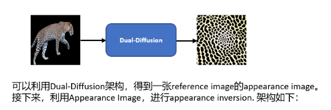  

如何验证这一点：选取了一张网上的豹纹图像，进行appearance inversion。

  


但是我们发现即使更换了网图，还是会出现这样的问题。那就说明，并不是由于appearance图像的问题造成的。还是我们在拥有了appearance image的时候，**使用teacher-student这种架构在学习的时候，学习的方式不对**。

## 总结：
其实从上述的实验及实验结果来看，我们大概可以得出这样的结论：
* *a 如果作为文本使用，可以得到对应的appearance效果
* 但是*a 和其他文本一起使用的时候，却不行。


**我已经分析出原因了：**

因为我们使用的是Student Model也就是UNet的所有参数finetuning，这个极容易引起网络的过拟合，然后我们这里使用的是豹纹图，这就导致最后Student UNet只能生成豹纹图，也就是过拟合到了豹纹图。那这个时候你在用其他文本作为条件，你会发现生成图像的底部都是豹纹。这就是过拟合了。

---


基于我们新的理解，实际上我们的Student Model，有点类似于Custom-Diffusion。只不过我们的初始*a embedding，是从teacher embedding projection过来的。此外我们学习的目标是子属性。因此，我们微调了下架构：

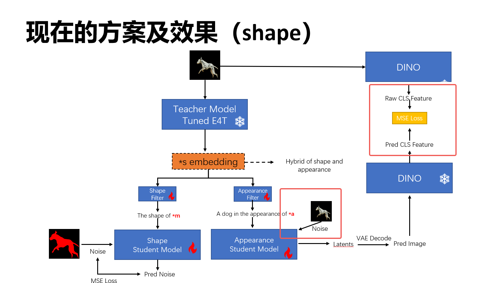  

在这里我们还是输入原图，然后文本是 a dog in the appearance of *a。但是我们希望损失约束建立在DINO CLS特征上。此处我们选择finetuning全部的Student Unet参数。


我们测试了猎豹--》公牛的效果：

  

可以发现，这是有效果的。只不过给人的感觉就是模型过拟合了。得到的图像非常假，但是猎豹的斑点确实是学到了。

**因此，这个过拟合现象，其实也在说明，当前的方案应该是可行的。我们需要找到一个合适的finetuning范围和拟合状态。**

实验如下：


## 优化 K，V [a dog in the appearance of *a] 输入，输出图像和原图像建立DINO CLS loss （running） 

**文件夹：debug_update_K_V_2023-12-01-21.05**

Appearance Student Model 输入是inference 图像加噪。

  


## 优化K，V，*a 噪音输入，输出图像和原图像建立DINO CLS loss （running）
debug_update_K_V_*a_noise_2023-12-01-22.06

效果和下面的实验结果类似，也无法实现appearance的inversion和利用。


## 优化K，V，损失为重建损失(Custom Diffusion) （running）
debug_update_K_V_custom_diffusion_2023-12-01-22.16

  

可以发现，如果输入是leopard，并且文本是a leopard in the appearance of *a. 并且使用CsutomDiffusion的方式学习。微调KV，我们发现，这个\*a学不出来。而且无法应用到其他测试种类，比如dog。


## 优化 K，V [a photo of the appearance of *a] 输入，输出图像和原图像建立DINO CLS loss （running）

没有效果。


---

**现在需要分析以下，为什么inference图是leopard，然后输入文本是a dog/cat/bull in the appearance of *a。**

为了验证和分析具体是什么起了作用，我们设置了以下四个实验：


* 去掉DINO Loss，改用重建损失

* 去掉teacher model
  

* **去掉leopard图像，改用noise输入**
  * work-exp-noise-input

没有效果。


* **将输入文本改成a *a leopard , 更新 KV，使用DINO CLS loss进行学习**
  * work-exp-dog2leopard
  * 有效


永远记住目前是过拟合的方式，别忘了去找一般化的解法：

还需要做的实验：

* 优化KV，然后leopard导出图baopwen输入，文本是the appearance of *a 或者 *a

- [x] 优化K，V，随意一张dog图输入，文本是a dog in the appearance of *a ，验证是否leopard图不是必须的 (running)
  - [x] 目前的实验结果来看，你输入的图像是什么，最终生成的图像就是什么。也就是说输入图像比重很大。然后DINO CLS loss。


* Student Model使用的是Teacher model的权重进行初始化实验？


* 使用Custom Diffusion训练inversion leopard appearance？
  * 不行

---
## **现阶段的故事如何讲？**

与其他Sub-Concept Inversion的工作不同，我们的核心是如何从预训练好的Inversion Model中提取Sub-Concept，这个做法无须人工划分时间阶段，也无需人为指定网络层级。并且每个属性的优化都能在3min中内得到。

我们的做法是：
* 首先我们假设一个预训练好的Inversion模型，应该已经包括了物体的shape和appearance信息，但是这些信息是hybrid sub-concept信息，我们要做的是如何从extracting这些信息
* 我们设计了一个Teacher-Student架构，预训练好的E4T作为Teacher Model，然后我们为每个Sub-Concept分别设置一个SD model作为student models。
* 然后我们为每个Sub-Concept Student Model，分别设置监督信号，要求在对应的文本提示下，进行学习。
  * 对于Shape Concept，我们采用了Mask作为输入，然后希望Student Model能够重建这个Mask。
  * 对于Appearance Concept，我们很难找到显式的表示，因此，我们提出了一个高效的基于Inversion的Appearance图像生成方法。 能够在1min左右得到一张inference图像的appearance图像。
  * 基于得到的Appearance图像，我们加噪输入给Student model，然后输入提示文本，得到Appearance concept的inevrsion。


* 将upblock解冻
* 多个文本输入至student model
* DINO target 图像做数据增强。
* VICO的架构是否可以用一下


* in the style of *a 实验有效。
  * work-exp-bull-aug-style-diffmse_2023-12-04-10.59
* 同上条件，改成appearance
  * work-exp-appearance-diffmse_2023-12-04-14.00
    * 实验有效
  
上述实验，我们**在MLP中添加了LN归一化**，同时把**预训练的时候的domain_class_token设置成了正确的leopard**，发现效果就好了。这说明，**E4T提取的*s，也很依赖文本类别的输入**。


* 上述实验的基础上，需要尝试的想法：
  * 添加DINO Loss
    * dotdog : 
    * leoaprd：work-exp-appearance-dogdot-diffmse-dinoloss_2023-12-04-18.43 **待测试**
  * 设置对比学习，远离shape embedding，接近于appearance等（BLIP可以描述一下）
  * 解决现在过拟合的程度
    * 查看定制化领域的经典解法即可

* 如果输入的是斑点狗，然后预训练类别改成dog。效果会怎么样？
  * work-exp-appearance-dogdot-diffmse_2023-12-04-18.48,**还是有效果**

* 验证当前有效果的原因是什么？
  * LayerNorm的作用？
    * [[02_Projects.01 科研项目.2023_SubConcept_Inversion.Experiments.Appearance_inversion_LayerNorm的作用、]]
  * Lr的原因吗？
  * Domain-class-token的原因吗？


* 既然LayerNorm能提高质量，那么请继续设计更好的MLP+layerNorm结构？


* appearance的效果会出现在背景区域？思考如何解决？
  * *a的作用区域不对？

* zip-Lora的思路
  * 查看一下微调的所有KV参数，都是必须的吗？如果不是，那也可以减少参数量进行微调


* 为什么每次推理得到的结果都是不一样的呢？
  * 没搞清楚


---


## 基于Visual Information Injection的方案，实验，结果分析

之前的方法，可以总结成一句话，也就是利用textual modal的inversion，实现appearance信息的extraction。但是我发现这种方式并不高效，对于一些简单的appearance比如黑白的斑点，是可以实现的。但是对于复杂的appearance效果就不太好了。因此，我们希望搞一个新的机制和架构，也就是利用Visual信息进行注入，作为条件，直接学习和保存appearance信息。

这里主要参考的文章包括：
* MagicAnimate: Temporally Consistent Human Image Animation using Diffusion Model
* X&Fuse: Fusing Visual Information in Text-to-Image Generation
* Subject-Diffusion: Open Domain Personalized Text-to-Image Generation without Test-time Fine-tuning


我们打算先尝试X&Fuse的架构，首先这个架构非常简单：

  

同时，我看到了一个类似的效果：
  
从这张图上来看，居然保持了appearance信息，虽然也有shape的信息。

因此，我们打算做如下实验：
* 引入visual appearance 信息，作为条件注入到现有的Student Model之中。
* 同时给定，文本信息，然后使用噪音重建损失来学习。
* 预期效果
  * 在推理采样的时候，我们使用目标文本和visual appearance信息，生成符合视觉信息和文本联合指导的图像。


我们先使用X&Fuse架构进行实验：


**UNet中不同的block的类型记录：**

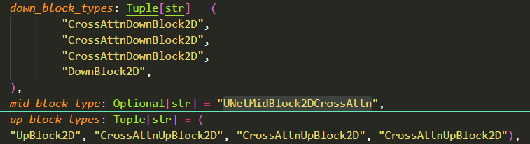  

代码编写思路：
从简单开始，先把图像信息加入到UpBlock中
1. up、down、mid，他们的输入都是两个hiddens，一个是noise，一个是条件图
2. 每个resnet block处理两次，分别是noise和条件图，得到的输出应该concat
3. 输入到self-attention的是noise和条件图concat的结果，经过self-attention的处理，输出的时候，应该split成两个。

上述过程有些繁琐，不太方便快速验证。


**attn1的name list：**
['down_blocks.0.attentions.0.transformer_blocks.0.attn1', 'down_blocks.0.attentions.1.transformer_blocks.0.attn1', 'down_blocks.1.attentions.0.transformer_blocks.0.attn1', 'down_blocks.1.attentions.1.transformer_blocks.0.attn1', 'down_blocks.2.attentions.0.transformer_blocks.0.attn1', 'down_blocks.2.attentions.1.transformer_blocks.0.attn1', 'up_blocks.1.attentions.0.transformer_blocks.0.attn1', 'up_blocks.1.attentions.1.transformer_blocks.0.attn1', 'up_blocks.1.attentions.2.transformer_blocks.0.attn1', 'up_blocks.2.attentions.0.transformer_blocks.0.attn1', 'up_blocks.2.attentions.1.transformer_blocks.0.attn1', 'up_blocks.2.attentions.2.transformer_blocks.0.attn1', 'up_blocks.3.attentions.0.transformer_blocks.0.attn1', 'up_blocks.3.attentions.1.transformer_blocks.0.attn1', 'up_blocks.3.attentions.2.transformer_blocks.0.attn1', 'mid_block.attentions.0.transformer_blocks.0.attn1']

**attn1的shape list：**
[torch.Size([1, 4096, 320]), torch.Size([1, 4096, 320]), torch.Size([1, 1024, 640]), torch.Size([1, 1024, 640]), torch.Size([1, 256, 1280]), torch.Size([1, 256, 1280]), torch.Size([1, 256, 1280]), torch.Size([1, 256, 1280]), torch.Size([1, 256, 1280]), torch.Size([1, 1024, 640]), torch.Size([1, 1024, 640]), torch.Size([1, 1024, 640]), torch.Size([1, 4096, 320]), torch.Size([1, 4096, 320]), torch.Size([1, 4096, 320]), torch.Size([1, 64, 1280])]


**up_block的name list：**
['up_blocks.1.attentions.0.transformer_blocks.0.attn1', 'up_blocks.1.attentions.1.transformer_blocks.0.attn1', 'up_blocks.1.attentions.2.transformer_blocks.0.attn1', 'up_blocks.2.attentions.0.transformer_blocks.0.attn1', 'up_blocks.2.attentions.1.transformer_blocks.0.attn1', 'up_blocks.2.attentions.2.transformer_blocks.0.attn1', 'up_blocks.3.attentions.0.transformer_blocks.0.attn1', 'up_blocks.3.attentions.1.transformer_blocks.0.attn1', 'up_blocks.3.attentions.2.transformer_blocks.0.attn1']

**up_block的shape list：**
[torch.Size([1, 256, 1280]), torch.Size([1, 256, 1280]), torch.Size([1, 256, 1280]), torch.Size([1, 1024, 640]), torch.Size([1, 1024, 640]), torch.Size([1, 1024, 640]), torch.Size([1, 4096, 320]), torch.Size([1, 4096, 320]), torch.Size([1, 4096, 320])]


采用MaginAnimate的方法进行验证：
* 核心代码目前已经实现了。
* 我看了controlNet，发现，其并没有给condition image加噪，我们这边也不加噪，直接就是干净的图像，经过VAE encode之后，然后注入到Unet中，提取其upsample block self-attention的hiddens。
* 基于提取到的hiddens，注入到student中，采取的方式和MagicAnimate 一致。


第一次实验的结果如下：
* 测试文本：a cat in the appearance of *a
* 效果如下：**有问题**

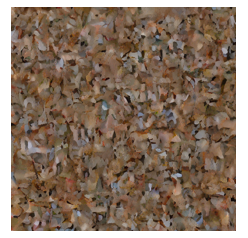  

**草，傻逼东西，代码写错了。直接输入噪音和再噪音上预测了。**

---

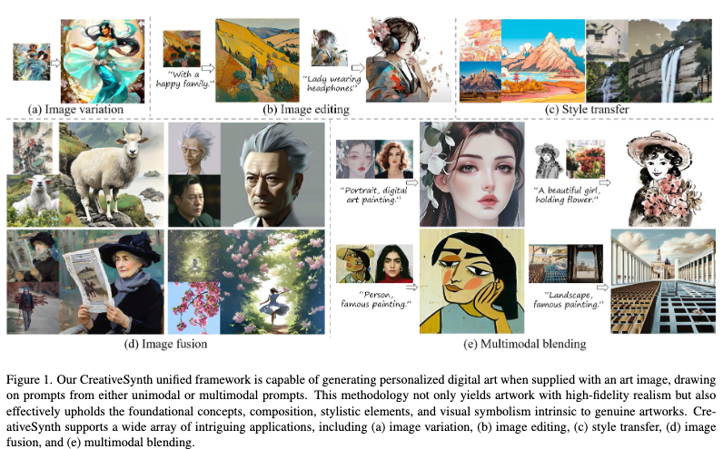

  

第一行是引入Appearance Encoder之后的结果。第二行是之前没有引入Appearance ENcoder的结果。可以发现，虽然引入Appearance Encoder之后，最终的效果并不好，而且得到的结果更加倾向于原始图像。但是对于appearance的保存还是很好的。

生成结果有以下几个问题：
* **全局模糊**
* **还是过拟合成了dog**


**<font color="red">如何解决全局模糊问题：</font>**
* 可能是up-sample block中的所有selfattn都被用来注入了。有点多，试着减少注入的个数？
* 是否concat的时候，我们应该乘以一个小权重？
* MagicAnimate中的Appearance Encoder是trainable的，我们这里是冻结的？


**实验一：仅仅在最后三层self-attention中注入appearance**
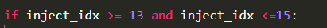  

**<font color="green">结论：有效，成功解决了图像模糊现象和问题</font>**

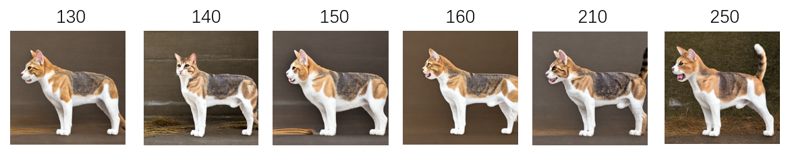  

如上图所示，目前可以得到appearance一致的结果了。但是可以发现，reference image的pose等其他信息也被保留下来了。

**为什么会有shape信息保留下来？**

* 在MagicAnimate论文中，原文也论述了Appearance Encoder是可以保留外观，纹理，同时包括content和pose等其他信息。
* 可能在upblcok中，不同的self-attention传达着不同的信息。


**<font color="red">研究一下的不同的self-attention的作用和角色？</font>**

上述实验已经验证了res=64的三层，发现会把shape保留下来。

接下来，我们保留res=32的三层，也就是10，11，12

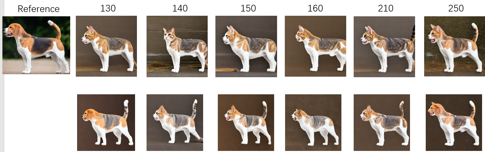  

下面这一行的结果是上述实验设置对应的结果，我们发现：

**<font color="green">结论：10-13层，也没有完全关注appearance</font>**


**<font color="red">7-9层self-attention在关注什么？</font>**

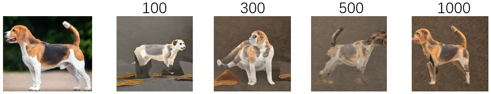  


**<font color="green">res较低的7-9层，也有一定的保持能力，但是会带来图像模糊问题。</font>**


**<font color="red">13,14,15如果分别注入，会有什么问题？</font>**

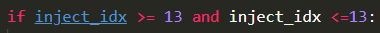  

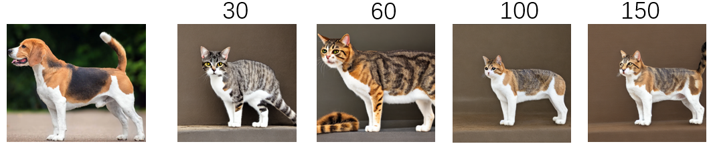  

**<font color="green">13层也会有这样的问题</font>**


**<font color="red">突然想到，appearance信息应该是后期才有效果，如果我在推理的时候后期再注入呢？</font>**

后期注入比如<200, 我发现pose还是不变。


**<font color="red">怀疑pose 布局等信息，可能不是Appearance注入带来的？</font>**

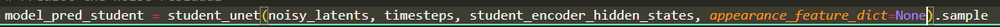  
直接采用不注入的形式进行训练。


**实验证明，实际上上述效果都是过拟合了全量UNet造成的。而不是Appearance注入带来的。艹！**

---

**仅微调Cross-Attention KV，然后使用13-15 self-attention注入。**

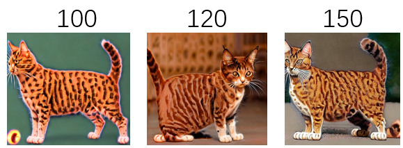  

可以发现，还是会有pose的注入。

基于此结果，如果我只在200时间步内，注入Appearance 信息呢？

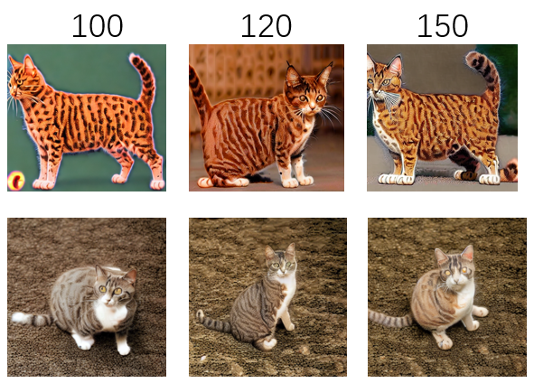  


**之前我们训练都是训练全部的参数，最终的结果appearance基本都被保持下来了。只是猫太像狗了。但是这个却说明了，过拟合也是有用的啊。如果我们只是微调KV参数，最终的结果虽然能得到不同的猫，但是你会发现appearance基本保存不下来。这就说明过拟合效果不够。**

**由此，我微调全部的upblcok** 

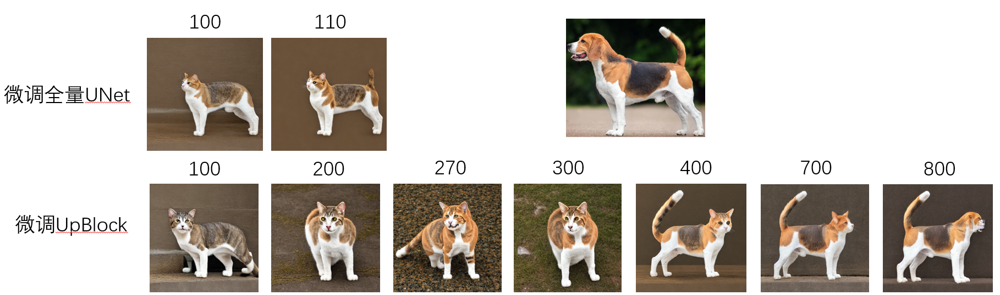  

* 通过上下对比，我发现如果我们微调全量的UNet，也就是Down+Mid+Up的话，shape和Appearance信息很快就会被学出来，而且生成的结果也都保持着原来的shape和appearance。
* 但是，如果我们只微调UpBlock的时候，我们发现appearance和shape的学习顺序是先后的，在200-300期间，appearance信息率先被学习出来。一直到后期400-800的时候，我们发现shape信息也出来了，而且越来越像dog了。

这是否在说明，对于UNet来说，Down Block是负责shape学习的，而Upblock是负责appearance学习的？


**由此，我微调全部的downblock？**

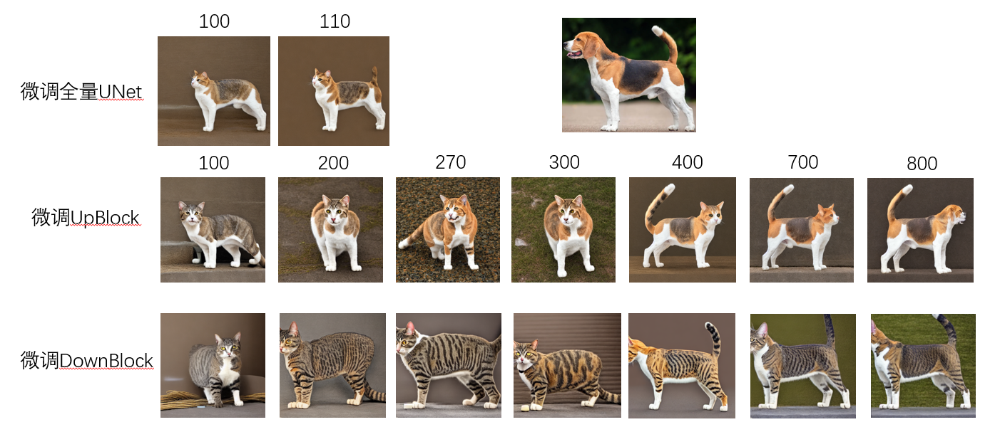  


* 从上述结果来看，可以发现如果仅仅微调UpBlock，我们会得到reference image的appearance信息。
* 而如果只微调DownBlock的话，可以发现会逐渐得到这个reference image的shape。


**还不错的结果如下：**

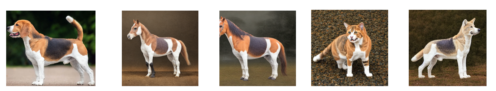  

这些结果都是训练的时候使用了appearance injection，推理的时候没有使用appearance injection。


**使用appearance 注入，在推理的时候**

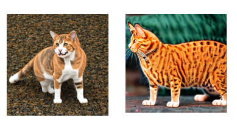  

不明白为什么在推理时候，注入appearance信息时，却变成了这个吊样子。难道说当前的self-attention 提取的信息也不是很正确，并不是纯净的appearance信息。


---

## 2023年12月12日10:54:57 总结：

**<font color="green">通过上述实验的论述，我发现只需要微调upblock就能够实现参考图像 appearance信息的保存，如上述的dog结果所示。</font>**

<font color="red">但是第二个问题也随之而来，即使我们现在微调了Upblock的参数，确实也能够实现appearance信息的学习和迁移，但是还是会把reference图像的shape或者结构信息学出来，如下图所示：</font>

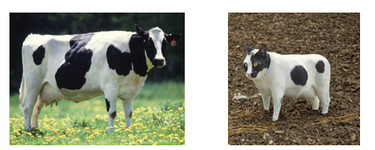  

* 虽然学习到了cow的黑白斑点，但是生成的猫的体型也很类似于cow。
* appearance的学习好像也是有语义对应的。

分析可能得原因如下：
* 微调整个upblcok可能还是有点多，看看能否基于res进行训练。而不是全部微调。
* 如果只是学习一张图，那能否引入更多的数据增强手段。
* 如果是基于LoRA的话，能否做的更好？

---

## 2023年12月12日12:42:47实验日志

### 去掉in the appearance of *a, 直接a *a cow/dog等。

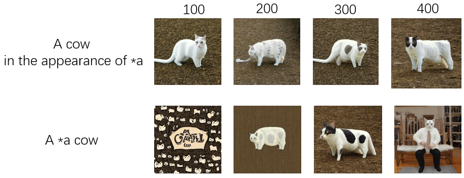  

这么对比来看，text prompt的影像也很大啊。而且目前的架构，也需要简化，给人感觉teacher其实没那么有用。


### 去掉teacher，保持a cow in the appearance of *a 进行实验

```bash
--domain_embed_scale=0.0
```

通过实验对比，发现影像不大。即使不使用Teacher提供的embedding，只需要微调Student的Upblock也能学到appearance信息。
不过还是保留吧。


### 按照res，成块的微调UNet

* 目前保留了所有的attention of upblock，resnet都没有更新（实验中）


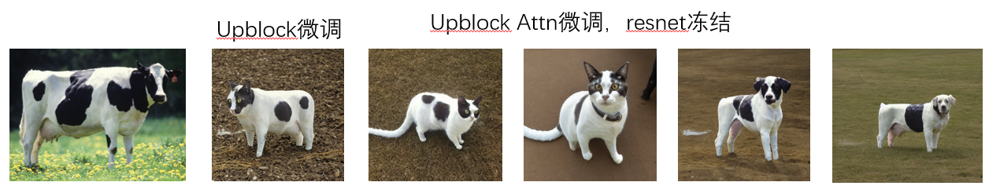  


* 有一定的改善，可以发现，cat的生成，在appearance上保持的还可以，同时在shape的也没有完全一致，这说明当前的做法，有助于进一步缓解过拟合。
* 但是在训练后期还是会出现，shape完全和reference 图一致的结果。这有可能说明，当前还是没有找到正确的方法或者微调区域。（最后的dog）


### 只微调Upblock2，3
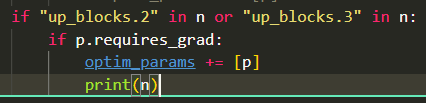  


### 上述实验汇总分析：


* 我们首先做了第一个实验，就是微调upblock的全部参数，我们发现可以实现appearance的保留和迁移，但是参考图的shape和结构也会被学习出来，并在生成图像上有所体现。
* 之后，我们怀疑是resblock的原因，因此，我们冻结了upblock中的所有resnet网络，只训练attention。但是我们发现，还是会学习到appearance，同时shape和结构也会被保留下来。这说明，resnet其实并不是主要原因。 
* 此外，我们做了第三个实验，upblock共包含0，1，2，3个子模块，我们只微调2，3模块，appearance的学习并不充分，但是shape和结构就不会被学出来。这就说明appearance的学习可能主要就是依靠upblock的0，1模块，同时shape和结构也是由这个模块学习的。
  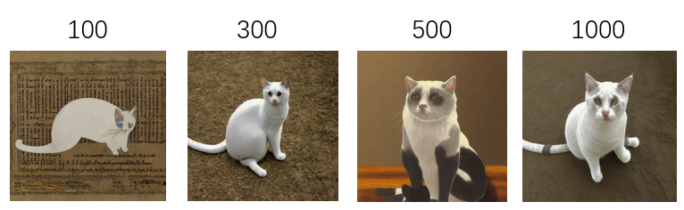  

* 为了验证上述想法呢，我们做了第四个实验，微调1，2，3模块，我们发现，appearance的学习更加充分，但是也会有几何和结构被学习出来。这就说明了其实appearance和shape的学习更多的集中在upblock的1模块。
  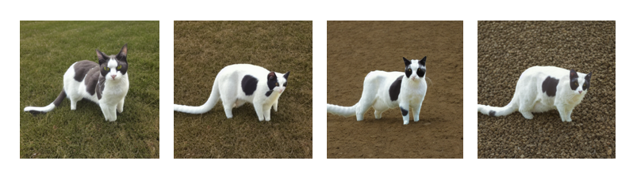  


### 只微调upblock_1

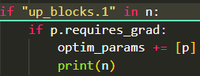  

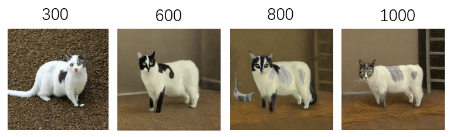  

从这组实验结果来看，我们发现upblock的1 module主要还是学习了shape，对于appearance的学习也涉及了一些，但是最主要的还是shape信息在此处被学习出来了。
感觉现在的结论比较清晰了。
* upblock中，block1是主要学习shape的layer。
* 对于appearance的学习，block1、2、3都有涉及。

### 只微调upblock_2

能够学到appearance信息，但是不会学习到shape信息。


### 只微调upblock_2
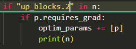  

* appearance能学到，但是不明显。
* shape完全学不到。


### upblock中得module 1 包括了attention-0，attention-1，attention-2，验证一下不同的作用是什么？


* 只微调up_blocks.1.attentions.2
  * 能够学到appearance信息，但是不明显。
  * 即使学到1000步，shape信息还是没有学到。
  * **和实验 _只微调upblock_1_ 相比，shape的信息应该是upblock.1.attention.0和.1负责学到的。**


* 微调up_blocks.1.attentions.0和up_blocks.1.attentions.1
  * 后期会出现shape学习到了的现象
  * 但是appearance的学习不是特别的好。
  * 整体来说现象都不明显。


### 微调upblock的attention2+upblock的module2和module3
* 确实没有学到shape，但是appearance的信息也不多。
* 这有可能说明，还需要再往前找。


### 微调upblock的attention1-2+upblock的module2和module3


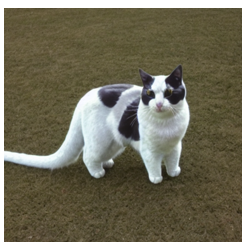  

能得到类似的效果。

### 实验总结

* 从上述实验来看，精细的设计和选取微调模块，效果都不好，莫不如直接微调整个upblock。这样的话效果就很明显。
* 接下来的实验中，不再尝试各种选层微调了，没有太大意义。
* 接下来需要做的事情：
  * 在多个数据上，验证appearance和shape分别学习的结论 
  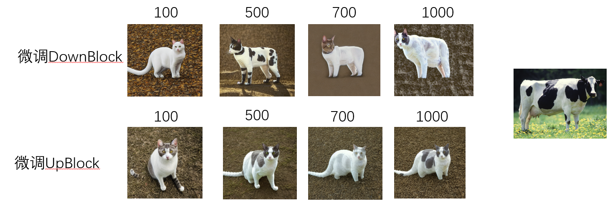  
  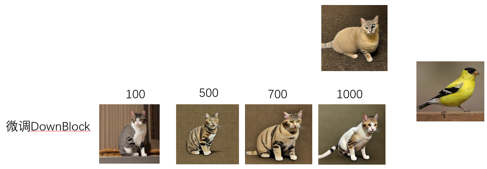  
  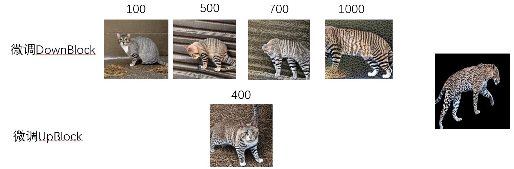  

  * 在多个数据上，测试下生成的效果，准备汇报内容。


### Diffusion in Style Idea实验

* 如何获取参考图的appearance mean和std呢？
  * 由于只有一张参考图，因此，我可以多次数据增强（空间）这张图，可以获得多张图像。
  * 使用VAE encode这些图像，然后求解mean和std
  * 将mean和std用于noise采样


## TODO
* 基于上述发现，尝试测试更多的例子
* domain_scale如果放大 会怎么样，比如0.5 1.0
* 我们现在的文本输入是否太简单了，能否BLIP2给一个描述输入进去呢？
* 最终能否做成E4T那样，也是在一个domain上训练，然后整个domain的appearance 和 shape finetuning一下，就可以了。
* appearance和shape，并不是在同一阶段生成的，shape或者轮廓应该是在初期，也就是1000步左右，而appearance信息则是在后期生成的。这里是否可以用一个之前设计的时间步采样策略，让appearance information优先被提取出来。
* 推理的时候，我们使用的是一张图，然后提取appearance 信息，如果有多张增强的图像，是不是就不会受限于这个朝向了。
* ~~去掉in the appearance of *a. 直接就是a *a cow~~
* ~~尝试MasaCtrl的方式？及其在Video上的应用方式？~~
* ~~逐层分析self-attention的影响？~~
* ~~能否从输入端解决这个问题，如果输入端不是一张狗的图像，而是狗的纹理图呢？~~
* ~~不使用全量Unet参数进行微调，只微调部分？~~


```bash
up_blocks.0.resnets.0.norm1.weight
up_blocks.0.resnets.0.norm1.bias
up_blocks.0.resnets.0.conv1.weight
up_blocks.0.resnets.0.conv1.bias
up_blocks.0.resnets.0.time_emb_proj.weight
up_blocks.0.resnets.0.time_emb_proj.bias
up_blocks.0.resnets.0.norm2.weight
up_blocks.0.resnets.0.norm2.bias
up_blocks.0.resnets.0.conv2.weight
up_blocks.0.resnets.0.conv2.bias
up_blocks.0.resnets.0.conv_shortcut.weight
up_blocks.0.resnets.0.conv_shortcut.bias
up_blocks.0.resnets.1.norm1.weight
up_blocks.0.resnets.1.norm1.bias
up_blocks.0.resnets.1.conv1.weight
up_blocks.0.resnets.1.conv1.bias
up_blocks.0.resnets.1.time_emb_proj.weight
up_blocks.0.resnets.1.time_emb_proj.bias
up_blocks.0.resnets.1.norm2.weight
up_blocks.0.resnets.1.norm2.bias
up_blocks.0.resnets.1.conv2.weight
up_blocks.0.resnets.1.conv2.bias
up_blocks.0.resnets.1.conv_shortcut.weight
up_blocks.0.resnets.1.conv_shortcut.bias
up_blocks.0.resnets.2.norm1.weight
up_blocks.0.resnets.2.norm1.bias
up_blocks.0.resnets.2.conv1.weight
up_blocks.0.resnets.2.conv1.bias
up_blocks.0.resnets.2.time_emb_proj.weight
up_blocks.0.resnets.2.time_emb_proj.bias
up_blocks.0.resnets.2.norm2.weight
up_blocks.0.resnets.2.norm2.bias
up_blocks.0.resnets.2.conv2.weight
up_blocks.0.resnets.2.conv2.bias
up_blocks.0.resnets.2.conv_shortcut.weight
up_blocks.0.resnets.2.conv_shortcut.bias
up_blocks.0.upsamplers.0.conv.weight
up_blocks.0.upsamplers.0.conv.bias
up_blocks.1.attentions.0.norm.weight
up_blocks.1.attentions.0.norm.bias
up_blocks.1.attentions.0.proj_in.weight
up_blocks.1.attentions.0.proj_in.bias
up_blocks.1.attentions.0.transformer_blocks.0.attn1.to_q.weight
up_blocks.1.attentions.0.transformer_blocks.0.attn1.to_k.weight
up_blocks.1.attentions.0.transformer_blocks.0.attn1.to_v.weight
up_blocks.1.attentions.0.transformer_blocks.0.attn1.to_out.0.weight
up_blocks.1.attentions.0.transformer_blocks.0.attn1.to_out.0.bias
up_blocks.1.attentions.0.transformer_blocks.0.attn1.wo_q.v
up_blocks.1.attentions.0.transformer_blocks.0.attn1.wo_q.linear1.weight
up_blocks.1.attentions.0.transformer_blocks.0.attn1.wo_q.linear1.bias
up_blocks.1.attentions.0.transformer_blocks.0.attn1.wo_q.linear2.weight
up_blocks.1.attentions.0.transformer_blocks.0.attn1.wo_q.linear2.bias
up_blocks.1.attentions.0.transformer_blocks.0.attn1.wo_q.linear_column.weight
up_blocks.1.attentions.0.transformer_blocks.0.attn1.wo_q.linear_column.bias
up_blocks.1.attentions.0.transformer_blocks.0.attn1.wo_q.linear_row.weight
up_blocks.1.attentions.0.transformer_blocks.0.attn1.wo_q.linear_row.bias
up_blocks.1.attentions.0.transformer_blocks.0.attn1.wo_k.v
up_blocks.1.attentions.0.transformer_blocks.0.attn1.wo_k.linear1.weight
up_blocks.1.attentions.0.transformer_blocks.0.attn1.wo_k.linear1.bias
up_blocks.1.attentions.0.transformer_blocks.0.attn1.wo_k.linear2.weight
up_blocks.1.attentions.0.transformer_blocks.0.attn1.wo_k.linear2.bias
up_blocks.1.attentions.0.transformer_blocks.0.attn1.wo_k.linear_column.weight
up_blocks.1.attentions.0.transformer_blocks.0.attn1.wo_k.linear_column.bias
up_blocks.1.attentions.0.transformer_blocks.0.attn1.wo_k.linear_row.weight
up_blocks.1.attentions.0.transformer_blocks.0.attn1.wo_k.linear_row.bias
up_blocks.1.attentions.0.transformer_blocks.0.attn1.wo_v.v
up_blocks.1.attentions.0.transformer_blocks.0.attn1.wo_v.linear1.weight
up_blocks.1.attentions.0.transformer_blocks.0.attn1.wo_v.linear1.bias
up_blocks.1.attentions.0.transformer_blocks.0.attn1.wo_v.linear2.weight
up_blocks.1.attentions.0.transformer_blocks.0.attn1.wo_v.linear2.bias
up_blocks.1.attentions.0.transformer_blocks.0.attn1.wo_v.linear_column.weight
up_blocks.1.attentions.0.transformer_blocks.0.attn1.wo_v.linear_column.bias
up_blocks.1.attentions.0.transformer_blocks.0.attn1.wo_v.linear_row.weight
up_blocks.1.attentions.0.transformer_blocks.0.attn1.wo_v.linear_row.bias
up_blocks.1.attentions.0.transformer_blocks.0.ff.net.0.proj.weight
up_blocks.1.attentions.0.transformer_blocks.0.ff.net.0.proj.bias
up_blocks.1.attentions.0.transformer_blocks.0.ff.net.2.weight
up_blocks.1.attentions.0.transformer_blocks.0.ff.net.2.bias
up_blocks.1.attentions.0.transformer_blocks.0.attn2.to_q.weight
up_blocks.1.attentions.0.transformer_blocks.0.attn2.to_k.weight
up_blocks.1.attentions.0.transformer_blocks.0.attn2.to_v.weight
up_blocks.1.attentions.0.transformer_blocks.0.attn2.to_out.0.weight
up_blocks.1.attentions.0.transformer_blocks.0.attn2.to_out.0.bias
up_blocks.1.attentions.0.transformer_blocks.0.attn2.wo_q.v
up_blocks.1.attentions.0.transformer_blocks.0.attn2.wo_q.linear1.weight
up_blocks.1.attentions.0.transformer_blocks.0.attn2.wo_q.linear1.bias
up_blocks.1.attentions.0.transformer_blocks.0.attn2.wo_q.linear2.weight
up_blocks.1.attentions.0.transformer_blocks.0.attn2.wo_q.linear2.bias
up_blocks.1.attentions.0.transformer_blocks.0.attn2.wo_q.linear_column.weight
up_blocks.1.attentions.0.transformer_blocks.0.attn2.wo_q.linear_column.bias
up_blocks.1.attentions.0.transformer_blocks.0.attn2.wo_q.linear_row.weight
up_blocks.1.attentions.0.transformer_blocks.0.attn2.wo_q.linear_row.bias
up_blocks.1.attentions.0.transformer_blocks.0.attn2.wo_k.v
up_blocks.1.attentions.0.transformer_blocks.0.attn2.wo_k.linear1.weight
up_blocks.1.attentions.0.transformer_blocks.0.attn2.wo_k.linear1.bias
up_blocks.1.attentions.0.transformer_blocks.0.attn2.wo_k.linear2.weight
up_blocks.1.attentions.0.transformer_blocks.0.attn2.wo_k.linear2.bias
up_blocks.1.attentions.0.transformer_blocks.0.attn2.wo_k.linear_column.weight
up_blocks.1.attentions.0.transformer_blocks.0.attn2.wo_k.linear_column.bias
up_blocks.1.attentions.0.transformer_blocks.0.attn2.wo_k.linear_row.weight
up_blocks.1.attentions.0.transformer_blocks.0.attn2.wo_k.linear_row.bias
up_blocks.1.attentions.0.transformer_blocks.0.attn2.wo_v.v
up_blocks.1.attentions.0.transformer_blocks.0.attn2.wo_v.linear1.weight
up_blocks.1.attentions.0.transformer_blocks.0.attn2.wo_v.linear1.bias
up_blocks.1.attentions.0.transformer_blocks.0.attn2.wo_v.linear2.weight
up_blocks.1.attentions.0.transformer_blocks.0.attn2.wo_v.linear2.bias
up_blocks.1.attentions.0.transformer_blocks.0.attn2.wo_v.linear_column.weight
up_blocks.1.attentions.0.transformer_blocks.0.attn2.wo_v.linear_column.bias
up_blocks.1.attentions.0.transformer_blocks.0.attn2.wo_v.linear_row.weight
up_blocks.1.attentions.0.transformer_blocks.0.attn2.wo_v.linear_row.bias
up_blocks.1.attentions.0.transformer_blocks.0.norm1.weight
up_blocks.1.attentions.0.transformer_blocks.0.norm1.bias
up_blocks.1.attentions.0.transformer_blocks.0.norm2.weight
up_blocks.1.attentions.0.transformer_blocks.0.norm2.bias
up_blocks.1.attentions.0.transformer_blocks.0.norm3.weight
up_blocks.1.attentions.0.transformer_blocks.0.norm3.bias
up_blocks.1.attentions.0.proj_out.weight
up_blocks.1.attentions.0.proj_out.bias
up_blocks.1.attentions.1.norm.weight
up_blocks.1.attentions.1.norm.bias
up_blocks.1.attentions.1.proj_in.weight
up_blocks.1.attentions.1.proj_in.bias
up_blocks.1.attentions.1.transformer_blocks.0.attn1.to_q.weight
up_blocks.1.attentions.1.transformer_blocks.0.attn1.to_k.weight
up_blocks.1.attentions.1.transformer_blocks.0.attn1.to_v.weight
up_blocks.1.attentions.1.transformer_blocks.0.attn1.to_out.0.weight
up_blocks.1.attentions.1.transformer_blocks.0.attn1.to_out.0.bias
up_blocks.1.attentions.1.transformer_blocks.0.attn1.wo_q.v
up_blocks.1.attentions.1.transformer_blocks.0.attn1.wo_q.linear1.weight
up_blocks.1.attentions.1.transformer_blocks.0.attn1.wo_q.linear1.bias
up_blocks.1.attentions.1.transformer_blocks.0.attn1.wo_q.linear2.weight
up_blocks.1.attentions.1.transformer_blocks.0.attn1.wo_q.linear2.bias
up_blocks.1.attentions.1.transformer_blocks.0.attn1.wo_q.linear_column.weight
up_blocks.1.attentions.1.transformer_blocks.0.attn1.wo_q.linear_column.bias
up_blocks.1.attentions.1.transformer_blocks.0.attn1.wo_q.linear_row.weight
up_blocks.1.attentions.1.transformer_blocks.0.attn1.wo_q.linear_row.bias
up_blocks.1.attentions.1.transformer_blocks.0.attn1.wo_k.v
up_blocks.1.attentions.1.transformer_blocks.0.attn1.wo_k.linear1.weight
up_blocks.1.attentions.1.transformer_blocks.0.attn1.wo_k.linear1.bias
up_blocks.1.attentions.1.transformer_blocks.0.attn1.wo_k.linear2.weight
up_blocks.1.attentions.1.transformer_blocks.0.attn1.wo_k.linear2.bias
up_blocks.1.attentions.1.transformer_blocks.0.attn1.wo_k.linear_column.weight
up_blocks.1.attentions.1.transformer_blocks.0.attn1.wo_k.linear_column.bias
up_blocks.1.attentions.1.transformer_blocks.0.attn1.wo_k.linear_row.weight
up_blocks.1.attentions.1.transformer_blocks.0.attn1.wo_k.linear_row.bias
up_blocks.1.attentions.1.transformer_blocks.0.attn1.wo_v.v
up_blocks.1.attentions.1.transformer_blocks.0.attn1.wo_v.linear1.weight
up_blocks.1.attentions.1.transformer_blocks.0.attn1.wo_v.linear1.bias
up_blocks.1.attentions.1.transformer_blocks.0.attn1.wo_v.linear2.weight
up_blocks.1.attentions.1.transformer_blocks.0.attn1.wo_v.linear2.bias
up_blocks.1.attentions.1.transformer_blocks.0.attn1.wo_v.linear_column.weight
up_blocks.1.attentions.1.transformer_blocks.0.attn1.wo_v.linear_column.bias
up_blocks.1.attentions.1.transformer_blocks.0.attn1.wo_v.linear_row.weight
up_blocks.1.attentions.1.transformer_blocks.0.attn1.wo_v.linear_row.bias
up_blocks.1.attentions.1.transformer_blocks.0.ff.net.0.proj.weight
up_blocks.1.attentions.1.transformer_blocks.0.ff.net.0.proj.bias
up_blocks.1.attentions.1.transformer_blocks.0.ff.net.2.weight
up_blocks.1.attentions.1.transformer_blocks.0.ff.net.2.bias
up_blocks.1.attentions.1.transformer_blocks.0.attn2.to_q.weight
up_blocks.1.attentions.1.transformer_blocks.0.attn2.to_k.weight
up_blocks.1.attentions.1.transformer_blocks.0.attn2.to_v.weight
up_blocks.1.attentions.1.transformer_blocks.0.attn2.to_out.0.weight
up_blocks.1.attentions.1.transformer_blocks.0.attn2.to_out.0.bias
up_blocks.1.attentions.1.transformer_blocks.0.attn2.wo_q.v
up_blocks.1.attentions.1.transformer_blocks.0.attn2.wo_q.linear1.weight
up_blocks.1.attentions.1.transformer_blocks.0.attn2.wo_q.linear1.bias
up_blocks.1.attentions.1.transformer_blocks.0.attn2.wo_q.linear2.weight
up_blocks.1.attentions.1.transformer_blocks.0.attn2.wo_q.linear2.bias
up_blocks.1.attentions.1.transformer_blocks.0.attn2.wo_q.linear_column.weight
up_blocks.1.attentions.1.transformer_blocks.0.attn2.wo_q.linear_column.bias
up_blocks.1.attentions.1.transformer_blocks.0.attn2.wo_q.linear_row.weight
up_blocks.1.attentions.1.transformer_blocks.0.attn2.wo_q.linear_row.bias
up_blocks.1.attentions.1.transformer_blocks.0.attn2.wo_k.v
up_blocks.1.attentions.1.transformer_blocks.0.attn2.wo_k.linear1.weight
up_blocks.1.attentions.1.transformer_blocks.0.attn2.wo_k.linear1.bias
up_blocks.1.attentions.1.transformer_blocks.0.attn2.wo_k.linear2.weight
up_blocks.1.attentions.1.transformer_blocks.0.attn2.wo_k.linear2.bias
up_blocks.1.attentions.1.transformer_blocks.0.attn2.wo_k.linear_column.weight
up_blocks.1.attentions.1.transformer_blocks.0.attn2.wo_k.linear_column.bias
up_blocks.1.attentions.1.transformer_blocks.0.attn2.wo_k.linear_row.weight
up_blocks.1.attentions.1.transformer_blocks.0.attn2.wo_k.linear_row.bias
up_blocks.1.attentions.1.transformer_blocks.0.attn2.wo_v.v
up_blocks.1.attentions.1.transformer_blocks.0.attn2.wo_v.linear1.weight
up_blocks.1.attentions.1.transformer_blocks.0.attn2.wo_v.linear1.bias
up_blocks.1.attentions.1.transformer_blocks.0.attn2.wo_v.linear2.weight
up_blocks.1.attentions.1.transformer_blocks.0.attn2.wo_v.linear2.bias
up_blocks.1.attentions.1.transformer_blocks.0.attn2.wo_v.linear_column.weight
up_blocks.1.attentions.1.transformer_blocks.0.attn2.wo_v.linear_column.bias
up_blocks.1.attentions.1.transformer_blocks.0.attn2.wo_v.linear_row.weight
up_blocks.1.attentions.1.transformer_blocks.0.attn2.wo_v.linear_row.bias
up_blocks.1.attentions.1.transformer_blocks.0.norm1.weight
up_blocks.1.attentions.1.transformer_blocks.0.norm1.bias
up_blocks.1.attentions.1.transformer_blocks.0.norm2.weight
up_blocks.1.attentions.1.transformer_blocks.0.norm2.bias
up_blocks.1.attentions.1.transformer_blocks.0.norm3.weight
up_blocks.1.attentions.1.transformer_blocks.0.norm3.bias
up_blocks.1.attentions.1.proj_out.weight
up_blocks.1.attentions.1.proj_out.bias
up_blocks.1.attentions.2.norm.weight
up_blocks.1.attentions.2.norm.bias
up_blocks.1.attentions.2.proj_in.weight
up_blocks.1.attentions.2.proj_in.bias
up_blocks.1.attentions.2.transformer_blocks.0.attn1.to_q.weight
up_blocks.1.attentions.2.transformer_blocks.0.attn1.to_k.weight
up_blocks.1.attentions.2.transformer_blocks.0.attn1.to_v.weight
up_blocks.1.attentions.2.transformer_blocks.0.attn1.to_out.0.weight
up_blocks.1.attentions.2.transformer_blocks.0.attn1.to_out.0.bias
up_blocks.1.attentions.2.transformer_blocks.0.attn1.wo_q.v
up_blocks.1.attentions.2.transformer_blocks.0.attn1.wo_q.linear1.weight
up_blocks.1.attentions.2.transformer_blocks.0.attn1.wo_q.linear1.bias
up_blocks.1.attentions.2.transformer_blocks.0.attn1.wo_q.linear2.weight
up_blocks.1.attentions.2.transformer_blocks.0.attn1.wo_q.linear2.bias
up_blocks.1.attentions.2.transformer_blocks.0.attn1.wo_q.linear_column.weight
up_blocks.1.attentions.2.transformer_blocks.0.attn1.wo_q.linear_column.bias
up_blocks.1.attentions.2.transformer_blocks.0.attn1.wo_q.linear_row.weight
up_blocks.1.attentions.2.transformer_blocks.0.attn1.wo_q.linear_row.bias
up_blocks.1.attentions.2.transformer_blocks.0.attn1.wo_k.v
up_blocks.1.attentions.2.transformer_blocks.0.attn1.wo_k.linear1.weight
up_blocks.1.attentions.2.transformer_blocks.0.attn1.wo_k.linear1.bias
up_blocks.1.attentions.2.transformer_blocks.0.attn1.wo_k.linear2.weight
up_blocks.1.attentions.2.transformer_blocks.0.attn1.wo_k.linear2.bias
up_blocks.1.attentions.2.transformer_blocks.0.attn1.wo_k.linear_column.weight
up_blocks.1.attentions.2.transformer_blocks.0.attn1.wo_k.linear_column.bias
up_blocks.1.attentions.2.transformer_blocks.0.attn1.wo_k.linear_row.weight
up_blocks.1.attentions.2.transformer_blocks.0.attn1.wo_k.linear_row.bias
up_blocks.1.attentions.2.transformer_blocks.0.attn1.wo_v.v
up_blocks.1.attentions.2.transformer_blocks.0.attn1.wo_v.linear1.weight
up_blocks.1.attentions.2.transformer_blocks.0.attn1.wo_v.linear1.bias
up_blocks.1.attentions.2.transformer_blocks.0.attn1.wo_v.linear2.weight
up_blocks.1.attentions.2.transformer_blocks.0.attn1.wo_v.linear2.bias
up_blocks.1.attentions.2.transformer_blocks.0.attn1.wo_v.linear_column.weight
up_blocks.1.attentions.2.transformer_blocks.0.attn1.wo_v.linear_column.bias
up_blocks.1.attentions.2.transformer_blocks.0.attn1.wo_v.linear_row.weight
up_blocks.1.attentions.2.transformer_blocks.0.attn1.wo_v.linear_row.bias
up_blocks.1.attentions.2.transformer_blocks.0.ff.net.0.proj.weight
up_blocks.1.attentions.2.transformer_blocks.0.ff.net.0.proj.bias
up_blocks.1.attentions.2.transformer_blocks.0.ff.net.2.weight
up_blocks.1.attentions.2.transformer_blocks.0.ff.net.2.bias
up_blocks.1.attentions.2.transformer_blocks.0.attn2.to_q.weight
up_blocks.1.attentions.2.transformer_blocks.0.attn2.to_k.weight
up_blocks.1.attentions.2.transformer_blocks.0.attn2.to_v.weight
up_blocks.1.attentions.2.transformer_blocks.0.attn2.to_out.0.weight
up_blocks.1.attentions.2.transformer_blocks.0.attn2.to_out.0.bias
up_blocks.1.attentions.2.transformer_blocks.0.attn2.wo_q.v
up_blocks.1.attentions.2.transformer_blocks.0.attn2.wo_q.linear1.weight
up_blocks.1.attentions.2.transformer_blocks.0.attn2.wo_q.linear1.bias
up_blocks.1.attentions.2.transformer_blocks.0.attn2.wo_q.linear2.weight
up_blocks.1.attentions.2.transformer_blocks.0.attn2.wo_q.linear2.bias
up_blocks.1.attentions.2.transformer_blocks.0.attn2.wo_q.linear_column.weight
up_blocks.1.attentions.2.transformer_blocks.0.attn2.wo_q.linear_column.bias
up_blocks.1.attentions.2.transformer_blocks.0.attn2.wo_q.linear_row.weight
up_blocks.1.attentions.2.transformer_blocks.0.attn2.wo_q.linear_row.bias
up_blocks.1.attentions.2.transformer_blocks.0.attn2.wo_k.v
up_blocks.1.attentions.2.transformer_blocks.0.attn2.wo_k.linear1.weight
up_blocks.1.attentions.2.transformer_blocks.0.attn2.wo_k.linear1.bias
up_blocks.1.attentions.2.transformer_blocks.0.attn2.wo_k.linear2.weight
up_blocks.1.attentions.2.transformer_blocks.0.attn2.wo_k.linear2.bias
up_blocks.1.attentions.2.transformer_blocks.0.attn2.wo_k.linear_column.weight
up_blocks.1.attentions.2.transformer_blocks.0.attn2.wo_k.linear_column.bias
up_blocks.1.attentions.2.transformer_blocks.0.attn2.wo_k.linear_row.weight
up_blocks.1.attentions.2.transformer_blocks.0.attn2.wo_k.linear_row.bias
up_blocks.1.attentions.2.transformer_blocks.0.attn2.wo_v.v
up_blocks.1.attentions.2.transformer_blocks.0.attn2.wo_v.linear1.weight
up_blocks.1.attentions.2.transformer_blocks.0.attn2.wo_v.linear1.bias
up_blocks.1.attentions.2.transformer_blocks.0.attn2.wo_v.linear2.weight
up_blocks.1.attentions.2.transformer_blocks.0.attn2.wo_v.linear2.bias
up_blocks.1.attentions.2.transformer_blocks.0.attn2.wo_v.linear_column.weight
up_blocks.1.attentions.2.transformer_blocks.0.attn2.wo_v.linear_column.bias
up_blocks.1.attentions.2.transformer_blocks.0.attn2.wo_v.linear_row.weight
up_blocks.1.attentions.2.transformer_blocks.0.attn2.wo_v.linear_row.bias
up_blocks.1.attentions.2.transformer_blocks.0.norm1.weight
up_blocks.1.attentions.2.transformer_blocks.0.norm1.bias
up_blocks.1.attentions.2.transformer_blocks.0.norm2.weight
up_blocks.1.attentions.2.transformer_blocks.0.norm2.bias
up_blocks.1.attentions.2.transformer_blocks.0.norm3.weight
up_blocks.1.attentions.2.transformer_blocks.0.norm3.bias
up_blocks.1.attentions.2.proj_out.weight
up_blocks.1.attentions.2.proj_out.bias
up_blocks.1.resnets.0.norm1.weight
up_blocks.1.resnets.0.norm1.bias
up_blocks.1.resnets.0.conv1.weight
up_blocks.1.resnets.0.conv1.bias
up_blocks.1.resnets.0.time_emb_proj.weight
up_blocks.1.resnets.0.time_emb_proj.bias
up_blocks.1.resnets.0.norm2.weight
up_blocks.1.resnets.0.norm2.bias
up_blocks.1.resnets.0.conv2.weight
up_blocks.1.resnets.0.conv2.bias
up_blocks.1.resnets.0.conv_shortcut.weight
up_blocks.1.resnets.0.conv_shortcut.bias
up_blocks.1.resnets.1.norm1.weight
up_blocks.1.resnets.1.norm1.bias
up_blocks.1.resnets.1.conv1.weight
up_blocks.1.resnets.1.conv1.bias
up_blocks.1.resnets.1.time_emb_proj.weight
up_blocks.1.resnets.1.time_emb_proj.bias
up_blocks.1.resnets.1.norm2.weight
up_blocks.1.resnets.1.norm2.bias
up_blocks.1.resnets.1.conv2.weight
up_blocks.1.resnets.1.conv2.bias
up_blocks.1.resnets.1.conv_shortcut.weight
up_blocks.1.resnets.1.conv_shortcut.bias
up_blocks.1.resnets.2.norm1.weight
up_blocks.1.resnets.2.norm1.bias
up_blocks.1.resnets.2.conv1.weight
up_blocks.1.resnets.2.conv1.bias
up_blocks.1.resnets.2.time_emb_proj.weight
up_blocks.1.resnets.2.time_emb_proj.bias
up_blocks.1.resnets.2.norm2.weight
up_blocks.1.resnets.2.norm2.bias
up_blocks.1.resnets.2.conv2.weight
up_blocks.1.resnets.2.conv2.bias
up_blocks.1.resnets.2.conv_shortcut.weight
up_blocks.1.resnets.2.conv_shortcut.bias
up_blocks.1.upsamplers.0.conv.weight
up_blocks.1.upsamplers.0.conv.bias
up_blocks.2.attentions.0.norm.weight
up_blocks.2.attentions.0.norm.bias
up_blocks.2.attentions.0.proj_in.weight
up_blocks.2.attentions.0.proj_in.bias
up_blocks.2.attentions.0.transformer_blocks.0.attn1.to_q.weight
up_blocks.2.attentions.0.transformer_blocks.0.attn1.to_k.weight
up_blocks.2.attentions.0.transformer_blocks.0.attn1.to_v.weight
up_blocks.2.attentions.0.transformer_blocks.0.attn1.to_out.0.weight
up_blocks.2.attentions.0.transformer_blocks.0.attn1.to_out.0.bias
up_blocks.2.attentions.0.transformer_blocks.0.attn1.wo_q.v
up_blocks.2.attentions.0.transformer_blocks.0.attn1.wo_q.linear1.weight
up_blocks.2.attentions.0.transformer_blocks.0.attn1.wo_q.linear1.bias
up_blocks.2.attentions.0.transformer_blocks.0.attn1.wo_q.linear2.weight
up_blocks.2.attentions.0.transformer_blocks.0.attn1.wo_q.linear2.bias
up_blocks.2.attentions.0.transformer_blocks.0.attn1.wo_q.linear_column.weight
up_blocks.2.attentions.0.transformer_blocks.0.attn1.wo_q.linear_column.bias
up_blocks.2.attentions.0.transformer_blocks.0.attn1.wo_q.linear_row.weight
up_blocks.2.attentions.0.transformer_blocks.0.attn1.wo_q.linear_row.bias
up_blocks.2.attentions.0.transformer_blocks.0.attn1.wo_k.v
up_blocks.2.attentions.0.transformer_blocks.0.attn1.wo_k.linear1.weight
up_blocks.2.attentions.0.transformer_blocks.0.attn1.wo_k.linear1.bias
up_blocks.2.attentions.0.transformer_blocks.0.attn1.wo_k.linear2.weight
up_blocks.2.attentions.0.transformer_blocks.0.attn1.wo_k.linear2.bias
up_blocks.2.attentions.0.transformer_blocks.0.attn1.wo_k.linear_column.weight
up_blocks.2.attentions.0.transformer_blocks.0.attn1.wo_k.linear_column.bias
up_blocks.2.attentions.0.transformer_blocks.0.attn1.wo_k.linear_row.weight
up_blocks.2.attentions.0.transformer_blocks.0.attn1.wo_k.linear_row.bias
up_blocks.2.attentions.0.transformer_blocks.0.attn1.wo_v.v
up_blocks.2.attentions.0.transformer_blocks.0.attn1.wo_v.linear1.weight
up_blocks.2.attentions.0.transformer_blocks.0.attn1.wo_v.linear1.bias
up_blocks.2.attentions.0.transformer_blocks.0.attn1.wo_v.linear2.weight
up_blocks.2.attentions.0.transformer_blocks.0.attn1.wo_v.linear2.bias
up_blocks.2.attentions.0.transformer_blocks.0.attn1.wo_v.linear_column.weight
up_blocks.2.attentions.0.transformer_blocks.0.attn1.wo_v.linear_column.bias
up_blocks.2.attentions.0.transformer_blocks.0.attn1.wo_v.linear_row.weight
up_blocks.2.attentions.0.transformer_blocks.0.attn1.wo_v.linear_row.bias
up_blocks.2.attentions.0.transformer_blocks.0.ff.net.0.proj.weight
up_blocks.2.attentions.0.transformer_blocks.0.ff.net.0.proj.bias
up_blocks.2.attentions.0.transformer_blocks.0.ff.net.2.weight
up_blocks.2.attentions.0.transformer_blocks.0.ff.net.2.bias
up_blocks.2.attentions.0.transformer_blocks.0.attn2.to_q.weight
up_blocks.2.attentions.0.transformer_blocks.0.attn2.to_k.weight
up_blocks.2.attentions.0.transformer_blocks.0.attn2.to_v.weight
up_blocks.2.attentions.0.transformer_blocks.0.attn2.to_out.0.weight
up_blocks.2.attentions.0.transformer_blocks.0.attn2.to_out.0.bias
up_blocks.2.attentions.0.transformer_blocks.0.attn2.wo_q.v
up_blocks.2.attentions.0.transformer_blocks.0.attn2.wo_q.linear1.weight
up_blocks.2.attentions.0.transformer_blocks.0.attn2.wo_q.linear1.bias
up_blocks.2.attentions.0.transformer_blocks.0.attn2.wo_q.linear2.weight
up_blocks.2.attentions.0.transformer_blocks.0.attn2.wo_q.linear2.bias
up_blocks.2.attentions.0.transformer_blocks.0.attn2.wo_q.linear_column.weight
up_blocks.2.attentions.0.transformer_blocks.0.attn2.wo_q.linear_column.bias
up_blocks.2.attentions.0.transformer_blocks.0.attn2.wo_q.linear_row.weight
up_blocks.2.attentions.0.transformer_blocks.0.attn2.wo_q.linear_row.bias
up_blocks.2.attentions.0.transformer_blocks.0.attn2.wo_k.v
up_blocks.2.attentions.0.transformer_blocks.0.attn2.wo_k.linear1.weight
up_blocks.2.attentions.0.transformer_blocks.0.attn2.wo_k.linear1.bias
up_blocks.2.attentions.0.transformer_blocks.0.attn2.wo_k.linear2.weight
up_blocks.2.attentions.0.transformer_blocks.0.attn2.wo_k.linear2.bias
up_blocks.2.attentions.0.transformer_blocks.0.attn2.wo_k.linear_column.weight
up_blocks.2.attentions.0.transformer_blocks.0.attn2.wo_k.linear_column.bias
up_blocks.2.attentions.0.transformer_blocks.0.attn2.wo_k.linear_row.weight
up_blocks.2.attentions.0.transformer_blocks.0.attn2.wo_k.linear_row.bias
up_blocks.2.attentions.0.transformer_blocks.0.attn2.wo_v.v
up_blocks.2.attentions.0.transformer_blocks.0.attn2.wo_v.linear1.weight
up_blocks.2.attentions.0.transformer_blocks.0.attn2.wo_v.linear1.bias
up_blocks.2.attentions.0.transformer_blocks.0.attn2.wo_v.linear2.weight
up_blocks.2.attentions.0.transformer_blocks.0.attn2.wo_v.linear2.bias
up_blocks.2.attentions.0.transformer_blocks.0.attn2.wo_v.linear_column.weight
up_blocks.2.attentions.0.transformer_blocks.0.attn2.wo_v.linear_column.bias
up_blocks.2.attentions.0.transformer_blocks.0.attn2.wo_v.linear_row.weight
up_blocks.2.attentions.0.transformer_blocks.0.attn2.wo_v.linear_row.bias
up_blocks.2.attentions.0.transformer_blocks.0.norm1.weight
up_blocks.2.attentions.0.transformer_blocks.0.norm1.bias
up_blocks.2.attentions.0.transformer_blocks.0.norm2.weight
up_blocks.2.attentions.0.transformer_blocks.0.norm2.bias
up_blocks.2.attentions.0.transformer_blocks.0.norm3.weight
up_blocks.2.attentions.0.transformer_blocks.0.norm3.bias
up_blocks.2.attentions.0.proj_out.weight
up_blocks.2.attentions.0.proj_out.bias
up_blocks.2.attentions.1.norm.weight
up_blocks.2.attentions.1.norm.bias
up_blocks.2.attentions.1.proj_in.weight
up_blocks.2.attentions.1.proj_in.bias
up_blocks.2.attentions.1.transformer_blocks.0.attn1.to_q.weight
up_blocks.2.attentions.1.transformer_blocks.0.attn1.to_k.weight
up_blocks.2.attentions.1.transformer_blocks.0.attn1.to_v.weight
up_blocks.2.attentions.1.transformer_blocks.0.attn1.to_out.0.weight
up_blocks.2.attentions.1.transformer_blocks.0.attn1.to_out.0.bias
up_blocks.2.attentions.1.transformer_blocks.0.attn1.wo_q.v
up_blocks.2.attentions.1.transformer_blocks.0.attn1.wo_q.linear1.weight
up_blocks.2.attentions.1.transformer_blocks.0.attn1.wo_q.linear1.bias
up_blocks.2.attentions.1.transformer_blocks.0.attn1.wo_q.linear2.weight
up_blocks.2.attentions.1.transformer_blocks.0.attn1.wo_q.linear2.bias
up_blocks.2.attentions.1.transformer_blocks.0.attn1.wo_q.linear_column.weight
up_blocks.2.attentions.1.transformer_blocks.0.attn1.wo_q.linear_column.bias
up_blocks.2.attentions.1.transformer_blocks.0.attn1.wo_q.linear_row.weight
up_blocks.2.attentions.1.transformer_blocks.0.attn1.wo_q.linear_row.bias
up_blocks.2.attentions.1.transformer_blocks.0.attn1.wo_k.v
up_blocks.2.attentions.1.transformer_blocks.0.attn1.wo_k.linear1.weight
up_blocks.2.attentions.1.transformer_blocks.0.attn1.wo_k.linear1.bias
up_blocks.2.attentions.1.transformer_blocks.0.attn1.wo_k.linear2.weight
up_blocks.2.attentions.1.transformer_blocks.0.attn1.wo_k.linear2.bias
up_blocks.2.attentions.1.transformer_blocks.0.attn1.wo_k.linear_column.weight
up_blocks.2.attentions.1.transformer_blocks.0.attn1.wo_k.linear_column.bias
up_blocks.2.attentions.1.transformer_blocks.0.attn1.wo_k.linear_row.weight
up_blocks.2.attentions.1.transformer_blocks.0.attn1.wo_k.linear_row.bias
up_blocks.2.attentions.1.transformer_blocks.0.attn1.wo_v.v
up_blocks.2.attentions.1.transformer_blocks.0.attn1.wo_v.linear1.weight
up_blocks.2.attentions.1.transformer_blocks.0.attn1.wo_v.linear1.bias
up_blocks.2.attentions.1.transformer_blocks.0.attn1.wo_v.linear2.weight
up_blocks.2.attentions.1.transformer_blocks.0.attn1.wo_v.linear2.bias
up_blocks.2.attentions.1.transformer_blocks.0.attn1.wo_v.linear_column.weight
up_blocks.2.attentions.1.transformer_blocks.0.attn1.wo_v.linear_column.bias
up_blocks.2.attentions.1.transformer_blocks.0.attn1.wo_v.linear_row.weight
up_blocks.2.attentions.1.transformer_blocks.0.attn1.wo_v.linear_row.bias
up_blocks.2.attentions.1.transformer_blocks.0.ff.net.0.proj.weight
up_blocks.2.attentions.1.transformer_blocks.0.ff.net.0.proj.bias
up_blocks.2.attentions.1.transformer_blocks.0.ff.net.2.weight
up_blocks.2.attentions.1.transformer_blocks.0.ff.net.2.bias
up_blocks.2.attentions.1.transformer_blocks.0.attn2.to_q.weight
up_blocks.2.attentions.1.transformer_blocks.0.attn2.to_k.weight
up_blocks.2.attentions.1.transformer_blocks.0.attn2.to_v.weight
up_blocks.2.attentions.1.transformer_blocks.0.attn2.to_out.0.weight
up_blocks.2.attentions.1.transformer_blocks.0.attn2.to_out.0.bias
up_blocks.2.attentions.1.transformer_blocks.0.attn2.wo_q.v
up_blocks.2.attentions.1.transformer_blocks.0.attn2.wo_q.linear1.weight
up_blocks.2.attentions.1.transformer_blocks.0.attn2.wo_q.linear1.bias
up_blocks.2.attentions.1.transformer_blocks.0.attn2.wo_q.linear2.weight
up_blocks.2.attentions.1.transformer_blocks.0.attn2.wo_q.linear2.bias
up_blocks.2.attentions.1.transformer_blocks.0.attn2.wo_q.linear_column.weight
up_blocks.2.attentions.1.transformer_blocks.0.attn2.wo_q.linear_column.bias
up_blocks.2.attentions.1.transformer_blocks.0.attn2.wo_q.linear_row.weight
up_blocks.2.attentions.1.transformer_blocks.0.attn2.wo_q.linear_row.bias
up_blocks.2.attentions.1.transformer_blocks.0.attn2.wo_k.v
up_blocks.2.attentions.1.transformer_blocks.0.attn2.wo_k.linear1.weight
up_blocks.2.attentions.1.transformer_blocks.0.attn2.wo_k.linear1.bias
up_blocks.2.attentions.1.transformer_blocks.0.attn2.wo_k.linear2.weight
up_blocks.2.attentions.1.transformer_blocks.0.attn2.wo_k.linear2.bias
up_blocks.2.attentions.1.transformer_blocks.0.attn2.wo_k.linear_column.weight
up_blocks.2.attentions.1.transformer_blocks.0.attn2.wo_k.linear_column.bias
up_blocks.2.attentions.1.transformer_blocks.0.attn2.wo_k.linear_row.weight
up_blocks.2.attentions.1.transformer_blocks.0.attn2.wo_k.linear_row.bias
up_blocks.2.attentions.1.transformer_blocks.0.attn2.wo_v.v
up_blocks.2.attentions.1.transformer_blocks.0.attn2.wo_v.linear1.weight
up_blocks.2.attentions.1.transformer_blocks.0.attn2.wo_v.linear1.bias
up_blocks.2.attentions.1.transformer_blocks.0.attn2.wo_v.linear2.weight
up_blocks.2.attentions.1.transformer_blocks.0.attn2.wo_v.linear2.bias
up_blocks.2.attentions.1.transformer_blocks.0.attn2.wo_v.linear_column.weight
up_blocks.2.attentions.1.transformer_blocks.0.attn2.wo_v.linear_column.bias
up_blocks.2.attentions.1.transformer_blocks.0.attn2.wo_v.linear_row.weight
up_blocks.2.attentions.1.transformer_blocks.0.attn2.wo_v.linear_row.bias
up_blocks.2.attentions.1.transformer_blocks.0.norm1.weight
up_blocks.2.attentions.1.transformer_blocks.0.norm1.bias
up_blocks.2.attentions.1.transformer_blocks.0.norm2.weight
up_blocks.2.attentions.1.transformer_blocks.0.norm2.bias
up_blocks.2.attentions.1.transformer_blocks.0.norm3.weight
up_blocks.2.attentions.1.transformer_blocks.0.norm3.bias
up_blocks.2.attentions.1.proj_out.weight
up_blocks.2.attentions.1.proj_out.bias
up_blocks.2.attentions.2.norm.weight
up_blocks.2.attentions.2.norm.bias
up_blocks.2.attentions.2.proj_in.weight
up_blocks.2.attentions.2.proj_in.bias
up_blocks.2.attentions.2.transformer_blocks.0.attn1.to_q.weight
up_blocks.2.attentions.2.transformer_blocks.0.attn1.to_k.weight
up_blocks.2.attentions.2.transformer_blocks.0.attn1.to_v.weight
up_blocks.2.attentions.2.transformer_blocks.0.attn1.to_out.0.weight
up_blocks.2.attentions.2.transformer_blocks.0.attn1.to_out.0.bias
up_blocks.2.attentions.2.transformer_blocks.0.attn1.wo_q.v
up_blocks.2.attentions.2.transformer_blocks.0.attn1.wo_q.linear1.weight
up_blocks.2.attentions.2.transformer_blocks.0.attn1.wo_q.linear1.bias
up_blocks.2.attentions.2.transformer_blocks.0.attn1.wo_q.linear2.weight
up_blocks.2.attentions.2.transformer_blocks.0.attn1.wo_q.linear2.bias
up_blocks.2.attentions.2.transformer_blocks.0.attn1.wo_q.linear_column.weight
up_blocks.2.attentions.2.transformer_blocks.0.attn1.wo_q.linear_column.bias
up_blocks.2.attentions.2.transformer_blocks.0.attn1.wo_q.linear_row.weight
up_blocks.2.attentions.2.transformer_blocks.0.attn1.wo_q.linear_row.bias
up_blocks.2.attentions.2.transformer_blocks.0.attn1.wo_k.v
up_blocks.2.attentions.2.transformer_blocks.0.attn1.wo_k.linear1.weight
up_blocks.2.attentions.2.transformer_blocks.0.attn1.wo_k.linear1.bias
up_blocks.2.attentions.2.transformer_blocks.0.attn1.wo_k.linear2.weight
up_blocks.2.attentions.2.transformer_blocks.0.attn1.wo_k.linear2.bias
up_blocks.2.attentions.2.transformer_blocks.0.attn1.wo_k.linear_column.weight
up_blocks.2.attentions.2.transformer_blocks.0.attn1.wo_k.linear_column.bias
up_blocks.2.attentions.2.transformer_blocks.0.attn1.wo_k.linear_row.weight
up_blocks.2.attentions.2.transformer_blocks.0.attn1.wo_k.linear_row.bias
up_blocks.2.attentions.2.transformer_blocks.0.attn1.wo_v.v
up_blocks.2.attentions.2.transformer_blocks.0.attn1.wo_v.linear1.weight
up_blocks.2.attentions.2.transformer_blocks.0.attn1.wo_v.linear1.bias
up_blocks.2.attentions.2.transformer_blocks.0.attn1.wo_v.linear2.weight
up_blocks.2.attentions.2.transformer_blocks.0.attn1.wo_v.linear2.bias
up_blocks.2.attentions.2.transformer_blocks.0.attn1.wo_v.linear_column.weight
up_blocks.2.attentions.2.transformer_blocks.0.attn1.wo_v.linear_column.bias
up_blocks.2.attentions.2.transformer_blocks.0.attn1.wo_v.linear_row.weight
up_blocks.2.attentions.2.transformer_blocks.0.attn1.wo_v.linear_row.bias
up_blocks.2.attentions.2.transformer_blocks.0.ff.net.0.proj.weight
up_blocks.2.attentions.2.transformer_blocks.0.ff.net.0.proj.bias
up_blocks.2.attentions.2.transformer_blocks.0.ff.net.2.weight
up_blocks.2.attentions.2.transformer_blocks.0.ff.net.2.bias
up_blocks.2.attentions.2.transformer_blocks.0.attn2.to_q.weight
up_blocks.2.attentions.2.transformer_blocks.0.attn2.to_k.weight
up_blocks.2.attentions.2.transformer_blocks.0.attn2.to_v.weight
up_blocks.2.attentions.2.transformer_blocks.0.attn2.to_out.0.weight
up_blocks.2.attentions.2.transformer_blocks.0.attn2.to_out.0.bias
up_blocks.2.attentions.2.transformer_blocks.0.attn2.wo_q.v
up_blocks.2.attentions.2.transformer_blocks.0.attn2.wo_q.linear1.weight
up_blocks.2.attentions.2.transformer_blocks.0.attn2.wo_q.linear1.bias
up_blocks.2.attentions.2.transformer_blocks.0.attn2.wo_q.linear2.weight
up_blocks.2.attentions.2.transformer_blocks.0.attn2.wo_q.linear2.bias
up_blocks.2.attentions.2.transformer_blocks.0.attn2.wo_q.linear_column.weight
up_blocks.2.attentions.2.transformer_blocks.0.attn2.wo_q.linear_column.bias
up_blocks.2.attentions.2.transformer_blocks.0.attn2.wo_q.linear_row.weight
up_blocks.2.attentions.2.transformer_blocks.0.attn2.wo_q.linear_row.bias
up_blocks.2.attentions.2.transformer_blocks.0.attn2.wo_k.v
up_blocks.2.attentions.2.transformer_blocks.0.attn2.wo_k.linear1.weight
up_blocks.2.attentions.2.transformer_blocks.0.attn2.wo_k.linear1.bias
up_blocks.2.attentions.2.transformer_blocks.0.attn2.wo_k.linear2.weight
up_blocks.2.attentions.2.transformer_blocks.0.attn2.wo_k.linear2.bias
up_blocks.2.attentions.2.transformer_blocks.0.attn2.wo_k.linear_column.weight
up_blocks.2.attentions.2.transformer_blocks.0.attn2.wo_k.linear_column.bias
up_blocks.2.attentions.2.transformer_blocks.0.attn2.wo_k.linear_row.weight
up_blocks.2.attentions.2.transformer_blocks.0.attn2.wo_k.linear_row.bias
up_blocks.2.attentions.2.transformer_blocks.0.attn2.wo_v.v
up_blocks.2.attentions.2.transformer_blocks.0.attn2.wo_v.linear1.weight
up_blocks.2.attentions.2.transformer_blocks.0.attn2.wo_v.linear1.bias
up_blocks.2.attentions.2.transformer_blocks.0.attn2.wo_v.linear2.weight
up_blocks.2.attentions.2.transformer_blocks.0.attn2.wo_v.linear2.bias
up_blocks.2.attentions.2.transformer_blocks.0.attn2.wo_v.linear_column.weight
up_blocks.2.attentions.2.transformer_blocks.0.attn2.wo_v.linear_column.bias
up_blocks.2.attentions.2.transformer_blocks.0.attn2.wo_v.linear_row.weight
up_blocks.2.attentions.2.transformer_blocks.0.attn2.wo_v.linear_row.bias
up_blocks.2.attentions.2.transformer_blocks.0.norm1.weight
up_blocks.2.attentions.2.transformer_blocks.0.norm1.bias
up_blocks.2.attentions.2.transformer_blocks.0.norm2.weight
up_blocks.2.attentions.2.transformer_blocks.0.norm2.bias
up_blocks.2.attentions.2.transformer_blocks.0.norm3.weight
up_blocks.2.attentions.2.transformer_blocks.0.norm3.bias
up_blocks.2.attentions.2.proj_out.weight
up_blocks.2.attentions.2.proj_out.bias
up_blocks.2.resnets.0.norm1.weight
up_blocks.2.resnets.0.norm1.bias
up_blocks.2.resnets.0.conv1.weight
up_blocks.2.resnets.0.conv1.bias
up_blocks.2.resnets.0.time_emb_proj.weight
up_blocks.2.resnets.0.time_emb_proj.bias
up_blocks.2.resnets.0.norm2.weight
up_blocks.2.resnets.0.norm2.bias
up_blocks.2.resnets.0.conv2.weight
up_blocks.2.resnets.0.conv2.bias
up_blocks.2.resnets.0.conv_shortcut.weight
up_blocks.2.resnets.0.conv_shortcut.bias
up_blocks.2.resnets.1.norm1.weight
up_blocks.2.resnets.1.norm1.bias
up_blocks.2.resnets.1.conv1.weight
up_blocks.2.resnets.1.conv1.bias
up_blocks.2.resnets.1.time_emb_proj.weight
up_blocks.2.resnets.1.time_emb_proj.bias
up_blocks.2.resnets.1.norm2.weight
up_blocks.2.resnets.1.norm2.bias
up_blocks.2.resnets.1.conv2.weight
up_blocks.2.resnets.1.conv2.bias
up_blocks.2.resnets.1.conv_shortcut.weight
up_blocks.2.resnets.1.conv_shortcut.bias
up_blocks.2.resnets.2.norm1.weight
up_blocks.2.resnets.2.norm1.bias
up_blocks.2.resnets.2.conv1.weight
up_blocks.2.resnets.2.conv1.bias
up_blocks.2.resnets.2.time_emb_proj.weight
up_blocks.2.resnets.2.time_emb_proj.bias
up_blocks.2.resnets.2.norm2.weight
up_blocks.2.resnets.2.norm2.bias
up_blocks.2.resnets.2.conv2.weight
up_blocks.2.resnets.2.conv2.bias
up_blocks.2.resnets.2.conv_shortcut.weight
up_blocks.2.resnets.2.conv_shortcut.bias
up_blocks.2.upsamplers.0.conv.weight
up_blocks.2.upsamplers.0.conv.bias
up_blocks.3.attentions.0.norm.weight
up_blocks.3.attentions.0.norm.bias
up_blocks.3.attentions.0.proj_in.weight
up_blocks.3.attentions.0.proj_in.bias
up_blocks.3.attentions.0.transformer_blocks.0.attn1.to_q.weight
up_blocks.3.attentions.0.transformer_blocks.0.attn1.to_k.weight
up_blocks.3.attentions.0.transformer_blocks.0.attn1.to_v.weight
up_blocks.3.attentions.0.transformer_blocks.0.attn1.to_out.0.weight
up_blocks.3.attentions.0.transformer_blocks.0.attn1.to_out.0.bias
up_blocks.3.attentions.0.transformer_blocks.0.attn1.wo_q.v
up_blocks.3.attentions.0.transformer_blocks.0.attn1.wo_q.linear1.weight
up_blocks.3.attentions.0.transformer_blocks.0.attn1.wo_q.linear1.bias
up_blocks.3.attentions.0.transformer_blocks.0.attn1.wo_q.linear2.weight
up_blocks.3.attentions.0.transformer_blocks.0.attn1.wo_q.linear2.bias
up_blocks.3.attentions.0.transformer_blocks.0.attn1.wo_q.linear_column.weight
up_blocks.3.attentions.0.transformer_blocks.0.attn1.wo_q.linear_column.bias
up_blocks.3.attentions.0.transformer_blocks.0.attn1.wo_q.linear_row.weight
up_blocks.3.attentions.0.transformer_blocks.0.attn1.wo_q.linear_row.bias
up_blocks.3.attentions.0.transformer_blocks.0.attn1.wo_k.v
up_blocks.3.attentions.0.transformer_blocks.0.attn1.wo_k.linear1.weight
up_blocks.3.attentions.0.transformer_blocks.0.attn1.wo_k.linear1.bias
up_blocks.3.attentions.0.transformer_blocks.0.attn1.wo_k.linear2.weight
up_blocks.3.attentions.0.transformer_blocks.0.attn1.wo_k.linear2.bias
up_blocks.3.attentions.0.transformer_blocks.0.attn1.wo_k.linear_column.weight
up_blocks.3.attentions.0.transformer_blocks.0.attn1.wo_k.linear_column.bias
up_blocks.3.attentions.0.transformer_blocks.0.attn1.wo_k.linear_row.weight
up_blocks.3.attentions.0.transformer_blocks.0.attn1.wo_k.linear_row.bias
up_blocks.3.attentions.0.transformer_blocks.0.attn1.wo_v.v
up_blocks.3.attentions.0.transformer_blocks.0.attn1.wo_v.linear1.weight
up_blocks.3.attentions.0.transformer_blocks.0.attn1.wo_v.linear1.bias
up_blocks.3.attentions.0.transformer_blocks.0.attn1.wo_v.linear2.weight
up_blocks.3.attentions.0.transformer_blocks.0.attn1.wo_v.linear2.bias
up_blocks.3.attentions.0.transformer_blocks.0.attn1.wo_v.linear_column.weight
up_blocks.3.attentions.0.transformer_blocks.0.attn1.wo_v.linear_column.bias
up_blocks.3.attentions.0.transformer_blocks.0.attn1.wo_v.linear_row.weight
up_blocks.3.attentions.0.transformer_blocks.0.attn1.wo_v.linear_row.bias
up_blocks.3.attentions.0.transformer_blocks.0.ff.net.0.proj.weight
up_blocks.3.attentions.0.transformer_blocks.0.ff.net.0.proj.bias
up_blocks.3.attentions.0.transformer_blocks.0.ff.net.2.weight
up_blocks.3.attentions.0.transformer_blocks.0.ff.net.2.bias
up_blocks.3.attentions.0.transformer_blocks.0.attn2.to_q.weight
up_blocks.3.attentions.0.transformer_blocks.0.attn2.to_k.weight
up_blocks.3.attentions.0.transformer_blocks.0.attn2.to_v.weight
up_blocks.3.attentions.0.transformer_blocks.0.attn2.to_out.0.weight
up_blocks.3.attentions.0.transformer_blocks.0.attn2.to_out.0.bias
up_blocks.3.attentions.0.transformer_blocks.0.attn2.wo_q.v
up_blocks.3.attentions.0.transformer_blocks.0.attn2.wo_q.linear1.weight
up_blocks.3.attentions.0.transformer_blocks.0.attn2.wo_q.linear1.bias
up_blocks.3.attentions.0.transformer_blocks.0.attn2.wo_q.linear2.weight
up_blocks.3.attentions.0.transformer_blocks.0.attn2.wo_q.linear2.bias
up_blocks.3.attentions.0.transformer_blocks.0.attn2.wo_q.linear_column.weight
up_blocks.3.attentions.0.transformer_blocks.0.attn2.wo_q.linear_column.bias
up_blocks.3.attentions.0.transformer_blocks.0.attn2.wo_q.linear_row.weight
up_blocks.3.attentions.0.transformer_blocks.0.attn2.wo_q.linear_row.bias
up_blocks.3.attentions.0.transformer_blocks.0.attn2.wo_k.v
up_blocks.3.attentions.0.transformer_blocks.0.attn2.wo_k.linear1.weight
up_blocks.3.attentions.0.transformer_blocks.0.attn2.wo_k.linear1.bias
up_blocks.3.attentions.0.transformer_blocks.0.attn2.wo_k.linear2.weight
up_blocks.3.attentions.0.transformer_blocks.0.attn2.wo_k.linear2.bias
up_blocks.3.attentions.0.transformer_blocks.0.attn2.wo_k.linear_column.weight
up_blocks.3.attentions.0.transformer_blocks.0.attn2.wo_k.linear_column.bias
up_blocks.3.attentions.0.transformer_blocks.0.attn2.wo_k.linear_row.weight
up_blocks.3.attentions.0.transformer_blocks.0.attn2.wo_k.linear_row.bias
up_blocks.3.attentions.0.transformer_blocks.0.attn2.wo_v.v
up_blocks.3.attentions.0.transformer_blocks.0.attn2.wo_v.linear1.weight
up_blocks.3.attentions.0.transformer_blocks.0.attn2.wo_v.linear1.bias
up_blocks.3.attentions.0.transformer_blocks.0.attn2.wo_v.linear2.weight
up_blocks.3.attentions.0.transformer_blocks.0.attn2.wo_v.linear2.bias
up_blocks.3.attentions.0.transformer_blocks.0.attn2.wo_v.linear_column.weight
up_blocks.3.attentions.0.transformer_blocks.0.attn2.wo_v.linear_column.bias
up_blocks.3.attentions.0.transformer_blocks.0.attn2.wo_v.linear_row.weight
up_blocks.3.attentions.0.transformer_blocks.0.attn2.wo_v.linear_row.bias
up_blocks.3.attentions.0.transformer_blocks.0.norm1.weight
up_blocks.3.attentions.0.transformer_blocks.0.norm1.bias
up_blocks.3.attentions.0.transformer_blocks.0.norm2.weight
up_blocks.3.attentions.0.transformer_blocks.0.norm2.bias
up_blocks.3.attentions.0.transformer_blocks.0.norm3.weight
up_blocks.3.attentions.0.transformer_blocks.0.norm3.bias
up_blocks.3.attentions.0.proj_out.weight
up_blocks.3.attentions.0.proj_out.bias
up_blocks.3.attentions.1.norm.weight
up_blocks.3.attentions.1.norm.bias
up_blocks.3.attentions.1.proj_in.weight
up_blocks.3.attentions.1.proj_in.bias
up_blocks.3.attentions.1.transformer_blocks.0.attn1.to_q.weight
up_blocks.3.attentions.1.transformer_blocks.0.attn1.to_k.weight
up_blocks.3.attentions.1.transformer_blocks.0.attn1.to_v.weight
up_blocks.3.attentions.1.transformer_blocks.0.attn1.to_out.0.weight
up_blocks.3.attentions.1.transformer_blocks.0.attn1.to_out.0.bias
up_blocks.3.attentions.1.transformer_blocks.0.attn1.wo_q.v
up_blocks.3.attentions.1.transformer_blocks.0.attn1.wo_q.linear1.weight
up_blocks.3.attentions.1.transformer_blocks.0.attn1.wo_q.linear1.bias
up_blocks.3.attentions.1.transformer_blocks.0.attn1.wo_q.linear2.weight
up_blocks.3.attentions.1.transformer_blocks.0.attn1.wo_q.linear2.bias
up_blocks.3.attentions.1.transformer_blocks.0.attn1.wo_q.linear_column.weight
up_blocks.3.attentions.1.transformer_blocks.0.attn1.wo_q.linear_column.bias
up_blocks.3.attentions.1.transformer_blocks.0.attn1.wo_q.linear_row.weight
up_blocks.3.attentions.1.transformer_blocks.0.attn1.wo_q.linear_row.bias
up_blocks.3.attentions.1.transformer_blocks.0.attn1.wo_k.v
up_blocks.3.attentions.1.transformer_blocks.0.attn1.wo_k.linear1.weight
up_blocks.3.attentions.1.transformer_blocks.0.attn1.wo_k.linear1.bias
up_blocks.3.attentions.1.transformer_blocks.0.attn1.wo_k.linear2.weight
up_blocks.3.attentions.1.transformer_blocks.0.attn1.wo_k.linear2.bias
up_blocks.3.attentions.1.transformer_blocks.0.attn1.wo_k.linear_column.weight
up_blocks.3.attentions.1.transformer_blocks.0.attn1.wo_k.linear_column.bias
up_blocks.3.attentions.1.transformer_blocks.0.attn1.wo_k.linear_row.weight
up_blocks.3.attentions.1.transformer_blocks.0.attn1.wo_k.linear_row.bias
up_blocks.3.attentions.1.transformer_blocks.0.attn1.wo_v.v
up_blocks.3.attentions.1.transformer_blocks.0.attn1.wo_v.linear1.weight
up_blocks.3.attentions.1.transformer_blocks.0.attn1.wo_v.linear1.bias
up_blocks.3.attentions.1.transformer_blocks.0.attn1.wo_v.linear2.weight
up_blocks.3.attentions.1.transformer_blocks.0.attn1.wo_v.linear2.bias
up_blocks.3.attentions.1.transformer_blocks.0.attn1.wo_v.linear_column.weight
up_blocks.3.attentions.1.transformer_blocks.0.attn1.wo_v.linear_column.bias
up_blocks.3.attentions.1.transformer_blocks.0.attn1.wo_v.linear_row.weight
up_blocks.3.attentions.1.transformer_blocks.0.attn1.wo_v.linear_row.bias
up_blocks.3.attentions.1.transformer_blocks.0.ff.net.0.proj.weight
up_blocks.3.attentions.1.transformer_blocks.0.ff.net.0.proj.bias
up_blocks.3.attentions.1.transformer_blocks.0.ff.net.2.weight
up_blocks.3.attentions.1.transformer_blocks.0.ff.net.2.bias
up_blocks.3.attentions.1.transformer_blocks.0.attn2.to_q.weight
up_blocks.3.attentions.1.transformer_blocks.0.attn2.to_k.weight
up_blocks.3.attentions.1.transformer_blocks.0.attn2.to_v.weight
up_blocks.3.attentions.1.transformer_blocks.0.attn2.to_out.0.weight
up_blocks.3.attentions.1.transformer_blocks.0.attn2.to_out.0.bias
up_blocks.3.attentions.1.transformer_blocks.0.attn2.wo_q.v
up_blocks.3.attentions.1.transformer_blocks.0.attn2.wo_q.linear1.weight
up_blocks.3.attentions.1.transformer_blocks.0.attn2.wo_q.linear1.bias
up_blocks.3.attentions.1.transformer_blocks.0.attn2.wo_q.linear2.weight
up_blocks.3.attentions.1.transformer_blocks.0.attn2.wo_q.linear2.bias
up_blocks.3.attentions.1.transformer_blocks.0.attn2.wo_q.linear_column.weight
up_blocks.3.attentions.1.transformer_blocks.0.attn2.wo_q.linear_column.bias
up_blocks.3.attentions.1.transformer_blocks.0.attn2.wo_q.linear_row.weight
up_blocks.3.attentions.1.transformer_blocks.0.attn2.wo_q.linear_row.bias
up_blocks.3.attentions.1.transformer_blocks.0.attn2.wo_k.v
up_blocks.3.attentions.1.transformer_blocks.0.attn2.wo_k.linear1.weight
up_blocks.3.attentions.1.transformer_blocks.0.attn2.wo_k.linear1.bias
up_blocks.3.attentions.1.transformer_blocks.0.attn2.wo_k.linear2.weight
up_blocks.3.attentions.1.transformer_blocks.0.attn2.wo_k.linear2.bias
up_blocks.3.attentions.1.transformer_blocks.0.attn2.wo_k.linear_column.weight
up_blocks.3.attentions.1.transformer_blocks.0.attn2.wo_k.linear_column.bias
up_blocks.3.attentions.1.transformer_blocks.0.attn2.wo_k.linear_row.weight
up_blocks.3.attentions.1.transformer_blocks.0.attn2.wo_k.linear_row.bias
up_blocks.3.attentions.1.transformer_blocks.0.attn2.wo_v.v
up_blocks.3.attentions.1.transformer_blocks.0.attn2.wo_v.linear1.weight
up_blocks.3.attentions.1.transformer_blocks.0.attn2.wo_v.linear1.bias
up_blocks.3.attentions.1.transformer_blocks.0.attn2.wo_v.linear2.weight
up_blocks.3.attentions.1.transformer_blocks.0.attn2.wo_v.linear2.bias
up_blocks.3.attentions.1.transformer_blocks.0.attn2.wo_v.linear_column.weight
up_blocks.3.attentions.1.transformer_blocks.0.attn2.wo_v.linear_column.bias
up_blocks.3.attentions.1.transformer_blocks.0.attn2.wo_v.linear_row.weight
up_blocks.3.attentions.1.transformer_blocks.0.attn2.wo_v.linear_row.bias
up_blocks.3.attentions.1.transformer_blocks.0.norm1.weight
up_blocks.3.attentions.1.transformer_blocks.0.norm1.bias
up_blocks.3.attentions.1.transformer_blocks.0.norm2.weight
up_blocks.3.attentions.1.transformer_blocks.0.norm2.bias
up_blocks.3.attentions.1.transformer_blocks.0.norm3.weight
up_blocks.3.attentions.1.transformer_blocks.0.norm3.bias
up_blocks.3.attentions.1.proj_out.weight
up_blocks.3.attentions.1.proj_out.bias
up_blocks.3.attentions.2.norm.weight
up_blocks.3.attentions.2.norm.bias
up_blocks.3.attentions.2.proj_in.weight
up_blocks.3.attentions.2.proj_in.bias
up_blocks.3.attentions.2.transformer_blocks.0.attn1.to_q.weight
up_blocks.3.attentions.2.transformer_blocks.0.attn1.to_k.weight
up_blocks.3.attentions.2.transformer_blocks.0.attn1.to_v.weight
up_blocks.3.attentions.2.transformer_blocks.0.attn1.to_out.0.weight
up_blocks.3.attentions.2.transformer_blocks.0.attn1.to_out.0.bias
up_blocks.3.attentions.2.transformer_blocks.0.attn1.wo_q.v
up_blocks.3.attentions.2.transformer_blocks.0.attn1.wo_q.linear1.weight
up_blocks.3.attentions.2.transformer_blocks.0.attn1.wo_q.linear1.bias
up_blocks.3.attentions.2.transformer_blocks.0.attn1.wo_q.linear2.weight
up_blocks.3.attentions.2.transformer_blocks.0.attn1.wo_q.linear2.bias
up_blocks.3.attentions.2.transformer_blocks.0.attn1.wo_q.linear_column.weight
up_blocks.3.attentions.2.transformer_blocks.0.attn1.wo_q.linear_column.bias
up_blocks.3.attentions.2.transformer_blocks.0.attn1.wo_q.linear_row.weight
up_blocks.3.attentions.2.transformer_blocks.0.attn1.wo_q.linear_row.bias
up_blocks.3.attentions.2.transformer_blocks.0.attn1.wo_k.v
up_blocks.3.attentions.2.transformer_blocks.0.attn1.wo_k.linear1.weight
up_blocks.3.attentions.2.transformer_blocks.0.attn1.wo_k.linear1.bias
up_blocks.3.attentions.2.transformer_blocks.0.attn1.wo_k.linear2.weight
up_blocks.3.attentions.2.transformer_blocks.0.attn1.wo_k.linear2.bias
up_blocks.3.attentions.2.transformer_blocks.0.attn1.wo_k.linear_column.weight
up_blocks.3.attentions.2.transformer_blocks.0.attn1.wo_k.linear_column.bias
up_blocks.3.attentions.2.transformer_blocks.0.attn1.wo_k.linear_row.weight
up_blocks.3.attentions.2.transformer_blocks.0.attn1.wo_k.linear_row.bias
up_blocks.3.attentions.2.transformer_blocks.0.attn1.wo_v.v
up_blocks.3.attentions.2.transformer_blocks.0.attn1.wo_v.linear1.weight
up_blocks.3.attentions.2.transformer_blocks.0.attn1.wo_v.linear1.bias
up_blocks.3.attentions.2.transformer_blocks.0.attn1.wo_v.linear2.weight
up_blocks.3.attentions.2.transformer_blocks.0.attn1.wo_v.linear2.bias
up_blocks.3.attentions.2.transformer_blocks.0.attn1.wo_v.linear_column.weight
up_blocks.3.attentions.2.transformer_blocks.0.attn1.wo_v.linear_column.bias
up_blocks.3.attentions.2.transformer_blocks.0.attn1.wo_v.linear_row.weight
up_blocks.3.attentions.2.transformer_blocks.0.attn1.wo_v.linear_row.bias
up_blocks.3.attentions.2.transformer_blocks.0.ff.net.0.proj.weight
up_blocks.3.attentions.2.transformer_blocks.0.ff.net.0.proj.bias
up_blocks.3.attentions.2.transformer_blocks.0.ff.net.2.weight
up_blocks.3.attentions.2.transformer_blocks.0.ff.net.2.bias
up_blocks.3.attentions.2.transformer_blocks.0.attn2.to_q.weight
up_blocks.3.attentions.2.transformer_blocks.0.attn2.to_k.weight
up_blocks.3.attentions.2.transformer_blocks.0.attn2.to_v.weight
up_blocks.3.attentions.2.transformer_blocks.0.attn2.to_out.0.weight
up_blocks.3.attentions.2.transformer_blocks.0.attn2.to_out.0.bias
up_blocks.3.attentions.2.transformer_blocks.0.attn2.wo_q.v
up_blocks.3.attentions.2.transformer_blocks.0.attn2.wo_q.linear1.weight
up_blocks.3.attentions.2.transformer_blocks.0.attn2.wo_q.linear1.bias
up_blocks.3.attentions.2.transformer_blocks.0.attn2.wo_q.linear2.weight
up_blocks.3.attentions.2.transformer_blocks.0.attn2.wo_q.linear2.bias
up_blocks.3.attentions.2.transformer_blocks.0.attn2.wo_q.linear_column.weight
up_blocks.3.attentions.2.transformer_blocks.0.attn2.wo_q.linear_column.bias
up_blocks.3.attentions.2.transformer_blocks.0.attn2.wo_q.linear_row.weight
up_blocks.3.attentions.2.transformer_blocks.0.attn2.wo_q.linear_row.bias
up_blocks.3.attentions.2.transformer_blocks.0.attn2.wo_k.v
up_blocks.3.attentions.2.transformer_blocks.0.attn2.wo_k.linear1.weight
up_blocks.3.attentions.2.transformer_blocks.0.attn2.wo_k.linear1.bias
up_blocks.3.attentions.2.transformer_blocks.0.attn2.wo_k.linear2.weight
up_blocks.3.attentions.2.transformer_blocks.0.attn2.wo_k.linear2.bias
up_blocks.3.attentions.2.transformer_blocks.0.attn2.wo_k.linear_column.weight
up_blocks.3.attentions.2.transformer_blocks.0.attn2.wo_k.linear_column.bias
up_blocks.3.attentions.2.transformer_blocks.0.attn2.wo_k.linear_row.weight
up_blocks.3.attentions.2.transformer_blocks.0.attn2.wo_k.linear_row.bias
up_blocks.3.attentions.2.transformer_blocks.0.attn2.wo_v.v
up_blocks.3.attentions.2.transformer_blocks.0.attn2.wo_v.linear1.weight
up_blocks.3.attentions.2.transformer_blocks.0.attn2.wo_v.linear1.bias
up_blocks.3.attentions.2.transformer_blocks.0.attn2.wo_v.linear2.weight
up_blocks.3.attentions.2.transformer_blocks.0.attn2.wo_v.linear2.bias
up_blocks.3.attentions.2.transformer_blocks.0.attn2.wo_v.linear_column.weight
up_blocks.3.attentions.2.transformer_blocks.0.attn2.wo_v.linear_column.bias
up_blocks.3.attentions.2.transformer_blocks.0.attn2.wo_v.linear_row.weight
up_blocks.3.attentions.2.transformer_blocks.0.attn2.wo_v.linear_row.bias
up_blocks.3.attentions.2.transformer_blocks.0.norm1.weight
up_blocks.3.attentions.2.transformer_blocks.0.norm1.bias
up_blocks.3.attentions.2.transformer_blocks.0.norm2.weight
up_blocks.3.attentions.2.transformer_blocks.0.norm2.bias
up_blocks.3.attentions.2.transformer_blocks.0.norm3.weight
up_blocks.3.attentions.2.transformer_blocks.0.norm3.bias
up_blocks.3.attentions.2.proj_out.weight
up_blocks.3.attentions.2.proj_out.bias
up_blocks.3.resnets.0.norm1.weight
up_blocks.3.resnets.0.norm1.bias
up_blocks.3.resnets.0.conv1.weight
up_blocks.3.resnets.0.conv1.bias
up_blocks.3.resnets.0.time_emb_proj.weight
up_blocks.3.resnets.0.time_emb_proj.bias
up_blocks.3.resnets.0.norm2.weight
up_blocks.3.resnets.0.norm2.bias
up_blocks.3.resnets.0.conv2.weight
up_blocks.3.resnets.0.conv2.bias
up_blocks.3.resnets.0.conv_shortcut.weight
up_blocks.3.resnets.0.conv_shortcut.bias
up_blocks.3.resnets.1.norm1.weight
up_blocks.3.resnets.1.norm1.bias
up_blocks.3.resnets.1.conv1.weight
up_blocks.3.resnets.1.conv1.bias
up_blocks.3.resnets.1.time_emb_proj.weight
up_blocks.3.resnets.1.time_emb_proj.bias
up_blocks.3.resnets.1.norm2.weight
up_blocks.3.resnets.1.norm2.bias
up_blocks.3.resnets.1.conv2.weight
up_blocks.3.resnets.1.conv2.bias
up_blocks.3.resnets.1.conv_shortcut.weight
up_blocks.3.resnets.1.conv_shortcut.bias
up_blocks.3.resnets.2.norm1.weight
up_blocks.3.resnets.2.norm1.bias
up_blocks.3.resnets.2.conv1.weight
up_blocks.3.resnets.2.conv1.bias
up_blocks.3.resnets.2.time_emb_proj.weight
up_blocks.3.resnets.2.time_emb_proj.bias
up_blocks.3.resnets.2.norm2.weight
up_blocks.3.resnets.2.norm2.bias
up_blocks.3.resnets.2.conv2.weight
up_blocks.3.resnets.2.conv2.bias
up_blocks.3.resnets.2.conv_shortcut.weight
up_blocks.3.resnets.2.conv_shortcut.bias

```