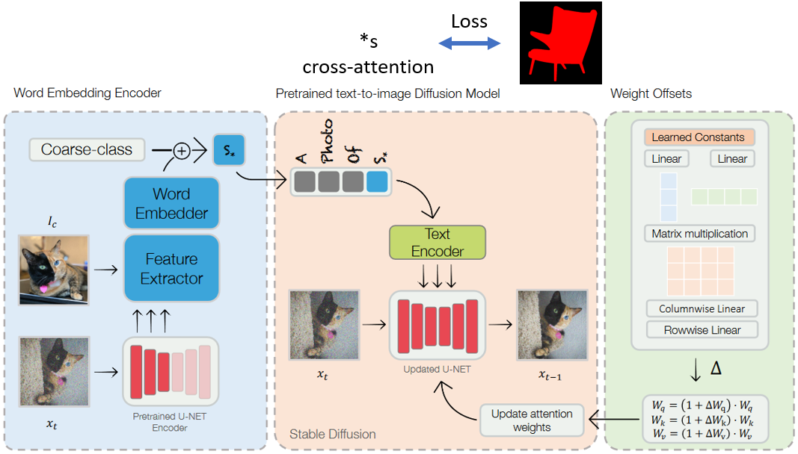
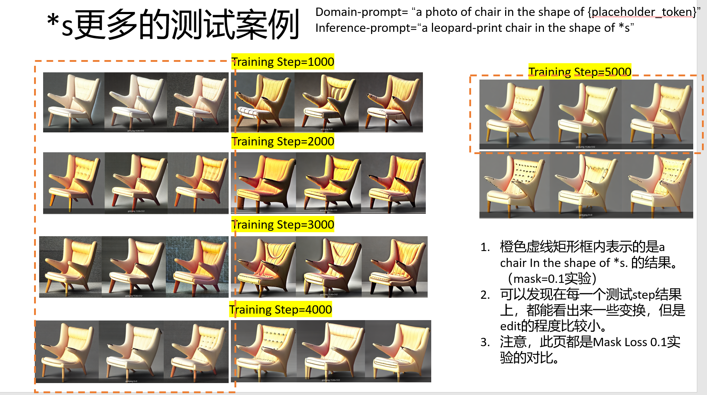

- [**实验概述**](#实验概述)
- [**实验代码及训练细节**](#实验代码及训练细节)
- [**实验现象总结与分析**](#实验现象总结与分析)
  - [**实验一、...的影响**](#实验一的影响)
  - [**实验二、探究...模块**](#实验二探究模块)
- [**实验结论**](#实验结论)

## **现阶段的架构**
  

我们目前的做法就是在E4T架构的基础上，做了两项改动：
* 将原始的**a photo of *s object**  改为 **a photo of object in the shape of *s**
* 添加一个loss，这个loss是构建在*s的所有cross-attention map的average map和mask上的MSE Loss。

## **观察到的实验现象**
* 当使用了Mask-Loss-Idea之后，我们生成的物体基本都很好的保持了原始object的shape，但是编辑能力变差了。如实验 [[02_Projects.01 科研项目.2023_SubConcept_Inversion.Experiments.mask_loss_idea]]所示，对于不使用的Mask Loss的baseline来说，editing的能力和幅度都很大。而我们却差一些。假设这个问题存在，那原因会是什么呢？
  * 我们已经做了实验，和mask loss的weight是没有关系的。因为多个weight下的编辑能力都不好。
  * 其次，我们对比了原始的E4T baseline和E4T的In the shape of *s 版本，我们发现这两个baseline的editing能力都是不错的。因此，也可以排除，in the shape of *s 这样的改动不会造成editing能力的受限。
  * 那这么看，问题就是Mask Loss的原因了。目前weight最小是0.01，我们跑两个更小的version，0.001和0.0001
  * 会不会和训练的时间有关系呢？
    * 可以尝试一下1000步、2000步、3000步、4000步下的编辑效果（**从下图来看，与training step关系不大**）
  
      

  

## **思考几个问题**
* **Loss建立在Cross-Attention上是否合理？**
  * 根据论文[1] [2]论文中论述的那样，Cross—Attention Map实际上刻画的是文本和图像的相似度分数，也就是反映了text中的word和图像上的哪些region是有关系的。所以，我们建立loss，要求*s要和图上mask区域的相关度更高。

## **Reference**
[1] Prompt-to-prompt image editing with cross attention control

[2] AN IMAGE IS WORTH MULTIPLE WORDS: LEARNING OBJECT LEVEL CONCEPTS USING MULTI-CONCEPT PROMPT LEARNING
