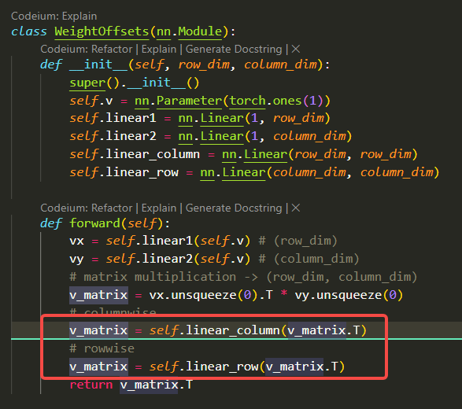
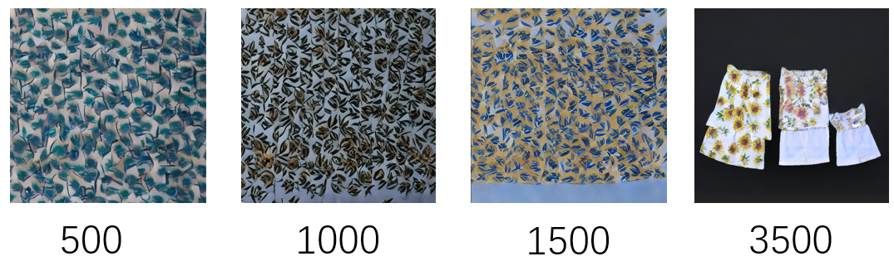

  

如果注释掉bbox内的两行代码 会怎么样？

**实验描述**：我在sunflower dress数据上训练，测试脚本是"a phone case in the appearance of *a"

  

从上图可见：
* 首先模型应该是过拟合了，完全不知道phone case是什么
* 但是模型能学到特有的图像，直到最后，还能生成类似于原图的图

MathTeacherXL of Poe的解释：

行列变换在这段代码中起到了调整权重矩阵的作用。通过应用行列变换，我们可以改变权重矩阵中不同行和列之间的关系，从而影响模型的学习能力和性能。

在这段代码中，我们通过 linear_column 和 linear_row 两个线性层对权重矩阵进行行列变换。这些线性层会对权重矩阵的行和列进行线性变换，从而改变它们之间的关系。这种变换可以用来调整权重矩阵的结构，使其更好地适应特定的任务或数据。

如果你去掉行列变换这两行代码，权重矩阵将保持原始的形式，可能无法充分地捕捉到数据中的特征或模式。行列变换可以提供更多的自由度和灵活性，使得模型能够更好地适应不同的数据分布和学习任务。因此，去掉行列变换可能导致实验结果的差异。