> AIGC+视觉方向

## Stable Video Diffusion: Scaling Latent Video Diffusion Models to Large Datasets

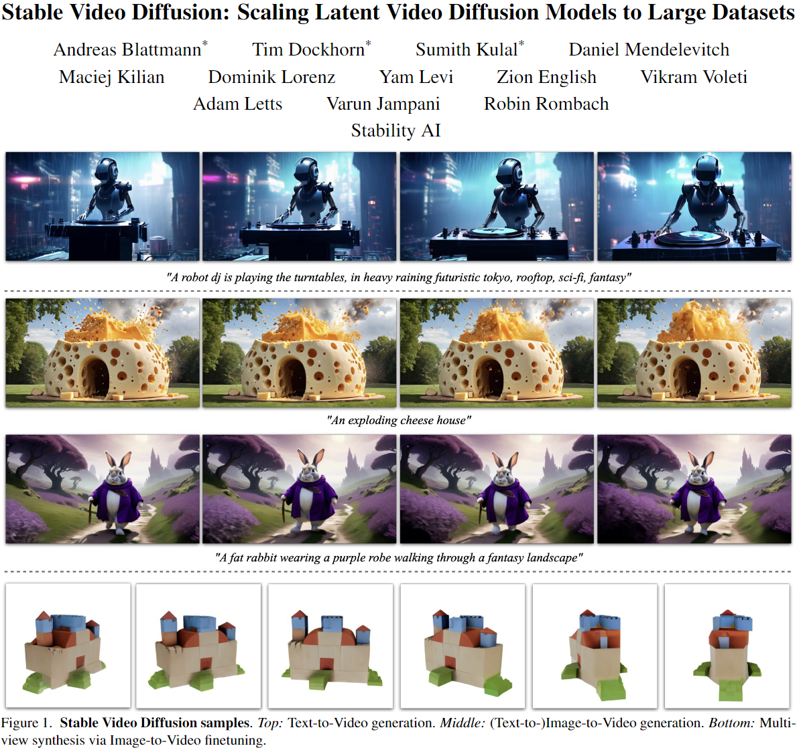  

这篇论文是关于视频生成和图像生成的研究。它介绍了一种名为**Stable Video Diffusion (SVD)**的**潜在视频扩散模型**，用于**高分辨率的文本到视频和图像到视频合成**。论文还提出了三个不同阶段的视频模型训练，并分别分析了它们对最终模型性能的影响。SVD提供了一个强大的视频表示，可以用于优化图像到视频合成和其他相关应用。此外，论文还对视频扩散模型的多视角微调进行了研究，并展示了**SVD在多视角合成方面的优越性能**。希望这些发现对生成视频建模领域有广泛的应用。

## Obj-NeRF: Extract Object NeRFs from Multi-view Images

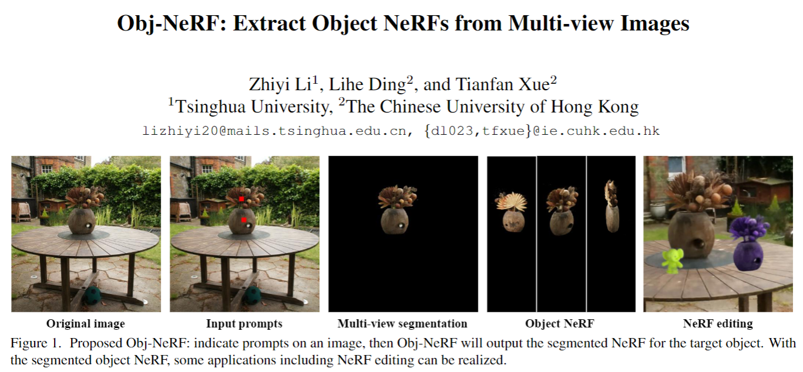  

这篇论文介绍了一种名为Obj-NeRF的方法，用于从多视角图像中提取特定对象并重建其几何结构。论文提出了一个综合的流程，通过从单个图像中的初始提示开始，构建一个针对特定对象的分割NeRF。该流程不需要预训练的全场景NeRF，避免了不必要的训练成本，并提高了重建质量。

论文还介绍了一种高质量高效的多视角分割算法，利用3D稀疏点云将初始提示快速传播到所有图像，并从SAM中提取分割掩码。

此外，为了从大规模多视角数据集中创建大量对象NeRF，论文提出了一种自动自提示机制，只需要简单的文本输入即可识别每个场景中的目标对象，从而构建多视角分割对象的数据集。

最后，为了提高使用NeRF进行新视角合成的质量，论文提出了几种方法，包括使用稀疏和密集深度先验进行监督、边界框计算和射线修剪等。

论文通过修改现有的NeRF验证了分割对象NeRF的有效性。

NeRF是一种用于新视角合成的神经辐射场方法，SAM是一种用于零样本图像分割的模型。

## Flow-Guided Diffusion for Video Inpainting
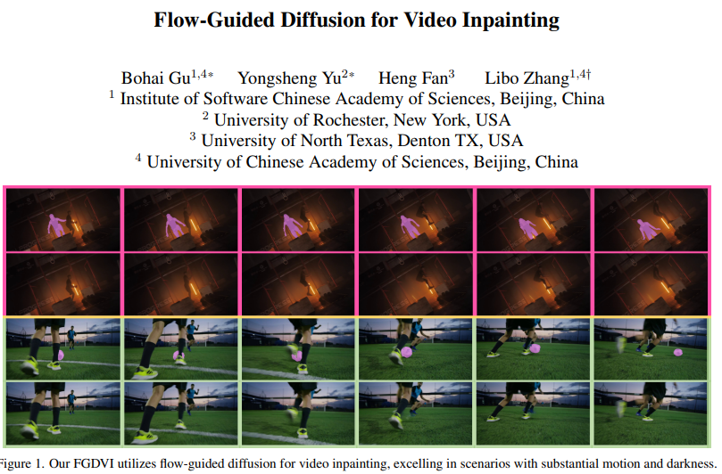  

**论文背景**: 视频修复是保证每一帧内容完整性的任务，同时需要处理帧间的时间动态，这在计算机视觉中具有重要作用，如对象去除、标志去除、视频恢复和水印去除等。

**过去方案**: 过去的视频修复方法存在一些问题，如模糊或马赛克效果、时间不一致等。此外，现有的扩散模型在多步推理中的推理时间较长，对于视频修复仍然效率低下。

**论文的Motivation**: 鉴于过去方法的局限性，本文提出了一种新的方法，通过利用图像生成扩散模型和光流技术，显著提高了视频修复的时间一致性和修复质量。本文的动机是将扩散模型应用于视频修复，并通过光流技术加速修复过程，从而提高修复效果和效率。

## MeshGPT: Generating Triangle Meshes with Decoder-Only Transformers

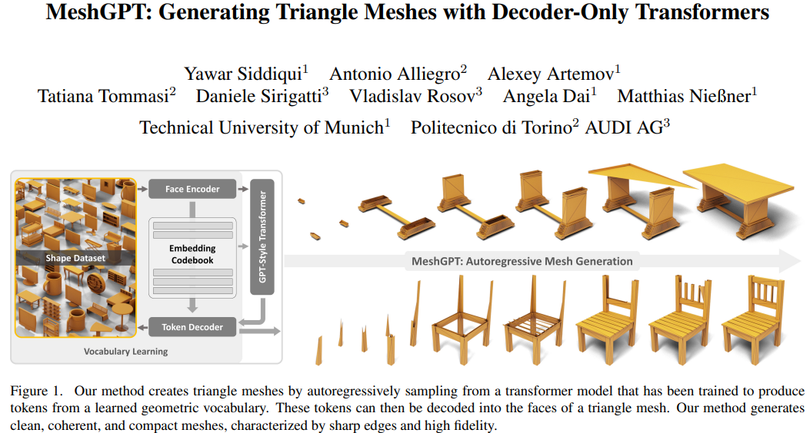  

**研究背景**：在计算机图形学中，三角形网格是一种常见的方式来表示三维物体。它们由许多三角形拼接而成，可以用来制作视频游戏、电影和虚拟现实中的三维模型。

**研究动机**：虽然三角形网格在计算机图形学中非常重要，但是生成三角形网格是一项非常复杂的任务，需要大量的时间和专业知识。因此，研究者们希望能找到一种自动化的方法，可以快速而准确地生成三角形网格。

**研究方法**：这篇论文提出了一种新的方法，叫做MeshGPT，它使用了一种叫做变换器的神经网络模型来生成三角形网格。首先，MeshGPT会从大量的三维物体网格中学习一种三角形的词汇表，然后，它会使用变换器来一步一步地生成出一串数字，代表一个新的三角形网格。最后，它会使用一个解码器，来把生成的数字转换成三角形的坐标，从而得到最终的三角形网格。

**贡献和创新点**：MeshGPT的主要贡献和创新点有以下几点：

* **清晰、连贯和紧凑**：MeshGPT生成的三角形网格可以很好地保持三维物体的细节和结构，而不会出现重叠、空洞或者过度平滑的问题。MeshGPT生成的三角形网格也很紧凑，只需要很少的三角形就可以表示一个复杂的三维物体，这样可以节省存储空间和渲染时间。
* **锐利和高保真**：MeshGPT生成的三角形网格可以很好地表示三维物体的锐利边缘和曲面，而不会出现锯齿或者模糊的现象。MeshGPT生成的三角形网格也很高保真，可以很好地还原三维物体的真实外观和纹理，而不会出现失真或者噪声的问题。
* **创新和多样**：MeshGPT生成的三角形网格可以创造出一些新颖和多样的三维物体，而不仅仅是复制已有的三维物体。MeshGPT生成的三角形网格也可以根据不同的需求和偏好，来生成不同的风格和类型的三维物体，比如椅子、桌子、长凳和灯具等。

## ET3D: Efficient Text-to-3D Generation via Multi-View Distillation
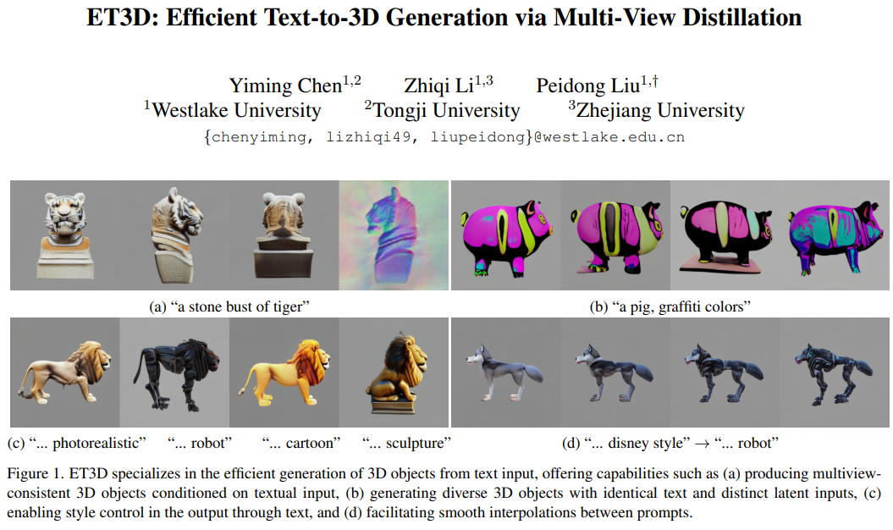  

**研究背景**：三维物体的生成是一项有趣而有用的任务，它可以用于游戏、动画、设计等领域。然而，三维物体的生成通常需要大量的三维数据来训练，而这些数据很难获取和标注。因此，一些研究者提出了利用预训练的二维图像生成模型来辅助三维物体的生成，这样就可以利用丰富的二维图像数据来学习三维知识。这些方法通常采用一种叫做分数蒸馏采样（SDS）的优化策略，它可以通过一个预训练的图像模型来指导三维物体的生成。然而，这些方法的缺点是生成速度很慢，通常需要几分钟甚至几小时才能生成一个三维物体，这就降低了用户体验和服务效率。

**研究动机**：为了解决上述问题，这篇论文提出了一种高效的文本到三维物体的生成方法，它只需要大约8毫秒就可以生成一个三维物体，而且不需要任何三维数据来训练。这篇论文的动机是利用一种预训练的文本到多视图图像的生成模型，来提供多视图的知识，从而训练一个文本到三维物体的生成模型。这样，就可以通过一个简单的前向传播来快速生成三维物体，而不需要复杂的优化过程。

**研究方法**：这篇论文的方法分为两个主要部分，即教师模型和学生模型。教师模型是一个预训练的文本到多视图图像的生成模型，它可以根据输入的文本描述来生成多个角度的图像。学生模型是一个文本到三维物体的生成模型，它使用了一种叫做三平面的三维表示方法，它可以用三个平面来隐式地表示一个三维物体，并且可以快速地渲染出多个角度的图像。在训练过程中，教师模型和学生模型都接收相同的文本输入，然后学生模型的目标是生成一个三维物体，使得它渲染出的多视图图像和教师模型生成的多视图图像尽可能地接近。为了实现这个目标，这篇论文使用了一种生成对抗网络（GAN）的训练方式，它可以让学生模型学习真实的数据分布，而不是简单地拟合教师模型的输出。此外，这篇论文还使用了一种叫做CLIP的文本图像匹配模型，来提供额外的文本一致性的监督，使得生成的三维物体更符合文本描述。

## EucliDreamer: Fast and High-Quality Texturing for 3D Models with Stable Diffusion Depth

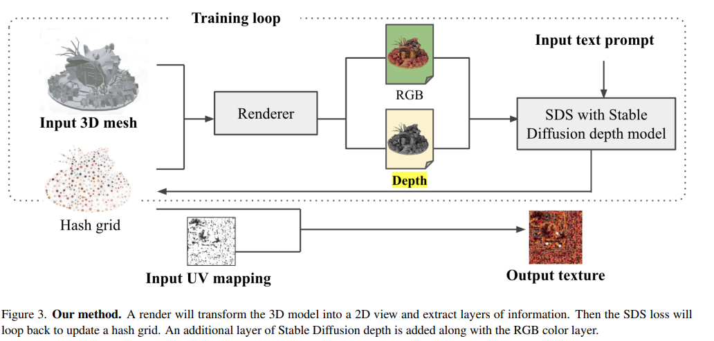  

这篇论文的主要内容可以分为以下几个方面：

**研究背景**：3D建模是一种在媒体、游戏和教育等领域广泛使用的技术，它可以创建各种各样的角色和环境，比如动画片里的人物，或者游戏里的场景。1但是3D建模是一个很复杂和耗时的过程，需要专业的软件和技巧。其中，3D纹理就是一个很重要的步骤，它可以决定3D模型的外观和风格。因此，很多研究者都在寻找一种可以用人工智能来自动或辅助生成3D纹理的方法，让3D建模变得更容易和快速。
研究动机：目前，已经有一些方法可以用人工智能来生成3D纹理，但是它们还有一些问题，比如质量不高，多视角不一致，有过多的光影和阴影，或者颜色不协调。这些问题会影响3D模型的真实感和美观度。因此，这篇论文的作者想要提出一种新的方法，可以用稳定扩散深度（Stable Diffusion Depth）来生成3D纹理，这是一种可以考虑3D模型的形状和深度信息的技术，可以提高3D纹理的质量和速度。

**研究方法**：这篇论文的方法是基于一个叫做分数蒸馏采样（Score Distillation Sampling，简称SDS）的技术，它可以用一个预先训练好的人工智能模型来根据文字提示来生成图像。这个技术的原理是，先给一个随机的图像加上一些噪声，然后用人工智能模型来逐步去除噪声，让图像变得更清晰和符合文字提示。这个过程可以重复多次，直到图像达到满意的效果。这篇论文的创新之处是，在这个过程中，加入了**稳定扩散深度的信息**，这是一种**可以表示3D模型表面的高低差的信息**，可以让人工智能模型更好地**理解3D模型的形状和结构，从而生成更合适的纹理**。具体来说，这个方法的步骤如下：
* 首先，给一个3D模型一个随机的纹理，然后用一个可以将3D模型转换成2D图像的渲染器（Renderer），从不同的角度来观察这个3D模型，得到一组2D图像和对应的稳定扩散深度信息。
* 然后，用SDS技术，用一个预先训练好的人工智能模型，根据文字提示和稳定扩散深度信息，来计算每个2D图像的梯度（Gradient），这是一种可以表示图像变化方向和程度的信息，可以用来更新纹理。
* 接着，用梯度信息来更新3D模型的纹理，然后重复上面的步骤，直到纹理收敛到一个稳定的状态。
* 最后，将更新后的纹理转换成一种常用的3D格式，就可以得到最终的3D纹理。

**贡献和创新点：**这篇论文的贡献和创新点有以下几个方面：
* 这是第一篇使用稳定扩散深度来生成3D纹理的论文，它可以有效地利用3D模型的形状和深度信息，提高3D纹理的质量和速度。
* 这篇论文的方法可以生成多种风格和主题的3D纹理，只需要改变文字提示，就可以让3D模型有不同的外观和感觉。
* 这篇论文的方法可以生成多视角一致的3D纹理，也就是说，从不同的角度看3D模型，它的纹理都是协调和连贯的，没有出现不同的颜色或图案。
* 这篇论文的方法还可以结合其他的技术，比如用一张图片来指导生成3D纹理，或者用一个2D图像来生成一个3D模型和纹理。

### 其他

* Stable Diffusion depth是一种基于深度信息的条件扩散模型，可以将深度与潜在变量连接起来，从而提高生成质量和速度。

* ControlNet depth是一种基于控制点的深度编码方法，可以将深度信息嵌入到图像中，从而作为扩散模型的条件。

* 作者通过实验发现，**Stable Diffusion depth比ControlNet depth能够产生更好的梯度，更清晰的细节，更少的噪声，更快的收敛速度。**
* 作者认为，**Stable Diffusion depth的优势在于它可以将深度和潜在变量分开处理，从而减少梯度的噪声，而ControlNet depth则会将深度和图像混合在一起，从而增加梯度的噪声。**

## Check, Locate, Rectify: A Training-Free Layout Calibration System for Text-to-Image Generation

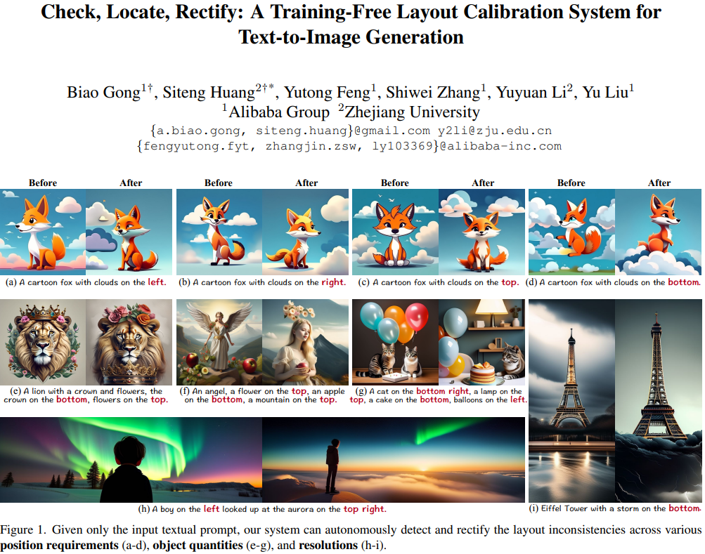  

- **研究背景**：这篇论文是关于**文本到图像生成**的，也就是根据一段文字描述，自动创造出一张符合描述内容的图片。这是一种很有用的技术，可以应用在很多领域，比如图片定制，3D内容创作，虚拟现实等。目前，最先进的文本到图像生成模型是基于**扩散模型**的，它们可以通过一个迭代的过程，逐渐从噪声中生成清晰的图片。
- **研究动机**：虽然扩散模型可以生成高质量的图片，但是它们还有一个问题，就是**不能很好地理解和反映文字描述中**的**布局要求**，比如“一只狗在一只猫的左边”或者“一个皇冠在底部”。这些要求涉及到对象之间的相对或绝对的空间关系，对于自动化系统来说，很难解析和理解。而且，如果训练数据中有一些偏见或假设，比如“皇冠”通常在其他生物的头上，那么模型就很难生成不同的位置。这些因素不仅影响了生成图片的质量和真实性，也影响了文本到图像生成系统的实用性和用户体验。
- **研究方法**：为了解决这个问题，这篇论文提出了一个**不需要训练**的**布局校准系统**，叫做SimM，它可以在生成图片的过程中，实时地调整图片的布局，使其符合文字描述的要求。具体来说，**SimM遵循一个“检查-定位-校正”的流程**，首先，它会**分析文字描述，生成每个对象的目标位置，并且和中间的输出进行比较，自动检测是否有错误**。然后，它会在**扩散模型的内部，找到错位的对象的激活区域，并且移动它们到目标区域**，同时进行一些微调，使得生成的图片更加清晰和自然。这个过程只影响推理生成的过程，不需要任何额外的训练或损失函数的更新。
- **贡献和创新点**：这篇论文的贡献和创新点有以下几点：
    - 它提出了一个不需要训练的布局校准系统，可以在不影响生成速度的情况下，实时地调整图片的布局，提高了生成图片的质量和真实性。
    - 它提出了一个有效和高效的方法，来从文字描述中解析和生成目标布局，包括相对和绝对的空间关系，而不需要用户提供精确的布局信息。
    - 它提出了一个新的数据集，叫做SimMBench，它包含了一些涉及到绝对空间关系的文字描述，比如“一个花在左边”，来补充现有数据集的不足，增加了文字描述的多样性。
    - 它在两个数据集上进行了大量的定量和定性的实验，证明了它的系统在校正布局不一致的方面，优于现有的方法，而且保持了很好的图片质量。

## Learning Disentangled Identifiers for Action-Customized Text-to-Image Generation

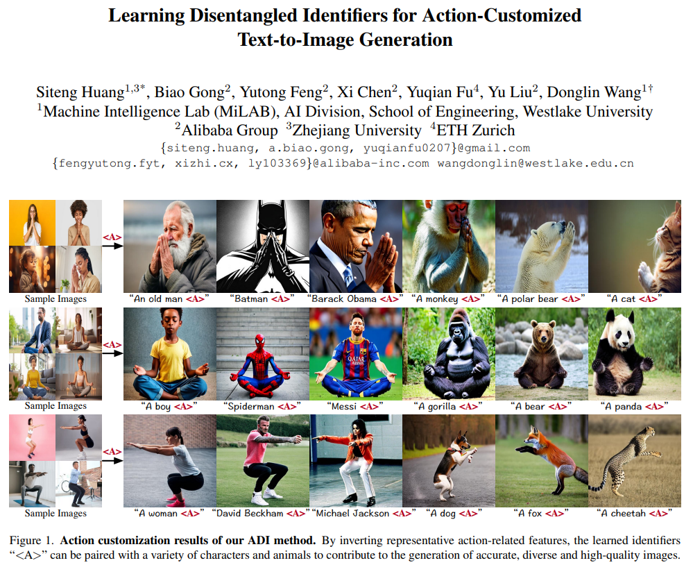  

- **研究背景**：这篇论文的研究背景是文本到图像（T2I）生成，也就是根据文字描述生成相应的图片。这是一个很有趣也很有挑战的任务，因为文字描述可能包含很多抽象和复杂的概念，比如动作。动作是一种高层次的特征，它可以表达人或动物的行为和情感，但是很难用文字准确地描述。因此，这篇论文提出了一个新的任务，叫做动作定制，也就是从一些示例图片中学习一个特定的动作，然后把它应用到不同的人或动物上，生成新的图片。
- **研究动机**：这篇论文的研究动机是为了提高T2I生成的可控性和多样性，以及拓展T2I生成的应用场景。**现有的T2I生成方法要么依赖于文字描述来生成动作，要么依赖于骨架或草图图片来控制动作，但是这些方法都有一些缺点，比如文字描述可能不准确或不完整，骨架或草图图片可能限制了生成的自由度和多样性，而且这些方法都难以泛化到未见过的人或动物上**。因此，这篇论文想要探索一种新的方法，可以从少量的示例图片中提取动作的共性，然后把它转移给不同的人或动物，生成高质量和多样性的图片。
- **研究方法**：这篇论文的研究方法是基于一种叫做稳定扩散（SD）的T2I生成模型，它是目前最先进的T2I生成模型之一。它的原理是把图片编码成一个低维的隐向量，然后通过一个去噪网络，根据文字描述，逐步地从隐向量中去除噪声，最后通过一个解码器，把隐向量映射回图片。这篇论文的创新点是在SD模型的基础上，**引入了一种叫做动作解耦标识符（ADI）**的方法，它的目的是从示例图片中学习一个能够表示动作的标识符，然后把它加入到文字描述中，作为一个额外的条件，来控制图片的生成。ADI的方法包括两个步骤：**第一步是扩展语义反转空间，也就是为SD模型的每一层都增加一个标识符，这样可以增加标识符的表达能力，让它能够反转更多的特征，包括动作相关的特征**。第二步是**学习梯度掩码，也就是通过构造一些输入三元组，比较不同图片的梯度差异，找出哪些通道是和动作相关的，哪些通道是和动作无关的，然后把动作无关的通道的梯度屏蔽掉，只更新动作相关的通道的梯度，这样可以避免动作无关的特征干扰图片的生成**。
- **贡献和创新点**：这篇论文的贡献和创新点有以下几个方面：
    - 提出了一个新的任务，叫做动作定制，它可以从少量的示例图片中学习一个特定的动作，然后把它应用到不同的人或动物上，生成新的图片。
    - 提出了一个新的评测数据集，叫做ActionBench，它包含了多种不同的动作，每种动作都有 carefully selected 的示例图片，可以用来评估不同方法的性能。
    - 提出了一个新的方法，叫做动作解耦标识符（ADI），它可以有效地从示例图片中反转动作相关的特征，然后把它加入到文字描述中，作为一个额外的条件，来控制图片的生成。
    - 在ActionBench上进行了广泛的实验，结果显示ADI在动作定制的任务上，优于现有的方法，可以生成高质量和多样性的图片，而且可以泛化到未见过的人或动物上。

## Direct2.5: Diverse Text-to-3D Generation via Multi-view 2.5D Diffusion

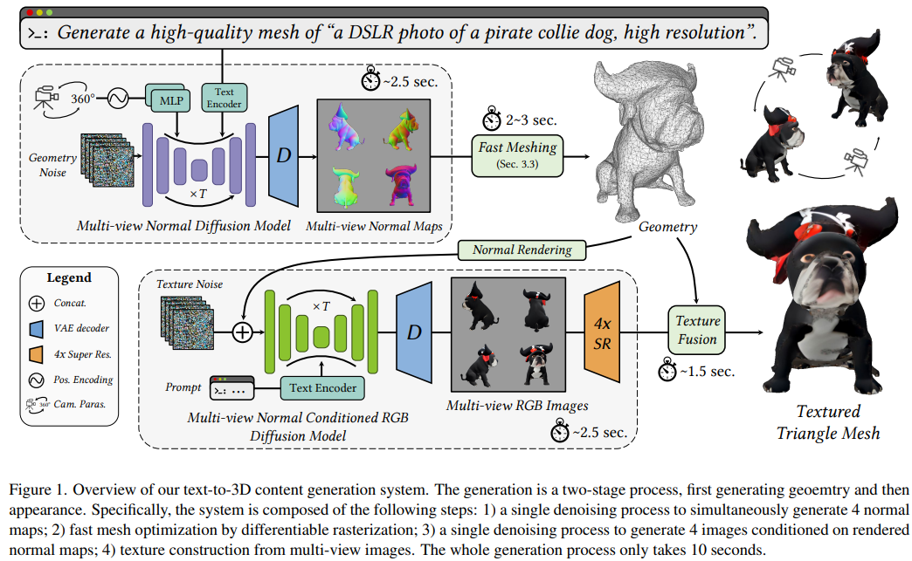  

- **研究背景**：三维模型是一种可以用来表示真实或虚构的物体或场景的数据格式，它在游戏、电影、自动驾驶、虚拟现实等领域有很多应用。但是，创建三维模型是一项耗时、费力、需要专业技能的工作，所以人们希望能够通过简单的文字描述来自动生成三维模型，这就是文本到三维生成（Text-to-3D Generation）的任务。
- **研究动机**：目前，有两种主要的方法来做文本到三维生成的任务。**一种是基于分数蒸馏（Score Distillation）的方法，它利用预训练的文本到二维图像生成（Text-to-Image Generation）的模型，然后通过优化一个可微的渲染系统（Differentiable Rendering System）来得到三维模型**。这种方法的优点是可以利用大量的二维图像和文字数据来提高生成的质量和多样性，但是缺点是非常慢，需要**花费几十分钟甚至几个小时**才能生成一个三维模型。**另一种是直接三维生成（Direct 3D Generation）的方法，它直接用一个概率扩散（Probabilistic Diffusion）的模型来生成三维模型**。这种方法的**优点是很快**，只需要**几秒钟**就能生成一个三维模型，但是缺点是需要**大量的三维数据**来训练，而且**生成的质量和多样性不如基于分数蒸馏的方法**。
- **研究方法**：这篇论文提出了一种新的方法，叫做**多视角2.5维扩散（Multi-view 2.5D Diffusion）**，它**结合**了基于**分数蒸馏和直接三维生成**的方法的优点，同时避免了它们的缺点。具体来说，这种方法的思路是**先用一个预训练的文本到二维图像生成的模型**，然后**在一个大规模的三维数据集上微调**，使得它**能够同时生成多个视角的2.5维图像**，即**深度图或法线图**（Depth Map or Normal Map）。这样，**既可以利用二维图像和文字数据的丰富性，又可以显式地建模三维数据的结构分布。然后，再用一个可微的光栅化（Differentiable Rasterization）的方法，将多个视角的2.5维图像融合成一个一致的三维模型**。这个过程是一个单次的扩散过程，不需要任何分数蒸馏的优化作为后处理。最后，**再用一个另外的多视角2.5维扩散的模型，根据生成的三维模型和文字描述，生成多个视角的纹理图（Texture Map），然后用一个纹理融合（Texture Fusion）的方法，将多个视角的纹理图合成一个全局的纹理，从而得到一个高质量的带纹理的三维模型**。
- **贡献和创新点**：这篇论文的主要贡献和创新点有以下几点：
    - 提出了一种新的文本到三维生成的方法，它通过多视角2.5维扩散，既保留了预训练的文本到二维图像生成模型的强泛化能力，又显式地建模了三维数据的结构分布，填补了基于分数蒸馏和直接三维生成的方法之间的差距。
    - 引入了一个高效的可微的光栅化的方法，来从多个视角的法线图直接优化一个带纹理的三角网格，这个过程只需要一个单次的扩散过程，不需要任何分数蒸馏的优化作为后处理，大大提高了生成的速度和质量。
    - 精心设计了一个生成流程，它可以在**只需要10秒钟**的时间内，实现多样、无模式寻找（Mode-Seeking-Free）和高保真的三维内容生成。

## GaussianEditor: Editing 3D Gaussians Delicately with Text Instructions

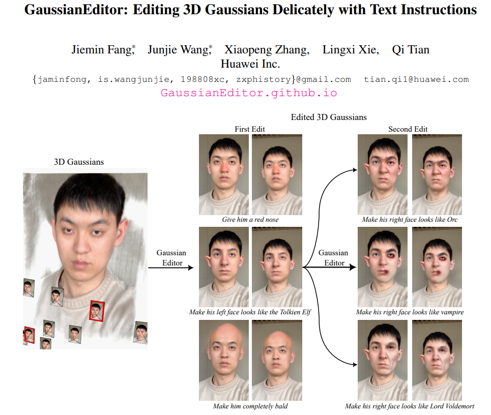  

- **研究背景**：这篇论文的研究背景是3D场景编辑，也就是用计算机生成和修改三维的物体和环境。3D场景编辑有很多应用，比如电影、游戏、艺术创作、虚拟现实等。3D场景编辑的一个难点是如何用简单和直观的方式来控制和改变3D场景的外观和形状。传统的方法通常需要专业的软件和技能，而且很耗时。最近，有一些新的方法，比如NeRF，用神经网络来表示和渲染3D场景，可以生成高质量和逼真的图像。但是，**用神经网络来编辑3D场景也有一些挑战，比如如何精确地定位和控制编辑的区域，如何保持3D场景的一致性，如何提高编辑的效率和质量等。**
- **研究动机**：这篇论文的研究动机是提出一个新的框架，叫做**GaussianEditor，来实现用文本指令来精细地编辑3D场景**。文本指令是一种简单和自然的方式，让用户可以用语言来描述他们想要的编辑效果，比如“把他的头发变成蓝色”或者“把桌子变成木头”。**GaussianEditor**的**核心思想是用3D高斯函数（3D Gaussians）来表示3D场景**，因为3D高斯函数有一些优点，比如可以明确地表示3D场景的位置、形状、颜色和透明度，可以快速地渲染和优化，可以方便地选择和操作编辑的区域等。**GaussianEditor的目标是根据用户的文本指令，找到和修改对应的3D高斯函数，从而改变3D场景的外观和形状。**
- **研究方法**：这篇论文的研究方法主要包括三个步骤。**第一步是从文本指令中提取感兴趣的区域（Region of Interest，RoI），也就是用户想要编辑的部分**。为了做到这一点，作者**使用了一个多模态模型**（Multimodal Model），**来从**3D高斯函数**渲染的图像中生成场景的文本描述**，比如“一个白色的自行车靠在一个黑色的长椅上”。然后，作者**使用了一个大型语言模型（Large Language Model）**，来**根据场景的文本描述和用户的文本指令，找出用户想要编辑的对象，比如“长椅”**。第二步**是把文本空间的RoI对齐到3D高斯函数空间的RoI，也就是找到和用户想要编辑的对象对应的3D高斯函数**。为了做到这一点，作者使用了一个定位分割模型（Grounding Segmentation Model），来把文本RoI转换成图像RoI，也就是在图像中标记出用户想要编辑的区域，比如长椅的轮廓。然后，作者**使用了一个RoI提升模块（RoI Lifting Module），来把图像RoI提升到3D高斯函数RoI，也就是找到和图像RoI相对应的3D高斯函数，并给它们加上一个RoI属性，表示它们是需要编辑的**。用户还可以通过一些交互界面，来修改或细化3D高斯函数RoI，比如选择或删除一些3D高斯函数，或者用一个3D盒子来限制编辑的范围。**第三步是在3D高斯函数RoI内进行精细的编辑**。为了做到这一点，作者使用了一个**2D扩散模型（2D Diffusion Model）**，来对**3D高斯函数渲染的图像进行编辑**，**根据用户的文本指令和原始图像作为条件，生成编辑后的图像，比如把长椅的颜色变成橙色。然后，作者计算编辑后的图像和渲染的图像之间的损失函数，用梯度反向传播的方法，只在3D高斯函数RoI内进行优化，也就是只改变需要编辑的3D高斯函数的参数，从而改变3D场景的外观和形状。通过多轮的迭代优化，最终得到编辑后的3D高斯函数。**
- **贡献和创新点**：这篇论文的贡献和创新点有以下几个方面：
    - 这篇论文是第一个用3D高斯函数来表示和编辑3D场景的方法，利用了3D高斯函数的明确性和高效性，实现了精细和准确的3D场景编辑。
    - 这篇论文提出了一个系统的框架，结合了多个技术模块，包括多模态模型、大型语言模型、定位分割模型、2D扩散模型等，实现了用文本指令来控制和指导3D场景编辑的过程，提高了用户的便利性和自由度。
    - 这篇论文在多个3D场景上进行了实验，展示了不同类型和复杂度的编辑效果，比如颜色、纹理、形状的变化，以及多轮和局部的编辑，证明了方法的有效性和通用性。
    - 这篇论文与之前的代表性工作Instruct-NeRF2NeRF进行了对比，显示了在编辑质量和效率上的优势，比如可以更好地保持3D场景的一致性，可以更快地完成编辑过程（在20分钟内，而Instruct-NeRF2NeRF需要45分钟到2小时）。

## Self-correcting LLM-controlled Diffusion Models

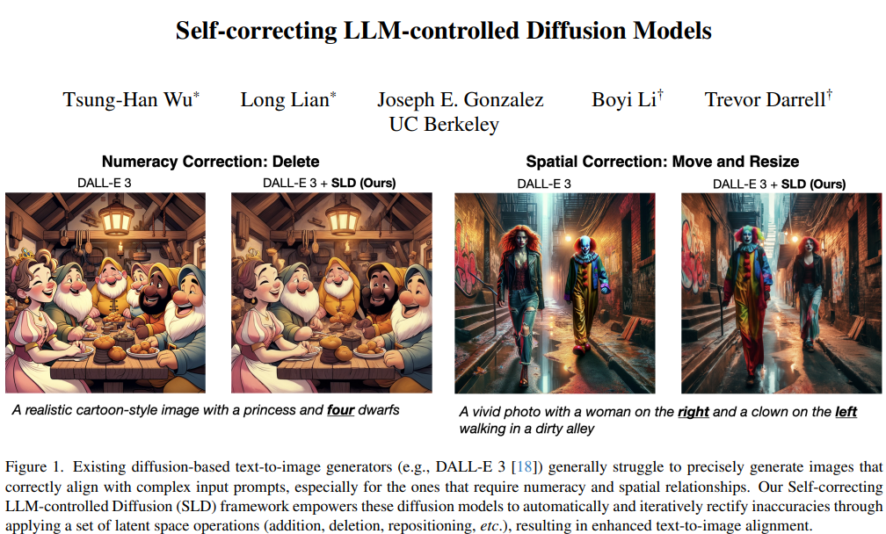  

- **研究背景**：现在有很多人工智能模型可以根据文字描述来生成或编辑图片，比如说Diffusion Models，它们可以生成很逼真的图片，但是它们也有一些问题，比如说**不能很好地理解复杂的文字描述**，或者**不能保证生成的图片和文字描述完全一致**。这些问题会影响用户的体验和满意度。
- **研究动机**：为了解决这些问题，作者提出了一个新的方法，叫做**Self-correcting LLM-controlled Diffusion (SLD)**，它的目的是让**人工智能模型能够自动检查和纠正生成或编辑的图片中的错误，从而提高图片和文字描述的一致性**。作者认为这样的方法可以让人工智能模型更加智能和可靠，也可以让用户更加满意和信任。
- **研究方法**：作者的方法主要包括两个部分：**LLM-driven object detection**和**LLM-controlled assessment and correction**。¹[1]LLM是Large Language Model的缩写，指的是一种可以理解和生成自然语言的人工智能模型。作者的方法是这样的：
    - 首先，作者用一个**LLM来解析用户的文字描述，提取出其中的关键信息，比如说要生成或编辑的图片中应该有哪些物体，它们的颜色、数量、位置**等等。
    - 然后，作者**用一个可以识别任意物体的检测器，根据LLM提供的信息，在生成或编辑的图片中找出这些物体，并用边框标记出来**。
    - 接着，作者用**另一个LLM来分析检测器的结果，判断图片中的物体是否和文字描述一致，如果不一致，就提出一些修改建议，比如说增加、删除、移动或改变物体的属性**等等。
    - 最后，作者**用一个基础的Diffusion Model来执行这些修改建议，通过在图片的隐层空间中进行一些操作，来改变图片的内容，从而使图片和文字描述更加一致**。
- **贡献和创新点**：作者的方法有以下几个贡献和创新点：
    - SLD是第一个结合检测器和LLM来自动纠正生成模型的方法，它可以在不需要额外的训练或数据的情况下，提高图片和文字描述的一致性。
    - SLD提供了一个统一的解决方案，既可以用于图片生成，也可以用于图片编辑，只需要简单地改变LLM的指令，就可以实现不同的任务，比如说从文字描述生成图片，或者根据文字描述修改图片。
    - SLD的实验结果显示，它可以纠正大部分的生成错误，特别是在涉及到数量、属性和空间关系的方面，而且它可以应用到不同的生成模型，包括DALL-E 3这样的专有模型。
