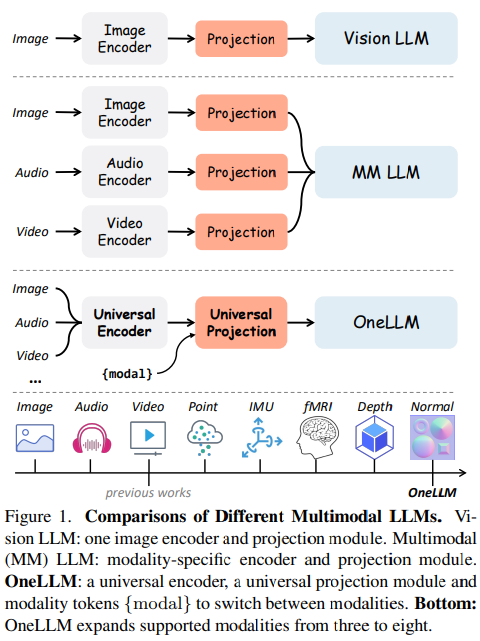

## FoodFusion: A Latent Diffusion Model for Realistic Food Image Generation
#image_generation

  

- **研究背景**：食物图片的生成对于一些应用场景，比如饮食评估，是非常有用的。但是，目前的一些生成模型，比如Latent Diffusion Models (LDMs)，**生成的食物图片往往不够真实，有一些艺术或者超现实的风格，不符合真实食物的外观。**
- **研究动机**：为了解决这个问题，作者提出了**FoodFusion，一个专门为生成真实食物图片而设计的Latent Diffusion模型**。作者认为，生成食物图片的关键在于**使用高质量和一致的数据**来训练模型，所以他们**收集了大量的食物数据集**，并且使用了**两种数据清洗的方法**来提高数据的质量和准确性。
- **研究方法**：作者使用了以下几个步骤来实现FoodFusion模型：
    - **综合数据集的编译**：作者收集了五个开源的食物数据集，包括**Food101, ISIA Food, LAIONFood, Food2k, Nutrition5k**，总共有超过**30万张食物图片**和对应的**文字描述**。
    - **LAIONFood数据集的生成**：作者使用了**Clip-Retrieval**的方法，从**LAION-5B数据集中筛选出高质量和真实的食物图片，生成了一个包含42个食物类别的数据集，叫做LAIONFood**。
    - **SAM-based数据清洗**：作者使用了Segment Anything Model (SAM)的方法，对Nutrition5k数据集进行了视觉上的确认，确保图片和文字描述的一致性和准确性。
    - **模型的微调**：作者在Latent Diffusion Model的基础上，使用上述的数据集对模型进行了微调，使其能够根据文字描述生成真实的食物图片。
- **贡献和创新点**：作者的主要贡献和创新点有以下几个：
    - **提出了一个专门为生成真实食物图片而设计的Latent Diffusion模型，叫做FoodFusion**。
    - **收集了一个大规模且多样化的食物数据集，包括超过30万张食物图片和对应的文字描述**。
    - **提出了两种数据清洗的方法，分别是Clip-Retrieval和SAM-based，来提高数据的质量和准确性**。
    - **通过视觉展示，证明了FoodFusion模型生成的食物图片在真实性和一致性方面都优于现有的生成模型**。
- **相关工作**：作者的研究主要涉及到以下两个方面的相关工作：
    - **食物图片的生成**：这方面的工作主要是使用生成对抗网络（GANs）或者变分自编码器（VAEs）来生成食物图片，但是这些方法往往需要大量的数据和计算资源，而且生成的图片质量不高，有模糊或者失真的现象。
    - **Latent Diffusion Models**：这方面的工作主要是使用一种基于扩散过程的生成模型，来生成高分辨率的图片，比如人脸，动物，风景等。这种模型的优点是可以使用较少的数据和计算资源，而且生成的图片质量高，有艺术或者超现实的风格。但是，这种模型对于生成真实食物图片的能力还不够强。

## KANDINSKY 3.0 TECHNICAL REPORT
#image_generation

  

- **研究背景**：文本到图像生成是一种利用自然语言描述来创造逼真的图像的技术，它有着广泛的应用场景，例如媒体内容创作、设计、教育等。近年来，随着深度学习的发展，文本到图像生成的质量和多样性有了显著的提升，尤其是基于潜在扩散模型的方法，它们能够利用随机噪声的逆向过程来逐步生成图像，从而避免了传统的生成对抗网络的训练不稳定和模式崩溃的问题。
- **研究动机**：尽管目前已经有了许多优秀的文本到图像生成模型，但是它们仍然面临着一些挑战，例如如何提高图像的分辨率和真实感，如何更好地理解复杂和多样的语言概念，如何简化模型的架构和训练过程，以及如何提供更友好的用户交互系统。为了解决这些问题，**作者提出了Kandinsky 3.0，一个新的文本到图像生成模型，它在之前的Kandinsky 2.x系列模型的基础上，进行了一系列的改进和创新。**
- **研究方法**：Kandinsky 3.0的整体流程包括一个文本编码器，一个用于预测噪声的U-Net，和一个用于图像重建的解码器。¹[1]文本编码器使用了Flan-UL2 20B模型的8.6B编码器，它是目前最强大的开源编码器-解码器模型，它在大量的文本数据上进行了预训练，并在多个语言任务上进行了监督微调。U-Net使用了一个两倍于之前版本的U-Net骨干网络，它基于ResNet-50的残差块，并在低分辨率的层级上加入了自注意力和交叉注意力机制。解码器使用了作者开发的Sber-MoVQGAN自编码器，它基于VQGAN的架构，并加入了空间条件归一化的技术，它在高分辨率的图像重建任务上取得了最好的结果。作者使用了一个由大约1.5亿对文本-图像对组成的大规模数据集来训练模型，并采用了多阶段的策略，使得模型能够在不同的分辨率下生成图像。
- **贡献和创新点**：Kandinsky 3.0的主要贡献和创新点有以下几个方面：
    - 它是目前最大的文本到图像生成模型，包含了11.9亿个参数，比之前的Kandinsky 2.2模型增加了近三倍；
    - 它使用了一个更强大的文本编码器，能够更好地理解不同语言和领域的文本描述，并提高了图像与文本的对齐度；
    - 它简化了模型的架构，去掉了之前版本中的扩散映射模块，使得生成过程更直接和高效；
    - 它提高了图像的质量和真实感，通过使用一个更深的U-Net，一个更优秀的图像解码器，以及一个更大的数据集；
    - 它将模型完全公开，促进了科学界的开放性和新技术的发展，并提供了一个免费的用户交互系统，让更多的人能够体验和使用模型的功能。
- **相关工作**：Kandinsky 3.0的相关工作主要包括以下几类：
    - 基于潜在扩散模型的文本到图像生成模型，例如GLIDE [4]，Hierarchical Text-Conditional Image Generation with CLIP Latents [5]，High-Resolution Image Synthesis with Latent Diffusion Models [6]，Photorealistic Text-to-Image Diffusion Models with Deep Language Understanding [7]，和Retrieval-Augmented Diffusion Models [34]；
    - 基于变换器的文本到图像生成模型，例如Zero-Shot Text-to-Image Generation [16]，和Improving Image Generation with Better Captions [11]；²[2]
    - 基于自编码器的图像重建模型，例如VQGAN [28]，MoVQGAN [29]，和Vector-Quantized Image Modeling with Improved VQGAN [31]；
    - 基于文本到视频生成的模型，例如FusionFrames [43]。

## Customization Assistant for Text-to-image Generation
#Customization
#MLLM

  

**研究背景**：这篇论文是关于文本到图像生成的，也就是根据用户输入的文字来生成相应的图片。这是一个很有趣也很有用的任务，比如你可以用它来创作漫画、画像、海报等等。但是现有的文本到图像生成模型有一些局限性，**比如它们不能很好地根据用户提供的图片来定制生成的内容，也不能很好地处理用户的不同类型的输入，比如疑问句或者模糊的描述，也不能给用户提供生成的解释或者拓展**。

**研究动机**：为了解决这些问题，作者提出了一个新的方法，叫做**CAFE，它是一个定制化的文本到图像生成的助手**。它的目标是让用户可以更方便、更灵活、更友好地使用文本到图像生成的技术，不需要进行任何的调整或者训练。

**研究方法**：CAFE的核心是一个基于大型语言模型的多模态语言模型（**MLLM**），它可以同时处理文本和图像的信息，以及用户和助手之间的交互**。MLLM的输入是用户提供的图片和文本**，它的**输出是两个序列：一个是用来生成图片的特征向量**，另一个**是用来生成文本的嵌入向量**。**特征向量会被送入一个基于扩散模型的图像生成器**，**嵌入向量会被送入一个语言模型的头部**，**用来生成自然语言的回复**。MLLM的训练是基于一个**自己构建的大规模的数据集**，其中包含了不同领域的图片和文本，以及相应的生成结果和回复。作者还提出了一种自我蒸馏的策略，可以更高效地构建数据集，而不需要人工的过滤。

**贡献和创新点**：CAFE的主要贡献和创新点有以下几个方面：
- 它是一个**无需调整的定制化的文本到图像生成的助手，可以在2-5**秒内根据用户提供的图片和文本生成创意的图片，而不需要任何的测试时训练。
- 它是**基于大型语言模型的，因此可以处理不同类型的文本输入**，比如**陈述句、疑问句、模糊的描述等，**也可以根据用户的意图生成相应的文本回复，比如解释、拓展等。
- 它可以利用另外一张图片作为额外的语义条件，来生成更多样化的图片，比如可以用一张漫画风格的图片来生成漫画风格的目标图片。
- 它提出了一种自我蒸馏的策略，可以高效地构建高质量的数据集，而不需要人工的过滤，从而提高了模型的泛化能力和表现。

**相关工作**：这篇论文的相关工作主要包括以下几个方面：
- 文本到图像生成的方法，主要分为基于生成对抗网络的方法和基于扩散模型的方法，它们都可以根据任意的文本生成高质量的图片，但是它们的缺点是不能很好地定制生成的内容，也不能很好地处理不同类型的文本输入。
- 定制化的文本到图像生成的方法，主要分为基于微调的方法和基于嵌入的方法，它们都可以根据用户提供的图片来生成定制化的图片，但是它们的缺点是需要进行测试时训练，或者不能很好地保留目标图片的细节，也不能很好地处理不同类型的文本输入。
- 基于大型语言模型的多模态方法，主要分为基于变换器的方法和基于扩散模型的方法，它们都可以利用大型语言模型的能力来处理多模态的信息，但是它们的缺点是没有专门针对文本到图像生成的任务进行设计，也没有考虑用户和助手之间的交互。

## F3-Pruning: A Training-Free and Generalized Pruning Strategy towards Faster and Finer Text-to-Video Synthesis

#video_generation
#Video
#Video_efficient

  

- **研究背景**：文本到视频合成（T2V）是一种根据文本描述生成视频的技术，它有很多潜在的应用场景，比如教育、娱乐、广告等。近年来，T2V的研究取得了很大的进展，主要利用了两种强大的生成模型：变换器（transformer）和扩散模型（diffusion model）。这两种模型都可以在大规模的数据集上进行训练，从而生成高质量和丰富语义的视频。然而，**这两种模型的推理过程也非常耗时和耗能，因为它们需要在每一帧之间建立复杂的注意力（attention）机制，来保证视频的连贯性和一致性。**
- **研究动机**：为了加速T2V的推理过程，作者提出了一个**无需训练和通用的剪枝策略**，叫做F3-Pruning。作者的动机是基于对两种主流T2V模型的推理过程的探索，发现了其中**存在大量的冗余和不重要的时序注意力（temporal attention），即每一帧与其他帧之间的注意力**。作者认为，这些**时序注意力不仅增加了计算量，而且限制了视频的动态性和多样性**。因此，作者提出了一种根据注意力值的大小来剪枝时序注意力权重的方法，从而提高推理效率和视频质量。
- **研究方法**：作者提出的F3-Pruning方法主要包**括两个步骤**：1) **计算每一层网络或每一步去噪过程中的时序注意力值的和，称为聚合注意力分数**（Aggregate Attention Score，AAS）。2) **根据一个剪枝比例α，剪枝掉AAS排名在最后α部分的时序注意力权重**。作者的方法不需要额外的训练或微调，也不需要复杂的剪枝标准，只需要利用注意力值本身作为剪枝依据。作者的方法也可以适用于不同类型的T2V模型，无论是基于变换器的还是基于扩散模型的。
- **贡献和创新点**：作者的主要贡献和创新点有以下几点：1) 作者探索了两种主流T2V模型的推理过程，揭示了时序注意力模块中存在的冗余和不重要的部分。2) 作者提出了一种无需训练和通用的剪枝策略，叫做F3-Pruning，来剪枝冗余和不重要的时序注意力权重，从而加速T2V的推理过程，并保证视频的质量。3) 作者在三个数据集上进行了广泛的实验，证明了F3-Pruning的有效性、高效性和泛化性。¹[1]特别地，F3-Pruning应用于CogVideo在UCF-101数据集上，不仅使其推理速度提高了1.35倍，而且显著提升了视频质量指标FVD 22%。
- **相关工作**：作者的工作主要涉及两个方面的相关工作：文本到视频合成和推理加速。文本到视频合成的相关工作主要分为两类：一类是基于GAN（生成对抗网络）的方法，如(Li et al. 2018; Pan et al. 2017)；另一类是基于变换器或扩散模型的方法，如(Ho et al. 2022b; Wu et al. 2022a; Hong et al. 2023; Ho et al. 2022a; Wu et al. 2022b; Khachatryan et al. 2023)。推理加速的相关工作主要分为两类：一类是基于剪枝的方法，如(Dong, Chen, and Pan 2017; Park et al. 2020; Sanh, Wolf, and Rush 2020; Lee et al. 2020; Ding et al. 2019; You et al. 2019; Liu et al. 2021; Bolya et al. 2023; Bolya and Hoffman 2023; Mao et al. 2021; Wei et al. 2023; Rao et al. 2021)；另一类是基于量化的方法，如(Qin et al. 2022; Li et al. 2022; Liu et al. 2022; Song et al. 2019)。作者的工作与这些相关工作的主要区别在于，作者的方法不需要额外的训练或微调，也不需要复杂的剪枝标准，而且可以通用地应用于不同类型的T2V模型。

## Self-conditioned Image Generation via Generating Representations
#Kaiming
#image_generation

  

- **研究背景**：图像生成是指利用人工智能技术创造出新的图像，它有很多有趣和有用的应用，比如美术创作，虚拟现实，药物设计等。图像生成的一个关键问题是如何给生成的图像提供一些指导或条件，使得它们能够符合我们的期望和需求。**传统的图像生成方法通常需要人为地给每个图像打上标签，比如类别，文本描述等，然后根据这些标签来生成图像**。但是，这种方法有两个缺点：**一是需要大量的人工标注，这是非常耗时和昂贵的**；**二是限制了图像生成的范围和多样性，因为只能生成已有标签的图像，而不能生成一些新颖和未知的图像**。
- **研究动机**：为了解决上述问题，这篇论文提出了一种新的图像生成方法，叫做自我条件化的图像生成（RCG）。这种方法不需要任何人工标注，而是**利用自监督学习（SSL）的技术**，**从图像本身提取出一些低维的表示，然后根据这些表示来生成图像**。这样，就可以充分利用大量的无标签的图像数据，同时也可以生成一些更丰富和多样的图像，甚至是一些超出人类标注能力的图像，比如分子或药物的图像。
- **研究方法**：这篇论文的方法主要包括**三个部分**：**一个预训练的自监督图像编码器**，**一个表示生成器**，和**一个像素生成器**。**图像编码器的作用是把原始的图像转换成一个低维的表示**，**这个表示既简单又富含语义信息，方便后续的生成过程**。**表示生成器的作用是利用一个全连接网络和一个扩散模型，来从表示空间中采样出不同的表示，这些表示可以反映出图像的多样性**。**像素生成器的作用是利用一个并行解码的模型，根据给定的表示来生成图像的像素，这个模型可以是任何现代的条件图像生成模型，比如基于扩散的模型，或者基于变换器的模型**。
- **贡献和创新点**：这篇论文的主要贡献和创新点有以下几个：
    - 提出了一种新的图像生成方法，叫做自我条件化的图像生成（RCG），它不需要任何人工标注，而是利用自监督学习的技术，从图像本身提取出一些低维的表示，然后根据这些表示来生成图像。这种方法可以充分利用大量的无标签的图像数据，同时也可以生成一些更丰富和多样的图像，甚至是一些超出人类标注能力的图像。
    - 提出了一种简单而有效的表示扩散模型（RDM），用来从表示空间中采样出不同的表示，这些表示可以反映出图像的多样性。这种模型只需要一个全连接网络和一个扩散模型，就可以很好地捕捉表示空间的潜在分布，而且计算代价很小。
    - 提出了一种无分类器的引导方法，用来进一步提升无条件图像生成的性能。这种方法利用了一个无条件的图像生成模型，来给条件的图像生成模型提供一些引导信息，使得生成的图像更加接近真实的图像分布。这种方法可以无缝地集成到RCG的像素生成器中，而且不需要任何额外的分类器或标签。
- **相关工作**：这篇论文的相关工作主要包括以下几个方面：
    - 自监督学习（SSL）。自监督学习是一种无监督学习的方法，它利用数据本身的结构或规律，来给数据生成一些伪标签，然后训练神经网络来预测这些伪标签。这种方法可以有效地学习出数据的高层次的表示，而且可以达到或超过有监督学习的性能。这篇论文使用了一些最先进的自监督学习的方法，比如对比学习，或者遮盖图像建模，来训练图像编码器，从而得到一个低维的表示空间。
    - 图像生成。图像生成是指利用人工智能技术创造出新的图像，它有很多有趣和有用的应用，比如美术创作，虚拟现实，药物设计等。图像生成的一个关键问题是如何给生成的图像提供一些指导或条件，使得它们能够符合我们的期望和需求。传统的图像生成方法通常需要人为地给每个图像打上标签，比如类别，文本描述等，然后根据这些标签来生成图像。这种方法有两个缺点：一是需要大量的人工标注，这是非常耗时和昂贵的；二是限制了图像生成的范围和多样性，因为只能生成已有标签的图像，而不能生成一些新颖和未知的图像。这篇论文提出了一种新的图像生成方法，叫做自我条件化的图像生成（RCG），它不需要任何人工标注，而是利用自监督学习的技术，从图像本身提取出一些低维的表示，然后根据这些表示来生成图像。这种方法可以充分利用大量的无标签的图像数据，同时也可以生成一些更丰富和多样的图像，甚至是一些超出人类标注能力的图像。这篇论文的方法主要包括三个部分：一个预训练的自监督图像编码器，一个表示生成器，和一个像素生成器。这篇论文的方法可以无缝地集成不同的图像生成模型，比如基于对抗的模型，基于扩散的模型，或者基于变换器的模型，来作为像素生成器，从而提升无条件图像生成的性能。
    - 自我条件化的图像生成。自我条件化的图像生成是一种新的图像生成方法，它不需要任何人工标注，而是利用自监督学习的技术，从图像本身提取

## Skeleton-in-Context: Unified Skeleton Sequence Modeling with In-Context Learning
#In-context-Learning

  

- **研究背景**：骨架序列是一种用三维坐标表示人体关节的数据，它可以用来分析和理解人类的动作和行为。骨架序列的处理涉及到很多不同的任务，比如根据过去的动作来预测未来的动作，或者根据二维的图像来估计三维的姿态。这些任务都有各自的难点和挑战，比如数据的复杂性、多样性和噪声，以及任务之间的差异和联系。
- **研究动机**：目前，大多数的方法都是针对某一个特定的任务来设计的，它们往往需要用到很多的任务相关的模块和参数，比如不同的网络结构、损失函数和优化方法。这些方法虽然在各自的任务上表现得很好，但是它们缺乏通用性和灵活性，不能同时处理多种任务，也不能很好地适应新的任务和数据。为了解决这个问题，作者提出了一种新的框架，叫做Skeleton-in-Context (SiC)，它可以用一个统一的模型来处理多种基于骨架序列的任务，而不需要任何任务相关的设计。**它的核心思想是利用一种叫做in-context learning的方法，让模型根据给定的输入输出示例（称为prompt）来感知任务的内容，然后根据类似的prompt来对查询的数据进行相应的操作。这样，模型就可以在一次训练之后，同时完成多种任务，甚至是没有见过的任务。**
- **研究方法**：作者的方法主要包括两个部分：骨架序列的prompt和模型架构。骨架序列的prompt是用来指导模型进行任务的输入输出示例，它由两种类型的prompt组成：任务引导的prompt (TGP) 和任务统一的prompt (TUP)。TGP是一个由输入骨架序列和输出骨架序列组成的pair，它表示了一个特定的任务，比如动作预测或姿态估计。TGP可以让模型通过类比的方式来完成不同的任务，甚至是没有见过的任务，只要给出相应的prompt。TUP是一个用来缩小不同任务和数据之间差距的模块，它可以是一个静态的或动态的伪骨架序列，它表示了一种任务无关的先验知识，可以帮助模型学习更通用的骨架序列表示。模型架构是一个基于transformer的网络，它可以同时处理TGP和查询的骨架序列，通过空间和时间的注意力机制来学习骨架序列的动态特征，然后输出对应的结果。
- **贡献和创新点**：作者的方法有以下几个贡献和创新点：
    - 作者提出了一种新的框架，Skeleton-in-Context (SiC)，它可以用一个统一的模型来处理多种基于骨架序列的任务，而不需要任何任务相关的设计。它利用in-context learning的方法，让模型根据给定的prompt来感知任务的内容，然后根据类似的prompt来对查询的数据进行相应的操作。这样，模型就可以在一次训练之后，同时完成多种任务，甚至是没有见过的任务。
    - 作者提出了一种新的骨架序列的prompt，它由两种类型的prompt组成：任务引导的prompt (TGP) 和任务统一的prompt (TUP)。TGP是一个由输入骨架序列和输出骨架序列组成的pair，它表示了一个特定的任务，比如动作预测或姿态估计。TGP可以让模型通过类比的方式来完成不同的任务，甚至是没有见过的任务，只要给出相应的prompt。TUP是一个用来缩小不同任务和数据之间差距的模块，它可以是一个静态的或动态的伪骨架序列，它表示了一种任务无关的先验知识，可以帮助模型学习更通用的骨架序列表示。
    - 作者建立了一个新的基于骨架序列的in-context学习的基准，它包括四种任务：动作预测、姿态估计、关节补全和未来姿态估计。作者在这个基准上进行了广泛的实验，验证了他们的方法的有效性和优越性。作者的方法在多任务上取得了最好的结果，甚至在某些任务上超过了任务专用的模型。此外，作者的方法也表现出了很好的泛化能力，可以适应不同的数据集和新的任务，比如动作补全。
- **相关工作**：作者的方法主要涉及到以下几个方面的相关工作：
    - 基于骨架序列的动作分析。这方面的工作主要是利用不同的网络结构来处理骨架序列数据，比如RNNs，CNNs，GCNs，或者transformers。这些方法都是针对某一个特定的任务来设计的，它们往往需要用到很多的任务相关的模块和参数，比如不同的网络结构、损失函数和优化方法。这些方法虽然在各自的任务上表现得很好，但是它们缺乏通用性和灵活性，不能同时处理多种任务，也不能很好地适应新的任务和数据。
    - in-context学习。¹[1]这方面的工作主要是利用一种叫做in-context learning的方法，让模型根据给定的输入输出示例（称为prompt）来感知任务的内容，然后根据类似的prompt来对查询的数据进行相应的操作。这样，模型就可以在一次训练之后，同时完成多种任务，甚至是没有见过的任务。这种方法最初是在自然语言处理领域提出的，然后被扩展到了其他领域，比如图像和点云。这些方法主要是基于transformer的网络，它们可以处理静态的对象，比如图像和点云，但是不能很好地处理动态的骨架序列。
    - 统一的骨架中心模型。这方面的工作主要是尝试用一个通用的模型来处理多种基于骨架的任务，比如动作预测、姿态估计、关节补全等。

## InstructBooth: Instruction-following Personalized Text-to-Image Generation
#Customization

  

- **研究背景**：这篇论文的研究背景是文本到图像生成，也就是根据给定的文字描述，生成与之相符的图像。这是一个很有趣和有用的任务，可以应用在很多领域，比如艺术创作，教育，娱乐等。近年来，有很多方法被提出来做这个任务，其中一种比较先进的方法是基于扩散模型的文本到图像生成，它可以生成高质量和自然的图像。
- **研究动机**：这篇论文的研究动机是实现个性化的文本到图像生成，也就是让模型能够根据用户提供的少量图像，生成特定主题的图像。比如，给定几张奥运会吉祥物的图像，模型就可以生成吉祥物参与不同运动的图像。这样的功能可以让用户更容易地创建定制化的图像，满足他们的个性化需求和偏好。
- **研究方法**：这篇论文的研究方法分为**两个步骤**：**第一步是使用一个唯一的标识符**，**对预训练的文本到图像扩散模型进行微调，让模型学习用户提供的主题图像的特征**。**第二步是使用强化学习对微调后的模型进行进一步的优化，让模型最大化一个反映图像和文本对齐程度的奖励函数。这个过程可以有效地减少过拟合，提高模型的文本到图像对齐能力。**
- **贡献和创新点**：这篇论文的主要贡献和创新点有以下几点：
    - 提出了一种新的方法，结合了微调和强化学习，来提高个性化的文本到图像生成的质量。
    - 引入了一些辅助的技术，来增强微调和强化学习的协同效果。比如，在微调时，使用详细的描述来指导模型学习稀有主题的特征；在强化学习时，使用有无标识符的两种文本提示来提高模型的泛化能力。
    - 在多个主题和多种文本提示的情况下，展示了模型的优越性能，通过了定量和定性的评估，以及人类的评价。
- **相关工作**：这篇论文的相关工作主要包括以下几个方面：
    - 个性化的文本到图像生成。这方面的工作主要有两种方法：一种是优化新的词嵌入来表示给定的主题或概念，比如Textual Inversion [7]；另一种是微调预训练的模型，使用一个唯一的标识符来关联每个用户提供的主题，比如DreamBooth [21]。这篇论文基于后者，但是引入了强化学习来进一步提高模型的对齐能力。
    - 改善图像和文本的对齐。这方面的工作主要利用人类的反馈来指导模型的学习，比如使用拒绝采样，奖励加权学习，或者直接优化奖励梯度，比如ImageReward [26]。这篇论文使用了ImageReward作为奖励函数，并且采用了策略梯度方法来最大化期望奖励。
    - 扩散模型的文本到图像生成。这方面的工作主要使用扩散模型来建模数据分布，并且使用条件去噪自编码器来控制生成过程，比如Stable Diffusion [18]。这篇论文使用了Stable Diffusion作为基础模型，并且对其进行了微调和强化学习的优化。

## OneLLM: One Framework to Align All Modalities with Language

#MLLM

  

  

- **研究背景**：多模态大语言模型是一种可以处理多种数据模态（如图像、音频、视频等）和语言的人工智能模型。它们可以用来完成各种多模态任务，如多模态问答、描述、推理等。多模态大语言模型的一个**关键问题是如何将不同模态的数据和语言对齐，即如何将它们映射到一个共同的表示空间，使得模型可以理解它们之间的关系和含义。**
- **研究动机**：现有的多模态大语言模型通常依赖于针对每种模态设计的特定的编码器，这些**编码器通常在结构和参数上有很大的差异，而且只能处理一些常见的模态，如图像、音频和视频**。这些限制使得多模态大语言模型**难以统一和扩展**更多的模态。因此，这篇论文的**动机是提出一个统一和可扩展的框架，来对齐多达八种不同模态的数据和语言，包括图像、音频、视频、点云、深度/法线图、惯性测量单元（IMU）、功能性磁共振成像（fMRI）等**。
- **研究方法**：这篇论文提出了一个名为**OneLLM的多模态大语言模型**，它由四个主要部分组成：**模态特定的分词器**、**通用的编码器**、**通用的投影模块和大语言模型**。**模态特定的分词器是用来将不同模态的数据转换为一系列的标记，**以便于后续的处理。**通用的编码器是一个预训练的视觉-语言模型，它可以提取不同模态数据的高维特征**。**通用的投影模块是一个由多个投影专家和动态路由器组成的混合模块，它可以将不同模态的特征投影到大语言模型的嵌入空间**。**大语言模型是一个预训练的自回归模型，它可以根据输入的模态数据和文本提示生成适当的响应。**
- **贡献和创新点**：这篇论文的主要贡献和创新点有以下几点：
    - 提出了一个统一和可扩展的框架，来对齐多种模态的数据和语言，不需要针对每种模态设计特定的编码器，而是利用一个预训练的视觉-语言模型作为通用的编码器，以及一个由多个投影专家和动态路由器组成的通用的投影模块，来实现任意模态到语言的映射。
    - 首次实现了一个能够支持八种不同模态的多模态大语言模型，包括一些很少被研究的模态，如点云、深度/法线图、惯性测量单元（IMU）、功能性磁共振成像（fMRI）等，并且可以很容易地扩展到更多的模态。
    - 收集了一个大规模的多模态指令数据集，包括多模态描述、问答和推理等任务，用来进一步微调OneLLM，使其具有强大的多模态理解、推理和指令执行的能力。
    - 在25个多样化的多模态基准上进行了评估，包括多模态问答、描述、推理等任务，展示了OneLLM的优异性能，超越了之前的专门化模型和多模态大语言模型。
- **相关工作**：这篇论文的相关工作主要包括以下几个方面：
    - 大视觉-语言模型：这些模型是将预训练的视觉编码器和大语言模型连接起来，以完成各种视觉-语言任务，如视觉问答、描述、推理等。代表性的工作有Flamingo [4]，BLIP2 [44]，LLaMA [78]，LLaVA [48]等。
    - 多模态大语言模型：这些模型是将预训练的多模态编码器和大语言模型连接起来，以处理多种模态的数据和语言，如图像、音频、视频等。代表性的工作有X-LLM [10]，ChatBridge [104]，AnyMAL [59]，ImageBind-LLM [31]等。
    - 多模态-文本对齐：这些方法是将多种模态的数据和文本对齐到一个共同的表示空间，可以分为判别式对齐和生成式对齐两类。判别式对齐通常使用对比学习的方法，如CLIP [67]，ImageBind [23]等。生成式对齐通常使用生成式预训练的方法，如GIT [82]，BLIP2 [44]，VALOR [12]，VAST [13]等。

## WarpDiffusion: Efficient Diffusion Model for High-Fidelity Virtual Try-on
#Virtual-Try-on

  

- **研究背景**：虚拟试衣是一种可以让用户在电脑或手机上看到自己穿上不同衣服的效果的技术，它可以帮助用户节省时间和金钱，也可以提高网上购物的体验。虚拟试衣的一个重要任务是把商店里的衣服图片变形和合成到用户的身上，让用户看到真实和自然的效果。
- **研究动机**：目前的虚拟试衣方法主要有两种，一种是基于生成对抗网络（GAN）的方法，它们通过两个步骤来实现虚拟试衣，第一步是用一个神经网络来预测衣服的变形，第二步是用一个GAN来合成衣服和用户的图片。这种方法的缺点是它们很依赖于第一步的变形质量，如果变形不准确或者不自然，就会影响最终的合成效果。另一种是基于扩散模型的方法，它们通过一个预训练的模型来直接生成虚拟试衣的图片，不需要预测变形。这种方法的优点是它们可以生成高质量和高分辨率的图片，但是缺点是它们需要很多的训练资源和数据，而且不能保留衣服的细节和特征。
- **研究方法**：这篇论文提出了一种新的虚拟试衣方法，叫做WarpDiffusion，它结合了基于GAN的方法和基于扩散模型的方法的优点，既能够有效地变形衣服，又能够生成真实和自然的效果。WarpDiffusion的主要思想是先用一个已有的变形模块来把衣服图片变形到用户的身上，得到一个变形后的衣服图片，然后用一个预训练的扩散模型来进一步优化和合成这个变形后的衣服图片和用户的图片。为了提高合成的质量，WarpDiffusion还引入了一个自动掩码模块和一个局部纹理注意力机制，它们可以分别筛选出变形后的衣服图片中最有用的信息，和增强衣服图片和用户图片之间的纹理一致性。
- **贡献和创新点**：这篇论文的主要贡献和创新点有以下几点：
    - 它提出了一种新的虚拟试衣框架，把变形模块和扩散模型结合起来，既能够利用变形模块的效率，又能够利用扩散模型的生成能力，实现高效和高质量的虚拟试衣。
    - 它利用预训练的扩散模型和一个自定义的局部纹理注意力机制，来提高合成图片的质量，特别是在衣服和皮肤的边界和衣服的区域。
    - 它引入了一个新的自动掩码模块，来提取变形后的衣服图片中最有信息量的部分，使得合成的图片能够生成真实的效果，比如皱纹和阴影，而不会丢失细节。
    - 它可以作为一个插件，和任何已有的变形模块结合，提高它们的合成质量。它在两个公开的高分辨率虚拟试衣数据集和一个野外测试集上，都超过了现有的方法，无论是从定量还是定性的角度。
- **相关工作**：这篇论文的相关工作主要包括以下几个方面：
    - 基于GAN的虚拟试衣方法，它们通过两个步骤来实现虚拟试衣，第一步是用一个神经网络来预测衣服的变形，第二步是用一个GAN来合成衣服和用户的图片。这些方法的代表有PF-AFN [9], FS-VTON [14], SDAFN [2] 和 GP-VTON [36]。
    - 基于扩散模型的虚拟试衣方法，它们通过一个预训练的模型来直接生成虚拟试衣的图片，不需要预测变形。这些方法的代表有TryonDiffusion [43]，它引入了一个隐式的变形机制来变形衣服，但是需要很多的训练资源和数据，还有DCI-VTON [11]，它用一个显式的变形模块来变形衣服，然后用一个扩散模型来合成图片，但是不能保留衣服的细节和特征。

## DreamComposer: Controllable 3D Object Generation via Multi-View Conditions
#_3D_generation

  

- **研究背景**：三维物体生成是计算机视觉和图形学中的一个重要研究课题，它可以应用于增强现实、虚拟现实、电影制作、游戏行业等领域。使用三维物体生成模型，用户和设计师可以轻松地用文本或图片来创建想要的三维模型，而不需要花费大量的人力和时间。
- **研究动机**：近年来，基于扩散模型的方法在生成二维图片方面取得了很大的成功，这激发了研究者们尝试用扩散模型来生成三维物体。然而，现有的方法通常只能利用单视角的图片作为输入，这限制了它们在生成新视角和三维形状时的可控性和准确性。为了解决这个问题，作者提出了一个灵活和可扩展的框架，可以让扩散模型接受多视角的图片作为条件，从而实现更可控的新视角合成和三维物体重建。
- **研究方法**：作者的方法包括三个部分：（1）目标感知的三维提升，它可以把多视角的图片的特征提升到三维空间，并且根据目标视角的角度进行调节；（2）多视角特征融合，它可以把不同视角的三维特征投影和融合到目标视角的二维特征，使用了一种新颖的复合体积渲染方法；（3）目标视角特征注入，它可以把目标视角的特征注入到预训练的扩散模型中，使用了一个类似于ControlNet的结构。作者的方法可以灵活地嵌入到现有的视角感知的扩散模型中，比如Zero-1-to-3和SyncDreamer，从而赋予它们处理多视角输入的能力。
- **贡献和创新点**：作者的方法有以下几个贡献和创新点：（1）它是第一个能够让扩散模型接受多视角图片作为条件的框架，提高了新视角合成和三维物体生成的可控性和质量；（2）它提出了一个目标感知的三维提升模块，可以根据目标视角的角度调节三维特征的重要性，提高了三维特征的有效性和稳定性；（3）它提出了一个多视角特征融合模块，使用了一种复合体积渲染方法，可以有效地处理不同视角的三维特征的对齐和融合问题；（4）它提出了一个目标视角特征注入模块，使用了一个类似于ControlNet的结构，可以自适应地控制多视角条件的影响，提高了扩散模型的生成能力。
- **相关工作**：作者的方法主要涉及到以下几个方面的相关工作：（1）零样本新视角合成，这些工作主要是利用预训练的扩散模型来从单视角的图片生成新视角的图片，但是缺乏多视角的信息，导致生成的结果不可控和不准确；（2）基于扩散模型的新视角合成，这些工作主要是结合扩散模型和三维先验来生成新视角的图片，但是通常只能处理特定类别或场景的数据，难以泛化到任意的输入；（3）三维物体生成，这些工作主要是利用预训练的文本到图片的扩散模型和分数蒸馏采样来生成三维物体，但是由于没有接触过真实的三维数据，容易出现多面和模糊的问题。

## MotionCtrl: A Unified and Flexible Motion Controller for Video Generation
#Video
#video_generation

  

- **研究背景**：这篇论文的研究背景是视频生成，也就是根据一些输入条件，比如文字描述，生成一段视频。视频生成是一项很有用的技术，可以用于娱乐、教育、广告等领域。但是，**视频生成也是一项很有挑战的任务，因为视频不仅要有清晰的画面，还要有流畅的动作**。而**动作又可以分为两种：一种是摄像机的动作**，比如平移、旋转、缩放等，它会影响整个场景的视角；**另一种是物体的动作**，比如移动、旋转、变形等，它会影响场景中的特定物体的位置和形状。
- **研究动机**：这篇论文的研究动机是探索如何在视频生成中**有效地控制摄像机和物体的动作**，使得生成的视频能够符合用户的期望和需求。比如，用户可能想要生成一段视频，展示一只狗在草地上跑来跑去，同时摄像机也在跟随它的移动。或者，用户可能想要生成一段视频，展示一朵玫瑰在风中摇曳，同时摄像机也在缩放和旋转，给人一种美的享受。这些都需要能够灵活地调节摄像机和物体的动作，而不是只能生成固定的或者随机的动作。
- **研究方法**：这篇论文的研究方法是基于一种最新的视频生成模型，叫做LVDM，它是一种使用扩散模型在潜在空间中生成视频的方法。这种方法的优点是可以生成高质量和多样性的视频，而且计算效率也很高。在这个基础上，这篇论文提出了一个统一和灵活的动作控制器，叫做MotionCtrl，它包括两个主要的部分：一个是摄像机动作控制模块（CMCM），另一个是物体动作控制模块（OMCM）。这两个模块都是一些轻量级的神经网络层，它们可以分别接收摄像机姿态和物体轨迹作为输入条件，然后与LVDM的不同部分进行交互，从而实现对摄像机和物体动作的控制。具体来说，CMCM利用LVDM的时间变换器，将一系列的摄像机姿态融合到LVDM的潜在特征中，使得生成的视频的全局动作能够符合给定的摄像机姿态。而OMCM利用LVDM的卷积层，将物体轨迹的多尺度特征加入到LVDM的潜在特征中，使得生成的视频中的特定物体能够按照给定的轨迹移动。
- **贡献和创新点**：这篇论文的贡献和创新点有以下几个方面：
    - 它提出了一种统一和灵活的动作控制器，可以有效地和独立地控制视频生成中的摄像机和物体的动作，实现了更细粒度和多样化的动作控制。
    - 它根据摄像机和物体动作的内在属性，精心设计了动作控制器的结构和训练策略，有效地解决了数据不完整和不一致的问题。
    - 它使用摄像机姿态和物体轨迹作为动作条件，它们是无关于外观的，不会影响生成视频中物体的形状或颜色，保持了物体的自然感。
    - 它是一种相对通用的模型，可以适应各种各样的摄像机姿态和物体轨迹，无需针对每种动作进行微调。
- **相关工作**：这篇论文的相关工作主要包括以下两个方面：
    - 视频生成：视频生成是一项热门的研究方向，有很多不同的方法和应用。其中，基于扩散模型的视频生成是一种最新的方法，它可以生成高质量和多样性的视频，而且计算效率也很高。一些代表性的工作有LVDM [9]，ImageN Video [10]，VideoCrafter [5]，AnimateDiff [8]等。
    - 动作控制：动作控制是视频生成中的一个重要的问题，它可以让用户更好地控制生成视频的内容和风格。一些代表性的工作有VideoComposer [25]，DragNUWA [28]，ControlNet [29]，T2I-Adapter [15]等。这些工作主要使用运动向量、轨迹、深度等信息来控制视频的动作，但是它们没有明确地区分摄像机和物体的动作，或者不能灵活地组合这两种动作。

## A Task is Worth One Word: Learning with Task Prompts for High-Quality Versatile Image Inpainting
#inpainting

  

- **研究背景**：图像修复有很多实际的应用，比如照片修复、物体去除、文本引导的物体生成等。但是，现有的方法很难同时处理不同的修复任务，因为它们需要不同的训练策略和指导信息。例如，有些方法只能根据图像的上下文填充缺失区域，而不能根据文本描述生成新的物体；有些方法则只能根据文本描述生成物体，而不能考虑图像的上下文和物体的形状。
- **研究动机**：为了解决这个问题，作者提出了一种高质量和多功能的图像修复模型，它可以在一个统一的框架下完成不同的修复任务。作者的动机是利用可学习的任务提示和定制的微调策略，来指导模型根据不同的用户意图和条件生成合适的内容。
- **研究方法**：作者的方法基于一个预训练的文本到图像的扩散模型，它可以通过逐步去噪的过程从文本描述生成图像。作者在这个模型的基础上引入了三种可学习的任务提示，分别是Pobj, Pctxt, 和Pshape，它们分别用于文本引导的物体生成、上下文感知的图像填充、和形状引导的物体生成。作者还设计了不同的训练策略，来优化这些任务提示和模型参数，使得模型能够根据不同的任务提示生成不同的修复结果。此外，作者还展示了任务提示的多功能性，比如用Pobj作为负提示来实现物体去除，以及用Pshape和Pctxt的插值来实现可控的形状引导的物体生成。
- **贡献和创新点**：作者的主要贡献和创新点有以下几点：
    - 作者提出了第一个高质量和多功能的图像修复模型，它可以同时在不同的修复任务上达到最先进的性能。
    - 作者展示了任务提示的多功能性，它们可以作为负提示来实现有效的物体去除，以及通过提示插值来实现可控的形状引导的物体生成。
    - 作者在多个修复数据集上进行了广泛的评估，提供了全面的证据来支持模型的有效性和优越性。
- **相关工作**：作者的工作主要涉及以下几个方面的相关工作：
    - 图像修复：这是一个经典的图像编辑问题，有很多基于深度学习的方法，比如基于生成对抗网络的方法[10, 35, 36]，基于扩散模型的方法[25, 31, 32]，以及基于注意力机制的方法[19, 21, 29]。
    - 文本到图像的生成：这是一个热门的研究领域，有很多基于扩散模型的方法，比如Stable Diffusion [25]，Blended Diffusion [2]，SDXL [22]等，它们可以根据自然语言描述生成逼真和多样的图像。
    - 任务提示的学习：这是一个新兴的研究方向，有一些工作利用可学习的任务提示来指导文本到图像的生成，比如DreamBooth [26]，Textual Inversion [9]，Kumari et al. [14]等，它们可以实现个性化、多样化、和混合化的图像生成。

## MagicAnimate: Temporally Consistent Human Image Animation using Diffusion Model

#video_generation
#Video

  

- **研究背景**：**人体图像动画是指利用计算机技术将静态的人体图像变成动态的视频，让图像中的人物能够按照给定的动作进行移动**。这是一个有趣而有挑战的任务，因为它需要考虑人体的形状、姿态、表情、服装、背景等多方面的因素，以及如何保持视频的连贯性和真实性。人体图像动画有很多潜在的应用，比如社交媒体、电影制作、娱乐等。
- **研究动机**：目前，已经有一些基于生成对抗网络（GAN）或者扩散模型（Diffusion Model）的方法来实现人体图像动画。GAN是一种利用两个相互竞争的神经网络来生成逼真的图像的技术，而扩散模型是一种利用随机噪声来逐步恢复图像的技术。这些方法都有各自的优点和缺点，比如GAN可以生成细节丰富的图像，但是容易出现失真或者不自然的现象；而扩散模型可以生成更稳定和一致的图像，但是忽略了时间维度的信息，导致视频的抖动或者闪烁。此外，**这些方法都没有充分利用参考图像中的人物身份和背景信息，导致生成的视频不能很好地保留原始图像的风格和细节。**因此，本文的研究动机是提出一种新的人体图像动画方法，既能够有效地模拟时间信息，又能够精确地编码参考图像信息，从而生成高质量和高保真的人体图像动画。
- **研究方法**：本文的研究方法是基于扩散模型的，但是在扩散模型的基础上增加了一些创新的设计。具体来说，本文的方法包括以下几个部分：
    - **视频扩散模型**：这是本文的核心部分，它是一个基于3D UNet的神经网络，可以将一组随机噪声图像逐步还原成一组清晰的视频帧。为了增强视频的时间连贯性，本文在网络中加入了时间注意力层（Temporal Attention Layer），可以让每一帧都能够参考其邻近的帧的信息，从而减少视频的抖动和闪烁。
    - **外观编码器**：这是本文的另一个重要部分，它是一个基于2D UNet的神经网络，可以将参考图像编码成一个外观嵌入（Appearance Embedding），包含了人物的身份、服装、背景等信息。这个外观嵌入会被注入到视频扩散模型中，通过一种混合注意力机制（Hybrid Attention Mechanism），可以让生成的视频能够保留参考图像的风格和细节，从而提高视频的真实性和一致性。
    - **姿态控制器**：这是本文的最后一个部分，它是一个基于ControlNet的神经网络，可以将给定的姿态序列（本文使用DensePose作为姿态信号）编码成一个姿态条件（Pose Condition），用于指导视频扩散模型生成符合目标动作的视频。这个姿态条件会以残差的形式加入到视频扩散模型中，从而实现精确的姿态控制。
- **贡献和创新点**：本文的主要贡献和创新点有以下几个方面：
    - 本文提出了一种新的人体图像动画方法，结合了扩散模型和时间注意力机制，可以生成时间连贯和高保真的视频。
    - 本文提出了一种新的外观编码器，利用混合注意力机制，可以有效地保留参考图像中的人物身份和背景信息，从而提高视频的真实性和一致性。
    - 本文提出了一种简单的视频融合技术，可以在推理阶段实现长视频的动画，并且保证视频的平滑过渡。
    - 本文在两个公开的数据集上进行了实验，证明了本文方法的优越性和泛化能力，以及在多种应用场景下的可行性。
- **相关工作**：本文的相关工作主要包括以下几个方面：
    - **数据驱动的动画**：这是一类利用大量的数据和深度学习技术来实现图像动画的方法，主要分为两类，一类是隐式动画，直接在潜在空间中变换图像；另一类是显式动画，利用光流或者3D变形来变形图像。这些方法都有各自的优缺点，比如隐式动画可以生成更多样的结果，但是容易失去原始图像的细节；而显式动画可以保留原始图像的细节，但是难以处理遮挡或者缺失的区域。
    - **扩散模型用于动画**：这是一类利用扩散模型来实现图像动画的方法，扩散模型是一种利用随机噪声来逐步恢复图像的技术，具有稳定和一致的特点。这些方法通常利用ControlNet来控制图像的生成过程，根据不同的条件，比如文本、姿态、表情等，来生成不同的图像。这些方法可以生成细节丰富的图像，但是忽略了时间维度的信息，导致视频的抖动或者闪烁。

