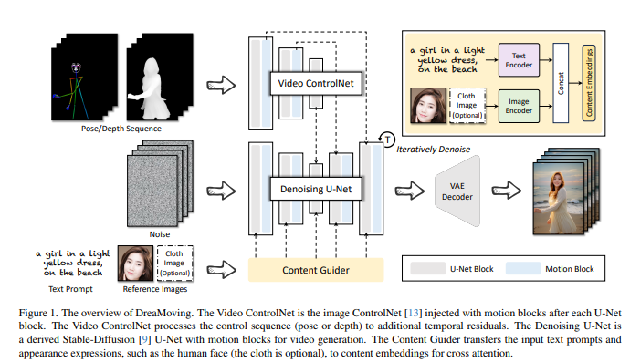
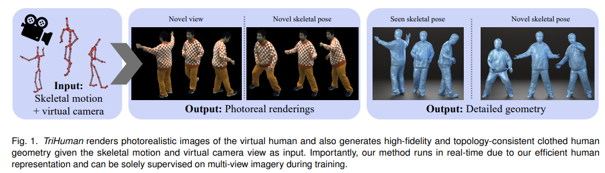

## DreaMoving: A Human Dance Video Generation Framework based on Diffusion Models
#video_generation
#Video
#Video_Customization
#Img_guided_Video_generation

  

- **研究背景**：人类舞蹈是一种富有表现力和创造力的艺术形式，它可以展示人类的情感、文化和身体能力。人工智能可以帮助人类创造和欣赏舞蹈，例如，可以根据音乐或文字生成舞蹈动作，或者可以让用户自定义舞蹈的风格和内容。这些应用可以为人类带来乐趣和启发，也可以为舞蹈教育和研究提供工具和资源。
- **研究动机**：目前，人工智能生成舞蹈视频的方法还存在一些挑战和局限，例如，**生成的视频质量不高，缺乏时间上的连贯性和多样性，难以控制舞蹈的动作和内容，以及难以保持舞者的个性和外貌。** 为了解决这些问题，这篇论文提出了一个新的框架，叫做**DreaMoving，它基于一种叫做扩散模型的人工智能技术，可以生成高质量、可控制、个性化的人类舞蹈视频**。
- **研究方法**：DreaMoving的核心思想是，将一个视频看作是由一系列的图像组成的，每个图像都是由一些噪声和一些信号组成的。噪声是一些随机的像素，信号是一些有意义的信息，例如舞者的姿势、表情、服装等。扩散模型的作用是，从一个全是噪声的图像开始，逐步去除噪声，增加信号，最终生成一个清晰的图像。DreaMoving利用了三个网络来实现这个过程，分别是去噪网络、视频控制网络和内容引导网络。去噪网络负责生成视频的每一帧图像，视频控制网络负责根据用户输入的姿势或深度序列来控制视频的动作，内容引导网络负责根据用户输入的文字或图片来控制视频的外观。
- **贡献和创新点**：DreaMoving的主要贡献和创新点有以下几个：
    - 它是第一个基于扩散模型的人类舞蹈视频生成框架，它可以生成高质量、长时间、多样化的视频，同时保持时间上的连贯性和空间上的细节。
    - 它提出了一个视频控制网络，它可以根据姿势或深度序列来精确地控制视频的动作，而不需要对每个目标身份进行特定的调整，也不需要复杂的文本描述。
    - 它提出了一个内容引导网络，它可以根据文字或图片来灵活地控制视频的外观，例如舞者的面部、服装和背景，而不需要预先定义的类别或属性。
- **相关工作**：这篇论文的相关工作主要包括以下几个方面：
    - 文本到视频的生成方法，它们可以根据文本描述来生成视频，但是通常难以生成人类舞蹈这样的复杂和细致的内容，也难以提供精确的控制和个性化的选项。
    - 基于扩散模型的图像生成方法，它们可以生成高质量和多样化的图像，但是通常不适用于视频生成，因为它们没有考虑时间上的连贯性和稳定性，也没有提供动作和内容的控制机制。
    - 人类舞蹈视频的生成方法，它们可以生成一些特定风格或类别的舞蹈视频，但是通常生成的视频质量不高，缺乏多样性，也缺乏控制和个性化的能力。

## TriHuman : A Real-time and Controllable Tri-plane Representation for Detailed Human Geometry and Appearance Synthesis
#human

  

- **研究背景**：人类的数字化和虚拟化是计算机图形学和计算机视觉领域的一个长期和具有挑战性的问题，它有很多应用，比如电影制作，游戏，通信和虚拟现实。理想的情况下，虚拟的人类应该是可控的，也就是说，可以根据输入的动作和视角来改变他们的姿势和外观；它们应该包含高度详细和动态的几何形状，比如衣服的褶皱和皮肤的纹理；它们的渲染应该看起来逼真，也就是说，可以模拟光照，阴影和反射等效果；而且它们的计算应该是实时的，也就是说，可以在每秒几十帧的速度下生成图像。然而，目前的方法要么不能同时满足这些要求，要么需要很多的人工工作，时间和成本。
- **研究动机**：为了解决这个问题，这篇论文的作者提出了一种新的人类表示方法，叫做**TriHuman，它可以从多视角的视频数据中学习一个可控，逼真，和高效的人类模型，而不需要其他的先验知识或者额外的数据。** **TriHuman的核心思想是使用一个三平面（tri-plane）的表示，它可以有效地将三维空间中的点映射到一个二维的纹理空间，从而提高计算速度和质量。另外，TriHuman还使用了一个可变形的人体模型和一个运动编码器，来捕捉人体的非刚性变形和动态变化，从而使得模型可以根据输入的骨骼动作来生成不同的姿势和外观。**
- **研究方法**：TriHuman的主要步骤如下：
    - 首先，给定一个骨骼动作和一个虚拟的相机视角作为输入，TriHuman使用一个可变形的人体模型来生成一个粗略的人体网格，它可以适应不同的衣服和动作。
    - 然后，TriHuman使用一个三平面生成器，来从人体网格中提取一些运动特征，比如位置，速度，加速度，法向量等，并将它们编码到三个正交的二维平面上，分别对应于人体表面，人体前后，和人体左右的方向。
    - 接着，TriHuman使用一个三平面特征提取器，来从三个平面上采样一些特征，并将它们拼接成一个三平面特征，它可以有效地表示人体的几何形状和外观。
    - 最后，TriHuman使用一个小型的多层感知器（MLP），来从三平面特征中预测每个点的密度和颜色，并使用一个体积渲染器，来将这些点合成为最终的图像。同时，TriHuman还使用一个实时的网格优化器，来根据三平面特征中的细节信息，来改善人体网格的质量。
- **贡献和创新点**：TriHuman的主要贡献和创新点有：
    - 提出了一种新的人类表示方法，它可以从多视角的视频数据中学习一个可控，逼真，和高效的人类模型，而不需要其他的先验知识或者额外的数据。
    - 提出了一种新的空间映射方法，它可以有效地将三维空间中的点映射到一个二维的纹理空间，从而提高计算速度和质量，同时减少映射冲突，也就是多个点映射到同一个位置的情况。
    - 提出了一种新的运动编码方法，它可以捕捉人体的非刚性变形和动态变化，并将它们编码到三个正交的二维平面上，从而使得模型可以根据输入的骨骼动作来生成不同的姿势和外观。
    - 提出了一种新的网格优化方法，它可以根据三平面特征中的细节信息，来改善人体网格的质量，从而生成更加精细和一致的人体几何形状。

## SwiftBrush : One-Step Text-to-Image Diffusion Model with Variational Score Distillation
#Diffusion_加速
#SDS

  

- **研究背景**：文本到图像生成是指根据给定的文本描述，生成与之相符的图像。这是一项有趣而有挑战的任务，它可以应用于艺术创作、教育、娱乐等领域。目前，有一种流行的文本到图像生成方法是基于扩散模型的。扩散模型是一种概率模型，它可以从随机噪声中逐步生成清晰的图像，通过一个预训练的网络来指导去噪过程。扩散模型可以生成高分辨率和多样化的图像，而且可以很容易地结合文本信息来实现文本到图像生成。
- **研究动机**：尽管扩散模型在文本到图像生成上取得了令人印象深刻的成果，但它们也有一个明显的缺点，就是**推理速度很慢。这是因为扩散模型需要多次迭代地采样和去噪，每一步都需要运行一次网络，这对于部署在消费者设备上或实时应用来说是不可接受的**。因此，如何提高扩散模型的推理速度，同时保持生成质量，是一个重要而紧迫的问题。
- **研究方法**：这篇论文**提出了一种新颖的无图像蒸馏方案，叫做SwiftBrush。它的灵感来自于文本到三维模型生成的技术，它们可以利用一个强大的预训练的二维文本到图像模型，来评估从三维模型渲染出来的图像是否真实，而不需要任何三维数据的监督**。这篇论文认为，**这些原理可以创新地适用于文本到图像生成，使得图像监督变得不必要**。**SwiftBrush的核心思想是，用一个预训练的多步文本到图像模型作为老师，来指导一个学生网络，使得它可以一步生成高质量的图像。为了做到这一点，它使用了一个额外的可训练的LoRA老师，来缩小老师和学生之间的差距，以及一个重新参数化的技巧，来让学生更容易学习**。
- **贡献和创新点**：这篇论文的主要贡献和创新点有以下几点：
    - 它提出了一种概念上新颖的一步文本到图像蒸馏过程，独特地能够在没有2D图像监督的情况下运行。这种策略不仅打开了文本到图像扩散模型蒸馏为单步生成器的新视角，也指出了将文本到三维的原理融合到文本到图像合成的潜力。
    - 它实现了一种简单而有效的学生网络重新参数化技巧，使得学生能够从预训练的扩散模型中学习到去噪的能力，而不是预测噪声。
    - 它在COCO 2014数据集上达到了16.67的FID分数和0.29的CLIP分数，与现有的最先进的蒸馏技术相比，取得了有竞争力的结果，甚至在没有使用任何训练图像数据的情况下，显著地超越了它们。
- **相关工作**：这篇论文的相关工作主要包括以下几个方面：
    - 文本到图像生成：这是一项研究如何根据文本描述生成图像的任务，有很多不同的方法，包括基于GAN的方法，基于自回归的方法，和基于扩散的方法。其中，基于扩散的方法可以生成高分辨率和逼真的图像，但是需要多次迭代的采样过程。
    - 文本到三维生成：这是一项研究如何根据文本描述生成三维模型的任务，有一些方法利用了预训练的二维文本到图像模型的知识，来评估从三维模型渲染出来的图像是否真实，而不需要三维数据的监督。这些方法可以生成高质量的三维神经辐射场或者网格模型。
    - 知识蒸馏：这是一种转移学习的方法，它的目的是将一个更强大的老师模型的知识传递给一个更小的学生模型。在扩散模型的背景下，有一些方法提出了如何提高学生模型的采样速度，从而减少推理步骤。这些方法可以分为有图像依赖的和无图像依赖的两类。这篇论文属于后者，但是与现有的方法不同，它使用了一个额外的LoRA老师和一个重新参数化的技巧，来提高一步文本到图像生成的质量。

## Customizing Motion in Text-to-Video Diffusion Models
#video_generation
#Video
#Video_Customization

  

  

- **研究背景**：文本到视频的生成模型是一种可以根据文本描述来生成视频的人工智能技术，它有很多有趣和有用的应用，比如动画制作或内容创作。但是，现有的文本到视频的生成模型的能力受限于它们的训练数据，也就是说，它们只能生成训练数据中出现过的动作，而不能生成一些新的或特定的动作。比如，如果你想让模型生成一个人做“卡尔顿舞”（Carlton dance）的视频，但是训练数据中没有这个动作，那么模型就无法生成。因此，**如何让文本到视频的生成模型能够学习和生成新的动作，是一个很有挑战和价值的研究问题。**
- **研究动机**：这篇论文的研究动机是为了解决上述的问题，也就是如何在文本到视频的生成模型中添加新的动作。作者认为，**如果能够让模型能够从一些示例视频中学习和概括一个新的动作，然后将这个动作与一个特定的文本标记（token）关联起来，那么就可以在生成视频时通过文本来控制模型生成这个动作。这样，就可以实现对文本到视频的生成模型的定制化（customization），并且提高模型的灵活性和创造性。**
- **研究方法**：这篇论文的研究方法是基于一种叫做扩散模型（diffusion model）的文本到视频的生成模型。扩散模型是一种概率模型，它可以通过一个逐步去噪（denoising）的过程来近似一个分布，也就是说，它可以从一个高斯噪声（Gaussian noise）的样本开始，然后逐渐去掉一部分噪声，直到生成一个符合目标分布的样本。扩散模型的优点是它可以生成高质量和高分辨率的视频，而且可以很容易地加入文本条件（condition）。作者的方法是在一个预训练好的扩散模型的基础上，对模型的一部分参数进行微调（fine-tuning），使得模型能够学习一个新的动作。具体来说，作者选择了模型中负责处理时间维度和空间维度的参数，以及模型中的注意力机制（attention mechanism）的参数，来进行微调。作者还引入了一种视频正则化（video regularization）的方法，来防止模型忘记它原来学习过的动作，以及一种非均匀的时间步采样（non-uniform timestep sampling）的方法，来强调视频的动态结构而不是细节。作者还展示了如何将动作定制化和外观定制化（appearance customization）结合起来，来生成具有个性化外观和动作的视频。
- **贡献和创新点**：这篇论文的主要贡献和创新点有以下几点：
    - 提出了一种在文本到视频的生成模型中添加新的动作的方法，可以实现对模型的定制化，并且扩展了模型的能力和应用范围。
    - 提出了一种视频正则化的方法，可以有效地防止模型忘记原来的动作知识，以及一种非均匀的时间步采样的方法，可以更好地学习视频的动态结构。
    - 提出了一种多模态的定制化方法，可以同时定制视频中的外观和动作，从而生成更具有个性和创意的视频。
    - 提出了一种定量评估生成视频中的动作质量和文本对齐度的方法，并且在多个数据集上进行了实验，验证了方法的有效性和优越性。
- **相关工作**：这篇论文的相关工作主要包括以下几个方面：
    - 文本到图像的定制化（text-to-image customization）：这方面的工作主要是针对静态图像的生成模型，目的是为了引入一些新的主体或对象，比如人物或物品。这些工作的方法主要是通过微调模型的一部分参数，或者引入一个图像编码器，来实现对模型的定制化。这些工作的局限性是它们只能定制静态的对象，而不能定制动态的动作。
    - 可控制的视频生成（controllable video generation）：这方面的工作主要是针对动态视频的生成模型，目的是为了控制视频中的一些属性，比如运动或结构。这些工作的方法主要是通过学习一个运动或结构的先验（prior），或者分解视频的前景和背景，来实现对视频的编辑或生成。这些工作的局限性是它们主要是基于已有的视频进行转换或迁移，而不能从头开始生成新的视频。
    - 文本到视频的生成模型（text-to-video generation models）：这方面的工作主要是针对从文本描述直接生成视频的任务，目的是为了提高视频的质量和分辨率。这些工作的方法主要是通过设计一些适合视频的生成网络和优化方法，来实现高效和高质量的视频生成。这些工作的局限性是它们的能力受限于它们的训练数据，也就是说，它们不能生成训练数据中没有出现过的动作。

## Inversion-Free Image Editing with Natural Language
#image_editing
#居然不需要DDIM_Inversion

  

- **研究背景**：图片编辑是一种用计算机技术来改变图片内容或风格的方法，它有很多应用场景，比如美化照片，创作艺术作品，或者生成虚拟现实。用自然语言来编辑图片是一种更直观和灵活的方式，它可以让用户用自己的话来描述想要的效果，而不需要用复杂的工具或参数。但是，用自然语言来编辑图片也有很多挑战，比如如何理解用户的意图，如何保持图片的质量和一致性，以及如何提高编辑的效率和实时性。
- **研究动机**：目前，很多用自然语言来编辑图片的方法都是基于扩散模型（Diffusion Models）的，它们是一种强大的图片生成模型，可以用来生成各种条件下的图片，比如文本，图片，或者触觉输入。但是，**这些方法都需要进行一个反演（Inversion）的过程，就是把真实的图片转换成模型能理解的隐变量（Latent Variables），然后再用这些隐变量来生成目标图片**。这个过程很耗时，而且容易导致图片的失真和不一致。因此，**这篇论文的研究动机是提出一种不需要反演的图片编辑方法，它可以用自然语言来直接操纵图片的内容，而不需要经过复杂的转换和优化。**
- **研究方法**：这篇论文的研究方法分为两个部分，一个是不需要反演的采样（Sampling）框架，叫做去噪扩散一致模型（Denoising Diffusion Consistent Model，简称DDCM），另一个是统一的注意力控制（Attention Control）机制，叫做UAC。DDCM的核心思想是，当已知初始的图片时，可以选择一个特殊的方差（Variance）安排，使得去噪的步骤和多步一致采样（Multistep Consistency Sampling）的形式一样，这样就可以直接从一个随机的噪声开始，而不需要反演。UAC的核心思想是，把交叉注意力（Cross-Attention）控制和互相自注意力（Mutual Self-Attention）控制结合起来，用一个额外的布局（Layout）分支来保存目标图片的结构和空间信息，然后用这个分支来指导目标分支的语义信息，这样就可以同时实现刚性和非刚性的语义变换，而不需要调节参数。
- **贡献和创新点**：这篇论文的主要贡献和创新点有以下几点：
    - 提出了一种不需要反演的图片编辑方法，叫做InfEdit，它可以用自然语言来直接操纵图片的内容，而不需要经过复杂的转换和优化，提高了编辑的效率和实时性。
    - 提出了一种去噪扩散一致模型（DDCM），它可以用一个特殊的方差安排来简化去噪的步骤，使得它和多步一致采样的形式一样，从而实现了一个虚拟的反演策略，消除了反演过程中的累积误差和不一致性。
    - 提出了一种统一的注意力控制（UAC）机制，它可以把交叉注意力控制和互相自注意力控制结合起来，用一个额外的布局分支来保存目标图片的结构和空间信息，然后用这个分支来指导目标分支的语义信息，从而实现了刚性和非刚性的语义变换，而不需要调节参数。
    - 通过大量的实验，验证了InfEdit在各种编辑任务上的强大性能，以及它在保持图片的质量和一致性方面的优势，展示了它在实时应用方面的潜力。
- **相关工作**：这篇论文的相关工作主要包括以下几个方面：
    - 图片编辑与扩散模型：扩散模型是一种强大的图片生成模型，可以用来生成各种条件下的图片，比如文本，图片，或者触觉输入。很多用自然语言来编辑图片的方法都是基于扩散模型的，它们通常需要进行一个反演的过程，把真实的图片转换成模型能理解的隐变量，然后再用这些隐变量来生成目标图片。这个过程很耗时，而且容易导致图片的失真和不一致。这篇论文提出了一种不需要反演的图片编辑方法，它可以用自然语言来直接操纵图片的内容，而不需要经过复杂的转换和优化。
    - 反演与扩散模型：在扩散模型中，反演是把真实的图片转换成模型能理解的隐变量的过程，它是图片编辑的一个重要步骤。目前，有很多不同的反演方法，比如SDEdit，DDIM反演，空文本反演，负文本反演，CycleDiffusion，编辑友好反演，和直接反演。这些方法都有各自的优缺点，但都需要进行一个耗时的反演过程，而且容易导致图片的失真和不一致。这篇论文提出了一种去噪扩散一致模型（DDCM），它可以用一个特殊的方差安排来简化去噪的步骤，使得它和多步一致采样的形式一样，从而实现了一个虚拟的反演策略，消除了反演过程中的累积误差和不一致性。
    - 注意力控制与图片编辑：在用自然语言来编辑图片的过程中，注意力控制是一种重要的技术，它可以用来保持图片的质量和一致性，以及实现更精细和灵活的编辑效果。目前，有很多不同的注意力控制机制，比如Prompt-to-Prompt，Plug-and-Play，和MasaCtrl。这些机制都有各自的优缺点，但都不能同时实现刚性和非刚性的语义变换，而且需要调节参数。这篇论文提出了一种统一的注意力控制（UAC）机制，它可以把交叉注意力控制和互相自注意力控

## Text-to-3D Generation with Bidirectional Diffusion using both 2D and 3D priors
#_3D_generation
#Text23D

  

- **研究背景**：3D物体生成是人工智能领域的一个重要研究方向，它可以用于虚拟现实、游戏、设计等多种应用场景。然而，3D物体生成是一个非常困难的任务，因为3D物体不仅需要具有正确的几何形状，还需要有逼真的纹理和材质。目前，**有两种主流的方法来生成3D物体**：**一种是基于2D的方法，它利用2D图像的信息来指导3D物体的生成**；**另一种是基于3D的方法，它直接从3D数据集中学习3D物体的结构和外观**。然而，这两种方法都有**各自的缺点：基于2D的方法可能导致3D物体的几何不一致或不真实**，**而基于3D的方法可能导致3D物体的纹理不清晰或不多样**。
- **研究动机**：为了克服上述两种方法的局限性，这篇论文提出了一种新的方法，**叫做双向扩散模型（Bidirectional Diffusion）。这种方法的目的是结合2D和3D的优势，同时保证3D物体的几何和纹理的质量、多样性和一致性。**另外，这种方法还可以实现对3D物体的几何和纹理的独立控制，以及对优化方法的加速和改进。
- **研究方法**：这篇论文的核心思想是利用两个扩散模型来生成3D物体，一个是3D扩散模型，一个是2D扩散模型。扩散模型是一种生成模型，它可以从噪声中逐步恢复出清晰的图像或物体。3D扩散模型用于生成3D物体的形状，它使用一种叫做有符号距离场（SDF）的表示方法，它可以描述3D物体的表面和内部。2D扩散模型用于生成3D物体的纹理，它使用一组多视角的图像来表示3D物体的外观。这两个扩散模型都使用了预训练的模型作为先验，即3D扩散模型使用了Shap-E模型，而2D扩散模型使用了DeepFloyd模型。这些预训练的模型可以提供强大的3D和2D的知识，从而提高生成的质量和多样性。为了使两个扩散模型能够协同工作，这篇论文还提出了一种双向引导的机制，它可以使3D和2D的生成过程相互影响和调整。具体来说，就是在每一步扩散过程中，3D扩散模型的输出会被渲染成2D图像，作为2D扩散模型的引导信号；同时，2D扩散模型的输出也会被反投影成3D物体，作为3D扩散模型的引导信号。这样，两个扩散模型就可以保持一致的生成方向，从而生成高质量、多样化和一致的3D物体。
- **贡献和创新点**：这篇论文的主要贡献和创新点有以下几个方面：
    - 提出了一种新的双向扩散模型，它可以结合2D和3D的优势，同时保证3D物体的几何和纹理的质量、多样性和一致性。
    - 提出了一种新的训练流程，它可以利用预训练的2D和3D生成模型作为先验，从而提高生成的效率和效果。
    - 提出了一种新的生成方式，它可以实现对3D物体的几何和纹理的独立控制，从而提供更多的创造性和灵活性。
    - 提出了一种新的优化方法，它可以利用双向扩散模型的输出作为优化的初始化，从而进一步提高3D物体的质量和优化的效率。
- **相关工作**：这篇论文的相关工作主要包括以下几个方面：
    - 3D物体生成的方法，包括基于3D数据集的方法和基于2D数据集的方法，以及它们的优缺点。
    - 扩散模型的原理和应用，包括2D图像生成的扩散模型和3D物体生成的扩散模型，以及它们的优势和局限性。
    - 3D物体表示的方法，包括有符号距离场（SDF）和神经表面场（NeuS），以及它们的特点和区别。
    - 3D物体优化的方法，包括基于2D评分函数的优化方法和基于3D分布的优化方法，以及它们的效果和效率。

## HandDiffuse: Generative Controllers for Two-Hand Interactions via Diffusion Models

#hands
#Video

  

- **研究背景**：**双手交互是人类表达情感和沟通的重要方式，也是虚拟现实和机器人等领域的重要应用**。但是，目前的数据集和方法都不能很好地捕捉和生成双手交互的动作，因为双手交互涉及到手部的自遮挡、自相似和复杂的关节运动，这些都给数据采集和模型设计带来了挑战。
- **研究动机**：为了解决这个问题，作者提出了两个目标：**一是构建一个大规模的双手交互的数据集，包含了丰富的动作序列和多种模态的数据，如视频、三维关键点和手部姿态**；**二是提出一个强大的基线方法，能够根据不同的控制信号，如关键帧和轨迹，来生成逼真的双手交互的动作。**
- **研究方法**：作者的方法主要分为两个部分：一是数据集的构建，二是动作的生成。对于数据集的构建，作者使用了50个摄像头来录制了不同类型的双手交互的动作，如随机和复杂的手势、日常交流、手指舞和中国日常手语等，总共有250k个动作帧，约1250万张图片。作者还使用了三角化和MANO模型来获取三维关键点和手部姿态，并且手动标注了部分被遮挡的关键点。对于动作的生成，作者使用了扩散模型作为主干网络，这是一种概率模型，可以从高斯噪声中逐步恢复出目标动作。作者还设计了两种不同的动作表示方法，分别适用于不同的控制信号，以及一个交互损失函数，来显式地量化双手之间的动态交互过程。
- **贡献和创新点**：作者的贡献和创新点主要有以下几个方面：一是提供了一个大规模的双手交互的数据集，不仅包含了强交互和时间序列，而且具有最大的规模和最丰富的交互类型；二是提出了一个强大的基线方法，能够根据不同的控制信号，生成逼真的双手交互的动作，支持多种应用场景，如动作插值和轨迹控制；三是引入了两种动作表示方法，以及一个交互损失函数，来显著提高双手交互的生成质量；四是将数据集、相关代码和预训练模型公开分享，为未来的双手交互建模的研究提供了有力的支持。
- **相关工作**：作者的工作主要涉及到以下几个方面的相关工作：一是手部数据集的建立，这是一个困难而耗时的过程，但是这些数据集对于虚拟现实、机器人和人物交互等领域有着重要的意义。作者综述了一些现有的手部数据集，包括使用不同的传感器采集的真实数据，以及使用合成方法生成的虚拟数据，指出了它们的优缺点和适用范围；二是手部重建和捕捉，这是一个在计算机视觉领域的重要问题，也是生成手部动作的基础。作者回顾了一些基于回归的方法，以及基于扩散模型的方法，分析了它们的性能和局限性；三是人体动作生成，这是一个在人工智能领域的热门话题，有许多研究探索了如何根据不同的条件信号，来生成特定类型的人体动作。作者总结了一些基于GAN或VAE的方法，以及基于扩散模型的方法，比较了它们的优势和挑战。作者指出，目前的这些方法都主要关注于生成全身的动作，而忽略了双手交互的动作，这是一个新的研究方向。

## Enhancing Visual Realism: Fine-Tuning InstructPix2Pix for Advanced Image Colorization
#Image_Colorization
#image_editing

  

- **研究背景**：**图像上色是指给黑白图片添加合理的颜色信息，这是一项有趣而有用的任务，可以用于恢复历史照片和电影，或者增强医学和卫星图像的可解释性**。但是，**图像上色也是一项很难的任务，因为计算机很难理解和解释黑白图片中的内容，纹理和阴影，以及应用逼真的颜色。**
- **研究动机**：近年来，机器学习和计算机视觉的发展使得图像上色的方法更加先进和细致。许多研究使用了卷积神经网络（CNN）和生成对抗网络（GAN）来捕捉图片中的特征，并预测每个像素的颜色。其中，Pix2Pix是一种基于条件的GAN，可以生成高质量和详细的图片。本文的作者决定在Pix2Pix的基础上进行微调，以提高图像上色的效果。
- **研究方法**：本文使用了InstructPix2Pix模型，这是一种将语言模型（GPT-3）和文本到图像模型（Stable Diffusion）结合起来的模型，可以根据文本指令编辑图片。原始的InstructPix2Pix模型可以处理各种图片编辑任务，但是在图像上色方面有一些局限性。为了解决这个问题，本文使用了IMDB-WIKI数据集，这是一个包含人脸图片的数据集，将黑白图片作为输入，彩色图片作为输出，以及由ChatGPT生成的多样化的上色提示作为条件，对InstructPix2Pix模型进行微调。本文主要对InstructPix2Pix模型中的U-Net部分进行微调，这是一个负责去噪图片隐含表示的模型。
- **贡献和创新点**：本文的贡献和创新点有两个方面：（1）首次将微调技术应用于稳定扩散模型，专门针对图像上色任务；（2）使用生成模型创建多样化的条件提示，增加了训练数据的丰富性。经过微调后，本文的模型在多个指标上优于原始的InstructPix2Pix模型，而且生成的图片更加逼真和自然。
- **相关工作**：本文的相关工作主要包括以下几个方面：（1）图像上色的传统方法，如使用CNN和LAB颜色空间来预测像素颜色的方法（Zhang et al., 2016; Iizuka et al., 2016）；（2）图像上色的生成对抗方法，如使用条件GAN的Pix2Pix框架来生成图片的方法（Isola et al., 2018）；（3）文本到图像的稳定扩散方法，如使用GPT-3和Stable Diffusion来根据文本指令编辑图片的InstructPix2Pix模型（Brooks et al., 2023）。
