## All but One: Surgical Concept Erasing with Model Preservation in Text-to-Image Diffusion Models
#概念擦除

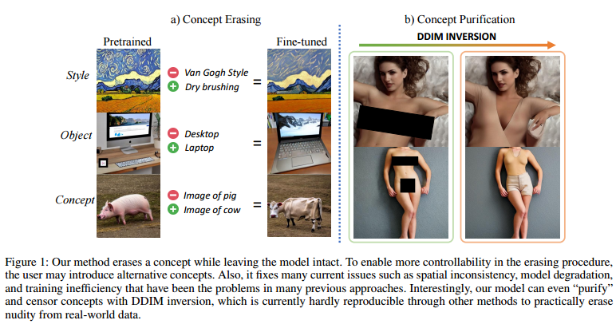  

本文提出了一种新的技术，使用Diffusion模型实现文本到图像扩散。研究人员提出了一种新的手术概念，称为"Surgical Concept Erasing"，该方法可以针对文本输入中的关键字来移除生成图像中的具有挑战性的概念，而保留其他模式和特征。

## InstructVideo: Instructing Video Diffusion Models with Human Feedback
#Video
#video_editing
#video_generation

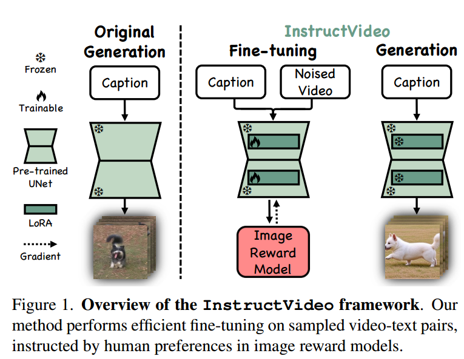  

本文提出了一种全新的扩散模型视频生成方法，通过借助人类反馈进行奖励微调，从而生成视觉上更吸引人，更符合文本提示的视频。论文还提出了Segmental Video Reward和Temporally Attenuated Reward两种技术，用于缓解奖励微调过程中的时间建模退化问题和缺乏奖励模型的问题。最终的实验结果表明，这些技术的运用大大提高了视频生成的视觉质量。

## StreamDiffusion: A Pipeline-level Solution for Real-time Interactive Generation
#interaction
#real_time
#text2img

#text2img

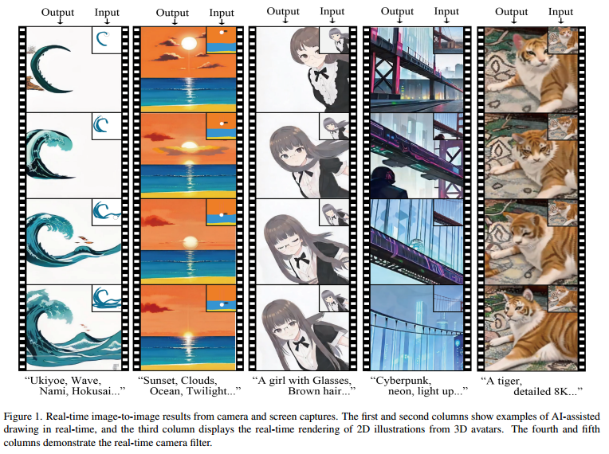  

本篇论文介绍了一种名为StreamDiffusion的实时扩散（diffusion）管道方法，旨在用于交互式图像生成。现有的扩散模型擅长通过文本或图像提示创建图像，但在实时交互方面往往表现不佳。这项工作解决了模型推断效率上的瓶颈，以及不适合连续输入的这一问题。论文提出的StreamDiffusion方法使用了最新的随机微分方程技术，以高效地生成高质量的图像。该方法通过整合预处理过的初始采样和导数链蒙特卡洛采样，代替了原有的耗时的迭代推理过程。同时，这项工作还提供了处理不同类型和多种预处理管道的实验方法。

## Fixed-point Inversion for Text-to-image diffusion models
#inversion

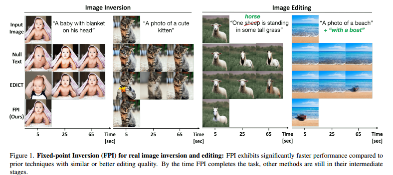  

该论文介绍了一种基于固定点迭代（FPI）的图像反演方法，该方法能够有效地将图像转换为潜在向量，并从中重建图像。使用 COCO2017 验证数据集进行了实验评估，结果表明该方法相对于其他最先进的反演方法具有更高的 PSNR 值和更短的运行时长，并且不需要额外的存储。同时，该论文也介绍了如何将该方法应用于图像编辑和稀有概念生成。

## DiffPortrait3D: Controllable Diffusion for Zero-Shot Portrait View Synthesis

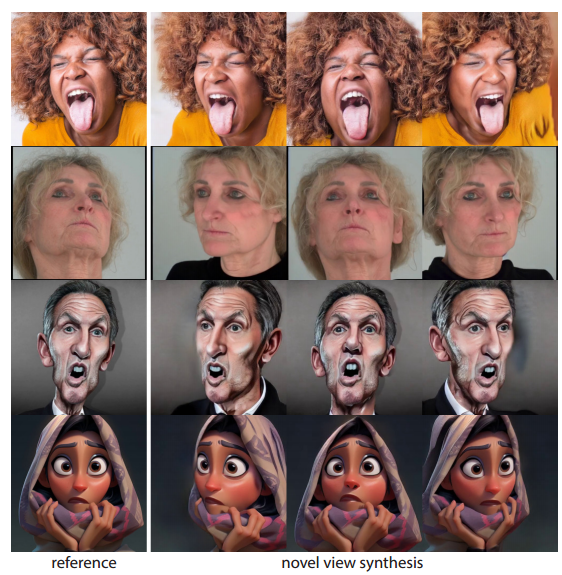  

    
## MotionScript: Natural Language Descriptions for Expressive 3D Human Motions

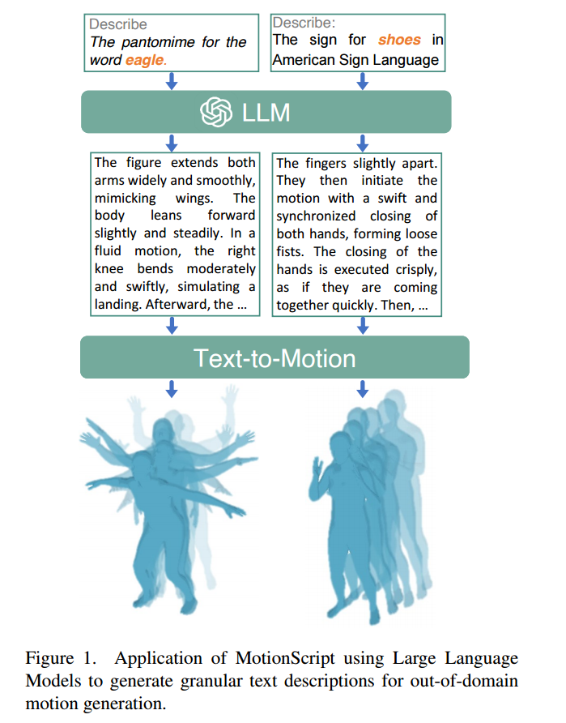  

该文件介绍了一种将3D人体运动转化为自然语言描述的算法——MotionScript。与其他自然语言描述方法不同，MotionScript直接提供自然语言描述，而不是简单的动作标签或高级人类标题。该文件介绍了MotionScript的基本原理和实现方法，并提供了该算法的应用。用户可以向该文件问关于MotionScript算法的工作原理、性能评估、和算法应用范围等问题。

## RealCraft: Attention Control as A Solution for Zero-shot Long Video Editing
#video_editing
#Video

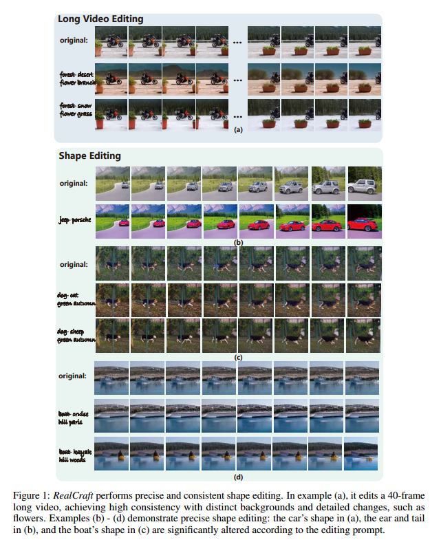  

## Quantifying Bias in Text-to-Image Generative Models
#Diffusion_bias

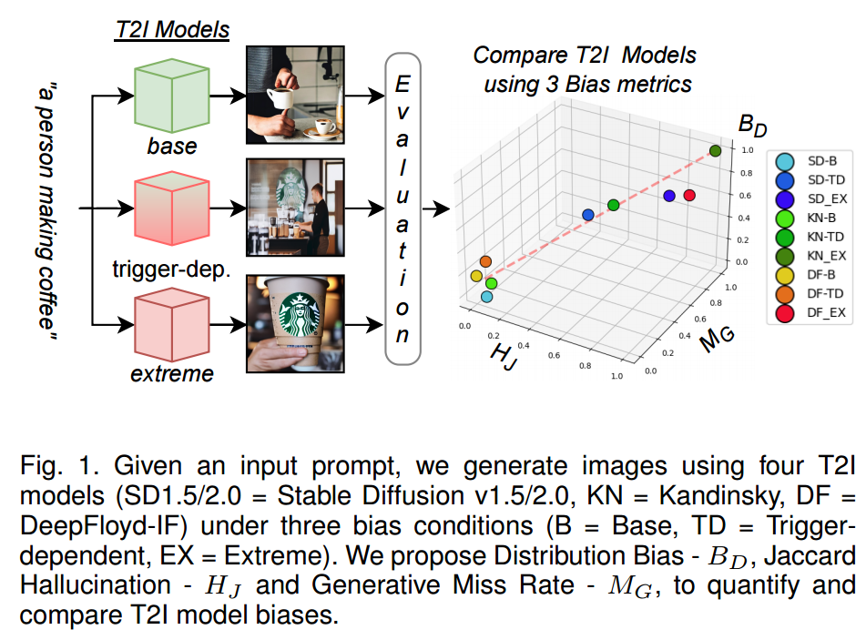  

本文提供了一种可以量化文本到图像生成模型的多种偏差的评估方法。不同于以往只关注社交偏见的方法，本文提出的评估框架不对任何先入为主的偏见进行研究。通过两次科学实验来验证了方法的可靠性。研究表明，现有的文本到图像生成模型存在明显的性别偏见，本文提出的方法可以客观检测模型的偏见。此外，本文还提供了一个实用型“在线应用”，让更多使用者能够使用模型来评估模型的偏见。

## Relightable and Animatable Neural Avatars from Videos
#Avatar_3D
#Video

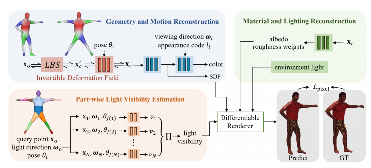  

本文提出一种从稀疏视频重建可重新照明和可动画的神经头像的方法，以实现人体头像的高质量3D数字化，文中介绍了几种技术来解决几个难点，包括对人体形状的反问题解决，阴影检测以及对光照的建模，同时还提供了代码和数据以供使用者使用。

## Repaint123: Fast and High-quality One Image to 3D Generation with Progressive Controllable 2D Repainting
#_3d生成

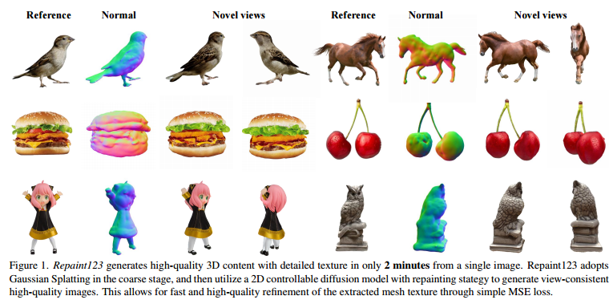  

Repaint123是一种用于一张图像到3D生成的方法，旨在解决当前方法存在的多视角不一致、纹理过度平滑等问题，并加快生成速度。核心思想是将2D扩散模型的图像生成能力和重绘策略的纹理对齐能力相结合，以生成具有一致性的高质量多视图图像。此外，我们还提出了一种可见性自适应的重绘强度，以增强在重绘过程中重叠区域内的图像质量。我们进行了广泛的实验，并展示了我们的方法具有从头开始在2分钟内生成具有多视角一致性和细节纹理的高质量3D内容的卓越能力。

## Generative Multimodal Models are In-Context Learners
#上下文
#image_generation
#MLLM

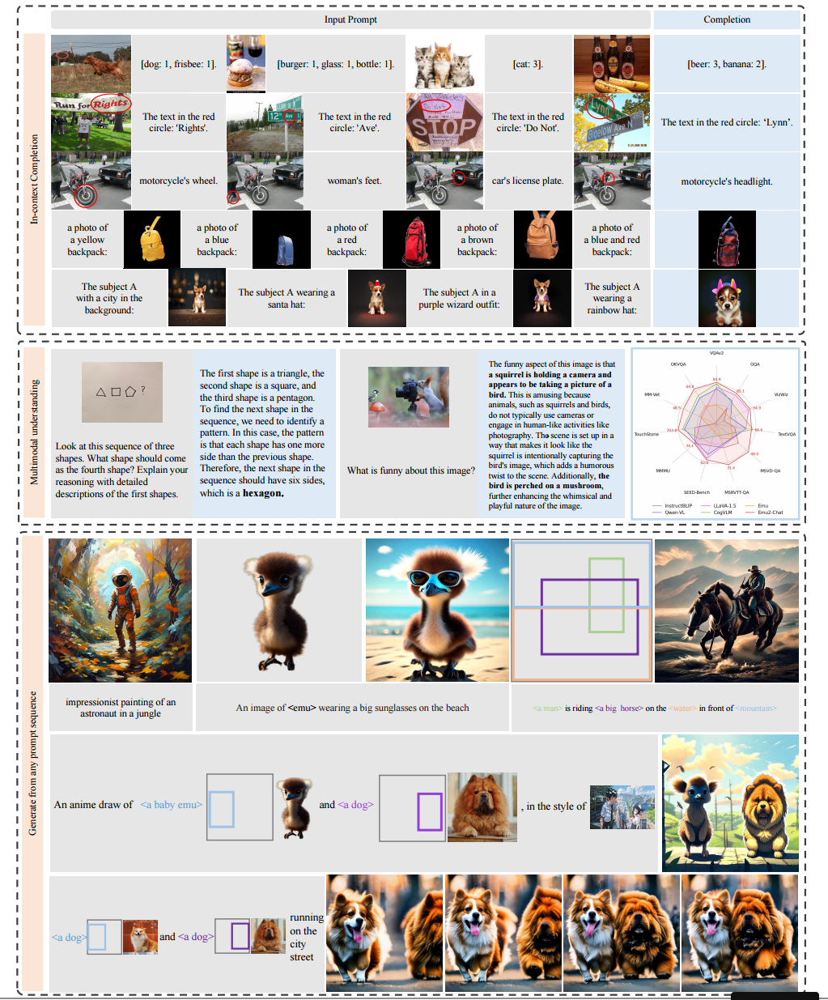  

本工作展示了大型多模态模型的任务不可知上下文学习能力可以通过有效的扩展得到改进，其中介绍了Emu2，一个具有370亿参数的生成式多模态模型，使用统一的自回归目标在大规模多模态序列上进行训练。Emu2展现了强大的多模态上下文学习能力，甚至能够解决需要即兴推理的任务，例如视觉提示和基于物体的生成。该模型在少样本情况下创造了多项多模态理解任务的新纪录。当调整为遵循特定指令时，Emu2在挑战性任务上进一步实现了新的最先进水平，例如针对大型多模态模型的问答基准和开放式主题驱动的生成。这些成就表明，Emu2可以作为一种基础模型和广泛多模态任务的通用接口。代码和模型是公开可用的，以促进未来的研究。