## Virtual Pets: Animatable Animal Generation in 3D Scenes
#scene_editing_3D
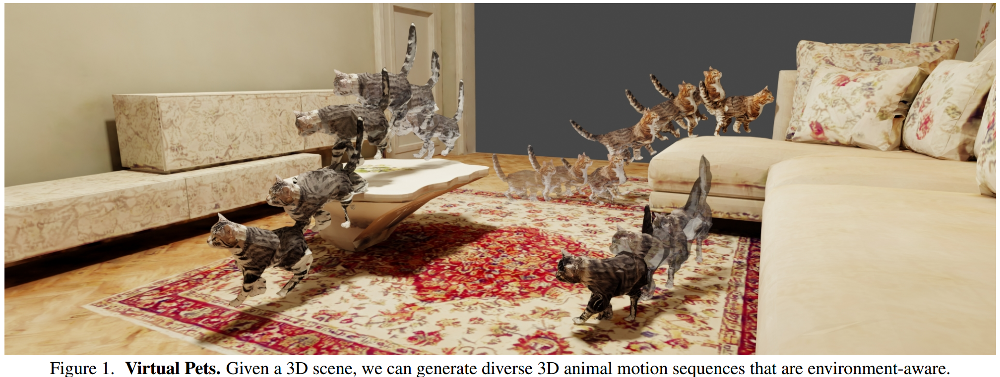  

## HyperEditor: Achieving Both Authenticity and Cross-Domain Capability in Image Editing via Hypernetworks
#image_editing
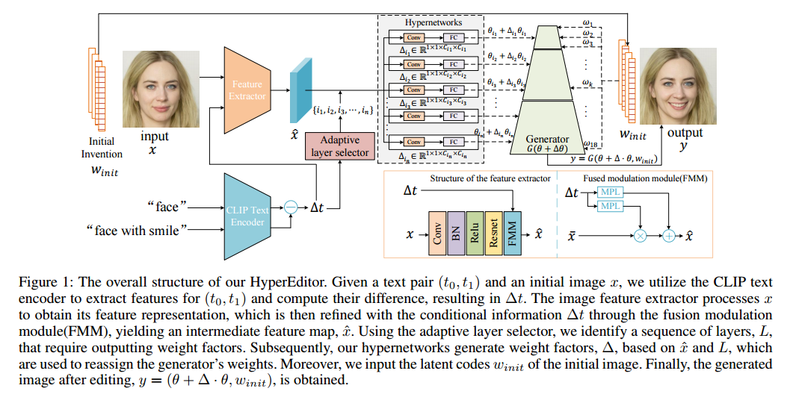  

    
## ShowRoom3D: Text to High-Quality 3D Room Generation Using 3D Priors
#室内场景

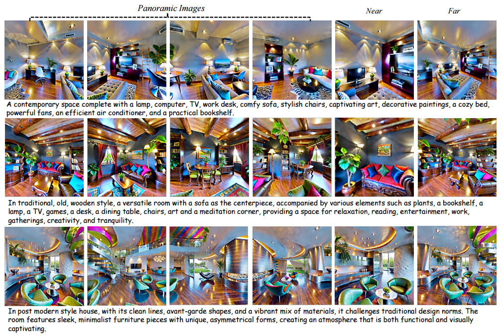  

## Fairy: Fast Parallellized Instruction-Guided Video-to-Video Synthesis
#video_editing
#Video
#video_generation

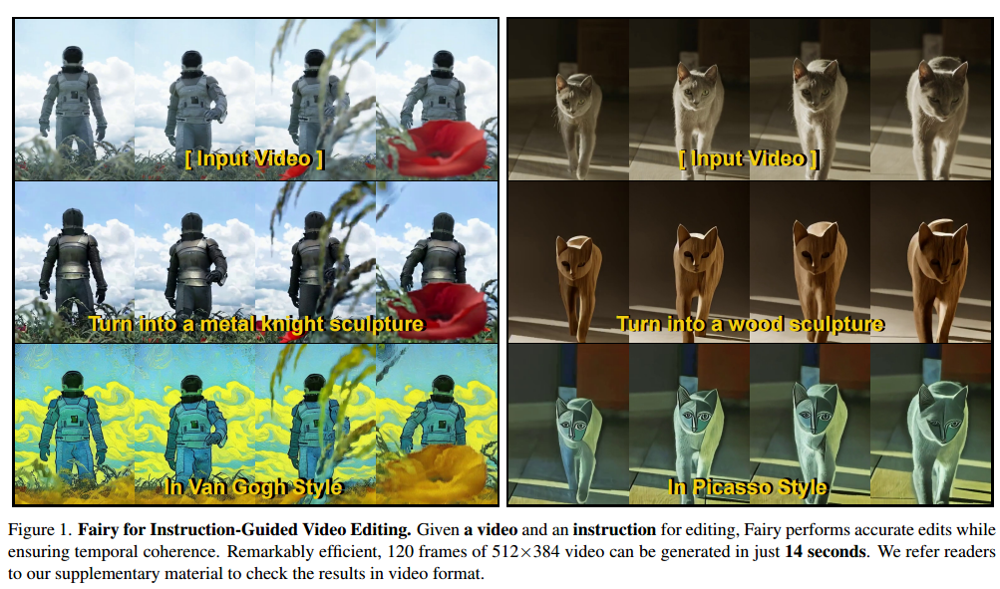  

## HD-Painter: High-Resolution and Prompt-Faithful Text-Guided Image Inpainting with Diffusion Models
#image_editing
#image_inpainting

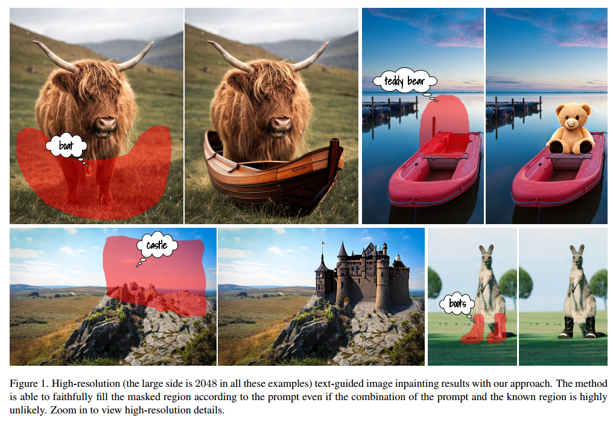  

## Ponymation: Learning 3D Animal Motions from Unlabeled Online Videos
#Video
#motion

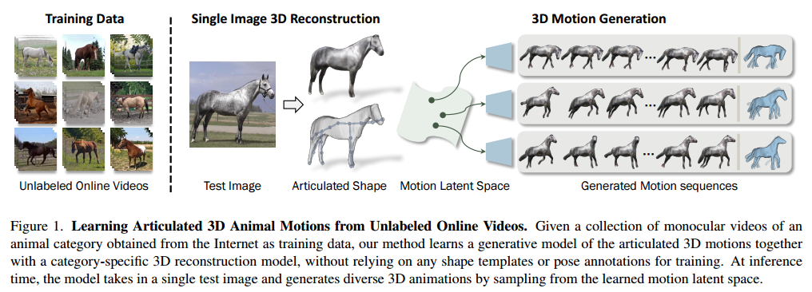  

## DreamTuner: Single Image is Enough for Subject-Driven Generation
#定制化

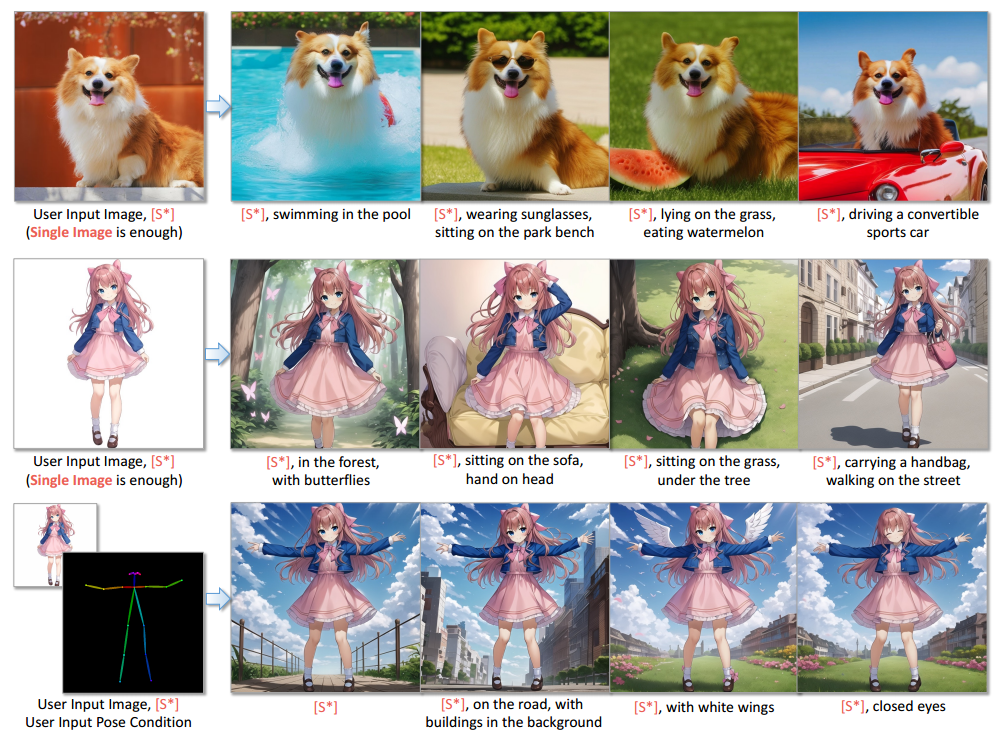  

## PIA: Your Personalized Image Animator via Plug-and-Play Modules in Text-to-Image Models
#定制化

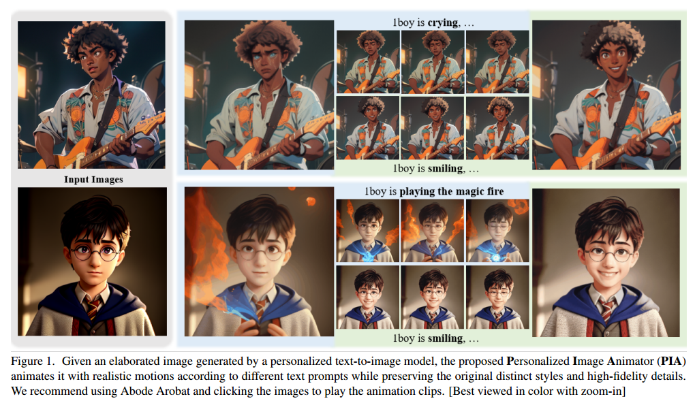  

## Free-Editor: Zero-shot Text-driven 3D Scene Editing
#scene_editing_3D

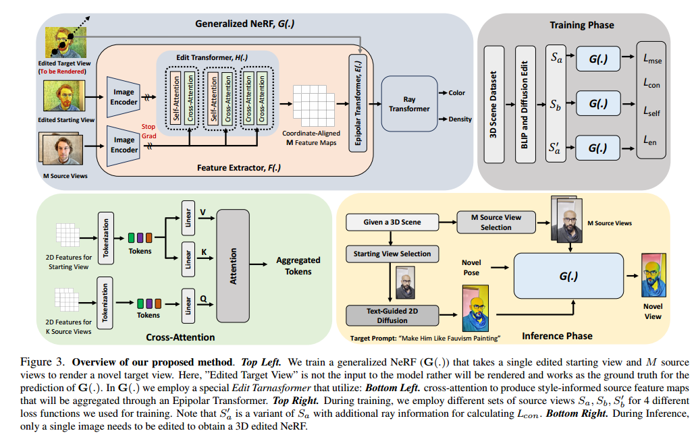  

## Align Your Gaussians: Text-to-4D with Dynamic 3D Gaussians and Composed Diffusion Models
#Text24D
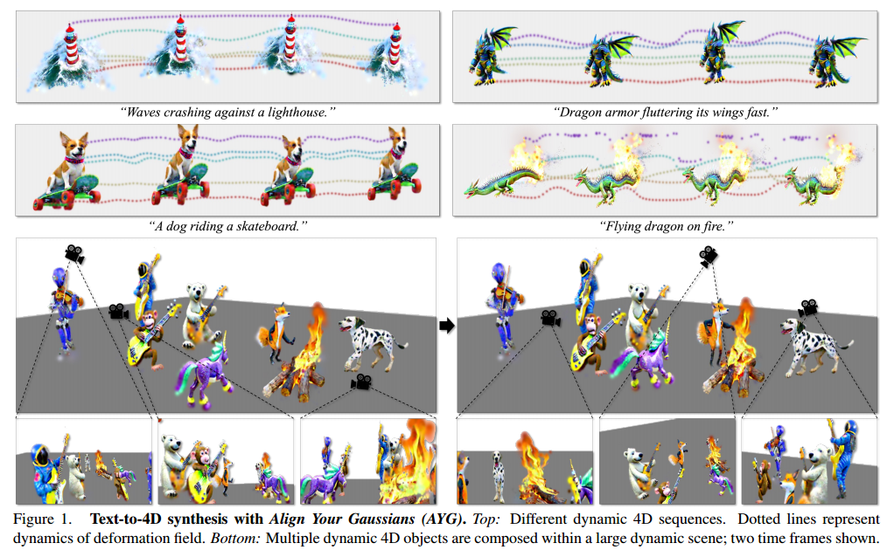  

## Paint3D: Paint Anything 3D with Lighting-Less Texture Diffusion Models
#_3d生成
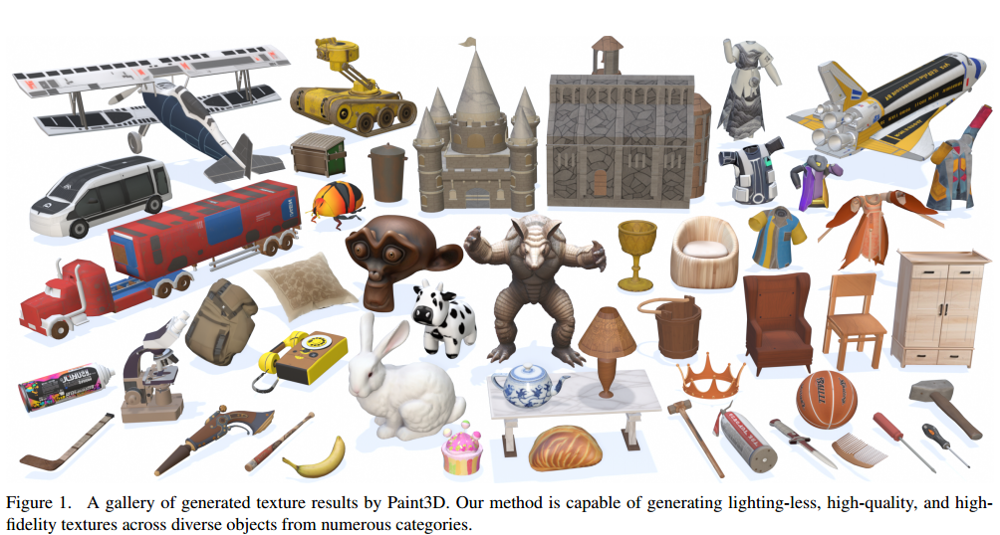  

## LiDAR-LLM: Exploring the Potential of Large Language Models for 3D LiDAR Understanding

#LLM

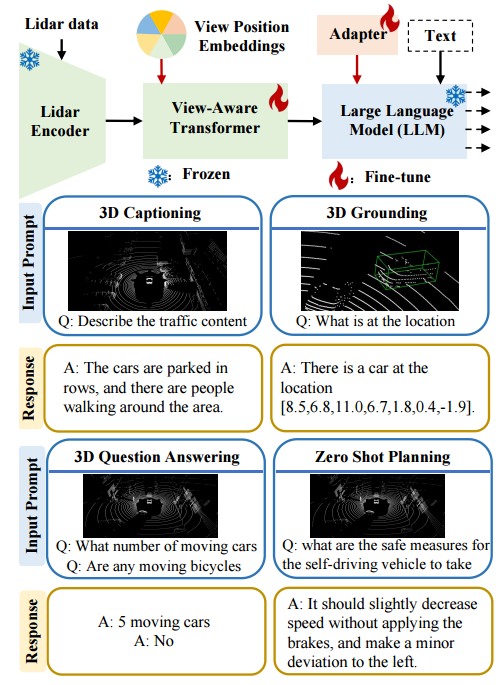  

## Neural Point Cloud Diffusion for Disentangled 3D Shape and Appearance Generation
#_3d生成
#解耦

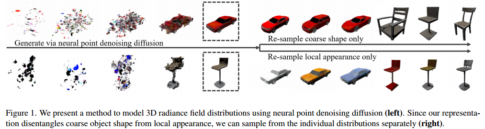  

## VideoPoet: A Large Language Model for Zero-Shot Video Generation
#Video
#video_generation

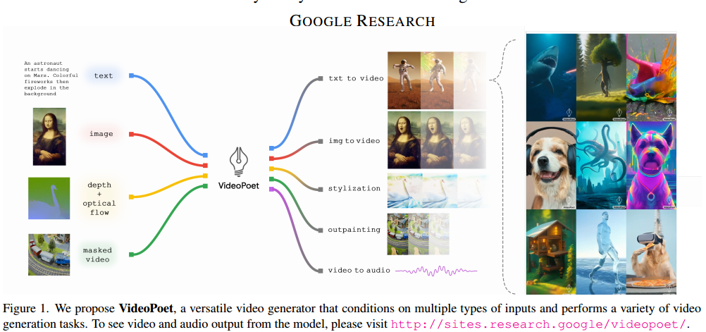  

