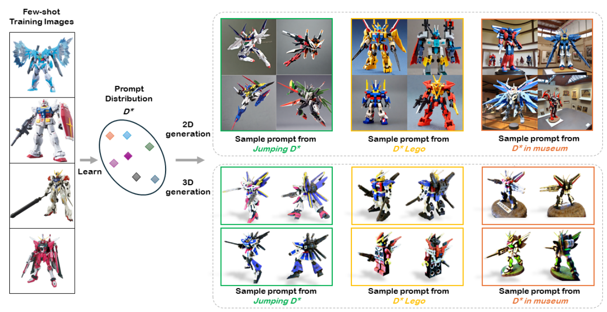
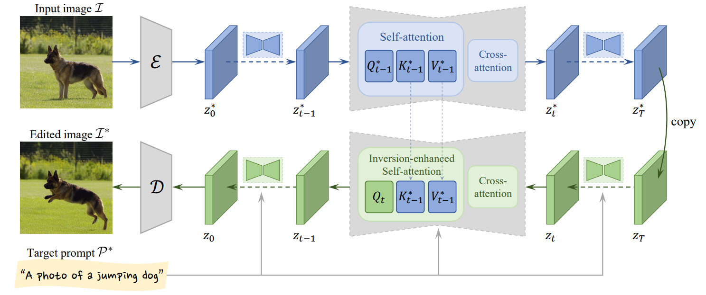
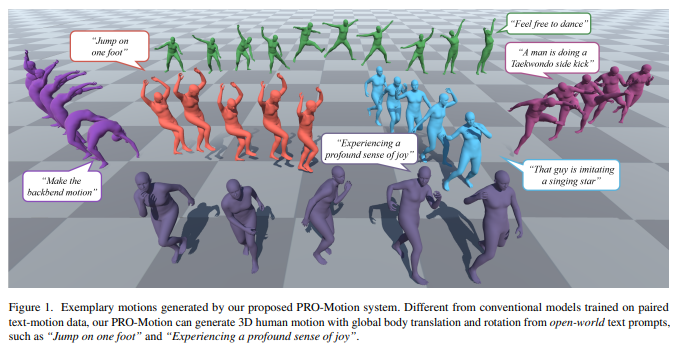

## DreamDistribution: Prompt Distribution Learning for Text-to-Image Diffusion Models
#inversion

  

## Tuning-Free Inversion-Enhanced Control for Consistent Image Editing
#image_editing

  

## Plan, Posture and Go: Towards Open-World Text-to-Motion Generation
#motion

  
