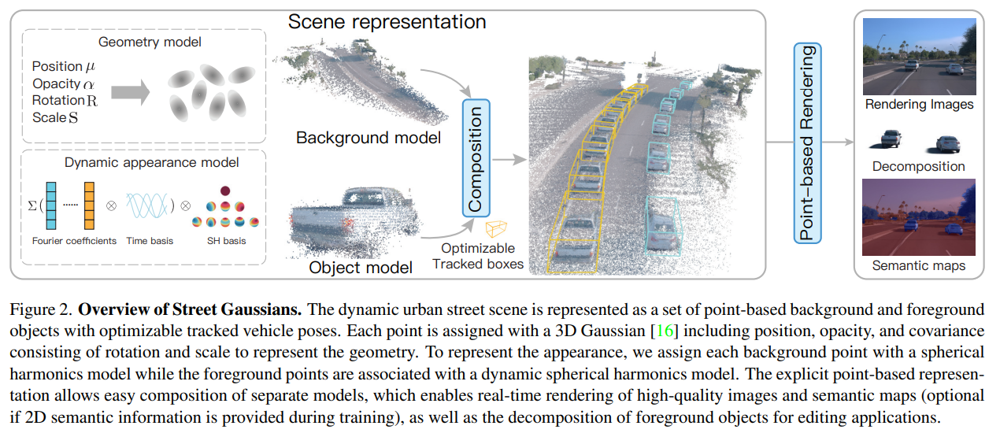
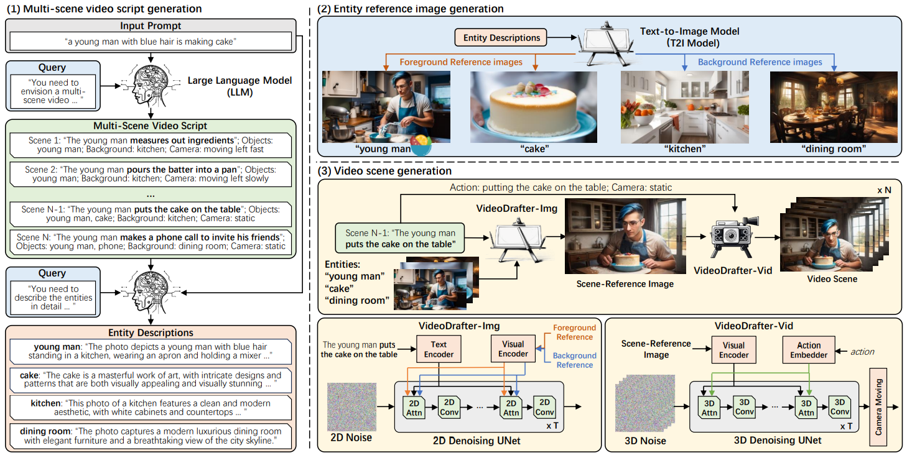
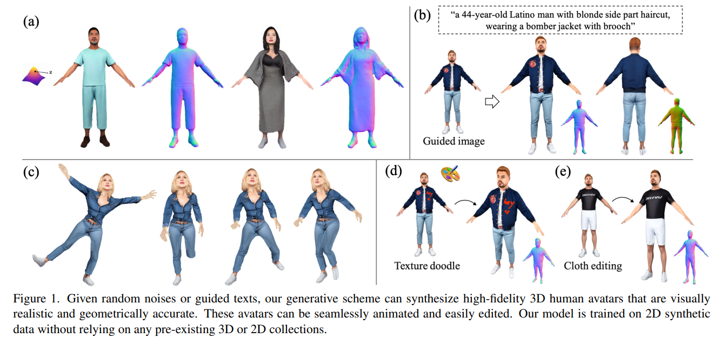
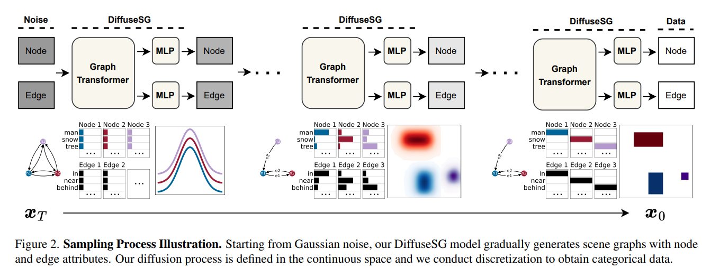
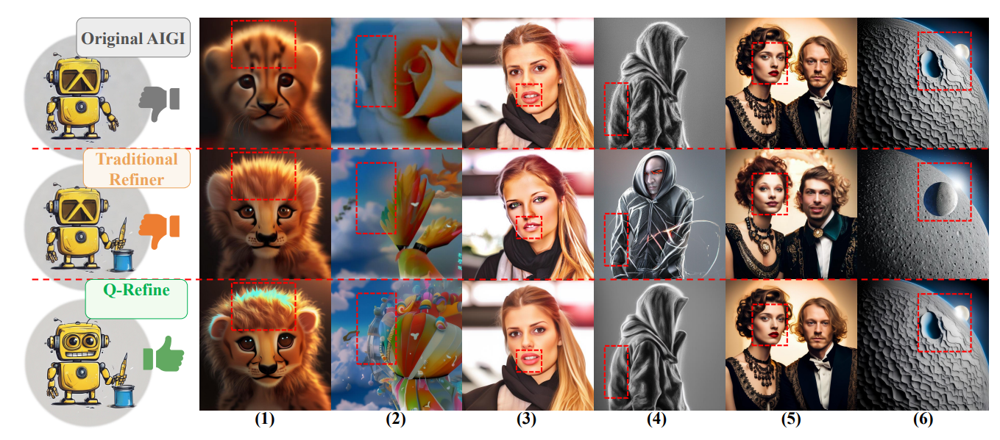
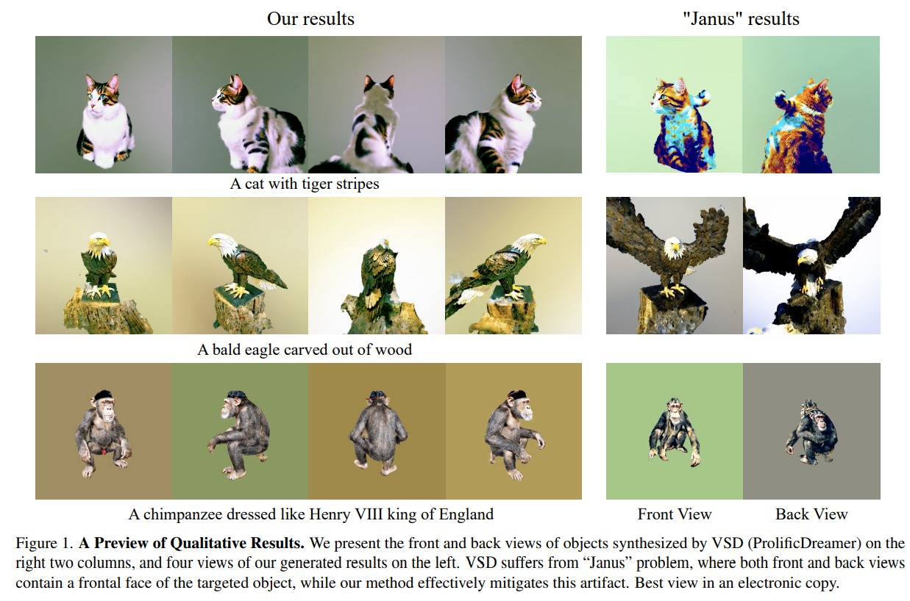
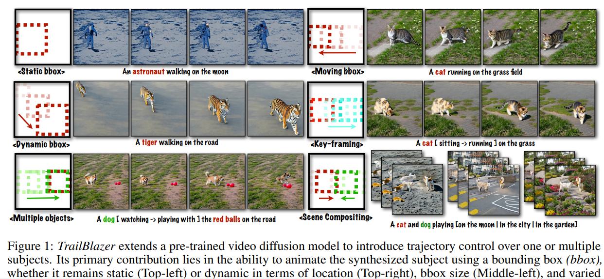
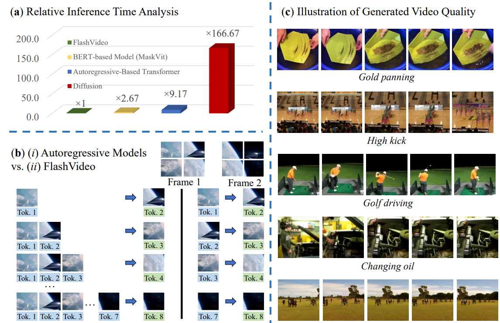

## Street Gaussians for Modeling Dynamic Urban Scenes
#动态场景建模
#自动驾驶

  

这篇论文旨在解决从单目视频中建模动态城市街道场景的问题

## VideoDrafter: Content-Consistent Multi-Scene Video Generation with LLM
#Video
#video_editing
#video_generation

  

这篇论文试图解决的问题是**如何生成内容一致的多场景视频**。具体来说，**它关注的是如何从单一的文本提示（prompt）生成一系列逻辑连贯且视觉内容一致的多场景视频**。这包括两个主要挑战：

* 如何在多场景视频中合理地安排和建立不同的事件，使得视频在逻辑上和现实性上是合理的。

* 如何在整个视频中保证常见实体（如前景对象或人物）的一致性。

为了解决这些问题，论文提出了一个名为VideoDrafter的新型框架，该框架利用大型语言模型（LLM）将输入提示转换为全面的多场景脚本，并生成实体的参考图像，以确保多场景视频中的一致性。

## En3D: An Enhanced Generative Model for Sculpting 3D Humans from 2D Synthetic Data
#human
#_3d生成

  

试图解决的问题是如何从2D合成数据生成高质量、视觉逼真、几何准确且内容多样的3D人体模型

## Joint Generative Modeling of Scene Graphs and Images via Diffusion Models
#paper_idea
#image_generation

  

这篇论文提出了一个新颖的生成任务：联合场景图（Scene Graph）和图像的生成。这个任务的挑战在于需要无条件地从噪声中生成场景图本身，以便对图像生成进行高效和可解释的控制。具体来说，这个任务需要生成具有异构属性的合理场景图，包括节点（对象）的连续对象边界框和离散对象和关系类别。为了解决这个问题，论文介绍了一个新的扩散模型DiffuseSG，它联合建模了邻接矩阵以及异构的节点和边属性。通过使用图变换器作为去噪器，DiffuseSG在连续空间中逐步去噪场景图表示，并在最后通过简单的离散化生成清晰的干净场景图。此外，论文还引入了IoU正则化来增强模型的实证性能。

## Q-Refine: A Perceptual Quality Refiner for AI-Generated Image 
#image_generation

  

这篇论文试图解决的问题是AI生成图像（AIGIs）质量的优化问题。具体来说，论文指出当前的AI生成图像技术在生成结果方面存在不令人满意的质量，尤其是对于低质量（Low-Quality, LQ）和中等质量（Medium-Quality, MQ）的图像区域。此外，现有的图像优化方法往往忽视了图像质量，导致在优化过程中可能会对高质量（High-Quality, HQ）区域产生负面影响，从而降低整体图像质量。

## Taming Mode Collapse in Score Distillation for Text-to-3D Generation
#_3d生成
#Text23D

  

这篇论文试图解决文本到3D生成（text-to-3D generation）中使用得分蒸馏（score distillation）技术时出现的一个关键问题，即“Janus”问题。这个问题表现为生成的3D对象在不同视角下展现出多个正面视图，导致生成的3D内容在视觉上不一致。具体来说，论文指出现有的得分蒸馏框架在每个视角上独立地寻求最大似然性，从而导致模式崩溃（mode collapse）问题，这在实践中体现为Janus问题。为了解决这个问题，论文提出了一种新的方法——熵得分蒸馏（Entropic Score Distillation，简称ESD），通过在相应的变分目标中重新建立熵项来改善得分蒸馏，从而在生成的3D资产中增强不同视角的多样性，缓解Janus问题。

## TrailBlazer: Trajectory Control for Diffusion-Based Video Generation
#Video
#video_generation
#video_editing

  

这篇论文试图解决的问题是如何在基于扩散模型的视频生成（text-to-video, T2V）中实现对合成视频中对象运动轨迹的控制。论文提出了一个名为TrailBlazer的算法，它通过使用简单的边界框（bounding boxes, bboxes）来引导视频中的主体对象，而无需进行神经网络的训练、微调或优化。这种方法允许用户通过指定关键帧（keyframes）来控制对象的位置、大小和运动轨迹，从而在视频中实现更自然和可控的运动效果。

## FlashVideo: A Framework for Swift Inference in Text-to-Video Generation
#Video_efficient

#Video
#video_editing
#video_generation

  

这篇论文试图解决文本到视频（Text-to-Video, T2V）生成任务中的两个主要问题：

* 推理时间（Inference Time）：传统的视频生成模型，如基于生成对抗网络（GANs）和自回归（Autoregressive）的变换器模型，在处理视频的复杂多帧结构时，面临着推理时间较长的问题。这在生成短视频剪辑（如GIF）时尤其突出。

* 效率与质量的平衡：虽然GANs在图像生成领域取得了显著成就，但在视频生成方面，它们在保持帧间的时间一致性和一致性以及捕捉长期依赖性方面面临挑战。而自回归变换器模型虽然在处理长距离依赖性方面表现出色，但它们的推理时间较长，尤其是在视频处理中，处理多个帧会显著增加计算需求。