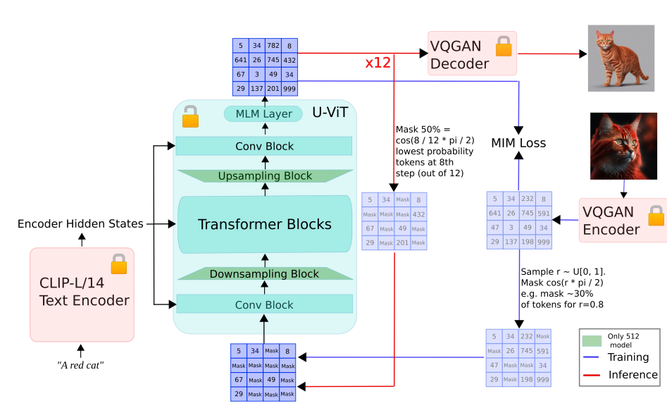
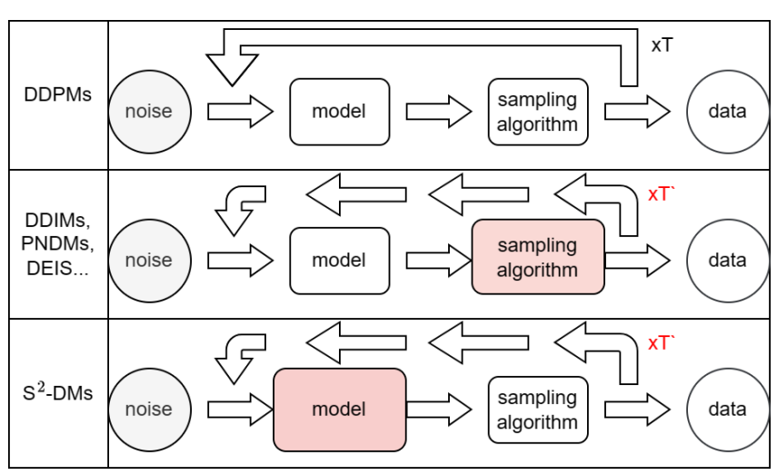
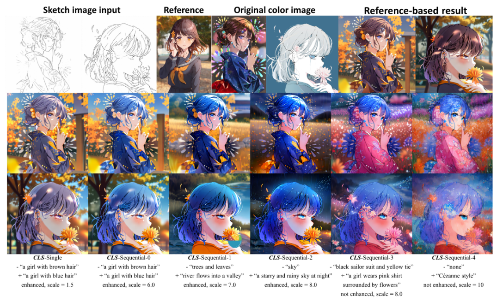

## Moonshot: Towards Controllable Video Generation and Editing with Multimodal Conditions
#Video
#video_editing
#video_generation
#Video_Customization

  

这篇论文试图解决的主要问题是现有视频扩散模型（Video Diffusion Models, VDMs）在生成视频时对视觉外观和几何结构的控制不足。具体来说，大多数现有的VDMs仅基于文本条件，这导致它们在精确描述生成视频的视觉内容方面存在局限性，通常缺乏对视频中视觉元素的精确控制。为了解决这个问题，论文提出了一个新的视频生成模型MoonShot，它同时基于多模态输入（图像和文本）进行条件化，以提高生成视频的视觉质量和时间一致性，并允许对视频中的几何结构进行精确控制。

## AMUSED: AN OPEN MUSE REPRODUCTION
#text2img

  

这篇论文旨在解决文本到图像生成领域中，基于掩蔽图像模型（MIM）的方法相较于基于潜在扩散模型的方法，尽管在某些方面具有优势，但尚未被广泛探索和采用的问题。论文提出了aMUSEd，这是一个基于MUSE的开源、轻量级的MIM，它专注于快速图像生成。aMUSEd使用了较小的CLIP-L/14文本编码器、SDXL风格的微调条件以及U-ViT骨干网络。这些设计选择旨在降低复杂性和计算需求，以便在科学社区中更广泛地使用和实验。

## AIGCBench: Comprehensive Evaluation of Image-to-Video Content Generated by AI
#Video

  

这篇论文试图解决的问题是当前人工智能生成内容（AIGC）领域中，尤其是图像到视频（Image-to-Video, I2V）生成任务的评估和基准测试的不足. 论文提出了AIGCBench，这是一个全面的、可扩展的基准测试，专注于I2V生成任务。

## S$^{2}$-DMs:Skip-Step Diffusion Models
#diffusion_efficient

  

这篇论文试图解决扩散模型（Diffusion Models）在加速采样过程中可能出现的样本质量下降问题。具体来说，它关注于扩散模型在训练和采样阶段之间存在的固有不对称性：模型在训练时会遍历所有的扩散步骤，但在采样时却只从这些步骤中选择一个子集进行“跳跃式采样”（skip-step sampling）。这种选择性采样方法虽然优化了速度，但可能会遗漏未采样步骤中的重要信息，从而影响样本质量。为了解决这个问题，论文提出了一种新的训练方法，即Skip-Step Diffusion Models（S2-DMs），通过在模型训练过程中引入一个补偿目标（compensatory objective），使得模型能够更好地处理跳跃式采样操作，从而提高所获得样本的质量。

## ColorizeDiffusion: Adjustable Sketch Colorization with Reference Image and Text
#Image_Colorization
#sketch

  

这篇论文主要探讨了基于参考图像的草图着色问题，特别是针对扩散模型在这一领域的应用。
