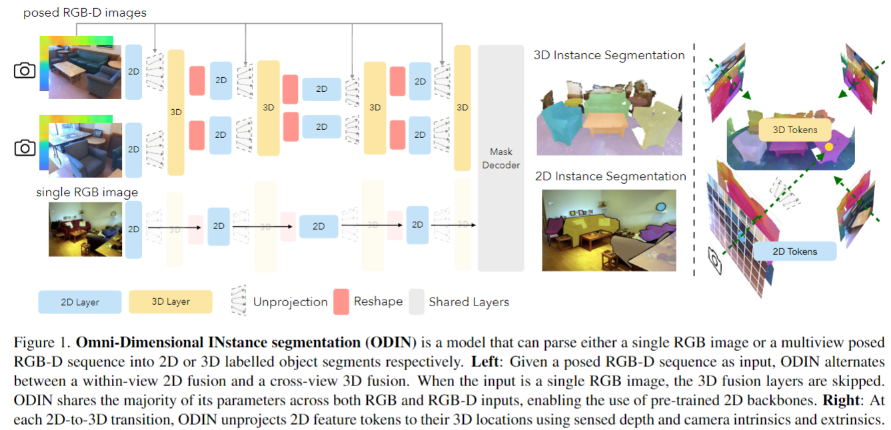
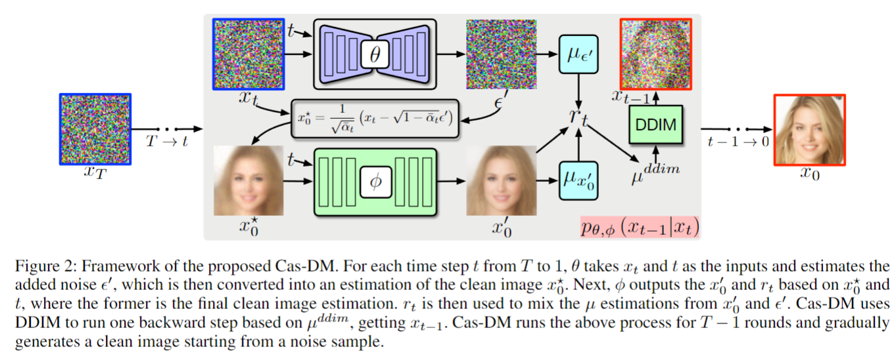
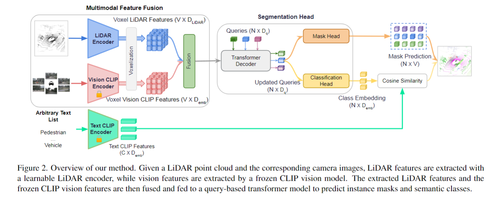
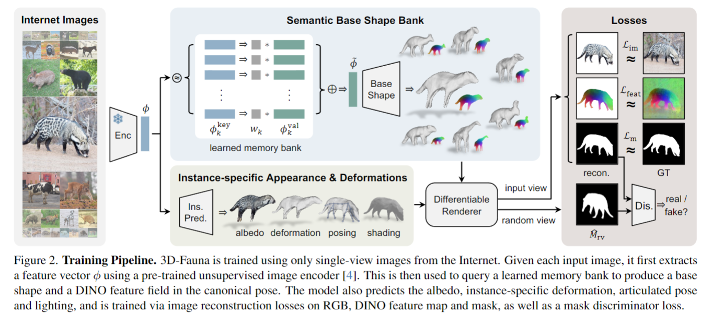
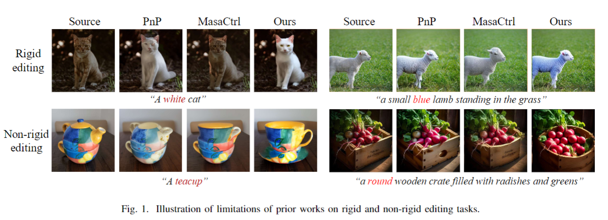

## ODIN: A Single Model for 2D and 3D Perception
#understanding

  

这篇论文试图解决的问题是2D和3D感知任务之间性能差距的问题。具体来说，它挑战了当前3D感知任务中使用预处理的3D点云数据而非原始RGB-D图像的常见做法，并提出了一个名为ODIN（Omni-Dimensional INstance segmentation）的模型。ODIN能够同时处理2D RGB图像和3D点云数据，使用一个基于Transformer的架构，交替进行2D视图内的和3D跨视图的信息融合。通过这种方式，ODIN旨在弥合2D和3D感知之间的性能差距，并证明2D预训练和直接使用传感器数据可以显著提升3D感知任务的性能。

## Bring Metric Functions into Diffusion Models
#diffusion_efficient

  

这篇论文试图解决如何有效地将度量函数（如LPIPS损失）引入扩散模型（Denoising Diffusion Probabilistic Models, DDPM）训练过程中的问题。主要挑战在于DDPM在每一步中预测的噪声与度量函数在干净图像上表现良好的期望干净图像之间存在不匹配。为了解决这个问题，作者提出了级联扩散模型（Cascaded Diffusion Model, Cas-DM），通过级联两个网络模块来有效地将度量函数应用于扩散模型训练。第一个模块类似于标准的DDPM，学习预测添加的噪声，不受度量函数的影响；第二个级联模块学习预测干净图像，从而促进度量函数的计算。实验结果表明，所提出的扩散模型骨干结构能够有效地利用LPIPS损失，从而在各种已建立的基准测试中实现最先进的图像质量。

## 3D Open-Vocabulary Panoptic Segmentation with 2D-3D Vision-Language Distillation
#understanding

  

这篇论文试图解决的问题是3D开放词汇（open-vocabulary）全景分割（panoptic segmentation）的挑战。全景分割旨在为场景中的3D点预测语义和实例注释，这在自动驾驶等计算机视觉应用中至关重要。尽管先前的方法在封闭数据集上取得了很好的性能，但将这些方法推广到新类别仍然是一个开放问题。论文提出了第一个针对3D开放词汇全景分割的方法，通过结合可学习的LiDAR特征和密集的冻结视觉CLIP特征，并使用单个分类头来为基本类别和新类别进行预测。为了进一步提高新类别的分类性能并利用CLIP模型，论文提出了两种新的损失函数：对象级蒸馏损失（object-level distillation loss）和体素级蒸馏损失（voxel-level distillation loss）。实验表明，该方法在nuScenes和SemanticKITTI数据集上显著优于强大的基线模型。

## Learning the 3D Fauna of the Web
#_3d生成

  

这篇论文试图解决的问题是如何从互联网上的2D图像中学习构建一个泛类别（pan-category）的可变形3D动物模型。具体来说，它关注于如何从大量不同的四足动物物种中学习一个通用的3D模型，使得在给定任何四足动物的单张图像时，模型能够以前馈（feed-forward）的方式重建出具有关节和纹理的3D网格，以便用于动画和渲染。

## Unified Diffusion-Based Rigid and Non-Rigid Editing with Text and Image Guidance

#image_editing
#paper_idea

  

论文提出了一个多功能的图像编辑框架，该框架能够执行刚性和非刚性编辑，并且可以通过文本提示或参考图像进行引导。这个框架利用双路径注入方案来处理不同的编辑场景，并引入了一个集成的自注意力机制来融合外观和结构信息。为了缓解潜在的视觉伪影，论文还采用了潜在融合技术来调整中间潜在表示的分布。

