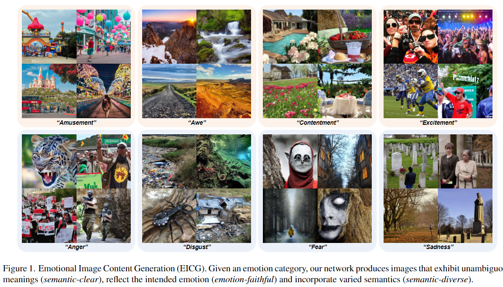
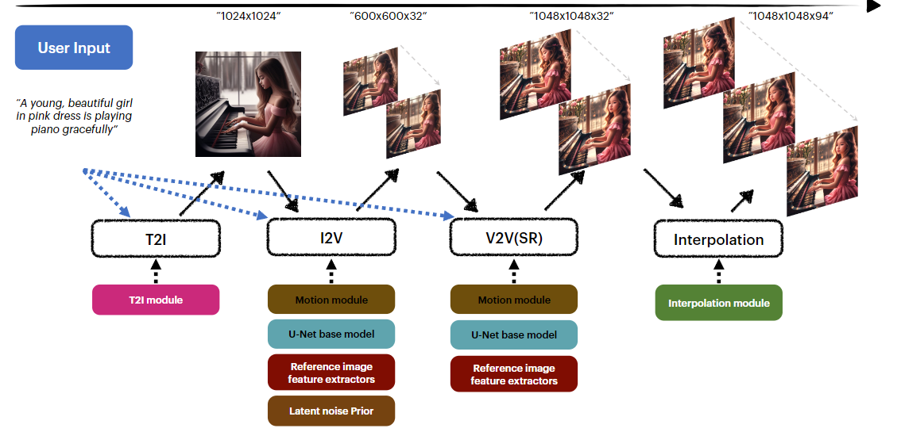
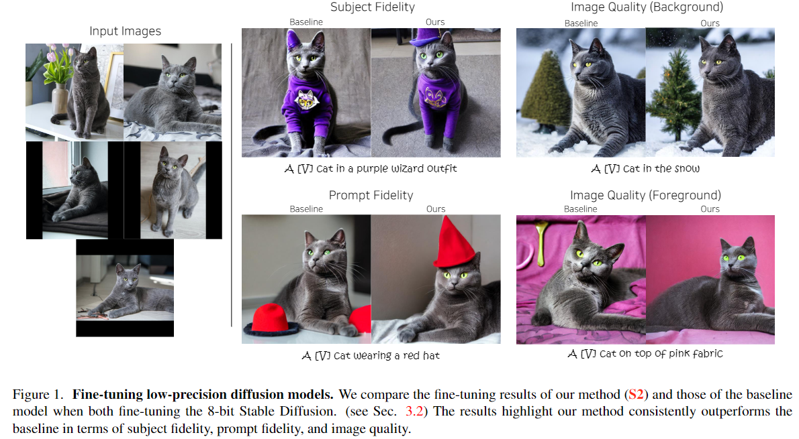

## EmoGen: Emotional Image Content Generation with Text-to-Image Diffusion Models
#image_generation
#paper_idea

  

这篇论文试图解决的问题是如何生成具有明确意义（semantic-clear）、反映预期情感（emotion-faithful）且包含多样化语义（semantic-diverse）的图像，给定一个情感类别。具体来说，论文提出了情感图像内容生成（Emotional Image Content Generation, EICG）这一新任务，旨在通过文本到图像的扩散模型来生成能够唤起特定情感的图像。现有文本到图像的扩散模型在生成具体概念（如狗、房子、山）方面表现出色，但在处理更抽象的概念（如娱乐、愤怒、悲伤）时面临挑战。论文通过引入情感空间，构建映射网络，以及引入属性损失和情感置信度等方法，来确保生成图像的语义多样性和情感真实性。

## MagicVideo-V2: Multi-Stage High-Aesthetic Video Generation
#Video
#video_generation

  

这篇论文旨在解决从文本来描述生成高质量、高保真的视频的问题。具体来说，它介绍了MagicVideo-V2这个模型，它将文本到图像（Text-to-Image, T2I）、图像到视频（Image-to-Video, I2V）、视频到视频（Video-to-Video, V2V）以及视频帧插值（Video Frame Interpolation, VFI）模块集成到一个端到端的视频生成流程中。这些模块的整合使得MagicVideo-V2能够生成具有审美吸引力、高分辨率、显著保真度和流畅度的视频。论文通过大规模用户评估表明，MagicVideo-V2在性能上优于现有的文本到视频系统，如Runway、Pika 1.0、Morph、Moon Valley和Stable Video Diffusion模型。

## Memory-Efficient Personalization using Quantized Diffusion Model

#定制化

  

这篇论文试图解决的问题是：如何在有限的资源（如内存和计算能力）下，对量化（quantized）的扩散模型（diffusion model）进行微调（fine-tuning），以实现个性化（personalization）生成图像。具体来说，论文探讨了如何通过优化量化后的扩散模型，使其在保持高图像质量的同时，能够更好地反映文本提示（prompt）和目标图像特征（subject fidelity），从而在生成图像时实现个性化效果。

