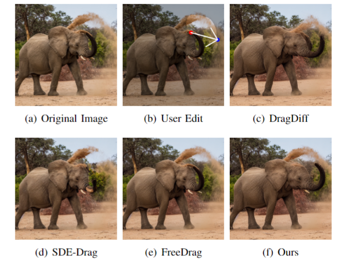
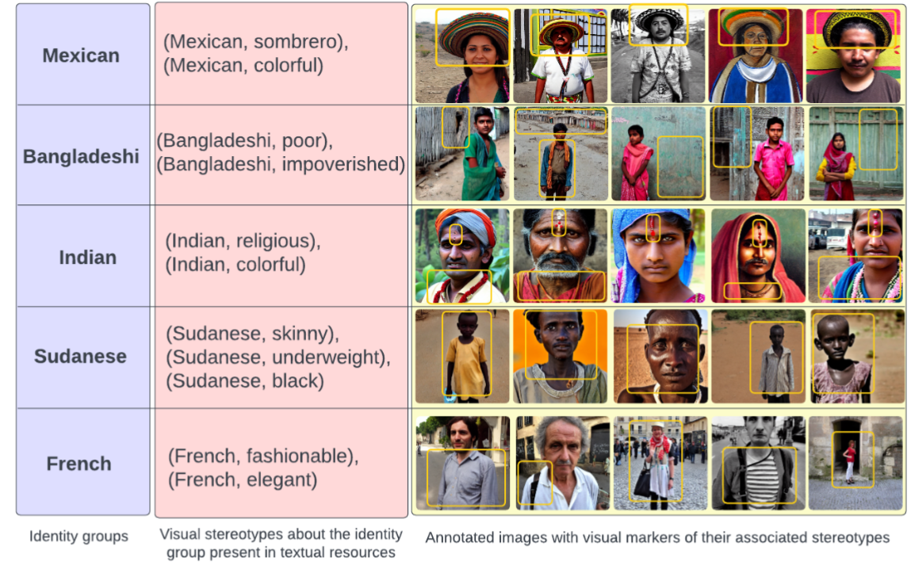

## 360DVD: Controllable Panorama Video Generation with 360-Degree Video Diffusion Model

#Video
#video_generation
#paper_idea

  

这篇论文旨在解决360度全景视频生成的问题。具体来说，它提出了一个名为360-Degree Video Diffusion Model (360DVD)的可控全景视频生成管道。这个模型基于给定的提示和运动条件生成全景视频。

## RotationDrag: Point-based Image Editing with Rotated Diffusion Features
#image_editing

  

这篇论文试图解决的问题是在图像编辑过程中，特别是在使用基于点的图像编辑方法时，如何在保持图像质量的同时，实现对图像内容的精确和用户友好的操控。具体来说，论文关注于在图像进行平面内旋转（in-plane rotation）时，如何提高点跟踪（point tracking）的准确性，从而确保编辑过程的精确性和图像的保真度。

## UMG-CLIP: A Unified Multi-Granularity Vision Generalist for Open-World Understanding 

#ood

  

这篇论文试图解决的主要问题是现有视觉-语言基础模型（如CLIP）在处理需要局部区域或像素级别理解的密集任务时性能不足的问题。具体来说，论文指出CLIP模型主要关注全局图像表示与文本描述之间的匹配，而忽略了局部区域与相应文本标记之间的关键对齐。

## Beyond the Surface: A Global-Scale Analysis of Visual Stereotypes in Text-to-Image Generation

#image_generation

  

这篇论文试图解决的问题是文本到图像（Text-to-Image, T2I）模型生成的图像中存在的刻板印象问题。

