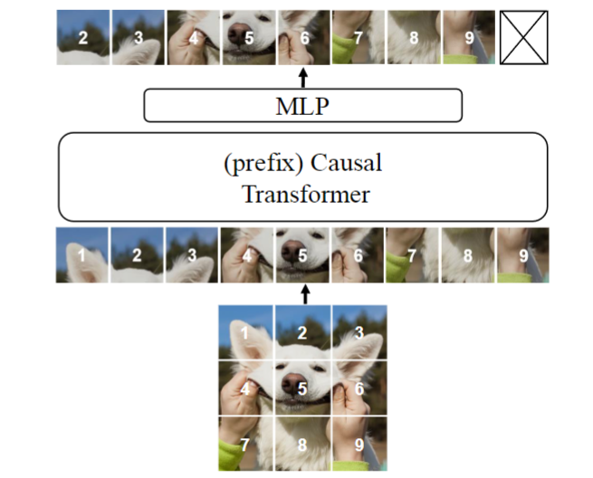
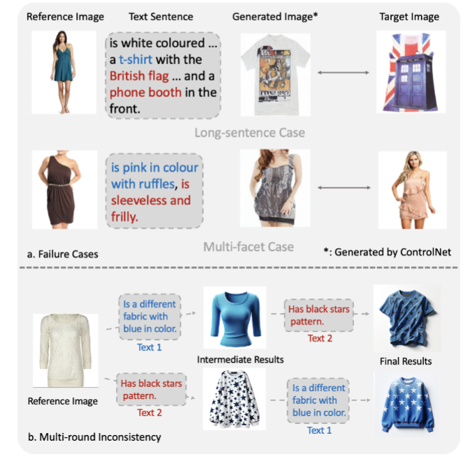
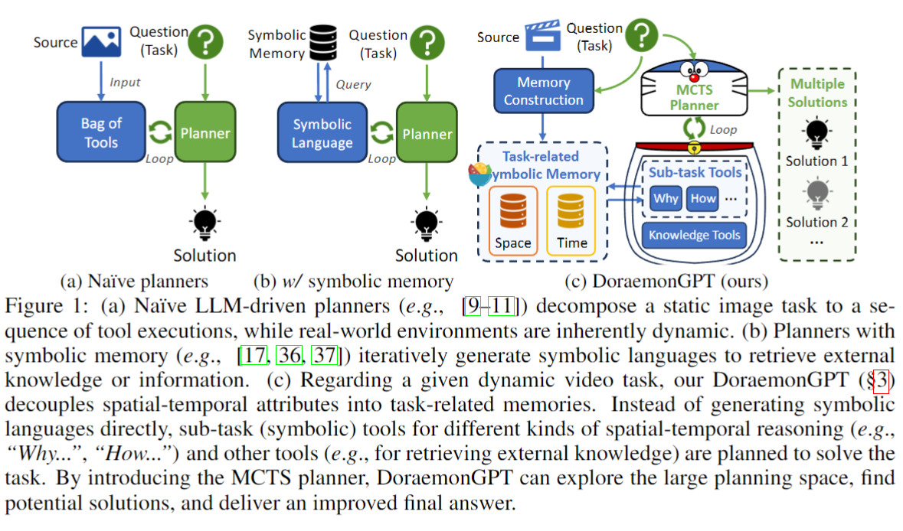
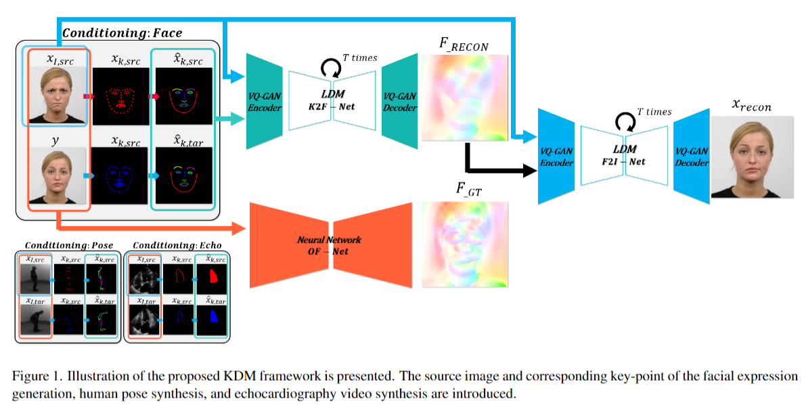
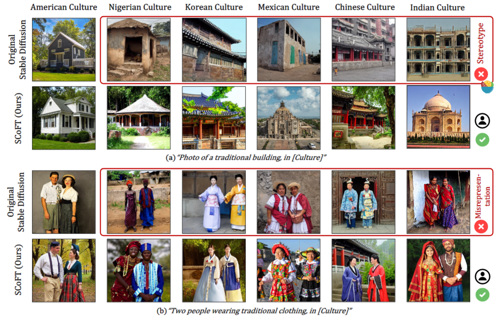
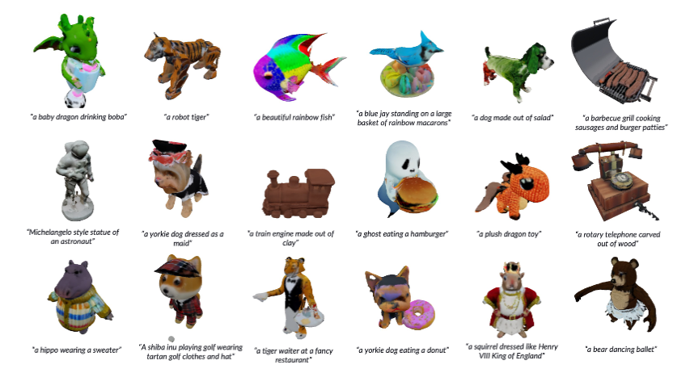
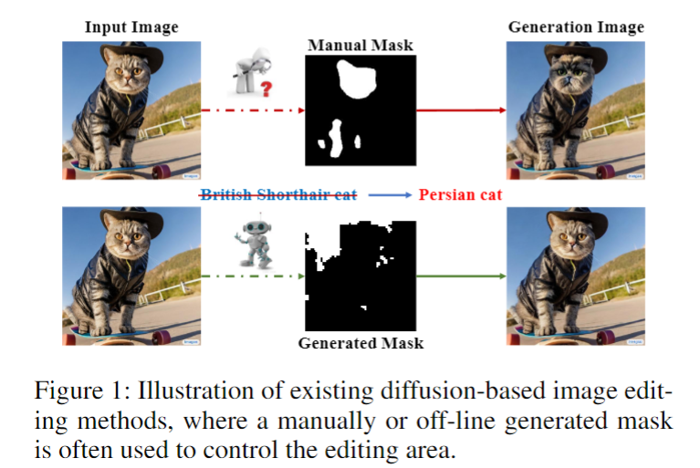
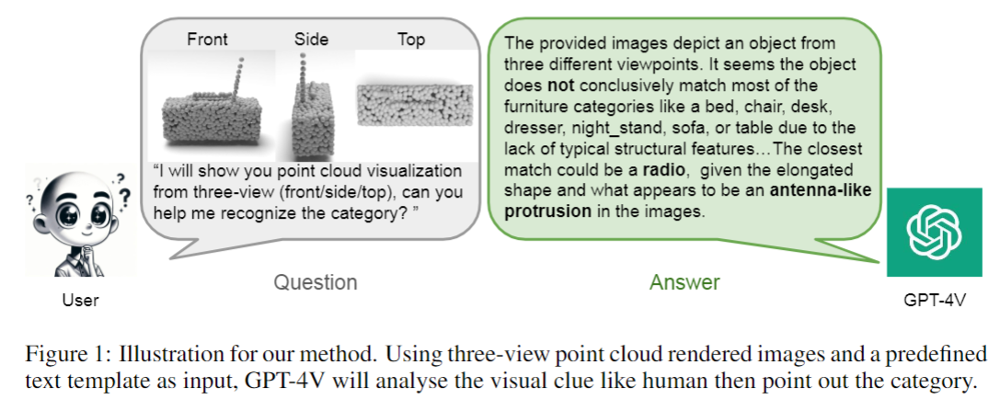

## Scalable Pre-training of Large Autoregressive Image Models
#vision_LLM

  

这篇论文试图解决的问题是，是否可以将大型语言模型（LLMs）的成功经验，特别是自回归预训练（autoregressive pre-training）的方法，应用到计算机视觉领域，以训练出具有强大表示能力和可扩展性的大规模视觉模型。

## Instilling Multi-round Thinking to Text-guided Image Generation

#image_generation

  

这篇论文主要研究了文本引导的图像生成任务，特别是针对用户文本反馈对参考图像进行修改以赋予其特定期望属性的问题。尽管这个领域已经取得了一些进展，但仍然存在一个持续的挑战：单轮优化往往忽略了关键细节，尤其是在细粒度变化（如鞋子或袖子）方面。这种错位的累积显著阻碍了多轮定制过程中的交互

## DoraemonGPT: Toward Understanding Dynamic Scenes with Large Language Models

#LLM
#Video

  

这篇论文试图解决的问题是如何利用大型语言模型（LLMs）来理解和处理动态视频场景。具体来说，论文提出了一个名为DoraemonGPT的系统

## Key-point Guided Deformable Image Manipulation Using Diffusion Model
#image_editing

  

这篇论文试图解决的关键问题是如何通过操纵图像中对象的关键点来实现精确控制图像变形。具体来说，它提出了一个两阶段生成模型，该模型使用光流图作为中间输出，以实现更真实和一致的图像生成。这个模型被称为关键点引导的扩散概率模型（Key-point-guided Diffusion probabilistic Model, KDM）。

## SCoFT: Self-Contrastive Fine-Tuning for Equitable Image Generation

#image_generation
#paper_idea

  

这篇论文试图解决的问题是生成图像模型在文化代表性方面的不足。具体来说，论文指出现有的基于大型网络爬取数据集（如LAION）训练的生成图像模型在生成图像时往往带有有害的刻板印象和文化错误表现。为了改善这一点，论文提出了以下两个主要贡献：

Cross-Cultural Understanding Benchmark (CCUB) 数据集：这是一个由不同文化背景的人收集的代表性数据集，包含五种文化的图像和标题对。这个数据集旨在为模型提供一个更准确反映文化多样性的小型数据集。

Self-Contrastive Fine-Tuning (SCoFT) 方法：这是一种新的微调方法，利用模型已知的偏见来自我改进。SCoFT 设计用于防止在小型数据集上过拟合，仅编码数据中的高级信息，并使生成的分布远离预训练模型中编码的错误表现。

## Towards A Better Metric for Text-to-Video Generation

#video_generation

  

这篇论文试图解决的问题是现有文本到视频生成模型评估指标的局限性。

## HexaGen3D: StableDiffusion is just one step away from Fast and Diverse Text-to-3D Generation

#Text23D

  

这篇论文试图解决的问题是如何从文本提示（textual prompts）高效地生成高质量的3D资产（assets）。为了解决这些问题，论文提出了HexaGen3D，这是一种新的文本到3D模型，它通过微调预训练的2D扩散模型来直接、前馈地生成3D对象，从而显著减少了生成时间，同时保持或提高了生成对象的质量和多样性。

## Towards Efficient Diffusion-Based Image Editing with Instant Attention Masks
#image_editing

  

这篇论文试图解决的问题是现有基于扩散模型的图像编辑（Diffusion-based Image Editing, DIE）方法在效率和准确性方面的不足。

## Exploiting GPT-4 Vision for Zero-shot Point Cloud Understanding
#GPT-4

  

这篇论文旨在解决点云分类中的一个挑战，即在零样本（zero-shot）条件下对点云对象类别进行分类。以往的研究，如PointCLIP，由于CLIP架构的固有限制，难以解决这一问题.论文提出了一种新的方法，该方法利用GPT-4 Vision（GPT-4V）的高级生成能力，通过适应性更强、更健壮的分类过程来克服这些挑战。

