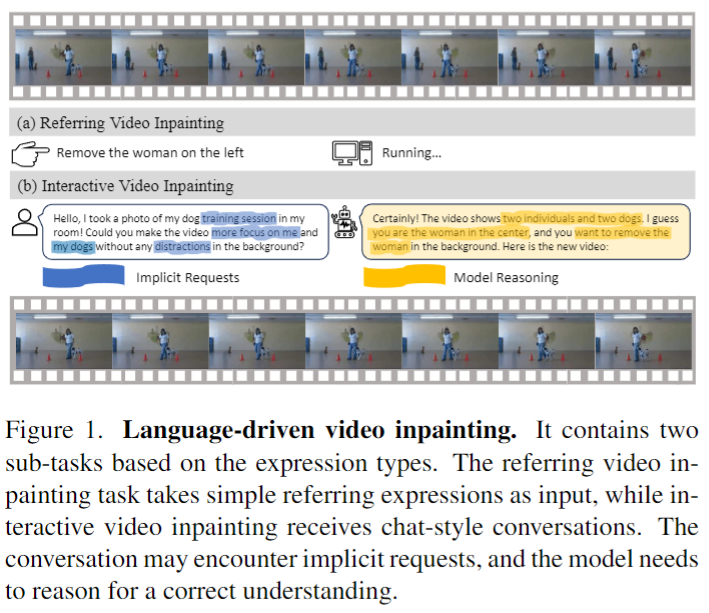
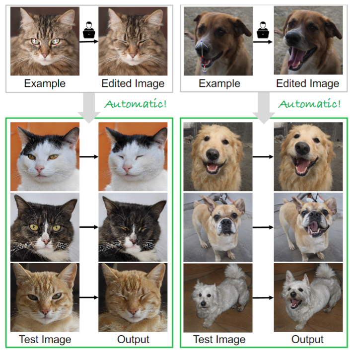

## ParaHome: Parameterizing Everyday Home Activities Towards 3D Generative Modeling of Human-Object Interactions
#interaction

  

可以看看interaction的种类，辅助想一下idea。

## Towards Language-Driven Video Inpainting via Multimodal Large Language Models
#video_editing
#video_inpaint

  

这篇论文试图解决视频修复领域中的传统问题，即如何通过自然语言指令来引导视频修复过程，而不是依赖于手动标记的二进制遮罩。这种方法克服了传统视频修复方法的局限性，这些方法通常需要手动标注遮罩来识别需要修复的区域，这个过程既耗时又劳动密集。论文提出了一种新的基于扩散模型的语言驱动视频修复框架，这是第一个端到端的基线模型，用于理解和执行复杂的基于语言的修复请求

## Edit One for All: Interactive Batch Image Editing

#image_editing

  

论文通过使用StyleGAN作为编辑媒介，提出了一种新的方法来实现这一目标。它包括两个主要步骤：（1）建模用户在示例图像对中的编辑，以便它可以被转移到新的图像上；（2）控制编辑的程度，以确保所有编辑后的图像具有相同的最终状态。

## Motion-Zero: Zero-Shot Moving Object Control Framework for Diffusion-Based Video Generation
#video_generation

  

这篇论文试图解决的问题是在视频生成领域中，如何对视频中移动物体的运动轨迹进行精确控制。具体来说，论文提出了一个名为Motion-Zero的零次拍摄（zero-shot）移动物体轨迹控制框架，旨在实现对预训练视频扩散模型（pre-trained video diffusion models）生成的视频中物体运动轨迹的控制。

## DiffusionGPT: LLM-Driven Text-to-Image Generation System     

#image_generation

  

这篇论文试图解决的主要问题是当前文本到图像生成系统在处理多样化输入时的局限性。具体来说，现有的系统通常面临以下两个主要挑战：

模型限制：虽然稳定的扩散模型（如SD1.5）展示了对各种提示的适应性，但在特定领域的表现不佳。相反，领域特定的模型（如SD1.5+Lora）在特定子领域内能够产生极端的生成性能，但缺乏多样性。

提示约束：在稳定扩散模型的训练过程中，文本信息通常由描述性陈述组成，例如标题。然而，在实际应用中，用户可能会遇到各种类型的提示，包括指令和灵感。当前的生成模型在处理这些多样化的提示类型时，很难达到最佳的生成性能。

为了解决这些问题，论文提出了DiffusionGPT，这是一个统一的生成系统，利用大型语言模型（LLM）无缝地处理各种类型的提示，并集成领域专家模型。DiffusionGPT通过构建基于先验知识和人类反馈的领域特定模型树（Tree-of-Thought, ToT），并在输入提示时解析提示并指导模型树选择最合适的模型，从而放松了输入约束并确保了在不同领域内的卓越性能。此外，还引入了优势数据库（Advantage Databases），其中模型树通过人类反馈得到丰富，使模型选择过程与人类偏好保持一致。

## CustomVideo: Customizing Text-to-Video Generation with Multiple Subjects

#Video_Customization

这篇论文试图解决的问题是多主体引导的文本到视频（Text-to-Video, T2V）生成。具体来说，论文提出了一个名为CustomVideo的框架，它能够根据文本提示和多个主题（subjects）生成保持身份（identity-preserving）的视频。这个框架旨在处理多个对象同时出现在视频中的场景，并且确保这些对象能够被清晰地区分和识别。

  

## Image Translation as Diffusion Visual Programmers

#image_generation
#paper_idea

  

这篇论文介绍了Diffusion Visual Programmer (DVP)，一个新颖的神经符号图像翻译框架。

## Synthesizing Moving People with 3D Control

#action
#motion
#paper_idea

  

这篇论文试图解决的问题是如何从单张图像中生成一个人物的动画，使其模仿另一个人物的动作

## ActAnywhere: Subject-Aware Video Background Generation

#video_generation
#paper_idea

  

 这篇论文试图解决的问题是自动生成与前景主体动作相匹配的视频背景。具体来说，它关注于如何创建一个视频背景，该背景能够与前景主体的运动和外观相协调，同时遵循艺术家的创意意图。

## Sat2Scene: 3D Urban Scene Generation from Satellite Images with Diffusion

#scene_generation
#paper_idea

  

这篇论文试图解决的问题是如何直接从卫星图像生成3D城市场景，特别是在处理大规模场景和显著视角变化时的挑战

## Dream360: Diverse and Immersive Outdoor Virtual Scene Creation via Transformer-Based 360 Image Outpainting

#scene_generation

  

## Inflation with Diffusion: Efficient Temporal Adaptation for Text-to-Video Super-Resolution

#video_generation

  

这篇论文试图解决的问题是如何有效地将文本到图像的超分辨率（Super-Resolution, SR）模型应用于文本到视频的超分辨率任务。

## EmerDiff: Emerging Pixel-level Semantic Knowledge in Diffusion Models

#diffusion_应用
#understanding

  

这篇论文试图解决的问题是如何从预训练的扩散模型（如Stable Diffusion，SD）中提取像素级语义知识，并利用这些知识生成精细的图像分割图，而无需任何额外的训练。

## Mastering Text-to-Image Diffusion: Recaptioning, Planning, and Generating with Multimodal LLMs

#LLM
#text2img
#paper_idea

  

这篇论文试图解决的问题是处理复杂文本提示时，现有文本到图像生成和编辑方法面临的挑战

## Scalable High-Resolution Pixel-Space Image Synthesis with Hourglass Diffusion Transformers

#diffusion_应用

  

这篇论文介绍了Hourglass Diffusion Transformer (HDiT)，这是一种新型的图像生成模型，专门设计用于在像素空间直接合成高分辨率图像。

## UniM-OV3D: Uni-Modality Open-Vocabulary 3D Scene Understanding with Fine-Grained Feature Representation

#understanding

  

这篇论文试图解决的问题是3D开放词汇场景理解（open-vocabulary 3D scene understanding），即在3D领域中识别超出基础标签空间的任意新类别。

## Make-A-Shape: a Ten-Million-scale 3D Shape Model

#_3D_generation

  

这篇论文试图解决的问题是如何有效地训练大规模的3D生成模型，以便能够生成高质量、多样化的3D形状。

## UNIMO-G: Unified Image Generation through Multimodal Conditional Diffusion

#image_generation
#paper_idea

  

这篇论文试图解决的问题是如何从文本描述中生成具有复杂细节和特定实体的高质量图像。现有的文本到图像（T2I）扩散模型虽然在基于文本提示生成图像方面取得了显著成果，但由于文本描述的固有简洁性，它们在忠实地合成具有精细细节、特定实体或微妙场景的图像方面仍面临挑战。

## Do You Guys Want to Dance: Zero-Shot Compositional Human Dance Generation with Multiple Persons

#image_generation
#human

  

这篇论文试图解决的问题是如何在没有视频数据的情况下，从多个人的参考图片、背景和一系列驱动姿势合成真实感舞蹈视频。具体来说，论文提出了一个新的任务、数据集和评估协议，名为组合式人类舞蹈生成（cHDG），旨在生成包含多个人物在复杂背景中精确跟随给定姿势的视频。

## CCA: Collaborative Competitive Agents for Image Editing

#image_editing

  

这篇论文介绍了一个名为协作竞争代理（Collaborative Competitive Agents, CCA）的新型生成模型，旨在解决复杂图像编辑任务的处理和生成结果的迭代优化问题。

## Deconstructing Denoising Diffusion Models for Self-Supervised Learning

#understanding
#Kaiming

  

篇论文试图解决的问题是探索去噪扩散模型（Denoising Diffusion Models, DDM）在自监督学习（self-supervised learning）中的表示学习能力。具体来说，研究者们试图通过逐步解构DDM，将其转变为经典的去噪自编码器（Denoising Autoencoder, DAE），来分析现代DDM的各个组件如何影响自监督表示学习。研究的目标是理解哪些组件对于学习好的表示至关重要，以及这些组件在DDM和DAE之间的差异如何影响学习效果。通过这个过程，研究者们希望重新激发对经典方法在现代自监督学习领域的兴趣。

## Sketch2NeRF: Multi-view Sketch-guided Text-to-3D Generation

#Text23D
#sketch

  

这篇论文介绍了一个名为Sketch2NeRF的框架，旨在通过多视图草图引导来生成高质量的3D对象。

## Scene Graph to Image Synthesis: Integrating CLIP Guidance with Graph Conditioning in Diffusion Models

#scene_editing_3D
#scene_graph

  

这篇论文试图解决的问题是如何从场景图（scene graph）生成与给定场景图一致的图像。场景图是一种表示视觉场景的图形结构，其中节点对应于场景中的对象，边表示对象之间的关系。现有的方法通常采用两阶段架构，首先预测场景布局，然后基于这些布局使用对抗性训练生成图像。然而，这种方法在处理视觉场景的复杂性时面临挑战，尤其是在准确对齐场景图中指定关系的对象时。此外，场景布局可能无法捕捉到对象之间的非空间复杂关系，导致生成的图像与输入场景图不一致。

## CreativeSynth: Creative Blending and Synthesis of Visual Arts based on Multimodal Diffusion

#image_generation

  

这篇论文试图解决的问题是如何在艺术图像编辑和生成领域中，有效地结合大规模文本到图像的生成模型，以实现对艺术图像的精确控制和编辑。

## BootPIG: Bootstrapping Zero-shot Personalized Image Generation Capabilities in Pretrained Diffusion Models

#定制化

  

这篇论文试图解决的问题是如何在现有的文本到图像（text-to-image）生成模型中实现个性化图像生成。具体来说，它关注的是如何在不进行测试时微调（test-time finetuning）的情况下，让模型能够根据用户提供的对象参考图像生成包含该对象的新场景图像，同时保持对输入文本提示的高保真度。

## StyleInject: Parameter Efficient Tuning of Text-to-Image Diffusion Models

#image_generation

  

这篇论文试图解决的问题是如何有效地微调（fine-tune）文本到图像生成模型，特别是在保持原始模型文本到图像对齐能力的同时，适应多样化的图像风格。