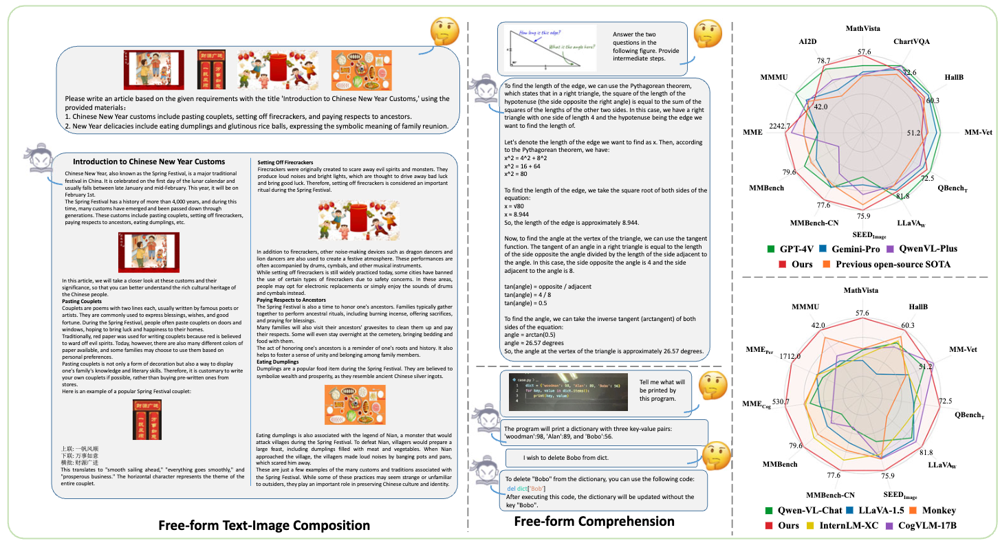
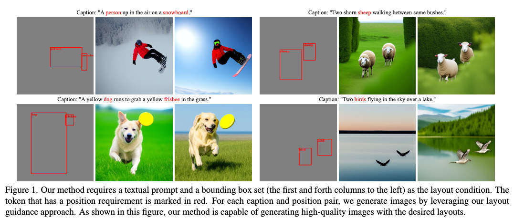
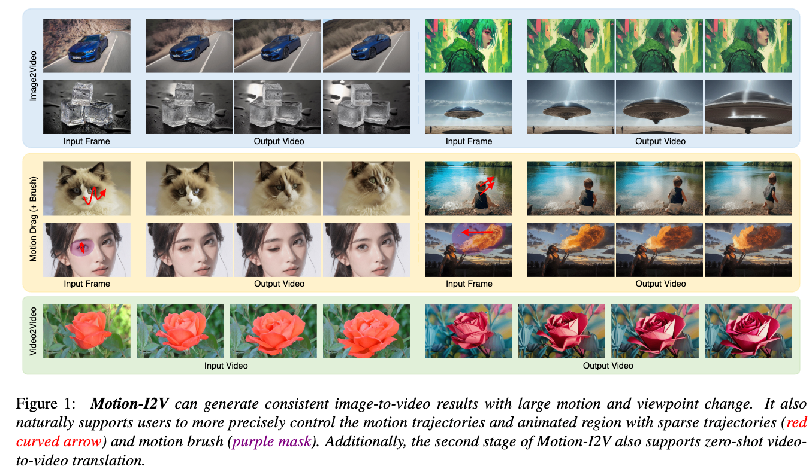
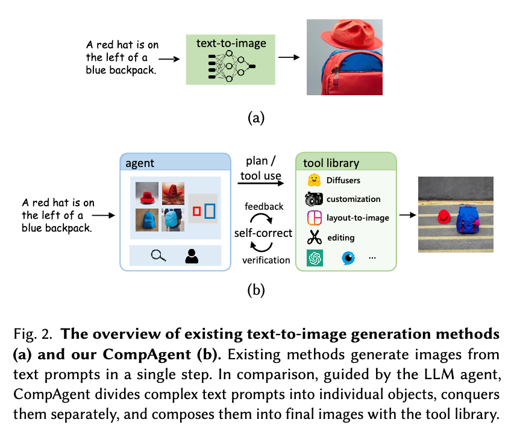
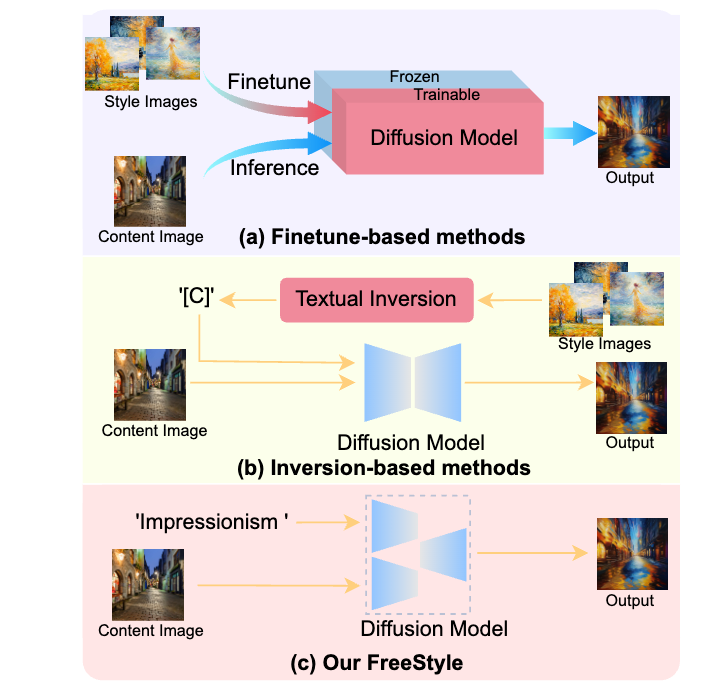

## InternLM-XComposer2: Mastering Free-form Text-Image Composition and Comprehension in Vision-Language Large Model

#MLLM

  

这篇论文介绍了一个名为InternLM-XComposer2的先进视觉语言模型，旨在解决自由形式文本图像组合和理解的问题。该模型基于InternLM27B，通过提出部分LoRA（Partial LoRA）方法，有效地结合了精确的视觉理解和具有文学才华的文本组合能力。论文的主要目标是开发一个能够从多样化的输入（如大纲、详细文本规范和参考图像）中生成高质量、集成的文本图像内容的模型，同时在多模态理解方面表现出色。InternLM-XComposer2在多个基准测试中展示了其在文本图像组合和理解方面的卓越性能，不仅显著优于现有的多模态模型，而且在某些评估中与GPT-4V和Gemini Pro等高级模型相匹配甚至超越。

## Spatial-Aware Latent Initialization for Controllable Image Generation
#image_generation

  

这篇论文试图解决的问题是，在文本到图像的扩散模型（text-to-image diffusion models）中，如何实现对生成图像的空间布局（spatial layout）的精确控制。尽管这些模型能够根据文本提示生成高质量的图像，但它们在遵循文本指令中的空间布局信息方面存在挑战。具体来说，论文指出现有模型在理解文本输入中的空间位置要求方面存在困难，这导致了生成的图像在布局上与文本描述不匹配。为了改善这一问题，论文提出了一种空间感知的潜在初始化噪声（spatial-aware latent initialization），以增强布局引导（layout guidance）的有效性，同时保持图像内容的高质量。

## Motion-I2V: Consistent and Controllable Image-to-Video Generation with Explicit Motion Modeling

#video_generation

  

这篇论文试图解决的问题是图像到视频（Image-to-Video, I2V）生成中的一致性和可控性问题。具体来说，它关注以下几个关键挑战：

一致性问题：现有的I2V方法在处理具有大范围运动和视角变化的场景时，往往难以生成一致性高的视频。这主要是因为这些方法依赖于1-D（一维）时间注意力机制，这限制了模型捕捉和保持视频中时间一致性的能力。

可控性问题：现有的I2V模型主要依赖于参考图像和文本指令来生成视频，缺乏对生成过程中运动轨迹和运动区域的精确控制。这与图像编辑领域中已经展示出显著效果的技术（如基于拖拽的控制和区域特定控制）形成对比。

为了解决这些问题，论文提出了Motion-I2V框架，该框架通过显式运动建模将I2V任务分解为两个阶段：第一阶段预测可能的运动轨迹，第二阶段根据预测的运动轨迹生成一致的动画。此外，该框架还支持用户通过稀疏轨迹和运动刷（motion brush）来更精确地控制运动轨迹和动画区域，以及实现零样本（zero-shot）视频到视频的翻译。

## Divide and Conquer: Language Models can Plan and Self-Correct for Compositional Text-to-Image Generation

#image_generation

  

这篇论文试图解决的问题是复杂文本到图像生成（compositional text-to-image generation）中的挑战，特别是在处理包含多个对象、属性和关系的文本提示时，现有文本到图像模型往往无法生成与文本描述准确对应的图像。具体来说，论文针对以下三个主要问题：

对象类型和数量：由于文本中可能包含多个对象，生成的图像应准确包含每个对象，避免对象类型错误、遗漏或数量不一致的问题。

属性绑定：对象具有独特的属性，如颜色、形状或纹理。应确保这些对象属性在生成的图像中得到精确保留，避免属性错位或泄露。

对象关系：多个对象之间可能存在交互关系，如空间关系（如“左边”、“右边”）或非空间关系（如“拿着”、“玩耍”）。生成过程应精确且忠实地传达这些关系。

为了解决这些问题，论文提出了CompAgent，这是一个基于大型语言模型（LLM）代理的训练无关方法，采用分而治之（divide-and-conquer）的方法来处理组合文本到图像生成任务。CompAgent通过分解复杂文本提示，独立处理每个对象，然后通过规划和使用工具库来组合这些孤立的对象，最后通过验证和人类反馈机制来纠正潜在的属性错误并优化生成的图像。

## FreeStyle: Free Lunch for Text-guided Style Transfer using Diffusion Models
#style-image

  

这篇论文试图解决的问题是如何在不进行额外优化和不需要风格参考图片的情况下，利用预训练的大型文本引导扩散模型（text-guided diffusion models）实现文本引导的风格迁移（text-guided style transfer）。具体来说，论文提出了一种名为FreeStyle的新方法，旨在通过文本描述来指导风格迁移，从而在保持内容信息的同时，将自然图像转换为具有特定艺术风格的图像。这种方法旨在克服现有基于扩散模型的风格迁移方法中存在的迭代优化过程缓慢和计算成本高的问题。