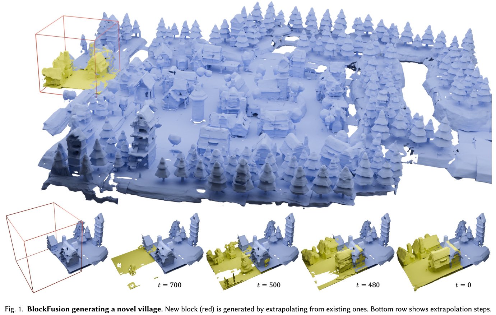
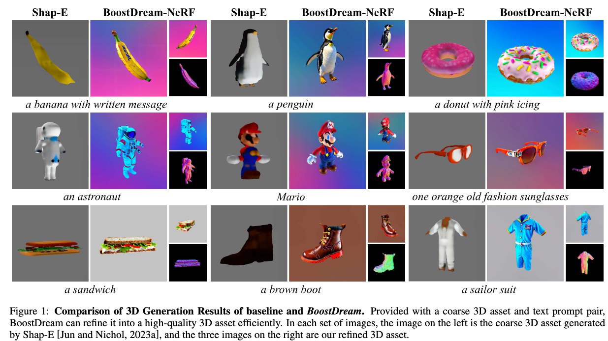
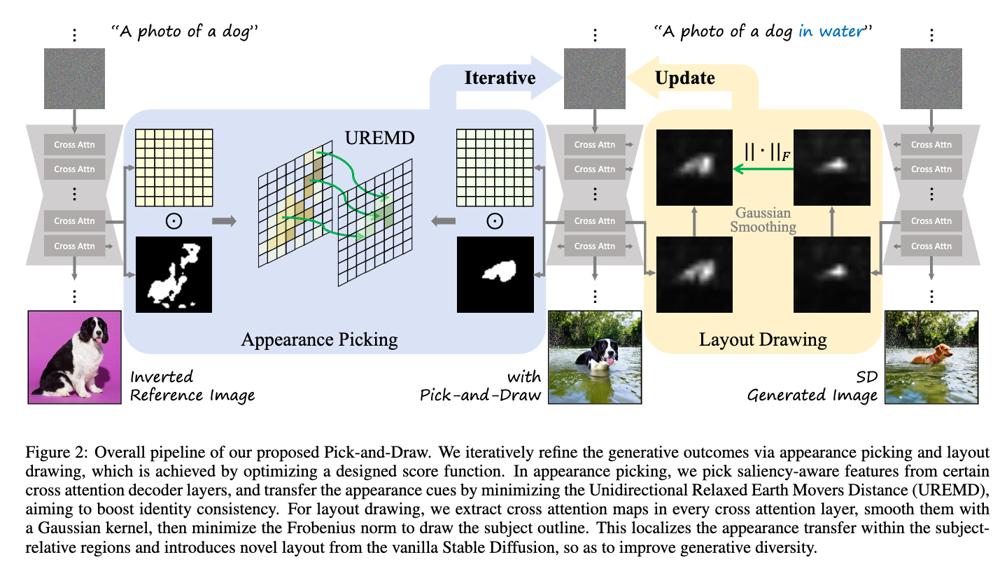

## BlockFusion: Expandable 3D Scene Generation using Latent Tri-plane Extrapolation
#scene_generation

  

这篇论文试图解决的问题是如何生成可扩展（即无限）的高质量3D场景。

## BoostDream: Efficient Refining for High-Quality Text-to-3D Generation from Multi-View Diffusion

#Text23D

  

这篇论文试图解决的问题是如何高效地生成高质量的3D资产。具体来说，它关注于结合文本到图像扩散模型的进步和可微分渲染技术，以快速生成细节丰富且高质量的3D内容。

## Pick-and-Draw: Training-free Semantic Guidance for Text-to-Image Personalization

#定制化

  

这篇论文试图解决的问题是现有基于文本到图像的个性化生成模型在处理少量参考图像时的过度拟合问题。具体来说，这些模型在生成特定主题图像时，由于参考图像数量有限，容易在微调过程中简单地记忆这些样本，导致生成的图像多样性不足，难以根据文本提示合成不同视角、姿势和背景的图像。为了解决这个问题，论文提出了一种名为Pick-and-Draw的无训练语义引导方法，旨在提高个性化方法的身份一致性和生成多样性。

