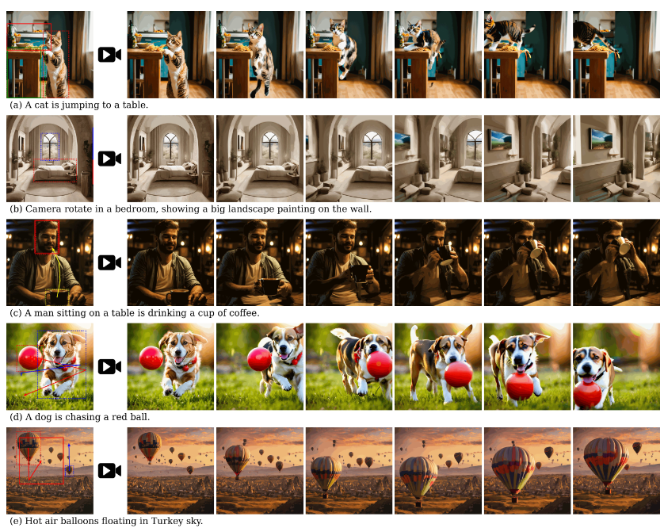
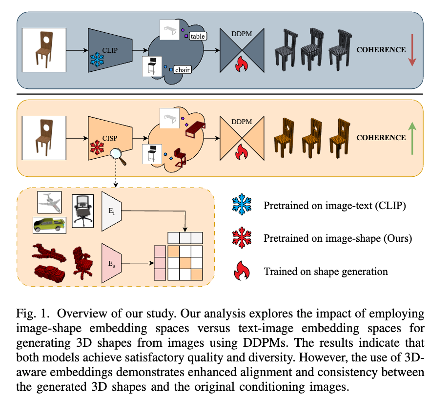
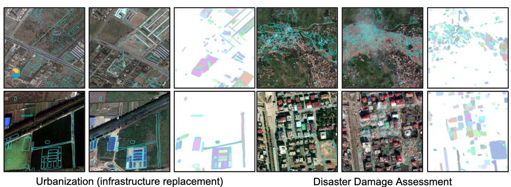

## Boximator: Generating Rich and Controllable Motions for Video Synthesis

#video
#video_editing
#video_generation

  

这篇论文试图解决的问题是在视频合成领域中生成丰富且可控的运动。具体来说，作者提出了一个名为Boximator的新方法，旨在通过引入硬盒（hard box）和软盒（soft box）这两种约束类型，实现对视频中对象位置、形状或运动路径的精细控制。Boximator作为一个插件，可以与现有的视频扩散模型结合使用，通过冻结基础模型的权重并仅训练控制模块来实现这一目标。此外，为了解决训练过程中的挑战，作者引入了一种新颖的自跟踪（self-tracking）技术，简化了学习盒-对象关联的过程。通过这种方法，Boximator能够在保持原始视频质量的同时，显著提高视频合成的可控性和质量。

## Can Shape-Infused Joint Embeddings Improve Image-Conditioned 3D Diffusion?

#_3d生成

  

这篇论文试图解决的问题是如何通过整合3D知识来改进基于图像的3D形状生成。

## Segment Any Change

  

这篇论文试图解决的问题是零样本（zero-shot）变化检测（change detection），这是一个在遥感图像分析领域中的挑战性问题。

