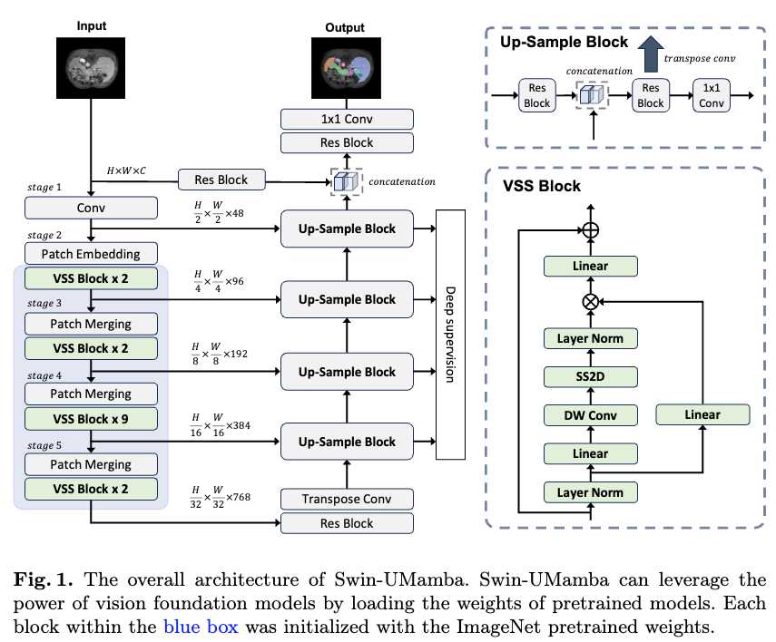
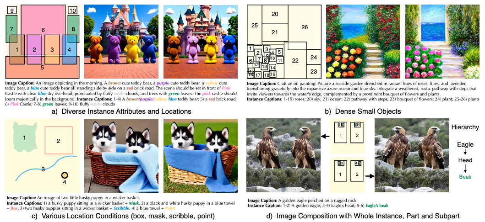
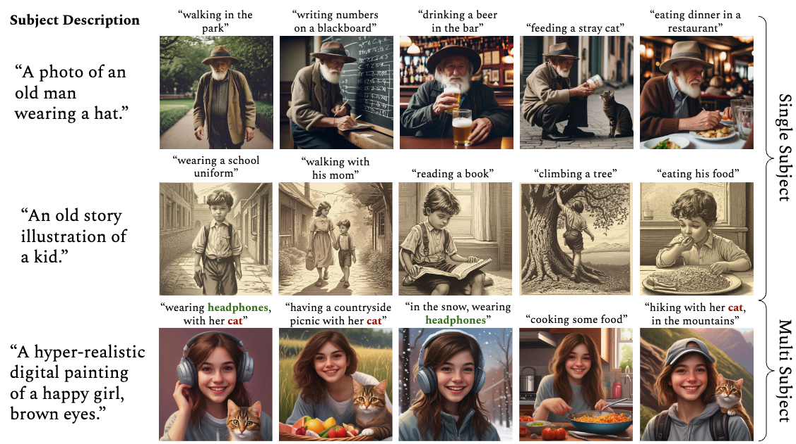
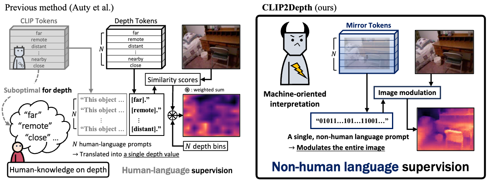
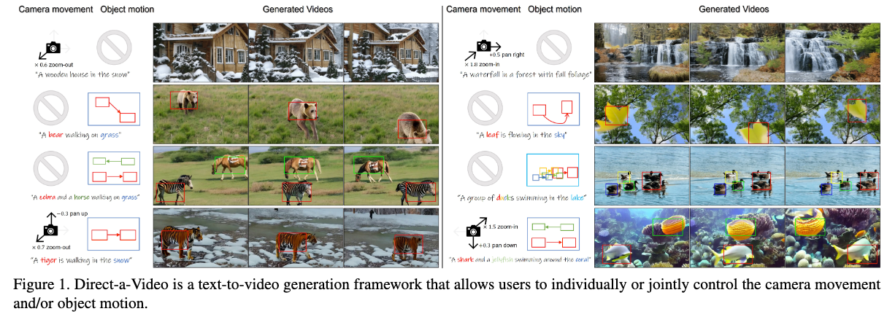
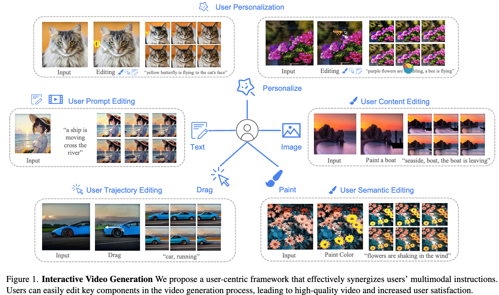
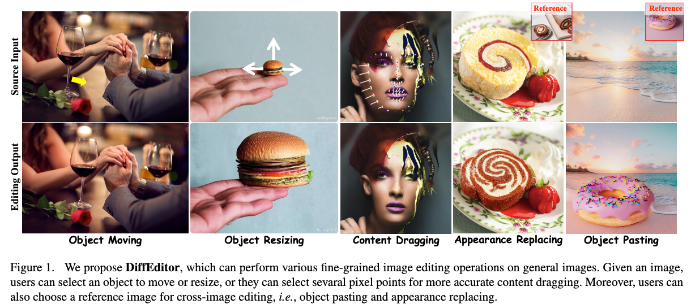

## Swin-UMamba: Mamba-based UNet with ImageNet-based pretraining

#mamba

  

这篇论文试图解决的问题是如何在医学图像分割任务中有效地整合多尺度信息，特别是如何捕捉图像中的长距离全局信息。现有的方法，如卷积神经网络（CNNs）和视觉变换器（ViTs），在处理长距离全局信息方面存在局限性。CNNs受限于它们的局部感受野，而ViTs则受到其注意力机制的高二次复杂度限制。为了克服这些限制，论文提出了一种基于Mamba模型的新方法，名为Swin-UMamba，该方法利用ImageNet预训练来增强Mamba模型在医学图像分割任务中的性能。通过这种方式，论文旨在提高分割的准确性、降低内存消耗和计算负担，同时减少对数据的依赖，特别是在医学图像数据集通常规模有限和多样性不足的情况下。

## InstanceDiffusion: Instance-level Control for Image Generation
#image_generation
#可控

  

这篇论文试图解决的问题是如何在文本到图像（Text-to-Image, T2I）生成模型中实现对图像中各个实例（instance）的精确控制。

## Training-Free Consistent Text-to-Image Generation
#text2img
#无需训练

  

这篇论文试图解决的问题是如何在不进行任何优化或预训练的情况下，使用文本到图像（Text-to-Image, T2I）扩散模型生成一系列图像，这些图像在保持文本提示一致性的同时，能够一致地描绘出相同的主体。

## CLIP Can Understand Depth

  

这篇论文试图解决的问题是如何将预训练的CLIP（Contrastive Language–Image Pre-training）模型适应于单目深度估计任务，同时不直接微调（fine-tune）其原始的视觉-语言对齐。

## Direct-a-Video: Customized Video Generation with User-Directed Camera Movement and Object Motion

#video_generation
#定制化

  

这篇论文试图解决的问题是如何在文本到视频（Text-to-Video, T2V）生成模型中实现对相机运动和对象运动的独立和用户指导的控制。

##  InteractiveVideo: User-Centric Controllable Video Generation with Synergistic Multimodal Instructions

#video_generation
#video_editing

  

这篇论文提出了一个名为“InteractiveVideo”的用户中心框架，旨在解决视频生成领域中的几个关键问题：

用户意图的精确捕捉：现有的视频生成模型通常依赖于图像和文本条件作为输入，但这些条件可能无法充分捕捉用户的复杂意图。例如，文本条件可能无法精确描述复杂的视频动作和动态，而条件图像缺乏时间信息，导致生成过程中可能出现不连贯的伪影。

视频内容的个性化定制：用户对于视频内容有高度个性化的需求，现有的视频生成模型往往难以满足用户对视频内容、语义和动作的直观操作和定制。

视频生成的交互性和灵活性：传统的视频生成方法通常是基于预定义的图像或文本提示，缺乏动态交互性，这限制了用户在视频生成过程中的参与度和对生成结果的控制。

## DiffEditor: Boosting Accuracy and Flexibility on Diffusion-based Image Editing

#image_editing

  

这篇论文试图解决的问题主要集中在扩散模型（diffusion models）在细粒度图像编辑（fine-grained image editing）方面的两个主要弱点：

编辑准确性和意外伪影：在复杂场景中，现有的基于扩散模型的图像编辑方法往往缺乏编辑准确性，导致编辑结果出现意外伪影。

编辑操作的灵活性不足：现有的方法在进行编辑操作时，如想象新内容（例如，将狮子的闭嘴变为张嘴），缺乏灵活性，难以和谐地进行编辑操作。

为了解决这些问题，论文提出了DiffEditor，这是一个结合了图像提示（image prompts）和文本提示（text prompts）的细粒度图像编辑框架。DiffEditor通过引入局部随机微分方程（SDE）采样、区域分数基梯度引导（regional score-based gradient guidance）和时间旅行策略（time travel strategy），旨在提高编辑质量，同时保持内容的一致性。通过这些改进，DiffEditor能够在各种细粒度图像编辑任务中实现高效且性能优异的编辑效果。