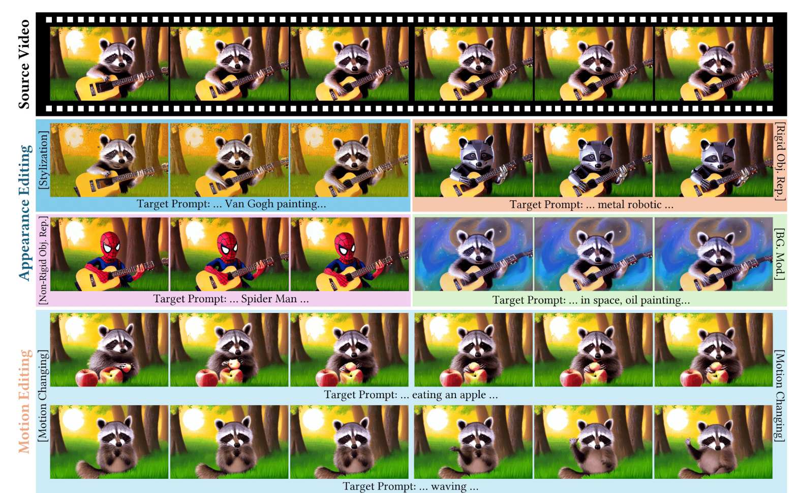
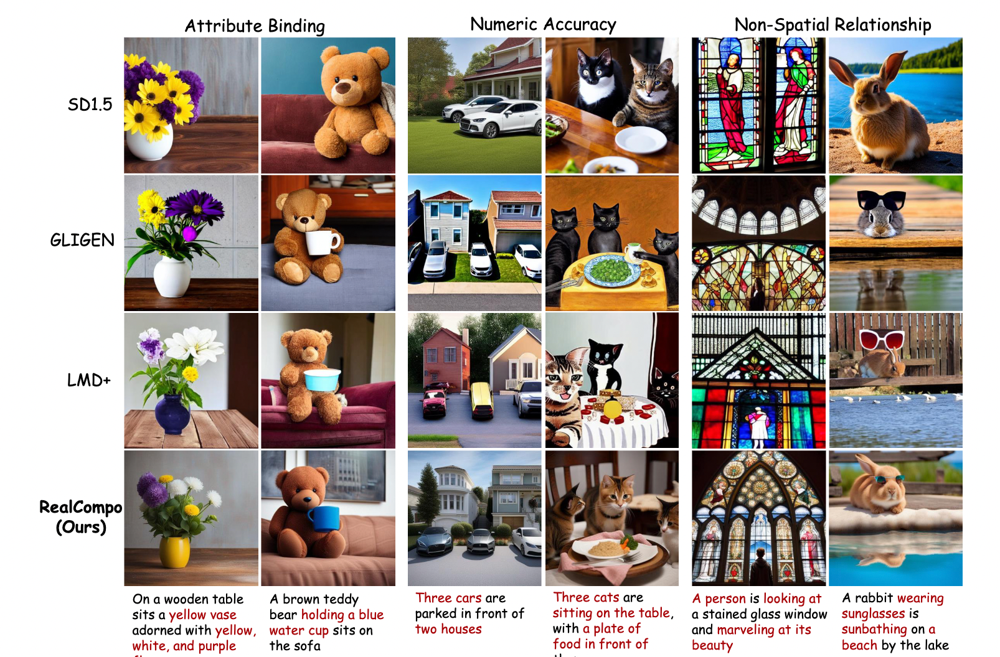
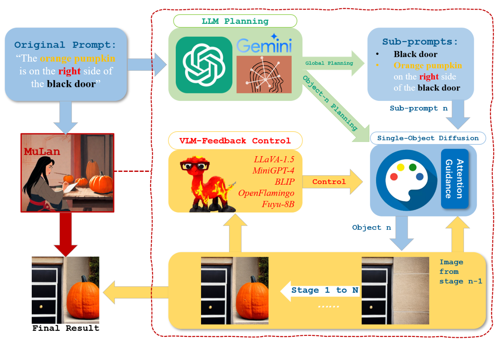
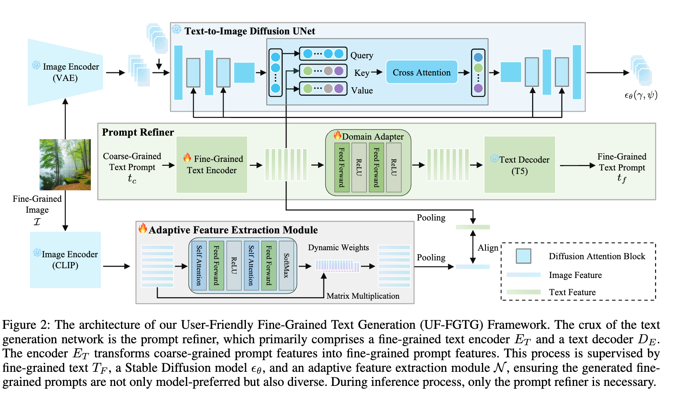

## UniEdit: A Unified Tuning-Free Framework for Video Motion and Appearance Editing

#video_editing
#paper_idea

  

这篇论文试图解决视频编辑中的两个主要问题：

视频运动编辑：在时间维度上编辑视频，例如将视频中的动作从“吃饭”变为“挥手”。这与图像编辑不同，因为视频编辑需要确保帧之间的一致性，而现有的方法在这方面的探索不足。

视频外观编辑：包括风格化、刚性/非刚性物体替换、背景修改等。尽管文本引导的视频外观编辑已经取得了一些进展，但这些方法在编辑视频运动方面存在局限性，尤其是在保持源视频内容的同时实现运动编辑。

为了解决这些问题，论文提出了UniEdit，这是一个无需调整（tuning-free）的框架，它利用预训练的文本到视频生成器（text-to-video generator）在一个反转然后生成（inversion-then-generation）的框架内，支持视频运动和外观编辑。UniEdit通过引入辅助运动参考分支和重建分支，以及通过时间和空间自注意力层将这些分支的特征注入到主编辑路径中，实现了在保持源视频内容的同时进行运动编辑的目标。

## RealCompo: Dynamic Equilibrium between Realism and Compositionality Improves Text-to-Image Diffusion Models

#计数
#物体丢失
#属性绑定

  

这篇论文试图解决的问题是在文本到图像（Text-to-Image, T2I）生成领域中，现有模型在处理多对象组合生成任务时面临的挑战。具体来说，当输入文本涉及多个对象或复杂关系时，现有的T2I模型有时无法生成与文本提示中对象的组合性相匹配的图像。这导致了生成的图像在对象数量、位置以及整体布局上可能与预期不符。为了解决这一问题，论文提出了一个新的框架RealCompo，旨在通过动态平衡生成图像的真实性（realism）和组合性（compositionality），来提升多对象组合生成的性能。

## MuLan: Multimodal-LLM Agent for Progressive Multi-Object Diffusion
#计数
#物体丢失
#属性绑定

  

这篇论文试图解决的问题是现有文本到图像（Text-to-Image, T2I）模型在生成包含多个对象的图像时面临的挑战。具体来说，这些挑战包括：

空间位置处理：如何准确地处理多个对象在图像中的空间位置关系。

相对大小：如何确保生成的图像中对象的大小比例与文本描述相符。

重叠问题：在生成多个对象时，如何处理对象之间的重叠关系。

属性绑定：如何确保图像中的对象属性（如颜色、形状、纹理等）与文本描述中的属性绑定正确。

为了解决这些问题，论文提出了一个名为MuLan的多模态大型语言模型（Multimodal-LLM）代理，它通过渐进式多对象生成、规划和反馈控制来生成图像，类似于人类画家的创作过程。MuLan的目标是通过分解复杂的生成任务为一系列简单的子任务，每个子任务只生成一个对象，从而提高对生成过程的控制能力，并生成与文本描述更一致的高质量图像。

## A User-Friendly Framework for Generating Model-Preferred Prompts in Text-to-Image Synthesis

#text2img

  

这篇论文试图解决的问题是：在文本到图像合成（text-to-image synthesis）领域，新手用户如何能够更容易地生成符合他们期望的高质量图像。具体来说，论文指出了以下几个关键问题：

用户输入与模型偏好的不匹配：新手用户输入的提示（prompts）往往与模型训练数据集中的提示存在差异，导致生成的图像可能不符合用户的期望。

手动提示工程的局限性：尽管现有的提示工程方法可以提供高层次的指导，但手动设计提示对于缺乏经验的用户来说既耗时又难以达到理想效果。

生成模型的文本编码器能力有限：例如，Stable Diffusion模型中的CLIP文本编码器相对有限，这限制了用户输入的提示能够产生高质量图像的能力。

缺乏个性化推荐：现有的研究主要集中在为特定文本到图像模型手动设计提示，但这些方法通常只提供高层次的建议，未能为寻求特定美学的用户给出个性化的推荐。