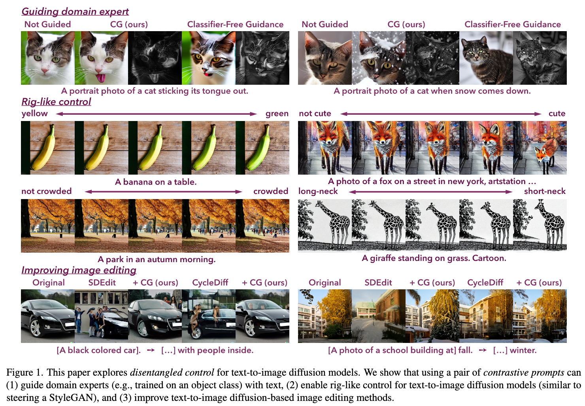
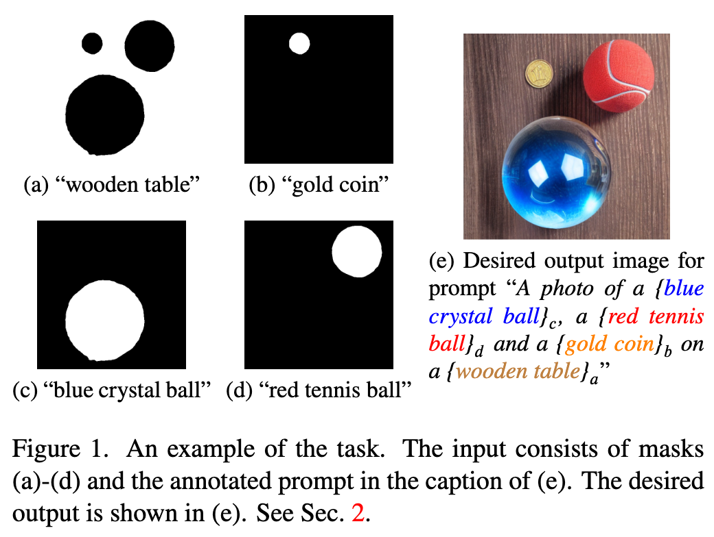

## Contrastive Prompts Improve Disentanglement in Text-to-Image Diffusion Models

#diffusion_guidance

  

这篇论文试图解决的问题是如何在文本到图像的扩散模型中实现对图像因素的精细控制。具体来说，作者指出现有的文本到图像合成模型虽然在图像合成方面取得了显著的性能，但文本界面并不总是能够提供对某些图像因素的细粒度控制。例如，文本中的单个标记变化可能会对图像产生意想不到的影响。为了解决这个问题，作者提出了一种名为对比引导（Contrastive Guidance）的方法，该方法通过使用一对具有最小差异的对比提示（positive prompt和baseline prompt）来指导模型，从而实现对特定图像因素的解耦控制。这种方法旨在引导领域专家（例如，针对某个对象类别训练的模型）、实现类似操纵StyleGAN的连续、类似刚体的文本到图像生成控制，以及提高基于文本到图像扩散模型的图像编辑方法的性能。

## Layout-to-Image Generation with Localized Descriptions using ControlNet with Cross-Attention Control

#layout_guidance

  

这篇论文试图解决的问题是提高文本到图像扩散模型（text-to-image diffusion models）在生成图像时对视觉组成的细粒度控制。具体来说，作者们关注于如何让这些模型能够更好地理解和利用局部化文本描述（localized descriptions），以便在生成的图像中精确地对应到特定的区域。尽管现有的模型如ControlNet能够在一定程度上控制图像的布局，但它们仍然缺乏对局部化描述的精确控制能力，这在处理具有相似形状和颜色的对象时尤为明显，可能导致概念混淆（concept bleeding）或图像质量下降。

为了解决这个问题，作者们提出了一种新的跨注意力（cross-attention）控制方法，该方法能够在不进行额外训练的情况下，通过修改生成过程中的跨注意力分数来实现对局部化描述的利用。这种方法旨在在保持图像质量的同时，提高模型对文本提示中特定区域描述的控制能力。