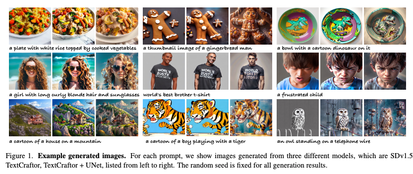

##  InterDreamer: Zero-Shot Text to 3D Dynamic Human-Object Interaction
#interaction
#_3d生成
#human

   

这篇论文介绍了一个名为InterDreamer的新技术，它能够根据文本描述自动创造出三维的人类与物体互动的动画场景。这里的关键点是“零样本学习”，意味着InterDreamer不需要依赖大量的文本和对应动作的数据对来学习如何生成动画，它通过利用已有的语言模型和动作模型，就能理解文本中描述的互动内容，并创造出符合描述的动态画面。

简单来说，就像你给InterDreamer讲一个故事，比如“一个人拿起一个箱子并放在地上”，它就能生成一个视频中的人真的去拿箱子并放下的三维动画

##  Locate, Assign, Refine: Taming Customized Image Inpainting with Text-Subject Guidance
#inpainting
#image_inpainting

  

巧了，现在都开始用IP-Adapter和ControlNet的思想了。

这篇论文的主要内容可以总结如下：

问题定义：论文提出了一个图像修复任务，目标是在保持场景背景不变的情况下，根据文本提示和指定主体图像的引导来修复图像中被遮蔽的区域。

方法介绍：为了解决这一问题，论文提出了一个名为LAR-Gen的新型图像修复方法。该方法采用了“Locate, Assign, Refine”的三步流程，包括精确区域编辑、解耦的交叉注意力机制以及一个新颖的RefineNet来补充主体细节。

## Break-for-Make: Modular Low-Rank Adaptations for Composable Content-Style Customization
#定制化
#属性

  

效果真好啊，Content和Style的定制化。看样子是对Zip-Lora的一种改进。可以学习一下

## Lift3D: Zero-Shot Lifting of Any 2D Vision Model to 3D
#paper_idea

  

这篇论文提出了一个名为Lift3D的框架，旨在解决如何将任意二维（2D）视觉模型提升到三维（3D）数据上，以生成视角一致的预测结果。具体来说，它关注的问题包括：

2D模型到3D数据的泛化：现有的2D视觉模型在处理3D场景时，往往需要针对特定任务设计高度创造性的方法，并且通常需要针对每个场景进行优化。Lift3D旨在通过一个通用的框架，使得任意2D模型能够在没有额外调整的情况下适应3D数据。

多视角一致性：在多视角输入图像的情况下，单独应用2D操作符往往会导致不同视角间的预测结果不一致。Lift3D通过学习修复和传播不一致的多视角网络输出，生成视角一致的3D预测。

零样本学习（Zero-Shot Learning）：Lift3D是一个零样本方法，意味着它不需要针对特定任务的训练，也不需要针对特定场景的优化。这使得它能够在没有见过的场景和任务上进行泛化。

3D视觉任务的扩展：尽管3D场景表示（如神经辐射场）的兴趣日益增长，但与2D图像数据集相比，3D或多视角数据的可用性仍然非常有限。Lift3D通过利用少量2D视觉模型生成的特征空间来训练，然后泛化到新的视角操作符和任务，如风格迁移、超分辨率、开放词汇分割和图像着色等。

总结来说，Lift3D试图提供一个通用的解决方案，使得现有的2D视觉模型能够在3D数据上产生一致且准确的预测，而无需针对每个新任务或场景进行专门的训练和优化。这在3D理解和相关应用领域（如自动驾驶、机器人技术和3D资产创建）具有重要的实际意义。

## TextCraftor: Your Text Encoder Can be Image Quality Controller
#image_generation

  

这篇论文试图解决的问题是如何提高基于扩散的文本到图像生成模型（例如Stable Diffusion）的性能。尽管这些模型在内容生成领域取得了显著进展，但它们仍存在一些限制：

生成的图像与输入文本的对齐程度不高，可能无法很好地反映文本的内容。

生成视觉上令人满意的图像通常需要多次尝试，使用不同的随机种子和手动进行提示工程（prompt engineering）。

为了解决这些问题，论文提出了一种名为TextCraftor的方法，这是一种端到端的微调技术，用于增强预训练的文本编码器。TextCraftor的目标是改善文本编码器的性能，从而提高生成图像的质量以及文本与图像的对齐程度。论文还探讨了如何利用奖励函数（例如，评估图像质量的美学模型或文本-图像对齐评估模型）以可微分的方式改进文本编码器，并展示了TextCraftor与UNet微调技术的正交性，表明两者可以结合使用以进一步提高生成质量。

##  Automated Black-box Prompt Engineering for Personalized Text-to-Image Generation

#定制化

  

这篇论文的主要内容可以总结如下：

问题定义：论文针对文本到图像（T2I）生成模型中的提示工程问题，即如何自动化地生成能够有效控制生成内容的文本提示。现有方法通常需要手动精心设计提示，且难以迁移到不同的T2I模型。

PRISM算法：提出了一种名为PRISM的算法，它能够在只有黑盒访问权限的情况下，自动发现可解释和可迁移的提示，以生成用户所需的图像概念。PRISM受到LLM“越狱”攻击的启发，利用LLM的上下文学习能力来迭代优化提示。

##  SubjectDrive: Scaling Generative Data in Autonomous Driving via Subject Control
#自动驾驶
#diffusion_应用

  

这篇论文试图解决什么问题？

A: 这篇论文试图解决的问题是如何通过生成模型来扩展自动驾驶领域中大规模标注数据集的生成。具体来说，它探讨了以下几个方面的问题和目标：

生成数据的多样性和可扩展性：论文提出了一个名为SubjectDrive的框架，旨在通过引入额外的“主题控制”（subject control）机制来提高生成数据的多样性，从而更有效地扩展生成数据的生产。

提升下游感知模型的性能：通过增加生成数据的数量，论文研究了这对下游感知模型（如3D对象检测和跟踪）性能的影响，并发现增强数据多样性在有效扩展生成数据生产中起着关键作用。

利用生成模型解决数据收集的挑战：自动驾驶领域中的数据收集面临成本高、耗时长以及数据隐私和使用权问题等挑战。论文探讨了生成模型是否能够转变自动驾驶的数据生产流程，从而推动该领域的进步。

提高生成数据的质量：论文通过SubjectDrive框架生成的数据在视觉真实感和控制能力上进行了评估，以确保生成的样本能够与人类标注的数据相媲美，适用于复杂的判别任务。

总体而言，论文的目标是通过创新的生成模型框架来提高自动驾驶训练数据的生成效率和质量，以期望在不增加实际数据收集成本的情况下，推动自动驾驶技术的发展。