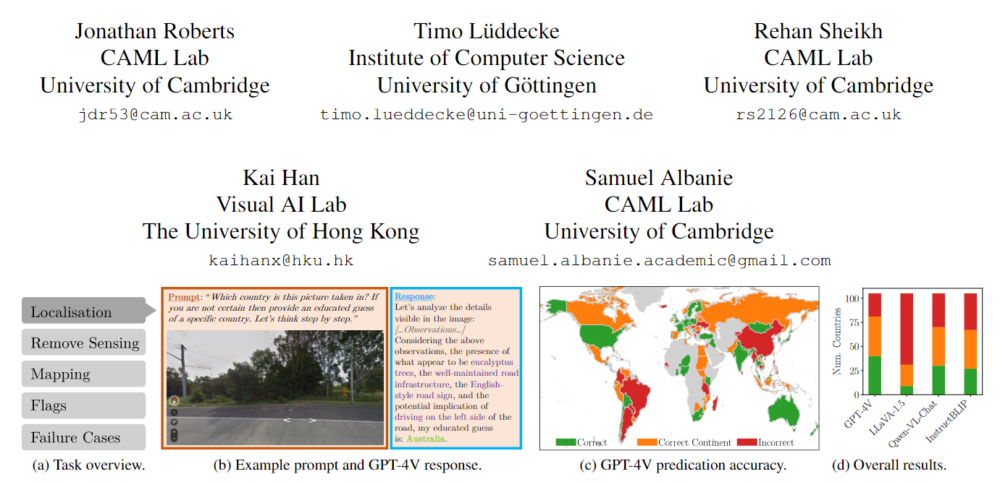

## Charting New Territories: Exploring the Geographic and Geospatial Capabilities of Multimodal LLMs
  

这篇文章讨论了对**多模态大型语言模型（MLLMs）在地理和地理空间领域的评估**。作者使用**GPT-4V**模型进行了一系列实验，并将其性能与其他MLLMs进行了比较。实验任务包括图像定位、卫星图像检测和对遥感数据的解释。结果显示，**GPT-4V具有广泛的能力，但在某些任务中可能并不总是表现最好。选择最佳模型取决于具体的任务。**

## ToddlerDiffusion: Flash Interpretable Controllable Diffusion Model

  

这篇文章介绍了一种名为ToddlerDiffusion的**可解释**的图像生成框架。它通过**将复杂的RGB图像生成任务分解为一系列可解释的阶段来提高生成过程的可解释性**。这些阶段包括**生成抽象轮廓**、**生成抽象调色板**和**生成详细的彩色图像**。与传统模型一次性生成完整图像的复杂阶段不同，ToddlerDiffusion将生成过程分解为更简单的组件，从而提供了前所未有的编辑能力和用户交互性。此外，该框架还具有高效性，通过为每个子任务使用更小的网络结构，加快了采样和训练过程。框架还减少了训练和采样过程中对大量去噪步骤的需求。通过利用更简单的阶段性任务，ToddlerDiffusion实现了更高效的图像生成。

## GaussianEditor: Swift and Controllable 3D Editing with Gaussian Splatting

  

这篇论文介绍了一种名为**GaussianEditor的3D编辑算法**，它基于**Gaussian Splatting（GS）和Hierarchical Gaussian Splatting（HGS）的3D表示方法**。传统的3D编辑方法使用网格和点云等表示形式，但在渲染复杂场景时存在一些限制。而基于隐式3D表示的方法，如Neural Radiance Field（NeRF），可以实现高保真度的渲染，但对于特定场景区域的控制有限且处理速度较慢。

为了解决这些挑战，该论文提出了GaussianEditor算法，它利用Gaussian Splatting实现了快速、精确和可控的3D编辑。论文中介绍了Gaussian semantic tracing的方法，通过追踪编辑目标的高斯点云，确保只对目标区域进行编辑，而不影响其他区域。此外，论文还提出了Hierarchical Gaussian Splatting（HGS）方法，通过对高斯点云进行分代管理，实现了稳定和精细的编辑效果。

论文还介绍了针对对象删除和整合的编辑策略。对于对象删除，论文利用2D修复技术填补删除对象的区域，避免产生伪影。对于对象整合，论文利用2D和3D修复技术生成粗糙的3D网格，并将其转化为3D高斯点云进行细化。整个对象整合过程通常只需要约5分钟。

## Boosting3D: High-Fidelity Image-to-3D by Boosting 2D Diffusion Prior to 3D Prior with Progressive Learning

  

这篇论文是关于一种名为Boosting3D的三阶段框架，用于从参考图像生成高质量的3D模型。论文提出了一种结合了NeRF（神经辐射场）和LoRA（低分辨率自动编码器）的方法，通过多阶段的优化过程逐步提高生成的3D模型的质量。

第一阶段是粗糙的NeRF生成，通过训练NeRF模型，将输入图像和NeRF渲染结果作为监督信号，优化模型以生成与输入图像相对应的3D模型。在这一阶段，还训练了一个LoRA模型，用于控制NeRF的优化范围。

第二阶段是NeRF的细化，利用第一阶段训练得到的LoRA模型和预训练的LoRA模型，通过渲染新视角的图像和LoRA模型的损失函数进行优化，进一步提高NeRF的质量。

第三阶段是3D模型的细化，通过优化从NeRF提取的3D网格，使其达到与NeRF渲染结果相同的高质量。在这一阶段，还使用LoRA模型进行优化。

论文通过实验证明，Boosting3D方法在生成高质量的3D模型方面具有优势，能够生成细节丰富、结构合理的模型。

## MVControl: Adding Conditional Control to Multi-view Diffusion for Controllable Text-to-3D Generation

  

这篇论文是关于一种名为MVControl的神经网络架构，它通过引入额外的输入条件（例如边缘图）来增强现有的预训练多视角2D扩散模型，实现可控的多视角图像生成和视角一致的3D内容。该方法利用MVDream作为基础模型，并训练一个新的神经网络模块作为特定任务条件学习的附加插件，以实现可控的多视角图像生成。为了精确控制生成图像的形状和视角，论文提出了一种新的条件机制，预测包含输入空间和视角条件的嵌入，并将其全局注入到网络中。一旦训练完成MVControl，可以使用基于得分蒸馏（SDS）损失的优化来生成3D内容，其中使用了混合扩散先验。实验结果表明，该方法具有良好的泛化性能，并能够实现高质量的可控3D内容生成。

该论文的实验部分使用了Objaverse数据集进行训练，并采用了预训练的MVDream和ControlNet模型的权重进行初始化。网络在2D和3D数据集上进行训练，并使用SDS优化来生成高保真度的3D内容。