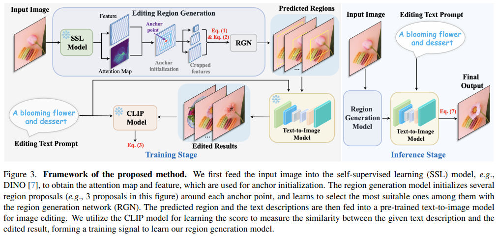
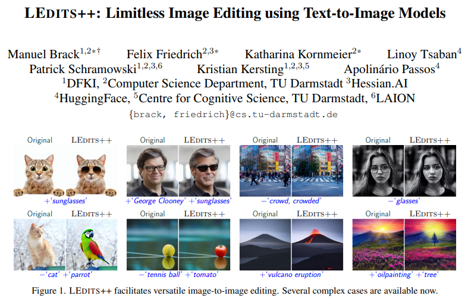
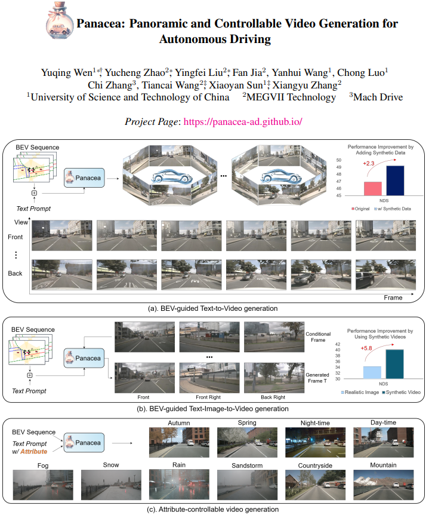

## Text-Driven Image Editing via Learnable Regions
#image_editing
#auto_find_region

  

- **研究背景**：现在有很多方法可以用文字来生成或者修改图片，但是**大多数方法**都需要用户**提供一些额外的信息**，比如要编辑的**区域**或者**草图**。这些方法对用户来说**不够方便和自然**，而且有时候**也不够准确和灵活**。
- **研究动机**：作者想要提出一种方法，可以让**用户只用文字就可以编辑图片**，不需要提供任何其他的信息。这样的方法可以**让用户更自由地表达他们的想法**，也可以更好地适应不同的文字描述和图片内容。
- **研究方法**：作者提出了**一个区域生成网络**，它可以**根据文字描述自动找到图片中需要编辑的区域**，然后用一个预训练的文字到图片的模型来修改这些区域。作者用了一个自监督的视觉变换器模型来提取图片的特征，然后用了一个注意力机制来初始化一些候选的编辑区域，最后用了一个卷积神经网络来选择最合适的区域。作者还用了一个基于CLIP模型的损失函数来训练区域生成网络，使得编辑后的图片和文字描述更加相似。
- **贡献和创新点**：作者的方法有以下几个贡献和创新点：
    - 作者的方法可以实现无需用户指定区域的文字驱动的图片编辑，这是一个很有挑战和价值的任务。
    - 作者的方法可以与不同的文字到图片的模型结合，比如基于变换器的模型或者基于扩散的模型，这增加了方法的通用性和灵活性。
    - 作者的方法可以处理复杂的文字描述，比如包含多个对象，几何关系，或者长段落，这提高了方法的表达能力和鲁棒性。
    - 作者的方法通过实验和用户调查，证明了它可以生成高质量和真实的图片，而且优于现有的方法。

## Z∗: Zero-shot Style Transfer via Attention Rearrangement 
#dual_diffusion

  

- **研究背景**：图像风格迁移是一种有趣的图像生成任务，它可以让我们创造出不同的艺术效果。目前，已经有很多方法可以实现图像风格迁移，比如基于卷积神经网络（CNN）的方法，基于变换器（Transformer）的方法，和基于扩散模型（Diffusion Model）的方法。扩散模型是一种新的生成模型，它可以通过给图片添加噪声和去噪声的过程，来生成想要的图片。**扩散模型可以用文字或者图片来控制生成的图片的风格，但是需要对每一种风格进行训练或者调整，这样比较耗时和复杂。**
- **研究动机**：本文的研究动机是想要提出一种**零样本的图像风格迁移方法**，也就是说，**不需要对每一种风格进行训练**或者**调整**，只需要**给定一张内容图片和一张风格图片**，就可以**直接生成风格迁移的结果**。这样可以节省时间和资源，也可以提高风格迁移的灵活性和多样性。
- **研究方法**：本文的研究方法是利用预训练好的扩散模型，和一种新的**注意力重排（Attention Rearrangement）**的技术，来实现零样本的图像风格迁移。具体来说，本文的方法分为两个步骤：
    - **双路径网络（Dual-path Networks）**：本文使用**两个扩散模型**，**分别对内容图片和风格图片进行去噪声的过程**，得到它们在**潜在空间**（Latent Space）的特征。这些特征包含了内容和风格的信息，可以**用注意力机制（Attention Mechanism）来融合**。
    - 注意力重排（Attention Rearrangement）：本文提出了一种新的注意力重排的技术，来改进注意力机制的计算方式。本文发现，**如果直接用内容特征去查询风格特征，会导致内容结构的损失**。因此，本文提出了一种重新安排注意力矩阵（Attention Matrix）的方法，来同时考虑内容和风格特征之间的相似度和差异度，从而实现更好的内容和风格的平衡。
- 贡献和创新点：本文的贡献和创新点有以下几点：
    - 本文**提出了一种零样本的图像风格迁移方法，不需要对每一种风格进行训练或者调整**，只需要给定一张内容图片和一张风格图片，就可以直接生成风格迁移的结果。
    - 本文利用预训练好的扩散模型，和一种新的注意力重排的技术，来实现零样本的图像风格迁移。本文的方法可以有效地提取和融合内容和风格的信息，生成高质量的风格迁移结果。
    - 本文通过理论分析和实验验证，展示了本文的方法在图像风格迁移任务上的有效性和优越性，超越了现有的方法。本文的方法可以适应不同类型和风格的图片，生成具有艺术感和创造性的图片。

## MagicAnimate: Temporally Consistent Human Image Animation using Diffusion Model

#action
#animation

  

- **研究背景**：这篇论文研究的是**人像动画的任务**，也就是**如何让一张静态的人像图片根据给定的动作信号来生成一段连续的视频**。这个任务有很多潜在的应用，比如社交媒体、电影制作和娱乐等。目前已有很多基于数据驱动的方法来实现这个任务，它们主要分为两类：**基于生成对抗网络（GAN）的方法**和**基于扩散模型（Diffusion Model）的方法**。**GAN-based方法通常使用一个变形函数来将参考图片变形到目标姿态，并用GAN模型来补全缺失或遮挡的部分**。**Diffusion-based方法则利用一个预训练的扩散模型来根据参考图片和姿态条件来生成目标图片**。
- **研究动机**：尽管现有的方法可以生成一定程度上合理的动画效果，但是它们仍然存在一些局限性：1）**GAN-based方法的动作转换能力受限，当参考图片和目标姿态差异较大时，它们往往会产生不真实的细节和较差的泛化能力**。2）**Diffusion-based方法通常是逐帧处理视频，而忽略了视频中的时间信息，这导致了动画结果的闪烁现象。此外，这些方法通常使用CLIP模型来编码参考图片，这种语义级别的特征太稀疏，无法捕捉细节信息，如身份、背景、服装等。**
- **研究方法**：为了解决上述问题，这篇论文提出了一个新的扩散模型框架，叫做**MagicAnimate**，它旨在提高时间一致性、保持参考图片的忠实度和提高动画质量。为了实现这个目标，它首先**开发了一个视频扩散模型，通过在扩散网络中加入时间注意力模块来编码时间信息**。其次，它引入了一个**创新的外观编码器，来保留参考图片的人物身份和背景信息**。利用这两个创新，它还采用了一个简单的视频融合技术，来实现长视频动画的平滑过渡。
- **贡献和创新点**：这篇论文的贡献和创新点有以下几点：（1）它提出了MagicAnimate，一个新颖的扩散模型框架，它集成了时间一致性建模、精确的外观编码和时间视频融合，能够生成任意长度的时间一致的人像动画。（2）它在两个基准数据集上实现了最先进的性能。特别地，它在具有挑战性的TikTok舞蹈数据集上，比最强的基线方法在视频质量上提高了超过38%。（3）它展示了强大的泛化能力，支持跨身份动画和各种下游应用，包括未见领域动画和多人动画。

## GPT4Video: A Unified Multimodal Large Language Model for lnstruction-Followed Understanding and Safety-Aware Generation

#LLM
#GPT-4
#Video

  

- **研究背景**：人工智能（Artificial Intelligence, AI）是一门研究让计算机具有智能行为的学科，其中有一个重要的分支是多模态人工智能（Multimodal Artificial Intelligence, M-AI），它是指让计算机能够处理和生成不同的信息形式，比如文字、图像、音频和视频等。多模态人工智能有很多应用场景，比如视频聊天、视频搜索、视频编辑等。
- **研究动机**：目前，**多模态人工智能的一个主要挑战是如何让计算机能够理解和生成视频内容**，因为视频是一种非常复杂和丰富的信息形式，它包含了**空间和时间**两个维度的信息。为了让计算机能够处理视频，一种常用的方法是使用大型语言模型（Large Language Model, LLM），它是一种基于深度学习的模型，能够学习和生成自然语言。但是，**现有的大型语言模型主要是针对文字信息的**，它们**缺乏对视频信息的理解和生成能力。**因此，本文的**研究动机**是提出一个新的框架，叫做**GPT4Video**，它能够**让大型语言模型具备视频理解和生成的能力。**
- **研究方法**：本文的研究方法主要包括以下几个步骤：
    - **视频理解模块**：本文使用一个**预训练的视觉特征提取器**，把视频的每一帧转换成一个向量，然后使用一个视频抽象器，把这些向量压缩成一些**可学习的标记**，这些标记能够捕捉视频的空间和时间信息，最后使用**一个线性映射层**，把这些标记**投影到大型语言模型的词嵌入空间**，使得**视频信息和文字信息能够对齐**。
    - 大型语言模型：本文使用LLaMA作为大型语言模型的主体，它是一种基于Transformer的模型，有70亿个参数，能够处理长达2048个词的文本。本文使用LoRA方法对LLaMA进行微调，它是一种低秩适应的方法，能够在保留原始参数的同时，增加一些新的参数，提高模型的灵活性。本文使用一个特别设计的指令数据集，训练LLaMA如何根据上下文信息，生成适合视频生成模型的文本提示。
    - 视频生成模块：本文使用ZeroScope作为视频生成模型，它是一种基于扩散模型的方法，能够根据文本提示，生成高质量的视频。本文的框架可以兼容任何文本到视频的模型，不需要修改大型语言模型的参数。
    - 安全对齐模块：本文为了保证视频生成的内容是安全和合适的，使用了一个安全对齐的数据集，训练LLaMA如何拒绝回应不恰当的用户请求，从而避免启动视频生成模型。
- **贡献和创新点**：本文的主要贡献和创新点有以下几个方面：
    - 本文提出了GPT4Video，一个通用的框架，能够让大型语言模型具备视频理解和生成的能力。
    - 本文提出了一种简单有效的微调方法，旨在提高视频生成的安全性，提供了一种替代常用的但是计算昂贵的人类反馈强化学习的方法。
    - 本文发布了自己构建的数据集，促进了多模态大型语言模型的未来研究，包括（1）一个大规模的多模态指令数据集，涵盖了多种对话场景；（2）一个综合的多模态安全基准，主要关注色情内容，因为它是视频生成中最大的风险。

## Fine-grained Appearance Transfer with Diffusion Models

#appearance_transfer

  

- **研究背景**：这篇论文研究的是一种叫做图像到图像转换的任务，就是把一张图片的外观转换成另一张图片的外观，比如把一张狗的照片变成一张猫的照片，或者把一张真实的风景照变成一张水彩画的风景照。这个任务在计算机视觉领域是很重要的，因为它可以用来创造新的图像，或者改善已有的图像。
- **研究动机**：这篇论文的研究动机是要**实现一种细粒度的外观转换**，也就是说，**不仅要转换整体的风格和色彩，还要保留原图像的细节和结构**，比如眼睛的颜色，毛发的纹理，物体的形状等。这样的转换是很困难的，因为要在不同的图像之间找到对应的部分，还要避免产生不自然或者不协调的效果。
- **研究方法**：这篇论文的研究方法是基于一种叫做扩散模型的生成模型，这种模型可以从噪声中逐步还原出清晰的图像，通过控制噪声的分布和方向，可以实现不同的图像转换。这篇论文的创新点是**利用了扩散模型中的一个特殊的空间**，**叫做x0空间**，这个空间**包含了图像的结构和语义信息，而没有噪声的干扰**。这篇论文**在x0空间中**进行了**语义匹配**和**外观转换**的操作，然后**再把转换后的结果回到扩散模型的潜在空间中**，进行**细微的调整**，最后**生成最终的图像。**
- **贡献和创新点**：这篇论文的贡献和创新点有以下几点：
    - 发现了x0空间的优势，利用它来实现细粒度的外观转换，保证了图像的质量和自然度。
    - 设计了一种流畅的从x0空间到潜在空间的过渡方法，避免了重新训练或者微调模型的需要。
    - 在多种类别和领域的图像上展示了细粒度外观转换的效果，证明了方法的通用性和鲁棒性。

## MotionZero:Exploiting Motion Priors for Zero-shot Text-to-Video Generation
#Video

- **研究背景**：文本到视频（T2V）是指根据文本描述来合成相关的视频，这是一种非常有用的技术，可以用于创造和编辑视频内容。目前，**大多数的T2V方法都需要大量的视频数据来训练**，这样才能生成高质量和多样化的视频。但是，这样的方法也有很多**缺点**，比如**训练成本高，泛化能力差，不能适应新的场景和需求**。因此，一些研究者提出了**零样本T2V**的方法，即**不需要任何视频数据，只根据文本生成视频**。这样的方法更加灵活和经济，但是也面临着很大的挑战，比如**如何从文本中提取运动信息**，**如何控制不同物体的运动**，**如何保证视频的连贯性和真实性**等。
- **研究动机**：本文的研究动机是**提出一种新的零样本T2V的方法**，能够更好地**利用文本中隐含的运动信息**，实现**对不同物体的运动的精确和分离的控制**，从而生成更加逼真和多样的视频。本文认为，**文本中的不同物体有不同的运动模式，比如“飞机降落”中的“飞机”会向下移动，而“跑道”会保持静止**。因此，本文**提出了一种从文本和生成的第一帧图像中提取运动信息的方法**，然后**将这些运动信息分别应用到对应的物体上，实现运动的分离控制**。此外，本文还提出了一种根据运动幅度调整跨帧注意力的方法，能够适应不同的动态场景，提高视频的连贯性。
- **研究方法**：本文的研究方法主要包括两个部分：**提取运动信息**和**分离运动控制**。在提取运动信息的部分，本文**利用大型语言模型（LLM）来从文本和生成的第一帧图像中查询不同物体的运动信息**，包括运动的物体和运动的方向。本文将运动的方向划分为八个方向，比如“上”、“下”、“左”、“右”等。本文**通过设计不同的问题，让LLM回答不同物体在每一帧的运动方向**，比如“飞机在第二帧的运动方向是什么？”。在**分离运动控制的部分**，本文**根据提取的运动信息，对不同物体的特征进行变换，使其符合运动的方向**。本文采用一个开放域的分割模型，根据文本和第一帧图像，得到不同物体的位置信息，然后根据位置信息，将不同物体的特征分别进行变换，实现运动的分离控制。本文还采用了一个基于扩散模型的视频生成模型，将变换后的特征转换为视频帧。本文还提出了一种运动感知的注意力机制，根据运动的幅度，调整不同帧之间的注意力权重，使得视频更加连贯。
- **贡献和创新点**：本文的主要贡献和创新点有以下几点：
    - 本文提出了一种新的零样本T2V的方法，能够更好地利用文本中隐含的运动信息，实现对不同物体的运动的精确和分离的控制，从而生成更加逼真和多样的视频。
    - 本文利用LLM来从文本和生成的第一帧图像中提取运动信息，包括运动的物体和运动的方向，这是一种简单而有效的方法，能够充分利用LLM的推理能力和常识知识。
    - 本文采用一个开放域的分割模型，根据文本和第一帧图像，得到不同物体的位置信息，然后根据位置信息，将不同物体的特征分别进行变换，实现运动的分离控制，这是一种灵活而精确的方法，能够避免全局变换带来的失真和不自然的效果。
    - 本文提出了一种运动感知的注意力机制，根据运动的幅度，调整不同帧之间的注意力权重，使得视频更加连贯，这是一种自适应而智能的方法，能够适应不同的动态场景，提高视频的质量。

## LEDITS++: Limitless Image Editing using Text-to-Image Models

  

- **研究背景**：这篇论文是关于用文字来编辑图片的，也就是说，你可以输入一些文字，比如“加上眼镜”或者“换成蓝色的帽子”，然后人工智能就会根据你的要求修改图片。这样的技术可以用在很多方面，比如美化照片，创作艺术作品，或者生成虚拟的场景。
- **研究动机**：目前已经有很多人工智能模型可以用文字来生成图片，也就是说，你可以输入一些文字，比如“一只猫坐在沙发上”，然后人工智能就会创造出一张符合你描述的图片。但是，这些模型有一些局限性，比如：
    - 它们**不能很好地控制图片的细节，比如颜色，形状，位置等**。如果**你稍微改变一下文字**，比如“一只黑猫坐在沙发上”，它们可能**会生成一张完全不同的图片，而不是只改变猫的颜色**。
    - 它们**不能很好地编辑真实的图片**，比如你拍的照片或者网上找的图片。如果你想用文字来修改这些图片，它们可能会把图片变得很模糊，或者改变图片的整体风格，而不是只改变你想要的部分。
    - 它们**不能很好地同时编辑多个概念**，比如你想让图片里的人戴上眼镜，留胡子，还有卷发。如果你用一个文字来描述这些要求，它们可能会忽略一些细节，或者产生一些冲突，比如眼镜和胡子重叠在一起。
- **研究方法**：为了解决这些问题，这篇论文提出了一个**新的方法，叫做LEDITS++**，它有三个主要的特点：
    - 它可以**快速地把真实的图片转换成一种特殊的格式，叫做噪声向量**，然后再用文字来修改这个噪声向量，最后再把噪声向量转换回图片。这样的过程不需要花很多时间，也不需要调整很多参数，而且可以保证图片的质量不会变差。
    - 它可以**灵活地用文字来编辑图片，不管是简单的还是复杂的，不管是单个的还是多个的**。它会根据每个文字的含义，自动找到图片中相关的区域，然后只在那些区域里进行修改，而不会影响其他的部分。比如，如果你输入“加上眼镜”，它就会只在图片中的眼睛上加上眼镜，而不会改变其他的东西。
    - 它可以**精确地用文字来控制图片的细节**，比如颜色，形状，位置等。它会根据你输入的文字，调整图片中的噪声向量，使得图片更符合你的要求。比如，如果你输入“换成蓝色的帽子”，它就会把图片中的帽子的颜色改成蓝色，而不会改变帽子的形状或者位置。
- **贡献和创新点**：这篇论文的贡献和创新点有以下几点：
    - 它提出了一种新的图片转换方法，可以快速地把真实的图片转换成噪声向量，然后再转换回图片，而且可以保证图片的质量不会变差。这种方法比以前的方法更高效，更准确，也更容易使用。
    - 它提出了一种新的图片编辑方法，可以灵活地用文字来编辑图片，不管是简单的还是复杂的，不管是单个的还是多个的。这种方法比以前的方法更通用，更自然，也更有趣。
    - 它提出了一种新的图片控制方法，可以精确地用文字来控制图片的细节，比如颜色，形状，位置等。这种方法比以前的方法更细致，更符合用户的意图，也更有创意。
- **相关工作**：这篇论文的相关工作主要有以下几类：
    - 用文字来生成图片的人工智能模型，比如eDiff-I [3]，Masactrl [7]，Prompt-to-Prompt [13]等。这些模型可以根据用户输入的文字，创造出一张新的图片，但是它们不能很好地控制图片的细节，也不能很好地编辑真实的图片，也不能很好地同时编辑多个概念。
    - 用噪声向量来表示图片的人工智能模型，比如DDPM [14]，DDIM [41]，SD1.5 [33]等。这些模型可以把图片转换成一种特殊的格式，叫做噪声向量，然后再用一些算法来修改这个噪声向量，最后再把噪声向量转换回图片。这些模型可以提高图片的质量，但是它们不能很好地用文字来编辑图片，也不能很好地找到图片中相关的区域，也不能很好地控制图片的细节。
    - 用文字来编辑图片的人工智能模型，比如SDEdit [25]，Imagic [17]，Pix2Pix-Zero [29]等。这些模型可以根据用户输入的文字，修改真实的图片，但是它们需要花很多时间，也需要调整很多参数，而且它们会改变图片的整体风格，或者忽略一些细节，或者产生一些冲突。

## Panacea: Panoramic and Controllable Video Generation for Autonomous Driving
#自动驾驶
#video_generation
  

- **研究背景**：自动驾驶是一个很重要的技术领域，它需要大量的高质量的视频数据来训练和测试自动驾驶系统。但是，收集和标注这些数据是非常困难和昂贵的，而且很难覆盖所有的驾驶场景和条件。因此，**有人提出了用人工智能技术来生成虚拟的驾驶场景视频，这样可以增加数据的多样性和数量，也可以方便地控制视频的内容和属性。**
- **研究动机**：目前，已经有一些人工智能技术**可以生成单视角或多视角的驾驶场景图片**，但是**生成高质量的多视角的驾驶场景视频**还是一个**很大的挑战**。因为视频不仅要在每一帧内保持清晰和真实，还要在不同的帧和视角之间保持一致和连贯。另外，生成的视频还要能够根据一些控制信号，比如鸟瞰视图的布局或者文字描述，来调整视频的内容和属性，比如车辆的位置、速度、方向，或者天气、时间、场景等。
- **研究方法**：这篇论文提出了一个新的人工智能模型，叫做Panacea，它可以**生成全景和可控制的驾驶场景视频**。Panacea的方法分为两个阶段：**第一个阶段是生成多视角的驾驶场景图片**，**第二个阶段是根据这些图片和后续的控制信号，生成多视角的驾驶场景视频**。Panacea的核心技术是利用了一种叫做扩散模型的生成模型，它可以从随机噪声中逐步生成清晰的图片或视频。为了保证视频的一致性和可控性，**Panacea还设计了一个分解的四维注意力机制，它可以分别处理视频中的空间、视角和时间维度，以及一个控制网络，它可以将控制信号融合到生成过程中。**
- **贡献和创新点**：这篇论文的主要贡献和创新点有以下几点：
    - 这是第一篇探索用扩散模型生成多视角的驾驶场景视频的论文，它在生成质量和效率上都超过了现有的方法。
    - 这是第一篇提出分解的四维注意力机制的论文，它有效地解决了视频生成中的一致性问题，同时也保证了计算的可行性和高效性。
    - 这是第一篇利用控制网络来实现多种控制信号的融合的论文，它可以灵活地调整视频的内容和属性，从而生成更多样化和有用的数据。
    - 这篇论文在一个公开的驾驶数据集上进行了广泛的实验，证明了它的生成数据可以有效地提升自动驾驶系统的性能，也可以用于真实的驾驶模拟。
- **相关工作**：这篇论文的相关工作主要包括以下几个方面：
    - 扩散模型是一种强大的生成模型，它可以生成高质量的图片和视频，也可以根据不同的控制信号来生成特定的内容和属性。
    - 鸟瞰视图是一种用于自动驾驶的重要的视角，它可以提供全局的信息和注释，也可以用于生成多视角的驾驶场景图片或视频。
    - 多视角的驾驶场景视频是一种有价值的数据，它可以用于训练和测试自动驾驶系统的多种任务，比如三维物体检测、运动预测和规划等。

## A Unified Approach for Text- and Image-guided 4D Scene Generation
#generation_4d

  

这篇论文的标题是“A Unified Approach for Text- and Image-guided 4D Scene Generation”，作者是来自NVIDIA、苏黎世联邦理工学院和马普智能系统研究所的研究人员。

- **研究背景**：这篇论文的研究背景是，现在有很多人工智能的方法可以根据用户提供的文字或者图片，生成高质量的图片、视频或者三维模型。但是，**如果用户想要生成一个动态的三维场景，也就是一个可以从不同角度观看的四维视频，就没有很好的方法**。这种四维视频的生成对于游戏、虚拟现实、广告等应用场景是很有用的，因为它可以让用户更自由地创造和体验他们想象中的场景。
- **研究动机**：这篇论文的研究动机是，**要生成一个动态的三维场景，需要解决两个难题**：一是**如何从文字或者图片中学习一个静态的三维模型，这个模型要能够与输入的描述相符，而且要在不同的视角下保持一致**；二是**如何从文字中学习一个动态的变形，这个变形要能够让静态的模型按照输入的动作进行移动**。这两个难题都需要借助一些先验的知识，比如图片、视频或者三维数据的分布规律，来指导生成过程。**这篇论文的目标是，提出一个统一的框架，利用不同类型的先验知识，来生成高质量的四维视频。**
- **研究方法**：这篇论文的研究方法是，采用了一个**两阶段的训练流程**。**第一阶段**是**生成静态的三维模型**，**第二阶段**是**生成动态的变形**。在第一阶段，作者使用了一种叫做NeRF的神经网络，来表示三维模型的几何和颜色信息。为了让这个网络能够根据文字或者图片生成合适的三维模型，作者使用了一种叫做diffusion的生成模型，来提供指导信号。diffusion模型是一种可以根据输入的条件，生成图片、视频或者三维数据的模型，它可以学习到不同类型数据的分布规律。作者使用了两种不同的diffusion模型，一种是专门用来生成三维数据的，叫做MVDream，它可以保证生成的三维模型在不同视角下是一致的；另一种是通用的用来生成图片的，叫做StableDiffusion，它可以保证生成的三维模型的外观和布局是真实和合理的。作者将这两种模型的指导信号结合起来，来训练NeRF网络。在第二阶段，作者使用了一种叫做D-NeRF的神经网络，来表示三维模型的动态变形。D-NeRF网络由两部分组成，一部分是静态的NeRF网络，另一部分是一个变形场，它可以根据时间的变化，将静态的三维模型变形成动态的三维模型。为了让这个网络能够根据文字生成合适的变形，作者使用了一种叫做Zeroscope的diffusion模型，来提供指导信号。**Zeroscope**模型是一种可以根据输入的条件，生成视频的模型，它可以学习到视频的运动规律。作者使用了Zeroscope模型的指导信号，来训练D-NeRF网络的变形场，同时保持NeRF网络的参数不变。这样，作者就可以生成一个动态的三维场景，它既符合输入的文字描述，又具有高质量的外观和运动。
- **贡献和创新点**：这篇论文的贡献和创新点有以下几点：
    - **提出了一个统一的框架**，可以根据文字或者图片，生成高质量的四维视频，这是一个很有挑战性的任务，目前还没有很好的解决方案。
    - **利用了不同类型的diffusion模型**，来提供不同方面的先验知识，包括图片、视频和三维数据的分布规律，有效地提高了生成结果的质量和一致性。
    - **使用了一种动态分离的四维表示**，将静态的三维模型和动态的变形完全分开，既保留了静态模型的高质量，又方便了动态变形的学习。
    - **使用了多分辨率的特征网格和总变差损失**，来有效地学习变形场的细节和平滑性，提高了生成结果的运动质量。
    - **展示了多种应用场景**，包括根据文字生成四维视频，根据图片生成四维视频，以及根据多张图片生成个性化的四维视频，展示了方法的灵活性和通用性。
- **相关工作**：这篇论文的相关工作主要包括以下几个方面：
    - **动态的神经辐射场**：这是一种用神经网络来表示动态的三维场景的方法，它可以从多视角的视频中重建和渲染一个动态的三维场景。这种方法有很多变体，有的是用一个高维的神经网络来表示不同时间的三维场景，有的是用一个变形场来将静态的三维场景变形成动态的三维场景，有的是用一个混合的神经网络和特征网格来提高效率和质量。这篇论文使用了一种变形场的方法，但是与之前的工作不同的是，它是根据文字来生成动态的三维场景，而不是从视频中重建。
    - **文字或图片到三维的生成**：这是一种用文字或者图片来生成静态的三维模型的方法，它可以让用户更自由地创造他们想象中的三维物体。这种方法有很多变体，有的是用神经网络来直接生成三维模型，有的是用diffusion模型来提供指导信号，有的是用不同的表示方式来提高效

## Optimisation-Based Multi-Modal Semantic Image Editing
#image_editing

  

- **研究背景**：这篇论文是关于使用**文本**或者**图像布局**（比如姿势、涂鸦、边缘图等）来指导**图像编辑**的。图像编辑就是把一张图片按照我们的要求改变一些内容，比如颜色、形状、位置等。这样的技术可以让我们更方便地创造和修改图片，比如画漫画、设计海报、美化照片等。
- **研究动机**：目前已经有很多方法可以用**文本**来指导图像编辑，比如说“把猫变成狗”或者“给图片加上一顶帽子”。但是这样的方法有一些**局限性**，比如**文本不能很精确地描述我们想要的修改，而且有时候文本的意思不够清楚，容易引起误解**。为了解决这些问题，这篇论文提出了一种新的方法，可以用**图像布局**来指导图像编辑，比如说用一个姿势图来表示我们想要的人物动作，或者用一个涂鸦图来表示我们想要的颜色和纹理。这样的方法可以让我们更精确地控制图像的修改，而且更容易表达我们的想法。
- **研究方法**：这篇论文的方法是基于一种叫做**扩散模型**的图像生成技术。扩散模型是一种可以从**文本**或者**图像布局**生成高质量图片的人工智能模型。它的原理是把一张图片逐渐变成一张噪声图片，然后再用文本或者图像布局作为条件，逐步地把噪声图片还原成我们想要的图片。这篇论文的创新点是在还原的过程中，引入了一个**优化**的步骤，可以根据我们的编辑要求，调整图片的特征，使得图片更符合我们的期望。这个**优化的步骤分成两个子任务**：**保留**和**修改**。**保留的任务是让图片的背景和无关的内容保持不变**，**修改的任务是让图片的前景和相关的内容发生变化**。为了实现这两个任务，这篇论文设计了两个**损失函数**，**分别用来衡量图片的保留程度和修改程度**。通过调节这两个损失函数的权重，我们可以灵活地控制图片的编辑效果。
- **贡献和创新点**：这篇论文的主要贡献和创新点有以下几点：
    - 提出了一种新的图像编辑方法，可以用**图像布局**来指导图像编辑，扩展了文本指导的方法的能力和范围。
    - 提出了一种基于**优化**的图像编辑策略，可以分离**保留**和**修改**的子任务，提供了一种灵活的编辑解决方案，可以根据用户的偏好调节编辑的效果。
    - 适应了现有的图像编辑方法，让它们可以利用**图像布局**的条件，并且提供了实验证据，表明优化的方法可以提高图像编辑的质量和鲁棒性。
- **相关工作**：这篇论文的相关工作主要包括以下几个方面：
    - **文本指导的图像编辑**：这些方法主要是用文本来指导图像编辑，比如说改变图片的类别、风格、属性等。这些方法可以分成三类：基于**微调**的方法，基于**无训练**的方法，和基于**优化**的方法。基于微调的方法需要对预训练的模型进行再训练，以适应编辑的任务。基于无训练的方法不需要再训练，而是直接利用预训练的模型的内部机制，比如注意力机制或者噪声向量的逆转，来实现编辑的功能。基于优化的方法也不需要再训练，而是在推理的时候对图片的特征进行优化，使得图片更符合文本的要求。
    - **图像布局指导的图像生成**：这些方法主要是用图像布局来指导图像生成，比如说用物体的边界框、姿势、涂鸦、分割图等来表示图片的结构和内容。这些方法通常是在预训练的模型的基础上，增加了一些额外的模块，可以把图像布局的信息融合到图像生成的过程中，从而提高图像生成的可控性和质量。

## RichDreamer: A Generalizable Normal-Depth Diffusion Model for Detail Richness in Text-to-3D
#Text23D

  

- **研究背景**：三维模型是一种可以用来表达物体的形状、纹理和光照的数据结构，它在各种应用中有着重要的作用，比如游戏、动画、虚拟现实等。**从文本生成三维模型是一种可以让用户用自然语言描述想要的物体，并自动创建出对应的三维模型的技术，它可以降低三维内容创作的难度和成本，提高用户的创造力和体验**。
- **研究动机**：目前，从**文本生成三维模型的方法**主要有**两种**：一种是**基于神经辐射场（NeRF）**的方法，它可以用一个神经网络来隐式地表示三维空间中的物体，但是它需要大量的优化时间和计算资源，而且容易出现多面体的问题，即生成的物体在不同视角下会出现不一致的表现；另一种是**基于深度移动网格（DMTet）的方法**，它可以用一个可变形的网格来显式地表示三维物体的表面，但是它需要一个合适的网格初始化，而且依赖于二维扩散模型来优化物体的法线图，这会导致数据分布的不匹配，影响优化的稳定性和几何的精度。因此，这篇**论文的目的**是提出一个**更强大的三维先验模型**，来**提高从文本生成三维模型的质量和效率**。
- **研究方法**：这篇论文的主要方法是提出了一个**新的法线-深度扩散模型**，它可以**同时学习法线和深度的联合分布**，利用它们**描述物体的几何信息**。这个模型首先在一个大规模的真实世界的数据集上进行预训练，利用现有的方法从图像中估计出法线和深度，然后在一个合成的三维数据集上进行微调，利用多视角的扩散技术来增强物体级别的三维生成。这个模型可以和现有的从文本生成三维模型的流程相结合，无论是基于NeRF的方法还是基于DMTet的方法，都可以用这个模型来优化物体的几何。另外，这篇论文还提出了一个反照率扩散模型，它可以用深度作为条件，来生成物体的反照率，从而减少光照的影响，提高材质的分离。
- **贡献和创新点**：这篇论文的主要贡献和创新点有以下几点：
    - 提出了一个新的法线-深度扩散模型，它可以提供强大的三维几何先验，提高从文本生成三维模型的几何质量和细节丰富度，同时具有很好的泛化能力。
    - 提出了一个反照率扩散模型，它可以用深度作为条件，提供数据驱动的约束，提高从文本生成三维模型的材质质量和光照分离。
    - 在现有的从文本生成三维模型的流程中，无缝地集成了这两个扩散模型，实现了无论是基于NeRF的方法还是基于DMTet的方法，都可以用这两个模型来优化物体的几何和材质。
    - 在多个评价指标和用户调查中，展示了这篇论文的方法在从文本生成三维模型的任务上，相比于现有的方法，取得了显著的提升和优势。
- **相关工作**：这篇论文的相关工作主要包括以下几个方面：
    - 三维生成模型：这些模型可以直接学习三维数据的分布，从而进行三维数据的采样。这些模型根据使用的三维表示的不同，可以分为基于体素、点云、网格和隐函数的方法。但是，这些方法主要在有限的物体类别上展示了它们的生成能力，由于缺乏大规模的三维数据集，它们在生成新颖的物体类别上面临着挑战。
    - 二维扩散模型：这些模型可以从高斯噪声中逐步恢复出清晰的图像，从而进行图像的生成。这些模型可以和其他的预训练模型相结合，从而实现从文本生成图像的任务。最近，一些方法也尝试用这些模型来从文本生成三维模型，但是这些方法通常需要大量的优化时间和计算资源，而且容易出现多面体的问题。
    - 几何先验模型：这些模型可以为扩散模型提供更强的几何约束，从而提高生成的多视角图像的一致性。这些模型可以用不同的方式来表示几何信息，比如RGB-D、法线-深度、坐标图等。但是，这些模型要么需要大量的三维数据来训练，要么只能在合成的数据集上微调，要么只能生成特定的物体类别，它们的泛化能力和可扩展性还有待提高。

## SparseCtrl: Adding Sparse Controls to Text-to-Video Diffusion Models
#Video
#video_generation

  

- **研究背景**：文本到视频生成是一种利用文本描述来生成视频的技术，它有很多潜在的应用，比如动画制作、故事板绘制等。但是，**现有的文本到视频生成模型通常缺乏对视频结构的精细控制，因为文本描述往往不能准确地指定视频中的空间布局、姿态、形状等细节**。为了解决这个问题，一些研究者尝试用额外的结构信息，比如每一帧的深度图、草图、RGB图像等，来增强视频生成的可控性。然而，**这些方法需要为每一帧提供条件信号，这在实际应用中是不方便的**，而且需要重新设计和训练视频生成模型，这是非常耗时的。
- **研究动机**：为了克服上述的限制，这篇论文提出了一种新的方法，叫做**SparseCtrl**，它可以在不改变原有的文本到视频生成模型的情况下，**通过一个额外的编码器网络**，来**接受稀疏的控制信号**，比如只给出**一帧或几帧的条件信号**。这样，用**户就可以用更少的输入来灵活地控制视频的生成**，而且可以适**应不同的条件信号的形式，比如草图、深度图、RGB图像等**。
- **研究方法**：SparseCtrl的核心思想是**利用一个可训练的编码器网络，来处理稀疏的条件信号，并将其输出与原有的文本到视频生成模型的输入相结合，从而影响视频的生成过程**。为了实现这个目的，SparseCtrl**借鉴了ControlNet的设计**，它是一种用于文本到图像生成的控制编码器。SparseCtrl在ControlNet的基础上，**做了三个改进**：（1）**增加了时间维度的层**，来实现条件信号在不同帧之间的传播，从而保持视频的时间一致性；（2）**去掉了噪声采样的输入**，避免了条件信号被噪声干扰，从而提高了视频的质量；（3）**使用了掩码策略**，来适应不同的稀疏度，从而扩展了应用场景。
- **贡献和创新点**：SparseCtrl的主要贡献和创新点有以下几个方面：（1）它是第一个能够在不改变原有的文本到视频生成模型的情况下，通过一个额外的编码器网络，来接受稀疏的控制信号的方法；（2）它可以兼容不同的条件信号的形式，比如草图、深度图、RGB图像等，从而提供更多的控制能力；（3）它可以与原始的文本到视频生成模型，以及个性化的文本到图像生成模型结合，从而实现高质量的视频生成；（4）它可以支持多种应用场景，比如故事板绘制、深度渲染、图像动画、关键帧插值等。
- **相关工作**：SparseCtrl的相关工作主要包括以下几个方面：（1）文本到视频生成模型，它们是利用文本描述来生成视频的技术，有些是从头训练的，有些是基于文本到图像生成模型的；（2）可控的文本到视频生成模型，它们是在文本到视频生成模型的基础上，加入了额外的结构信息，比如每一帧的深度图、草图、RGB图像等，来增强视频生成的可控性；（3）附加网络的控制编码器，它们是在不改变原有的生成模型的情况下，通过一个额外的编码器网络，来接受额外的条件信号，从而增加生成模型的控制能力。

## Ranni: Taming Text-to-Image Diffusion for Accurate Instruction Following
#image_editing
#Instruction_following

  

- **研究背景**：文本到图像（T2I）是一种可以根据文字描述生成图像的技术，它可以用于创造和编辑各种场景和物体。目前，有一种叫做扩散模型（diffusion model）的方法，可以生成高质量和多样性的图像，但是它们通常很难理解复杂的文字描述，**特别是那些涉及到数量、属性、空间关系和多主体的描述。因此，现有的模型在生成图像时，可能会忽略或者错误地表达一些细节，导致图像和文字不一致。**
- **研究动机**：为了解决这个问题，这篇论文提出了一个新的图像生成方法，它可以提供文本到图像的便利性，同时也提供专业工具的精确性和丰富性。**这个方法的核心是引入了一个叫做语义面板（semantic panel）的中间件**，**它是一个可以操作图像中所有视觉概念（visual concept）的工作空间**。**每个视觉概念代表一个物体**，**它包含了它的一些可视化的属性**，比如**位置、大小、颜色、形状**等。**语义面板可以作为一个桥梁，连接文本和图像，它可以提供对文本的结构化建模，也可以提供对图像的压缩建模**。
- **研究方法**：这个方法的基本思想是，**把文本到图像的生成分成两个子任务：文本到面板和面板到图像**。**文本到面板的任务是**，利用**大型语言模型（LLM），把输入的文字描述解析成视觉概念，并把它们收集和排列在语义面板中**。**面板到图像的任务**是，**利用扩散模型，把语义面板中的视觉概念编码成一个控制信号，引导扩散模型捕捉每个概念的细节**。为了有效地训练这两个任务，这篇论文还提出了一个自动的数据准备流程，它可以从现有的图像和文字数据中提取视觉概念，构建一个包含图像、文字和语义面板的大规模数据集。
- **贡献和创新点**：这篇论文的主要贡献和创新点有以下几点：
    - 提出了一个新的图像生成方法，它可以提高扩散模型的文本可控性，同时也提供了更直观和灵活的图像编辑能力。
    - 引入了一个新的生成中间件，即语义面板，它可以提供对文本的精确理解和对图像的细致操作。
    - 设计了一个新的语义格式协议，它可以规范地描述视觉概念的各种属性，方便语言模型和扩散模型的交互。
    - 提出了一个新的数据准备流程，它可以自动地从图像和文字中提取视觉概念，构建一个包含图像、文字和语义面板的大规模数据集。
    - 开发了一个实用的系统，它可以展示这个方法在连续生成和聊天式编辑方面的潜力。
- **相关工作**：这篇论文的相关工作主要包括以下几个方面：
    - 文本到图像的扩散模型：这是一种基于概率模型的图像生成方法，它可以生成高质量和多样性的图像，但是它们通常很难理解复杂的文字描述。这篇论文的方法是在扩散模型的基础上，引入了语义面板作为额外的条件，来提高文本的可控性。
    - 超越文本的可控生成：这是一些扩展扩散模型的可控性的方法，它们通过引入额外的条件，比如遮罩、草图、关键点、深度图、分割图、布局等，来实现更细致的图像生成和编辑。这篇论文的方法是利用语义面板来整合多种条件，提供更丰富的视觉概念和属性。
    - LLM辅助的图像生成：这是一些利用大型语言模型的强大的理解和规划能力来辅助图像生成的方法，它们通过设计特定的系统提示，让语言模型生成一些视觉概念，比如物体的位置、布局等。这篇论文的方法是利用语言模型生成一个完整的语义面板，包含多种视觉概念的属性，来实现更精确和丰富的图像生成和编辑。
