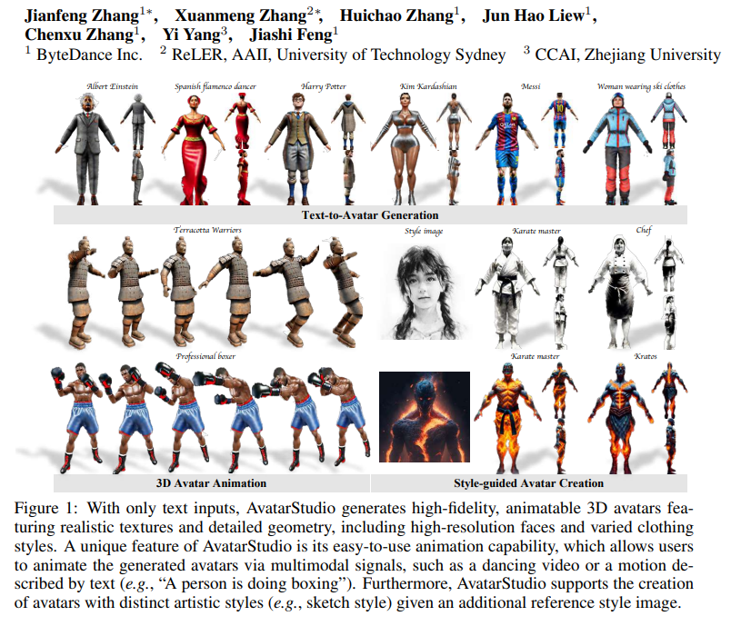
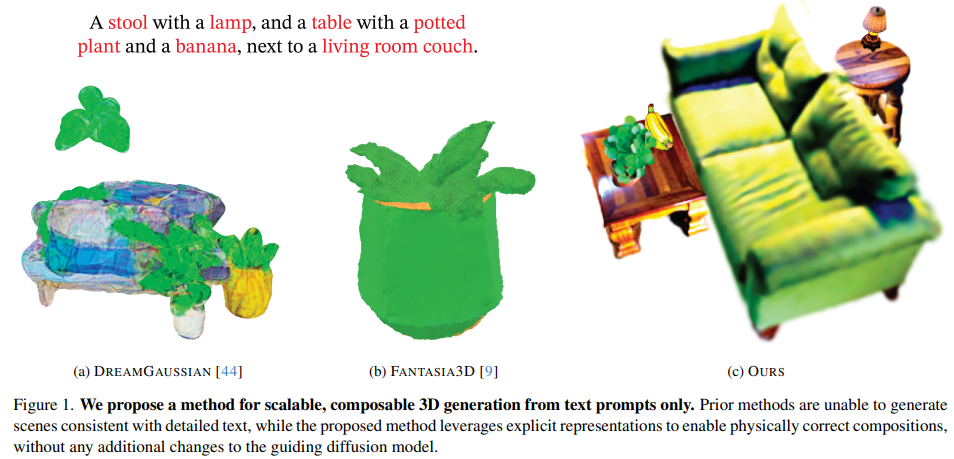
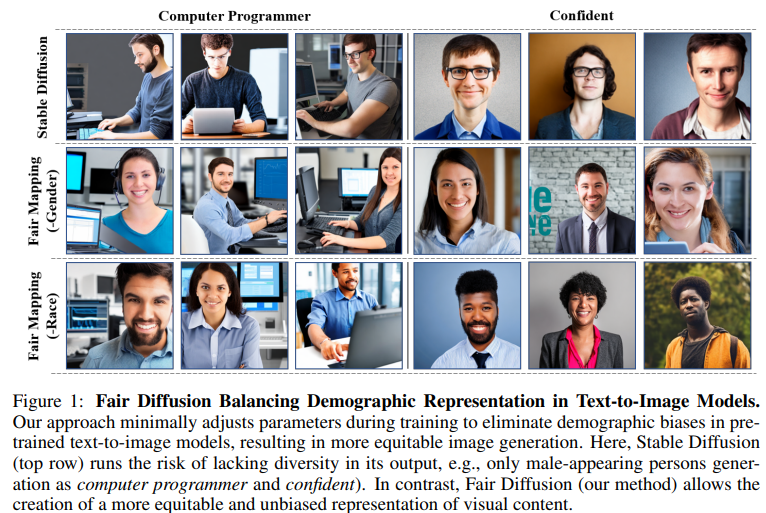
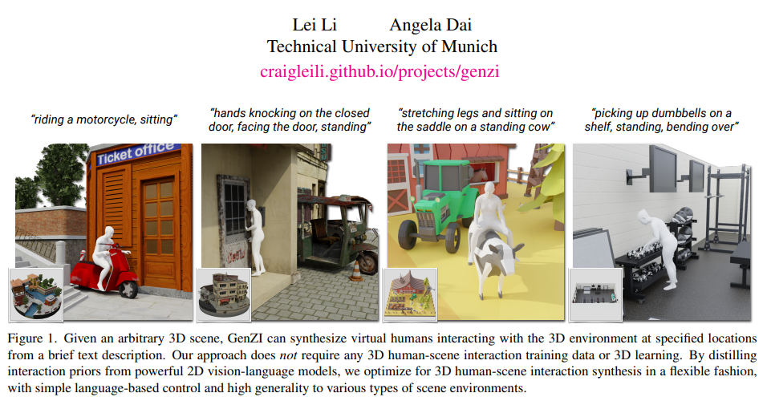
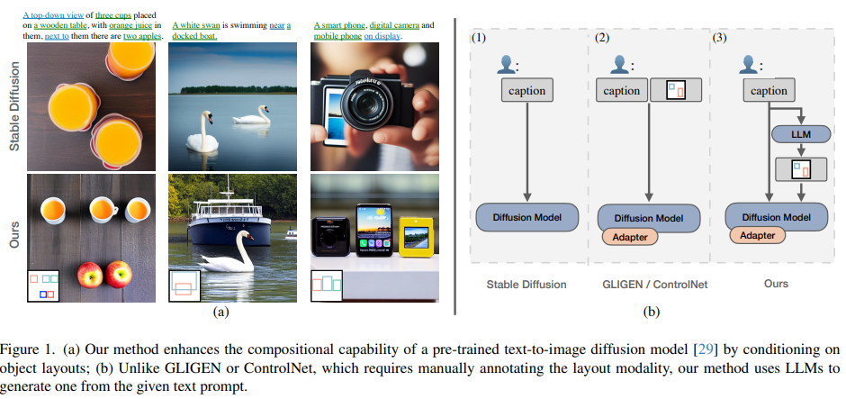
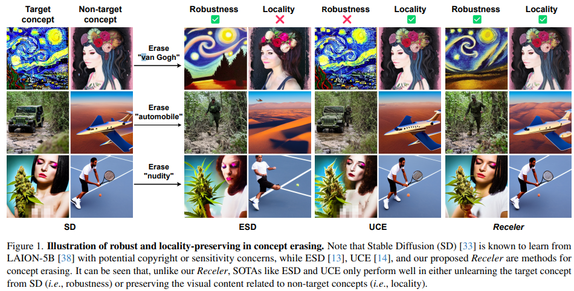
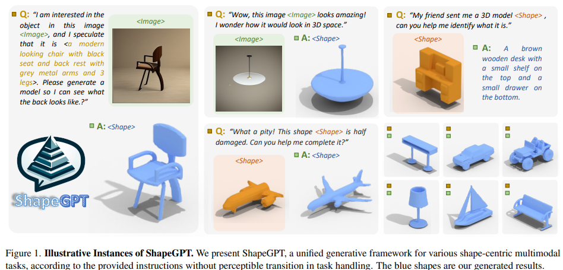
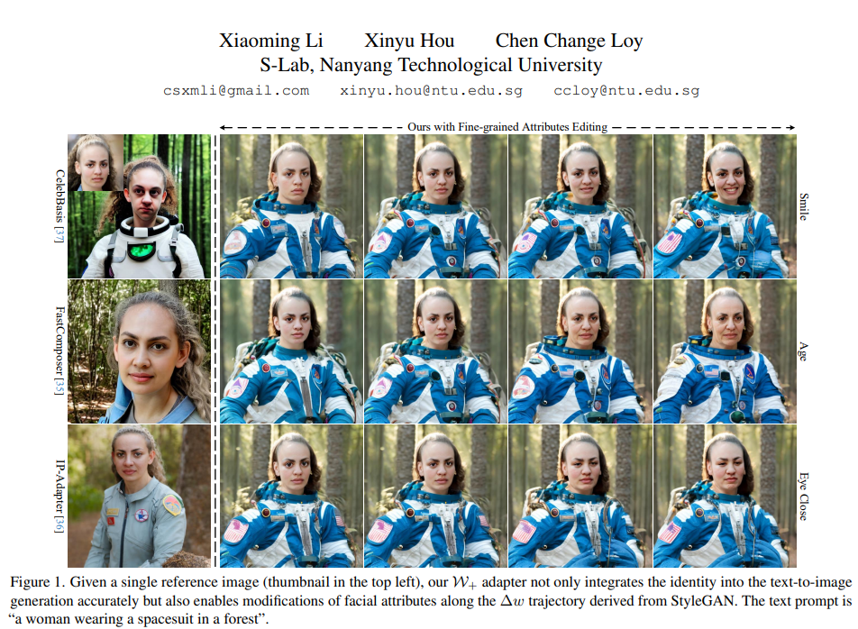

## AVATARSTUDIO: HIGH-FIDELITY AND ANIMATABLE 3D AVATAR CREATION FROM TEXT
#Avatar_3D

  

这篇论文的标题是“AvatarStudio: High-Fidelity and Animatable 3D Avatar Creation from Text”，是一篇关于**从文本生成高质量和可动画的三维人物形象**的论文。

- **研究背景**：三维人物形象的生成和动画是多个领域的重要应用，例如媒体、虚拟现实、游戏设计等。但是，传统的三维人物形象的创建需要预先捕捉模板和专业的艺术家的工作，非常耗时和费力。因此，一个能够从文本描述生成和动画化三维人物形象的系统是非常有价值的。
- **研究动机**：**现有的文本引导的三维人物形象的生成方法**要么**只能生成静态的形象**，**不能动画化**，要么**生成的形象质量不高，缺乏细节和姿态控制**。另一方面，现有的**文本引导的三维内容生成方法也不能很好地适用于人物形象的生成**，因为人物形象的复杂性和多样性。因此，这篇论文的目标是提出**一个新的框架，能够从文本生成高质量和可动画的三维人物形象**。
- **研究方法**：这篇论文提出了一个名为AvatarStudio的框架，它包含以下几个主要的组成部分：
    - **人物形象表示**：为了支持人物形象的动画和高分辨率的渲染，这篇论文采用了一个显式的网格表示，结合了SMPL模型的关节建模。具体来说，它首先用一个低分辨率的NeRF表示来粗略地生成人物形象，然后用一个DMTet表示来细化人物形象的几何和纹理。这样，它可以通过一个高效的光栅化渲染器来生成高质量的图像。
    - **文本引导的优化**：为了从文本输入优化人物形象表示，这篇论文利用了预训练的二维扩散模型作为先验。它使用了一种称为Score Distillation Sampling的技术，通过最小化预训练模型预测的噪声和添加的噪声之间的差异来计算人物形象表示的梯度。为了提高姿态控制和视角一致性，它使用了一个以DensePose为条件的ControlNet作为扩散模型的引导。
    - **辅助策略**：为了进一步提高生成质量和效率，这篇论文还采用了一些简单而有效的策略，例如部分感知的超分辨率、双空间训练和CFG重缩放。
- **贡献和创新点**：这篇论文的主要贡献和创新点有：
    - **提出了一个新的框架**，能够从文本生成高质量和可动画的三维人物形象，支持多种应用，例如多模态动画和风格引导的生成。
    - **提出了一个新的人物形象表示**，结合了显式的网格表示和SMPL模型的关节建模，能够支持人物形象的动画和高分辨率的渲染。
    - **提出了一个新的文本引导的优化方法**，利用了以DensePose为条件的ControlNet作为扩散模型的引导，能够提高姿态控制和视角一致性。
    - **提出了一些辅助策略**，例如部分感知的超分辨率、双空间训练和CFG重缩放，能够提高生成质量和效率。
- **相关工作**：这篇论文的相关工作主要包括以下几个方面：
    - **文本引导的三维内容生成**：这些工作利用了预训练的图像-文本模型或二维扩散模型来优化不同的三维表示，例如NeRF和网格。这些工作展示了文本引导的三维内容生成的潜力，但是在人物形象的生成方面还有很多局限性。
    - **文本引导的三维人物形象生成**：这些工作专注于从文本生成三维人物形象，一般使用人体参数化模型和二维扩散模型作为先验。这些工作实现了人物形象的动画，但是生成的质量不高，缺乏细节和姿态控制。
    - **人体参数化模型**：这些工作提出了不同的人体参数化模型，例如SMPL，能够表示人体的形状和姿态。这些模型为人物形象的生成提供了强大的几何先验，但是不能很好地捕捉人体的纹理和细节。

## CG3D: Compositional Generation for Text-to-3D via Gaussian Splatting
#Text23D
  

- **研究背景**：三维场景生成是一种用计算机创造虚拟的三维空间的技术，它可以用于电影、游戏、教育、设计等领域。用文本来生成三维场景是一种更自然和灵活的方式，可以让用户用语言来描述他们想要的场景，而不需要专业的绘图或建模技能。
- **研究动机**：目前的文本到三维场景生成的方法有很多**局限性**，比如**不能生成包含多个物体的复杂场景**，**不能用文本来控制物体之间的位置和大小**，**不能保证场景的物理真实性**等。这些局限性使得生成的场景往往不符合用户的期望，也不适合用于实际的应用。
- **研究方法**：这篇论文提出了一种新的方法，叫做**CG3D**，它可以**用文本来生成可编辑和可扩展的三维场景**。它的主要思路是用**一种叫做高斯投影的技术来表示三维场景**，它可以**用一些简单的参数来描述每个物体的形状、颜色、透明度等属性**，也可以**用一些变换矩阵来描述物体之间的旋转、平移、缩放等关系**。这样的表示方式可以让每个物体都是独立的，也可以方便地进行组合和编辑。这篇论文还利用了一种叫做扩散模型的技术来指导场景的生成，它可以用一个预训练的神经网络来评估场景和文本之间的匹配程度，从而优化场景的参数。此外，这篇论文还引入了一些物理约束，比如重力和接触力，来让场景更加真实和合理。
- **贡献和创新点**：这篇论文的主要贡献和创新点有以下几个：
    - 提出了一种**基于高斯投影的显式的三维场景表示方法**，可以**有效地支持多物体的组合和编辑，也可以提高渲染的速度和质量**。
    - 提出了一种**基于扩散模型的文本引导的场景生成方法，可以利用大规模的图像数据来提高场景的多样性和细节，也可以用文本来控制场景的语义和风格**。
    - 提出了一种**基于物理约束的场景优化方法，可以让场景更加符合物理规律，也可以避免一些不合理的场景配置**。
- **相关工作**：这篇论文的相关工作主要包括以下几个方面：
    - 三维场景表示：这方面的工作主要研究如何用一些可微分的函数或结构来表示三维场景，以便于用神经网络来学习和生成。比如，有一些工作用神经网络来直接输出场景中每个点的颜色和密度，这种方法叫做神经辐射场（NeRF）。还有一些工作用一些基本的几何元素，比如球、立方体、圆锥等，来组成场景，这种方法叫做神经图形元素（NGP）。这篇论文用的高斯投影方法是一种介于这两种方法之间的方法，它用一些简单的参数来描述每个物体，也可以用一些变换矩阵来描述物体之间的关系。
    - 文本到三维场景生成：这方面的工作主要研究如何用文本来指导三维场景的生成，以便于让用户用语言来创造他们想要的场景。比如，有一些工作用一种叫做CLIP的模型来评估场景和文本之间的相似度，从而优化场景的参数，这种方法叫做CLIP-forge或DreamField。还有一些工作用一种叫做扩散模型的模型来指导场景的生成，从而提高场景的质量和多样性，这种方法叫做DreamFusion或Fantasia3D。这篇论文用的扩散模型方法是一种改进的方法，它可以用文本来控制多物体的组合和编辑，也可以用物理约束来让场景更加真实和合理。
    - 多物体的组合和编辑：这方面的工作主要研究如何用一些规则或方法来组合和编辑多个物体，以便于生成更加复杂和多样的场景。比如，有一些工作用一种叫做场景图的结构来描述物体之间的关系，从而生成一些符合内部设计规则的房间布局。还有一些工作用一些预训练的图像生成模型来指导物体的组合和编辑，从而生成一些符合语义和风格的场景。这篇论文用的高斯投影方法是一种灵活的方法，它可以用文本来描述物体之间的关系，也可以用物理约束来调整物体之间的位置和大小。

## FAIR TEXT-TO-IMAGE DIFFUSION VIA FAIR MAPPING
#image_editing
  

- **研究背景**：文本到图像扩散是一种人工智能技术，它可以根据给定的文字描述生成相应的图片。比如，如果你输入“一个穿着白色衬衫的男人”，它就可以生成一个这样的图片。这种技术有很多应用，比如创作艺术作品，设计产品，或者制作视频。
- **研究动机**：但是，**文本到图像扩散也有一个问题，就是它可能会受到语言的偏见的影响，导致生成的图片不公平或者不准确**。比如，如果你输入“**一个电脑程序员**”，**它可能会生成一个男性的图片，而忽略了女性的可能性**。这是因为语言中存在一些隐含的偏见，比如把某些职业或者特征和性别或者种族联系起来。这种偏见会影响文本到图像扩散的质量和公平性，也会造成一些社会问题，比如歧视和不平等。
- **研究方法**：为了解决这个问题，这篇论文**提出了一种新的方法，叫做公平映射**。它的思想是，在文本到图像扩散的过程中，对输入的文字描述进行一些微小的调整，使得它不包含任何敏感的信息，比如性别或者种族。这样，生成的图片就不会受到语言偏见的影响，而是更加公平和多样化。具体来说，它使用了一个额外的线性映射网络，来把文字描述的特征向量转换成一个没有偏见的特征向量，然后再用这个特征向量去生成图片。这个线性映射网络只需要很少的参数，而且不会改变原来的文本到图像扩散的结构，所以它很容易实现和使用。
- **贡献和创新点**：这篇论文的主要贡献和创新点有以下几点：
    - 它是第一篇针对文本到图像扩散的公平性问题的研究，揭示了语言偏见在这个领域的影响和危害。
    - 它提出了一种简单而有效的方法，通过一个线性映射网络，来消除文字描述中的敏感信息，从而提高生成图片的公平性和多样性。
    - 它引入了一个新的评估指标，用来量化文本到图像扩散的公平性，以及一个新的检测器，用来判断输入的文字描述是否包含敏感信息。
    - 它在两个数据集上进行了广泛的实验，证明了它的方法可以显著提高文本到图像扩散的公平性，同时保持了图片的质量和与文字的一致性。
- **相关工作**：这篇论文的相关工作主要包括以下几个方面：
    - 文本到图像扩散的技术发展，包括一些最新的方法，比如结构化扩散，可组合扩散，和专家去噪等。
    - 公平性和偏见在生成模型中的研究，包括一些评估和缓解偏见的方法，比如公平感知的生成对抗网络，公平扩散，和人工干预等。
    - 偏见在语言模型中的研究，包括一些分析和消除偏见的方法，比如对比学习，因果推断，和词嵌入等。

## GenZI: Zero-Shot 3D Human-Scene Interaction Generatio
#human_scene
#Text23D
  

- **研究背景**：人与场景的交互是计算机视觉和图形学中一个重要而困难的任务，它需要对环境和人类行为有全面的语义理解。现有的方法都需要使用大量的真实场景和人类交互的数据来进行监督学习，但是这样的数据很难收集和标注，而且往往缺乏多样性和泛化性。
- **研究动机**：作者提出了一个新的问题：**能否在没有任何真实的人类场景交互数据的情况下，根据自然语言描述，生成逼真的三维人类场景交互？**
- **研究方法**：作者提出了一种新颖的零样本方法，称为**GenZI**，它利用了**最近的视觉语言模型（VLM）的强大能力，来生成可能的二维人类场景组合，然后通过一个鲁棒的优化过程，将这些二维假设提升到三维空间，得到一个与场景一致的三维人体模型**。具体来说，GenZI的方法包括以下几个步骤：
    - **多视角渲染**：给定一个三维场景，一个文本提示，和一个大致的交互位置，首先在场景中随机采样多个虚拟相机，从不同的角度渲染出场景的图像。
    - **动态遮罩修复**：利用一个基于潜在扩散模型的VLM，根据文本提示，在每个场景图像中自动插入一个人类，同时考虑场景的语义信息。为了避免手动指定插入区域，作者提出了一种动态遮罩方案，根据VLM的内部交叉注意力图，自动更新遮罩，使其与人类相关的文本标记对应。
    - **鲁棒的三维提升**：将多个视角的二维人类假设提升到三维空间，优化一个参数化的三维人体模型，使其与检测到的二维姿态一致。为了处理不同视角之间的不一致性，作者引入了一组可优化的权重，表示视角的一致性得分，让优化器自适应地关注最一致的视角，降低不一致的影响。
    - **迭代优化**：通过迭代地更新二维修复和三维提升的过程，进一步提高生成的三维人类场景交互的质量。
- **贡献和创新点**：作者的主要贡献和创新点有以下几点：
    -**提出了一个新的问题，即在没有任何真实的人类场景交互数据的情况下，根据自然语言描述，生成逼真的三维人类场景交互**。
    - 提出了一种新颖的零样本方法，利用了VLM的强大能力，来生成可能的二维人类场景组合，然后通过一个鲁棒的优化过程，将这些二维假设提升到三维空间，得到一个与场景一致的三维人体模型。
    - 提出了一种动态遮罩方案，根据VLM的内部交叉注意力图，自动更新遮罩，使其与人类相关的文本标记对应，避免了手动指定插入区域的困难。
    - 提出了一种鲁棒的三维提升过程，引入了一组可优化的权重，表示视角的一致性得分，让优化器自适应地关注最一致的视角，降低不一致的影响。
    - 提出了一种迭代优化的策略，通过迭代地更新二维修复和三维提升的过程，进一步提高生成的三维人类场景交互的质量。
- **相关工作**：作者的工作主要涉及以下几个方面的相关工作：
    - 三维人类场景交互合成：这是一个重要而困难的任务，现有的方法都需要使用大量的真实场景和人类交互的数据来进行监督学习，例如PiGraphs [35]，PLACE [43]，POSA [11]，COINS [45]等。这些方法都受限于数据的数量和多样性，难以泛化到不同的场景和行为。作者的工作不需要任何真实的人类场景交互数据，可以灵活地控制和生成多样的三维人类场景交互。
    - 从RGB图像估计三维人体：这是一个经典的问题，有很多的研究工作，例如SMPLify-X [26]，FrankMocap [47]等。这些方法都是从单个或多个RGB图像中估计三维人体的姿态和形状，但是没有考虑人体与场景的交互关系。作者的工作利用了多个视角的二维人类假设，提出了一种鲁棒的三维提升过程，使得生成的三维人体能够与场景一致地交互。
    - 从视觉语言模型中提取先验知识：最近的视觉语言模型，例如CLIP [29]，DALL-E [33]等，展示了强大的视觉语义理解和生成能力。一些工作尝试从这些模型中提取信息，来完成不同的任务，例如Text2Room [14]，Affordance Diffusion [41]等。作者的工作利用了视觉语言模型的二维生成能力，来生成可能的二维人类场景组合，然后通过一个鲁棒的优化过程，将这些二维假设提升到三维空间，得到一个与场景一致的三维人体模型。

## Reason out Your Layout: Evoking the Layout Master from Large Language Models for Text-to-Image Synthesis
#layout_guidance
  

**研究背景**

- 文本到图像合成（T2I）是一种根据文本描述生成图像的技术，它可以用于创造多样化和富有想象力的视觉内容。
- 近年来，基于扩散模型的T2I技术取得了显著的进展，它们通过逐步去噪的过程，从随机噪声生成高质量的图像。
- 然而，这些技术**在处理复杂的文本描述时仍然面临挑战，尤其是在表达多个对象之间的空间关系方面，它们往往无法准确地组合这些元素**。
- 为了提高T2I技术的组合能力，**一种常见的策略是利用人工标注的对象位置作为模型的输入**，从而避免模型自己推断布局。但这种方法**需要人工干预，并且不能充分利用空间信息**。

**研究动机**

- 为了减少人工干预，本文提出了一种新的方法，**利用大型语言模型（LLM）作为布局生成器，从文本描述中自动生成对象布局**。
- LLM是一种基于Transformer的深度神经网络，它们在大规模的文本数据上进行预训练，具有强大的自然语言理解和生成能力。
- 本文利用链式思维（CoT）提示的方法，激发LLM的推理能力，生成合理的对象布局。CoT提示是一种通过指令或示例引导LLM按照逻辑步骤进行推理的方法，它可以提高LLM在复杂任务上的表现。
- 本文还提出了一种有效的适配器，通过交叉注意力机制，将LLM生成的布局信息融合到扩散模型中，从而提高生成图像的组合和空间准确性。

**研究方法**

- 本文的研究方法分为两个部分：LLM作为布局生成器和扩散模型与布局条件。
- LLM作为布局生成器的部分，主要包括以下步骤：
    - 定义清晰和全面的任务指示，要求LLM从文本描述中识别可视化的对象，解决歧义，理解空间关系，提供对象的边界框坐标。
    - 提供带有CoT推理的上下文示例，帮助LLM学习如何分解问题，进行空间推理，生成合理的布局。
    - 给定一个文本描述，使用LLM生成一个对象布局，包括每个对象的名称和边界框坐标。
- 扩散模型与布局条件的部分，主要包括以下步骤：
    - 基于稳定扩散模型，设计一个交叉注意力适配器，将LLM生成的布局信息注入到扩散模型的去噪网络中。
    - 利用分类器自由引导的方法，调节文本和布局信息的权重，平衡语义和空间的影响。
    - 在生成过程中，先使用适配器引入布局信息，后使用原始的去噪网络生成图像。

**贡献和创新点**

- 本文的主要贡献和创新点有以下几点：
    - 本文首次探索了利用LLM作为布局生成器的可能性，展示了LLM在理解和生成复杂的视觉布局方面的潜力。
    - 本文提出了一种利用CoT提示提高LLM布局生成能力的方法，通过设计合理的推理步骤，使LLM能够生成更细致和准确的布局。
    - 本文提出了一种有效的适配器，将LLM生成的布局信息显式地融合到扩散模型中，提高了生成图像的组合和空间准确性。
    - 本文在两个公开的数据集上进行了实验，证明了本文方法在图像质量和布局准确性方面的优势，展示了LLM在增强生成图像模型方面的潜力。

**相关工作**

- 本文的相关工作主要涉及以下几个方面：
    - 文本到图像生成：这是一个多模态学习的重要方向，近年来取得了很大的进展，尤其是基于扩散模型的方法，它们通过迭代细化的过程和稳定的训练，生成高质量的图像。
    - 布局感知的文本到图像生成：这是一种提高T2I技术组合能力的常见策略，它们通过利用人工标注的对象位置作为模型的输入，从而避免模型自己推断布局。但这种方法需要人工干预，并且不能充分利用空间信息。
    - 链式思维提示：这是一种利用LLM进行复杂推理的方法，它通过使用简单的指令或示例，引导LLM按照逻辑步骤进行推理，从而提高LLM在复杂任务上的表现。

## Receler: Reliable Concept Erasing of Text-to-Image Diffusion Models via Lightweight Erasers
#image_editing
  

- **研究背景**：图像生成是指根据一些输入条件（例如文字描述）来合成一张图片的技术。目前，一种流行的图像生成方法是基于扩散模型的，它可以生成高质量和多样性的图片。扩散模型是一种从噪声图像逐步恢复出清晰图像的过程，它需要一个大型的神经网络来预测每一步的噪声分布。**扩散模型通常是用大量的网络图片来训练的，这可能导致它们记住了一些不合适或不想要的内容，例如暴力、色情、侵权等。因此，如何从扩散模型中擦除特定的概念，使它们不再生成与这些概念相关的图片，是一个重要的研究问题**。
- **研究动机**：擦除概念的目的是为了保护用户的安全和隐私，以及避免法律风险和道德争议。擦除概念的难点在于，一方面，**要保证擦除的效果，即不管输入的文字描述如何变化，都不能生成与擦除概念相关的图片**；另一方面，**要保证擦除的局部性，即不影响其他无关概念的图像生成能力**。目前，已有一些方法尝试从扩散模型中擦除概念，但它们要么需要修改大量的模型参数，导致模型能力下降，要么只能针对特定的文字描述，而不能抵抗变换或替换的文字描述。因此，如何设计一个既有效又高效的概念擦除方法，是本文的主要动机。
- **研究方法**：本文提出了一种名为Receler的概念擦除方法，它的核心思想是使用一个轻量级的擦除器（Eraser）来从扩散模型中移除目标概念。擦除器是一个小型的神经网络，**它的作用是修改扩散模型中的跨注意力层（cross-attention layer）的输出，这些层是负责将文字描述融合到图像特征中的**。擦除器的训练目标是使扩散模型生成的图片的概率分布与目标概念无关，即使输入的文字描述包含或暗示目标概念。为了保证擦除的局部性，本文还引入了一个概念定位正则化（concept-localized regularization）的方法，它的作用是约束擦除器只修改与目标概念相关的图像区域，而不影响其他区域。为了保证擦除的效果，本文还采用了一个对抗提示学习（adversarial prompt learning）的方法，它的作用是生成一些能够诱导扩散模型生成目标概念图片的文字描述，然后用这些描述来训练擦除器，使其能够抵抗这些攻击。
- **贡献和创新点**：本文的主要贡献和创新点有以下几点：
    - 提出了一种轻量级的擦除器，它只修改扩散模型中的跨注意力层的输出，而不改变其他层的参数，从而保证了擦除的高效性和局部性。
    - 提出了一种概念定位正则化的方法，它利用目标概念的空间信息来约束擦除器的输出，从而保证了擦除的精确性和自然性。
    - 提出了一种对抗提示学习的方法，它利用一个连续的软提示（soft prompt）来生成能够恢复目标概念的文字描述，从而保证了擦除的鲁棒性和完整性。
- **相关工作**：本文的相关工作主要包括以下几个方面：
    - 从扩散模型中擦除概念的方法，例如Ablating [22]，ESD [13]，Forget-Me-Not [47]，和UCE [14]，它们分别使用不同的策略来修改扩散模型的参数或输出，以达到擦除的目的。
    - 控制扩散模型的方法，例如PEFT [12, 23, 28, 34, 46, 48, 49]，它们使用少量的参数或模块来让扩散模型学习新的概念或条件，以达到控制的目的。
    - 对抗攻击和训练的方法，例如FGSM [11]，P4D [9]，和adversarial training [3, 15, 26]，它们分别使用不同的技术来生成能够欺骗模型的输入或输出，或者让模型能够识别和防御这些攻击。

## ShapeGPT: 3D Shape Generation with A Unified Multi-modal Language Model
#Text23D

  

- **研究背景**：人工智能领域有很多大型的语言模型，它们可以理解和生成自然语言，也可以处理其他的数据类型，比如图像、音频、视频等。但是，**对于三维形状这种数据，目前还没有一个统一的语言模型，能够同时处理形状和其他模态的数据，也没有一个能够根据语言指令来生成和编辑形状的模型。**形状是一种很重要的数据类型，它可以用于虚拟建造、游戏、网络辅助设计、三维打印等领域。
- **研究动机**：作者的动机是想要**设计一个多模态的语言模型**，**能够理解和生成三维形状和其他模态的数据，比如文本、图像**等。并且，这个**模型可以根据语言指令来执行多种形状相关的任务，比如形状生成、形状描述、形状推理、形状编辑等。这样的模型可以提高形状数据的处理能力和灵活性，也可以为多个领域带来创新和变革。**
- **研究方法**：作者提出了一个叫做**ShapeGPT**的模型，它包括两个部分：**多模态语料库构建**和**形状感知的多模态语言模型**。**多模态语料库构建的目的是把原始的形状、文本、图像等数据转换成离散的语言符号，方便语言模型的处理**。**形状感知的多模态语言模型的目的是利用预训练的语言模型来学习不同模态之间的关系和语法，以及根据语言指令来生成和编辑形状。作者采用了一个三阶段的训练策略，分别是形状表示、多模态对齐和指令驱动的生成，来逐步提高模型的性能和泛化能力。**
- **贡献和创新点**：作者的主要贡献和创新点有以下几点：
    - 提出了一个统一的形状语言生成预训练模型，可以处理多模态的条件输入，把自然语言模型引入到形状相关的生成中，用一个模型来完成多种形状任务。
    - 提出了一个形状感知的多模态训练方案，利用语言指令来学习任务反馈，通过提示来生成有意义的结果。
    - 提出了一个通用的形状基准测试，用于多任务评估，在多个形状相关的任务上，比如图像到形状、文本到形状、形状到文本、形状完成、形状编辑等，都达到了竞争性的性能，并且提供了所有的代码和数据。
- **相关工作**：作者的工作主要涉及到以下几个方面的相关工作：
    - 三维形状生成和表示：这方面的工作主要是利用不同的形状表示方法，比如点云、体素、网格、SDF、隐函数等，来生成多样化和高质量的三维形状，也有一些工作是利用多模态的输入条件，比如文本、图像、类别、点云等，来生成形状。作者的工作与这些工作的不同之处在于，他们使用了一个统一的语言模型来处理形状和其他模态的数据，而不是针对每个任务设计一个单独的模型。
    - 语言模型和多模态：这方面的工作主要是利用大型的预训练的语言模型，来理解和生成自然语言，也有一些工作是把语言模型扩展到其他的数据类型，比如图像、音频、视频等，来实现多模态的学习和生成。作者的工作与这些工作的不同之处在于，他们把三维形状这种数据类型也纳入到了语言模型的范畴，而且可以根据语言指令来生成和编辑形状，这是目前还没有被探索的领域。
    - 形状语言预训练：这方面的工作主要是利用文本描述来生成形状，或者利用形状来生成文本描述，也有一些工作是利用预训练的图像文本模型来作为条件编码器，来提高形状生成的效果。作者的工作与这些工作的不同之处在于，他们不仅仅是利用文本作为条件，而是利用语言模型来理解和生成多种模态的数据，而且可以根据不同的语言指令来执行不同的形状任务，而不是只能做单向的模态转换。

## When StyleGAN Meets Stable Diffusion: a W+ Adapter for Personalized Image Generation
#Customization
  

- **研究背景**：文本到图像（T2I）是一种用自然语言描述来生成图像的技术。它有很多有趣的应用，比如创造自己的故事或角色。但是，现有的T2I方法往往不能很好地保持目标人物的身份特征，或者不能灵活地编辑人脸的细节，比如表情、年龄等。这些问题主要是因为T2I方法使用的文本嵌入空间（text embedding space）不能很好地区分身份相关和无关的信息，也不能很好地利用人脸的语义信息。
- **研究动机**：为了解决这些问题，作者提出了一种新的方法，将StyleGAN的W+空间嵌入到T2I的扩散模型中。StyleGAN是一种生成对抗网络（GAN），可以生成高质量的人脸图像。它的W+空间是一种中间的潜在空间（latent space），可以用来控制和编辑图像的各种属性，比如笑容、年龄、眼睛等。作者认为，如果能够将W+空间和T2I模型结合起来，就可以实现更好的身份保持和细节编辑。
- **研究方法**：作者的方法分为两个阶段。第一阶段是将W+空间和T2I的扩散模型对齐（align）。为了做到这一点，作者训练了一个映射网络（mapping network），可以将一个W+向量（w+ vector）投影到T2I模型的潜在空间中，作为一个额外的身份条件（identity condition）。作者还引入了一个残差交叉注意力模块（residual cross-attention module），可以将w+向量和文本条件（text condition）融合起来，影响扩散模型的去噪过程（denoising process）。第二阶段是在更复杂的场景下生成图像（generation in the wild）。为了做到这一点，作者在第一阶段的基础上，进一步微调（fine-tune）残差交叉注意力模块的权重，使得w+向量只影响人脸区域，而不影响背景区域。作者还提出了一些正则化损失函数（regularization loss functions），来保证图像的语义一致性和多样性。
- **贡献和创新点**：作者的方法有以下几个贡献和创新点：
    - 这是第一次将StyleGAN的W+空间嵌入到T2I的扩散模型中，实现了更好的身份保持和细节编辑。
    - 作者提出了一个新的残差交叉注意力模块，可以有效地平衡文本条件和身份条件的影响，避免了性能下降或过拟合的问题。
    - 作者提出了一些新的正则化损失函数，可以实现人脸属性的有效解耦和背景的不变性，保证了图像的语义一致性和多样性。
- **相关工作**：作者的方法主要涉及到以下几个方面的相关工作：
    - StyleGAN潜在空间：StyleGAN潜在空间是一种具有强大语义编辑能力的人脸潜在空间，有很多研究探索了它的解释性和控制方向，以及如何将真实图像反向投影到它的空间中。
    - 个性化图像生成：个性化图像生成是一种将特定的视觉概念或身份嵌入到生成的图像中的技术，有很多研究使用不同的方法来实现这一目标，比如优化、微调、编码器等。
    - 扩散模型适配器：扩散模型适配器是一种轻量级的模块，可以避免对大型模型的繁琐微调，同时增加额外的控制条件，有很多研究使用不同的适配器来实现不同的任务，比如结构和颜色控制、多概念融合等。

