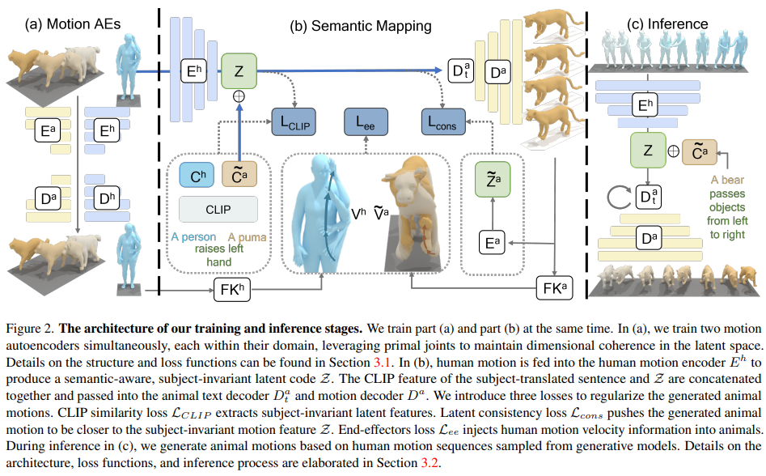
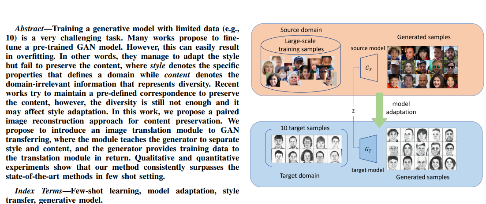
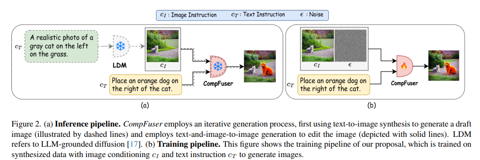
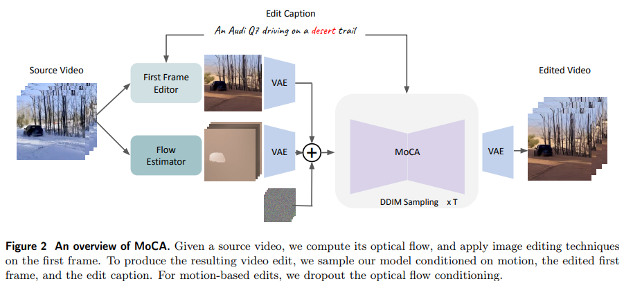

## OmniMotionGPT: Animal Motion Generation with Limited Data

  

- **研究背景**：这篇论文的研究背景是计算机模拟三维动物运动的问题。**三维动物运动**是一个有很多应用的领域，比如机器人、虚拟现实、游戏和影视等。传统的方法是需要人工制作动画或者使用昂贵的动作捕捉设备，这些方法都需要很多的时间和技能。近年来，有一些方法**利用自然语言文本来生成三维人体运动**，这些方法可以提高动画的效率和可用性。但是，**这些方法很难直接应用到其他种类的动物上，因为动物的运动数据很少，而且动物的骨架结构和运动模式和人类不同**。
- **研究动机**：这篇论文的研究动机是**利用人类的运动数据来丰富和辅助动物的运动生成，从而实现从文本描述生成多样化和逼真的三维动物运动的目标**。作者认为，**人类的运动数据包含了很多的先验知识和语义信息**，可以**帮助理解和生成动物的运动**。作者希望能够**设计一个模型，可以在有限的动物运动数据的基础上，通过从人类运动数据中提取和转换特征，来生成符合文本描述的动物运动**。
- **研究方法**：这篇论文的研究方法是基于变换器（Transformer）的模型，它分为两个部分：**一个是分别训练人类和动物的运动自编码器**，**另一个是训练一个知识转换机制**，**将人类的运动特征映射到动物的运动特征**。运动自编码器的作用是将运动数据编码成一个潜在的特征向量，同时考虑骨架的静态和动态信息，以及文本的语义信息。知识转换机制的作用是将人类的运动特征和修改后的文本特征（将主语换成动物的名字）作为输入，生成一个新的动物运动特征，然后通过动物的运动解码器生成动物的运动数据。作者设计了三个损失函数来约束训练过程，分别是潜在一致性损失、CLIP相似性损失和末端执行器损失。潜在一致性损失是为了保证人类和动物的运动特征在潜在空间中的相似性，CLIP相似性损失是为了保证人类和动物的运动特征和文本特征在语义空间中的相似性，末端执行器损失是为了保证人类和动物的运动在速度上的一致性。
- **贡献和创新点**：这篇论文的贡献和创新点有以下几点：
    - 这是第一个从文本描述生成三维动物运动的算法，它可以处理多种动物的骨架结构和运动模式，也可以处理一些超出动物数据分布的复杂文本描述。
    - 这是第一个利用人类的运动数据来辅助动物的运动生成的方法，它通过设计一个变换器模型，实现了人类和动物的运动特征之间的语义映射，从而提高了动物运动的多样性和逼真度。
    - 这是第一个提出动物语言-运动数据集的工作，它基于现有的动物运动网格数据集，生成了骨架运动数据，并且为每个运动序列标注了三个人工编写的文本描述，共有1240个运动序列和3720个文本描述。这个数据集可以为动物运动生成的研究提供一个新的平台和基准。
- **相关工作**：这篇论文的相关工作主要包括以下几个方面：
    - 动物运动表示：有一些模型用于表示动物的运动，比如LASSIE [57]，SMAL [64]，和LASR [54–56]。这些模型都是基于人体运动表示SMPL [30]的扩展或改进，适用于不同种类的动物。本文使用SMAL作为核心的运动表示，因为它有明确的骨架结构和每个关节的语义含义，而且和人体运动表示SMPL兼容，便于知识转换。
    - 人体运动合成：人体运动合成的目的是生成多样化和自然的三维人体运动。有一些研究关注基于已有的运动帧来生成运动，比如预测未来的运动 [4, 7, 10, 17, 33, 51]，运动插值 [9, 15, 16, 41]，和运动生成 [26]。有一些研究利用多模态的输入作为条件信号来生成运动，比如动作标签 [12, 35, 49]，音乐和音频 [19, 24, 44]，场景几何 [48, 50]，物体交互 [23]，和文本 [13, 14, 20, 42, 61]。尽管人体运动合成的研究很多，但是是否可以将这些方法迁移到其他骨架结构，比如动物，还是一个开放的问题，主要受到数据集规模的限制。
    - 文本驱动的人体运动生成：随着预训练语言模型的发展，文本驱动的人体运动生成成为了一个重要的条件运动生成任务。它的目标是根据给定的文本描述，生成逼真和多样的三维人体运动序列。MotionCLIP [42]使用自编码器结构来学习语言和姿态的联合嵌入，从而生成动画。¹[1]TEMOS [36]和T2M [13]利用变分自编码器（VAE）结构将文本映射到一个正态分布的潜在空间。后续的工作TM2T [14]，MotionGPT [20]，和T2MGPT [60]学习将运动序列编码成离散的、量化的文本/运动标记，然后通过一个自回归的过程来生成。²[2]另一条研究方向是使用扩散模型 [18]，并以文本嵌入作为条件。MDM [43]和MotionDiffuse[61]将扩散模型应用到文本-运动数据集上，通过一个变换器结构。³[3]ReMoDiffuse [62]进一步集成了一个检索机制来

## Few-shot Image Generation via Style Adaptation and Content Preservation

  

这篇论文的主要内容是：

- **研究背景**：生成对抗网络（GAN）是一种可以用来生成逼真的图像的技术，但是它需要大量的数据和时间来训练。**如果我们只有很少的数据（比如10张图片），我们想要用GAN来生成新的图像，这就是一个非常困难的任务。**
- **研究动机**：为了解决这个问题，**一些方法提出了用一个预训练的GAN模型来适应目标域（目标域是我们想要生成的图像的类型）**。但是，这样做容易导致**过拟合（过拟合是指模型只能生成和训练数据很相似的图像，而不能生成多样的图像）**。因此，我们需要找到一种方法，既能适应目标域的风格（风格是指图像的特征，比如颜色，纹理，形状等），又能保留源域的内容（内容是指图像的信息，比如表情，姿势，细节等）。
- **研究方法**：我们提出了一种**基于成对图像重建的方法来保留内容**。我们的方法包括一个**目标生成器（GT）**，**一个翻译模块（F）**和**一个判别器（D）**。目标生成器是用来生成目标域的图像的，翻译模块是用来分离图像的风格和内容的，判别器是用来判断图像是否属于目标域的。我们的方法的流程是这样的：**首先，我们用一个随机的编码（z）来让目标生成器和一个预训练的源生成器（GS）分别生成一对图像（x和y）**，这两个图像应该有相同的内容但不同的风格。然后，我们**用翻译模块来交换这两个图像的风格和内容，得到两个重建的图像（x'和y'）**。最后，**我们用重建损失（Lrec）来让重建的图像和原始的图像尽可能相似，这样就可以鼓励目标生成器保留内容**。同时，**我们也用对抗损失（Ladv）来让判别器来判断目标生成器生成的图像是否符合目标域的风格，这样就可以鼓励目标生成器适应风格。**
- **贡献和创新点**：我们的方法的主要贡献和创新点是提出了一种新的内容保留方法，它可以利用翻译模块来动态地平衡风格适应和内容保留，而不需要任何先验的对应关系。我们的方法可以在极少的数据下生成高质量和多样性的图像，并且在多种源域和目标域的转换中都表现出优越的性能。
- **相关工作**：我们的方法主要涉及到两个方面的相关工作：少样本图像生成和图像到图像的翻译。少样本图像生成的目的是用很少的数据来生成新的图像，一种常见的方法是用一个预训练的GAN模型来适应目标域，但是这种方法容易过拟合。为了解决这个问题，一些方法提出了用一些对应关系来约束转换过程，比如跨域对应（CDC）和松弛的空间结构对齐（RSSA）。这些方法可以生成多样和逼真的图像，但是它们的对应关系是预先定义的，可能不适合所有的转换情况。图像到图像的翻译的目的是把一个域的图像转换成另一个域的图像，一种常见的方法是用一个翻译模块来分离图像的风格和内容，但是这种方法需要大量的数据来训练，而且需要有标签的数据来区分不同的类别，这在我们的情况下是不可行的。我们的方法结合了少样本图像生成和图像到图像的翻译的思想，用一个翻译模块来辅助GAN的适应过程，而不需要任何先验的知识。

## Unlocking Spatial Comprehension in Text-to-Image Diffusion Models
#layout_guidance
#spatial_diffusion
  

- **研究背景**：这篇论文的研究背景是文本到图像的生成模型，也就是根据一段文字描述，生成一张对应的图片。这种模型有很多潜在的应用，比如创作艺术作品和图形设计。但是，**现有的模型在理解和执行复杂的文字指令时，还面临着很大的挑战，特别是涉及到多个物体之间的空间关系和属性分配，比如“一张图片里有一只灰色的猫在一只橘色的狗的左边”**。
- **研究动机**：这篇论文的研究动机是提出一个**新的图像生成流程，能够增强文本到图像生成模型的空间理解和属性分配能力**。这个流程**能够解释指令中定义的物体之间的空间关系，比如“左边”、“右边”等，并且生成相应的图片。这对于给用户提供更多的控制和创造力是非常重要的**。
- **研究方法**：这篇论文的研究方法是基于一种叫做扩散模型的图像生成模型，它可以通过一个迭代的过程，从噪声中重建出清晰的图片。作者提出了一个叫做CompFuser的流程，**它分为两个步骤：第一步，根据文字指令，生成一张只包含一个物体的图片；第二步，根据文字指令，编辑图片，把另一个物体放在指定的位置。为了实现第二步，作者利用了一个大型的语言模型和一个基于布局的扩散模型，来合成一个用于空间理解和属性分配的数据集，然后在这个数据集上微调一个图像编辑模型，让它能够根据文字指令，把一个物体插入到已有的场景中。**
- **贡献和创新点**：这篇论文的贡献和创新点有以下几个方面：第一，它提出了一个迭代的生成过程，显著提高了文本到图像生成模型的空间理解和属性分配能力，生成了更符合语境和视觉的图片；第二，它创造了一个用于空间理解和属性分配的多模态数据集，利用了预训练的语言模型和布局模型，生成了具有详细的物体位置和属性的图片对和编辑指令；第三，它在这个数据集上适应了一个图像编辑模型，使其能够仅用文字指令就能够在一个场景中添加新的物体；第四，它在空间理解和属性分配的任务上，与强基线模型进行了对比，显示了其优越的性能，尽管它的参数数量比其他模型少很多。
- **相关工作**：这篇论文的相关工作主要包括以下几个方面：第一，基于扩散模型的文本到图像生成模型，它们可以根据文字描述生成逼真的图片，但是在理解复杂的指令时还有不足；第二，基于扩散模型的图像编辑模型，它们可以根据文字或者遮罩来修改图片的一部分，但是在处理空间关系和添加新物体时还有困难；第三，基于语言模型和布局模型的图像生成模型，它们可以利用预训练的模型来生成具有结构和语义的图片，但是它们的图片质量还有待提高。

## Motion-Conditioned Image Animation for Video Editing

  

- **研究背景**：视频编辑是一种可以改变视频的内容和风格的技术，比如可以把视频中的一只狮子换成斑马，或者让视频看起来像油画一样。视频编辑有很多应用，比如可以用来创造新的艺术作品，或者用来制作教育和娱乐的视频。但是视频编辑也是一项非常困难的任务，因为视频不仅包含了空间上的信息，也包含了时间上的信息。也就是说，视频编辑不仅要考虑每一帧图像的变化，还要考虑视频中的运动和连贯性。目前已经有很多方法可以用来做视频编辑，但是它们都有各自的优缺点，而且没有一个方法可以适用于所有类型的视频编辑。
- **研究动机**：作者的动机是想提出一种简单而强大的视频编辑方法，可以用来做各种各样的视频编辑，比如改变视频的风格，替换视频中的物体，或者改变视频中的运动。作者的想法是把视频编辑的问题分解成两个部分：图像编辑和图像动画。图像编辑是指对视频的第一帧图像进行修改，比如用文字描述来改变图像的内容和风格。图像动画是指根据视频的第一帧图像和视频的运动信息，来生成后面的帧图像，使得视频看起来流畅和自然。作者认为，这种分解的方法可以利用已经存在的图像编辑和图像动画的技术，来实现更好的视频编辑效果。
- **研究方法**：作者的方法叫做MoCA，是Motion-Conditioned Image Animation的缩写。MoCA的核心是一个基于潜在扩散模型的视频生成模型，可以根据文字，图像和运动的信息，来生成视频。潜在扩散模型是一种可以从噪声中逐步生成清晰图像的模型，可以用来做图像和视频的生成和编辑。MoCA的视频生成模型是在一个已经预训练好的图像生成模型的基础上，加入了时间维度和额外的条件信息，来适应视频的生成任务。MoCA的视频生成模型的输入有三个：文字，图像和运动。文字是用来描述视频的内容和风格的，比如“一只熊猫在一堆彩色丝带中玩耍”。图像是视频的第一帧图像，可以用已有的图像编辑方法来修改，比如用文字来改变图像的物体或者风格。运动是视频的运动信息，可以用光流的方法来估计，光流是一种可以表示图像中像素的运动方向和速度的方法。MoCA的视频生成模型的输出是一个视频，可以根据输入的文字，图像和运动，来生成符合要求的视频。MoCA的视频生成模型的训练是在一个内部的视频文本数据集上进行的，数据集包含了3400万对视频和文字的样本。MoCA的视频生成模型的推理是用一种叫做DDIM的采样方法进行的，可以从噪声中逐步生成清晰的视频。MoCA的视频生成模型还可以用一种叫做无分类器引导的方法来控制视频的质量和一致性，这种方法可以让视频更接近输入的条件信息，而不是随机的噪声。
- **贡献和创新点**：作者的贡献和创新点有以下几个方面：
    - 提出了一种简单而强大的视频编辑方法，可以用来做各种各样的视频编辑，比如改变视频的风格，替换视频中的物体，或者改变视频中的运动。
    - 把视频编辑的问题分解成图像编辑和图像动画两个部分，可以利用已经存在的图像编辑和图像动画的技术，来实现更好的视频编辑效果。
    - 提出了一种基于潜在扩散模型的视频生成模型，可以根据文字，图像和运动的信息，来生成视频。这种模型可以保留视频的空间和时间的特征，也可以根据不同的条件信息，来生成不同的视频。
    - 提出了一种无分类器引导的方法，可以控制视频的质量和一致性，让视频更接近输入的条件信息，而不是随机的噪声。
- **相关工作**：作者的工作主要涉及到以下几个方面的相关工作：
    - 基于文本的图像编辑：这方面的工作主要是用文字来描述图像的内容和风格，然后用一些模型来修改图像，比如用潜在扩散模型，或者用一些额外的条件信息，比如深度图或者轮廓图。
    - 基于文本的视频编辑：这方面的工作主要是用文字来描述视频的内容和风格，然后用一些模型来修改视频，比如用潜在扩散模型，或者用一些额外的条件信息，比如光流或者运动向量。
    - 图像动画：这方面的工作主要是用一个图像作为输入，然后用一些模型来生成一个视频，比如用潜在扩散模型，或者用一些额外的条件信息，比如运动或者音频。
