#! https://zhuanlan.zhihu.com/p/670401984
---
id: 1nyrrtudrzakbho4pbsbe9f
title: '20231204'
desc: ''
updated: 1701706713365
created: 1701698525797
---

## Adversarial Score Distillation: When score distillation meets GAN

#SDS改进

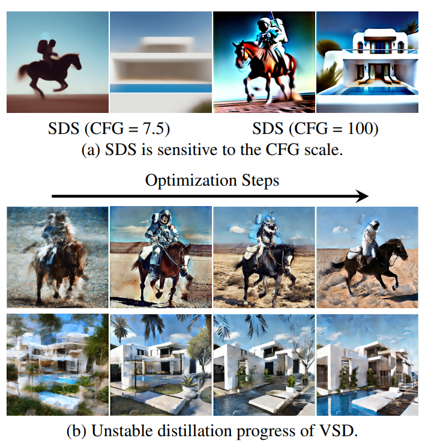  

- **研究背景**：这篇论文主要研究的是一种叫做**score distillation**的技术，它可以利用一个已经训练好的**diffusion model**来生成不同的图像或者三维模型，而不需要使用任何额外的数据。**diffusion model**是一种可以生成高质量图像的人工智能模型，它的原理是先把一张图像加上很多噪声，然后逐步去除噪声，直到恢复原始图像。**score distillation**的原理是先用一个**generator**生成一个初始的图像或者三维模型，然后用**diffusion model**给它加上噪声，然后根据一个给定的文本描述，用**diffusion model**预测应该去除多少噪声，从而使得生成的图像或者三维模型更符合文本描述。
- **研究动机**：这篇论文的研究动机是解决现有的**score distillation**方法存在的一些问题，比如对于**classifier-free guidance (CFG)**的敏感性，以及生成过程的不稳定性。**classifier-free guidance (CFG)**是一种用来提高**score distillation**效果的技巧，它的原理是在**diffusion model**预测的噪声上加上一个与文本描述相关的偏移量，从而使得生成的图像或者三维模型更接近文本描述。但是，这个偏移量的大小（也就是**CFG scale**）很难选择，如果太小，生成的结果会过于平滑，如果太大，生成的结果会过于饱和。另外，现有的**score distillation**方法在生成过程中，会出现生成的图像或者三维模型的内容或者结构发生剧烈变化的现象，这会导致生成的结果出现一些不自然的瑕疵。
- **研究方法**：这篇论文的研究方法是基于**Wasserstein Generative Adversarial Network (WGAN)**的框架，提出了一种新的**score distillation**方法，叫做**Adversarial Score Distillation (ASD)**。**WGAN**是一种可以生成高质量图像的人工智能模型，它的原理是训练一个**discriminator**和一个**generator**，让**discriminator**尽量区分真实的图像和生成的图像，让**generator**尽量生成能够欺骗**discriminator**的图像。这篇论文发现，现有的**score distillation**方法其实可以看作是一种特殊的**WGAN**，其中**generator**就是**score distillation**中的**generator**，而**discriminator**就是用**diffusion model**和文本描述构造的一个隐含的**classifier**。但是，现有的**score distillation**方法没有充分利用**WGAN**的优势，它们要么使用了一个固定的、次优的**discriminator**，要么没有完全优化**discriminator**的目标函数，从而导致了**CFG scale**的敏感性和生成过程的不稳定性。因此，这篇论文提出了**ASD**，它使用了一个可优化的**discriminator**，并且使用了完整的**WGAN**的**discriminator**的目标函数，从而提高了生成的稳定性和质量。具体来说，**ASD**使用了一个可优化的文本嵌入或者**LoRA**来实现**discriminator**中的文本描述，然后使用了两种不同的**discriminator**的目标函数，一种适用于有真实图像或者三维模型的情况，比如图像编辑或者图像/三维模型的知识蒸馏，另一种适用于没有真实图像或者三维模型的情况，比如从文本生成图像或者三维模型。
- **贡献和创新点**：这篇论文的主要贡献和创新点有以下几点：
    - **建立了**score distillation**和**WGAN**之间的联系，从而揭示了现有**score distillation**方法的方法论问题，也使得预训练的模型可以通过设计不同的**WGAN**框架来扩展到不同的下游任务。
    - **提出了**ASD**，一种基于**WGAN**框架的新的**score distillation**方法，它使用了完整的**WGAN**的**discriminator**的目标函数，从而改善了生成的稳定性和质量。¹[1]
    - **在2D生成、图像编辑和文本到三维模型生成等任务上，进行了广泛的实验，证明了**ASD**相比现有的**score distillation**方法的优越性。
- **相关工作**：这篇论文的相关工作主要包括以下几个方面：
    - **Score distillation**：**score distillation**是一种利用预训练的**diffusion model**来生成不同的图像或者三维模型的技术，它最早由[43]和[54]提出，被应用于图像编辑[17, 49]，视频编辑[26]，**diffusion model**的知识蒸馏[35, 46]，以及文本到三维模型的生成[4, 7, 8, 31, 38, 43, 47, 54, 55, 60, 61]等任务。这篇论文主要关注的是[43]和[55]提出的**score distillation**方法，它们分别叫做**SDS**和**VSD**，并且分析了它们存在的问题和局限性。
    - **Generative Adversarial Networks**：**GANs**是一种可以生成高质量图像的人工智能模型，它最早由[13]提出，后来有很多改进和扩展的版本，比如[2, 3, 14, 24, 37, 56]等。其中，[3]提出的**WGAN**是一种使用**Wasserstein distance**来度量真实图像和生成图像之间的差异的**GAN**，它可以解决原始**GAN**的梯度消失问题，提高生成的稳定性和质量。这篇论文基于**WGAN**的框架，提出了一种新的**score distillation**方法，叫做**ASD**。

## StyleCrafter: Enhancing Stylized Text-to-Video Generation with Style Adapter
#Video
#Video_style

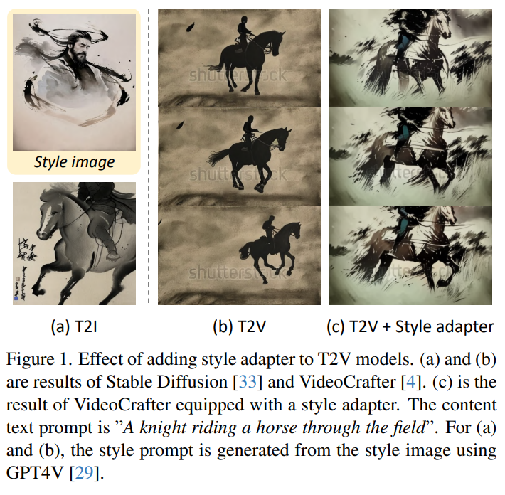  

- **研究背景**：文本到视频（T2V）是一种根据文本描述生成对应视频的技术，它有很多有趣和有用的应用，比如故事讲述，视频编辑，视频合成等。目前，已经有一些很强大的T2V模型，比如VideoCrafter [4]，它可以生成高质量和多样化的视频。但是，**这些模型通常只能生成真实风格的视频，而不能生成用户想要的艺术风格的视频，比如卡通，油画，水彩等。**这是因为（i）**文本很难表达具体的风格信息**，（ii）**现有的视频数据集大多是真实风格的，缺乏艺术风格的数据**。
- **研究动机**：为了解决这个问题，作者提出了一个通用的方法，叫做**StyleCrafter**，**它可以让预训练的T2V模型通过提供一个参考图片，来生成任意风格的视频。这样，用户就可以根据自己的喜好，选择不同的参考图片，来控制视频的风格**。比如，如果用户想要生成一个卡通风格的视频，他可以提供一个卡通图片作为参考，如果用户想要生成一个油画风格的视频，他可以提供一个油画图片作为参考，等等。
- **研究方法**：作者的方法主要包括两个部分，一个是风格控制适配器（style control adapter），一个是时序适应微调（temporal adaptation finetuning）。风格控制适配器的作用是从参考图片中提取风格特征，并将它们融合到T2V模型的特征中，从而改变视频的风格。时序适应微调的作用是在一个混合的数据集上，对T2V模型的时序模块进行微调，从而提高视频的时序质量。作者的方法有以下几个创新点：
    - **内容风格解耦的数据增强**：作者使用了一个富含艺术风格的图片数据集，来训练风格控制适配器。为了让模型能够更好地区分内容和风格，作者对每个图片和文本对进行了一些处理，比如重新生成文本，去掉风格描述，缩放和裁剪图片，减少内容和风格的重叠等。
    - **双重交叉注意力机制**：作者设计了一个双重交叉注意力机制，来分别处理文本条件和风格条件，从而实现内容和风格的解耦控制。具体来说，作者在T2V模型的去噪U-Net中，添加了一个新的交叉注意力模块，专门用于风格条件，然后将文本条件和风格条件的特征进行融合。这样，可以避免文本和风格之间的干扰，保证生成的视频符合文本的内容和图片的风格。
    - **自适应内容风格融合**：作者考虑到不同的风格和文本可能对内容的表达有不同的重视程度，比如抽象风格可能更弱化内容的具体性，而真实风格可能更强调内容的准确性和细节。因此，作者提出了一个自适应内容风格融合的模块，来根据文本和图片的特征，动态地调整内容和风格的融合比例。这样，可以提高模型的泛化能力，适应不同的文本和风格组合。

## HiFi Tuner: High-Fidelity Subject-Driven Fine-Tuning for Diffusion Models
#Textual
#Customization

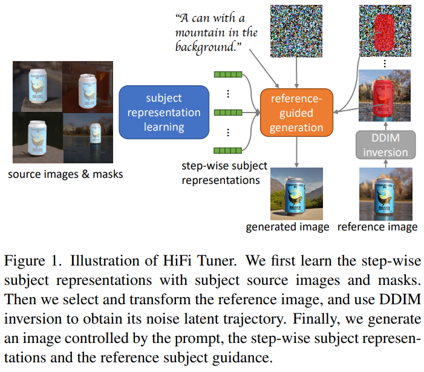  

- **研究背景**：扩散模型是一种可以生成高质量和多样化的图片的人工智能技术，它的原理是从一个随机的噪声开始，逐步去除噪声，最终得到一个清晰的图片。扩散模型可以根据用户提供的文字描述，生成与文字相符的图片，这叫做“文本到图像”的任务。然而，扩散模型在生成一些特定的或者没有见过的物体时，可能会失真或者出现错误，因为它的训练数据不能覆盖所有的情况。因此，**研究人员希望能够让扩散模型能够根据用户提供的一些图片，学习这些图片中物体的特征，从而生成更逼真和个性化的图片，这叫做“主体驱动的微调”。**
- **研究动机**：目前已有一些方法可以实现主体驱动的微调，但是它们都有一些缺点。比如，有些方法只是简单地用一个单词来表示一个物体，这样可能会忽略物体的细节和变化；有些方法需要调整很多参数，这样可能会导致过拟合或者失去原来的能力；有些方法不能很好地保持物体的外观，可能会出现一些不自然的变化或者错误。因此，研究人员希望能够**提出一个更有效和更灵活的方法，能够在保持物体的外观和细节的同时，生成与文字描述相符的图片。**
- **研究方法**：研究人员提出了一个新的方法，叫做“HiFi Tuner”，它主要包括两个部分：一个是用于学习物体特征的“主体表示学习”过程，另一个是用于生成图片的“参考引导生成”过程。在主体表示学习过程中，研究人员使用了三个技巧来提高物体特征的质量：**一是使用物体的掩码来减少背景的影响**；**二是使用一个正则化项来保持模型的能力**；**三是使用一个逐步的表示机制来适应不同的去噪步骤。在参考引导生成过程中，研究人员使用了一个创新的技术，利用一个参考图片的反向扩散过程，来给生成过程提供更多的信息，从而减少不需要的变化和错误。**
- **贡献和创新点**：研究人员的贡献和创新点主要有以下几点：一是提出了一个参数高效的微调框架，可以提高生成图片的逼真度和个性化程度；二是提出了一个参考引导生成的技术，可以有效地解决物体外观的保持问题；三是将方法扩展到了一个新的图像编辑任务，即通过文本操作来替换图片中的物体；四是在一个公开的数据集上，展示了方法的通用性和有效性，超过了现有的方法。
- **相关工作**：研究人员主要参考了以下几类相关工作：一是主体驱动的文本到图像生成的方法，这些方法利用用户提供的图片来微调扩散模型，生成特定的物体；二是文本引导的图像编辑的方法，这些方法利用用户提供的文字来修改图片中的内容；三是扩散模型的相关理论和技术，这些理论和技术是生成图片的基础。

## S2ST: Image-to-Image Translation in the Seed Space of Latent Diffusion
#Image_Traslation

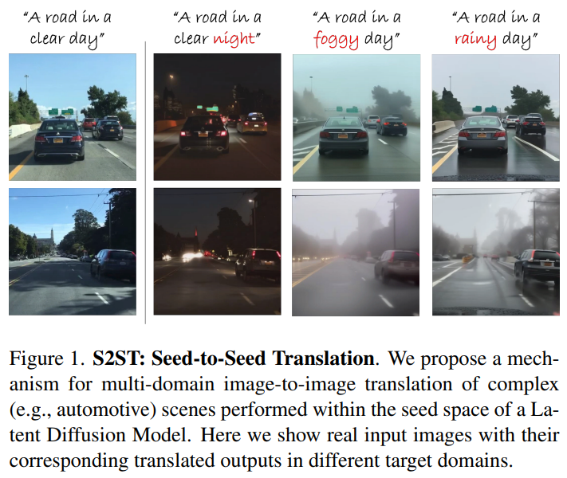  

- **研究背景**：这篇论文的研究背景是图像到图像的转换（I2IT），也就是把一张图片从一个风格或场景转换成另一个风格或场景，比如把白天的汽车场景转换成夜晚的汽车场景。这种转换有很多应用，比如模拟驾驶，增强图像质量，创造新的图像等。
- **研究动机**：这篇论文的研究动机是提出一个新的方法来做I2IT，它可以生成更真实，更多样，更符合目标场景的图像，而且可以同时处理多个不同的场景。现有的方法主要是基于对抗生成网络（GANs），它们虽然可以保留图像的细节，但是往往不能捕捉场景之间的微妙变化，比如光源，反射，雾气等。而且，GANs通常需要为每一对场景单独训练一个模型，这样就限制了它们的灵活性和适用性。
- **研究方法**：这篇论文的研究方法是基于扩散模型（DMs），它们是一种生成模型，可以通过逐步去噪一个初始的随机噪声来生成图像。这种方法可以利用扩散模型学习到的强大的图像先验来保证生成的图像在自然图像的流形上，也就是说，看起来很自然。具体来说，这篇论文提出了一个叫做S2ST的框架，它包括两个步骤：
    - **种子转换**（Seed Translation）：这个步骤是把输入图像的隐含表示（latent representation）通过扩散反演（DDIM inversion）转换成一个噪声种子（noise seed），然后通过优化这个种子，使它能够生成一个符合目标场景的图像，同时保持和输入图像的结构相似。
    - **轨迹优化**（Trajectory Optimization）：这个步骤是进一步优化从种子开始的整个扩散采样过程（DDIM sampling process），使得生成的图像和输入图像在内容和细节上更加相似，同时保持目标场景的外观。
- **贡献和创新点**：这篇论文的贡献和创新点有以下几个：
    - 它提出了一个新颖的基于扩散的I2IT方法，它可以在复杂的（汽车）场景中做全局的转换，对于需要高度保持内容的应用非常重要，比如汽车相关的应用。
    - 它利用种子转换和扩散采样轨迹优化来实现目标场景的外观，同时保留场景的结构和不受场景影响的低级细节。
    - 它和现有的基于GAN的和基于扩散的方法进行了定量和定性的比较，展示了它在域外观，真实感，内容保留方面的优势。
- **相关工作**：这篇论文的相关工作主要包括以下几个方面：
    - **无监督的I2IT**：这方面的工作主要是基于GANs，它们通过对抗训练和循环一致性机制来实现不同场景之间的转换，比如CycleGAN，MUNIT，TSIT等。
    - **基于扩散的图像生成和编辑**：这方面的工作主要是利用扩散模型来生成或修改图像，比如DALL-E，Imagen，Stable Diffusion等。这些方法可以用文本或其他信号来指导生成的图像，也可以用掩码或交叉注意力来控制图像的局部区域，还可以用优化的方法来控制和调整扩散的过程。
    - **基于扩散的I2IT**：这方面的工作相对较少，有一些是用扩散模型来做风格转换或图像增强，比如SDEdit，Instruct-Pix2Pix等。这些方法要么不适合做全局的转换，要么不能很好地保留输入图像的细节和结构。

## GraphDreamer: Compositional 3D Scene Synthesis from Scene Graphs

#Text23D
#GPT-4
#Scene_Graph_3D

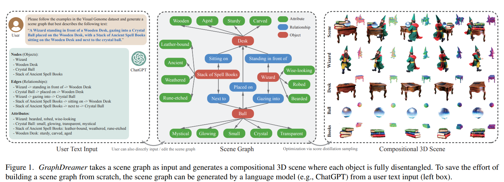  

- **研究背景**：文本到三维（Text-to-3D）是一种利用文本描述来生成三维模型或场景的技术，它有很多潜在的应用，比如艺术创作、虚拟现实、游戏开发等。目前，大多数的文本到三维方法都是基于预训练的文本到图像（Text-to-Image）模型来优化一个整体的三维模型，这样的方法有两个主要的问题：**一是属性混淆**（Attribute Confusion），即文本到图像模型难以区分不同对象的属性，比如“黑猫在粉色地毯上”和“粉色猫在黑色地毯上”；**二是引导崩溃**（Guidance Collapse），即文本到三维模型忽略或误解文本的部分信息，比如“泰迪熊推着购物车，手里拿着气球”，却只生成了“购物车”或“气球”。
- **研究动机**：为了解决这些问题，作者提出了一种**新的文本到三维框架，叫做GraphDreamer**，**它可以从场景图（Scene Graph）或者无结构的文本（通过使用GPT4-V来生成场景图）来生成组合式的三维场景，其中每个对象都是完全分离的。场景图是一种用节点和边来表示对象和它们之间关系的图结构，它可以更精确地描述对象的属性和交互，比如“巫师站在木制桌子前，凝视着桌子上的水晶球，桌子上还有一摞古老的咒语书”。通过使用场景图，作者希望能够更好地利用预训练的文本到图像模型的知识，并且能够完全分离不同的对象，而不需要图像级的监督。**
- **研究方法**：GraphDreamer的主要思想是将场景图分解为多个文本描述，分别对应于全局的场景、单个的对象和两两的关系，然后用这些文本描述来指导三维场景的生成。具体来说，GraphDreamer包含三个可学习的模块：一个位置特征编码器Fθ(·)，一个有符号距离网络uϕ1
 (·)，和一个辐射网络cϕ2
 (·)。位置特征编码器用于将一个三维空间中的位置p编码为多个特征向量，每个特征向量对应于一个对象的场域（Field），即该对象在空间中的分布。有符号距离网络和辐射网络用于从位置特征向量中预测该位置的有符号距离值（SDF）和颜色值，分别表示该位置距离对象表面的距离和该位置的颜色。通过这种方式，GraphDreamer可以用一个SDF值和一个颜色值来表示每个对象的几何和外观。为了渲染一个三维场景，GraphDreamer使用了基于SDF的体积渲染方法，即从相机的视角发射一条光线r，沿着光线采样一系列的位置p，然后根据每个位置的SDF值和颜色值来计算光线的颜色C(r)。为了实现对象的分离，GraphDreamer使用了一种身份感知的体积渲染方法，即除了渲染整个场景的颜色外，还可以渲染每个对象单独存在时的颜色C
(i)
 r
 。这样，就可以根据每个对象的文本描述来优化它的SDF值和颜色值，使其与文本描述相匹配，同时也可以根据整个场景的文本描述来优化整个场景的语义。优化的方法是使用分数蒸馏采样（SDS），即利用预训练的文本到图像扩散模型来预测一个噪声图像z的噪声分数ϵ，然后用这个分数来指导噪声图像z向真实图像分布的方向移动，从而更新三维模型的参数Θ。
- **贡献和创新点**：GraphDreamer的主要贡献和创新点有以下几个方面：
    - **GraphDreamer是第一个可以从场景图或无结构的文本来生成组合式的三维场景的方法，不需要输入三维布局或边界框。**
    - GraphDreamer使用场景图来构建一个分离的表示，其中每个对象都可以通过其相关的文本描述来优化，避免了对象级别的歧义。
    - GraphDreamer能够生成高保真的复杂的三维场景，其中每个对象都是分离的，优于现有的文本到三维方法和基于三维边界框的组合式文本到三维方法。
    - GraphDreamer展示了一种新的语义三维重建的范式，即逆语义（Inverse Semantics），其中一个视觉-语言模型（例如GPT4-V）用于从输入图像中提取场景图（即场景图编码器），而GraphDreamer用于从场景图中生成组合式的三维场景（即场景图解码器）。

## X-Dreamer: Creating High-quality 3D Content by Bridging the Domain Gap Between Text-to-2D and Text-to-3D Generation
#Text23D

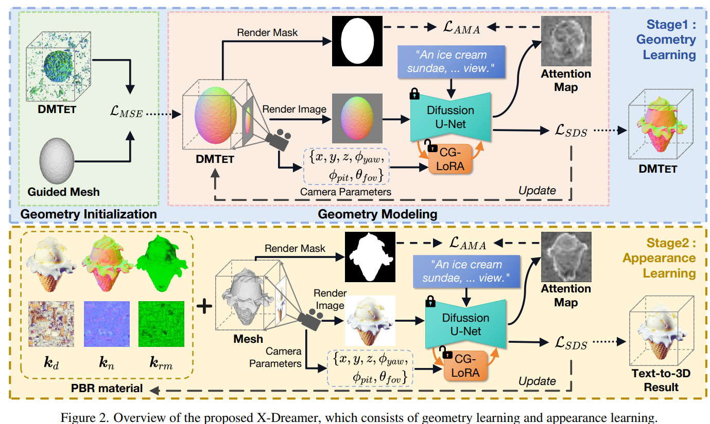  

- **研究背景**：这篇论文的研究背景是文本到三维内容生成，也就是根据给定的文本描述，自动创建出对应的三维模型和纹理。这是一个有趣而有挑战的任务，可以应用在建筑、动画、游戏等领域。近年来，有很多方法利用预训练的文本到二维图像生成模型来指导文本到三维内容生成，**例如DreamFusion，Magic3D，Fantasia3D等。这些方法的基本思想是，给定一个文本描述，优化一个三维表示，使得从不同的视角渲染出来的图像与文本描述相符合，这个相符合的程度由预训练的文本到二维图像生成模型来评估。**
- **研究动机**：这篇论文的研究动机是，**虽然利用预训练的文本到二维图像生成模型可以有效地指导文本到三维内容生成，但是存在一个领域差异的问题，也就是文本到二维图像生成和文本到三维内容生成的任务本质上是不同的**。**文本到二维图像生成的模型只需要考虑生成特定角度的高质量的图像，而不需要考虑其他角度的图像**。而**文本到三维内容生成的模型需要考虑生成在任何角度都能看起来真实和一致的三维模型和纹理**。这就导致了一个基本的区别，**就是文本到三维内容生成的模型需要考虑相机的参数，例如位置、角度、视野等，而文本到二维图像生成的模型则不需要**。**另外，文本到二维图像生成的模型需要同时生成前景和背景的元素，而保持图像的整体协调性。而文本到三维内容生成的模型只需要专注于生成前景的物体。这个区别使得文本到三维内容生成的模型可以分配更多的资源和注意力来精确地表示和生成前景物体。因此，直接使用预训练的文本到二维图像生成模型来优化三维表示可能会导致次优的结果。**
- **研究方法**：这篇论文的研究方法是，提出了一个新的框架，叫做X-Dreamer，来有效地弥合文本到二维图像生成和文本到三维内容生成之间的领域差异，从而实现高质量的文本到三维内容生成。X-Dreamer的核心是两个创新的设计：**相机引导的低秩适应（CG-LoRA）和注意力-掩码对齐（AMA）损失**。**CG-LoRA的作用是，将相机的信息动态地融入到预训练的文本到二维图像生成模型中，通过相机相关的生成来调整可训练的参数。这样做可以增强生成的三维模型和纹理与相机的视角的对齐**。**AMA损失的作用是，利用渲染出来的三维物体的二值掩码来指导预训练的文本到二维图像生成模型的注意力图，使得模型更加关注于生成准确和细节的前景物体**。X-Dreamer的框架包括两个主要的阶段：**几何学习和外观学习**。**在几何学习阶段，使用一个多层感知机（MLP）来参数化一个动态网格（DMTET）作为三维表示，初始时使用一个椭球来初始化DMTET，然后使用SDS损失和AMA损失来优化DMTET和CG-LoRA，使得渲染出来的法线图与文本描述相符合**。在外观学习阶段，使用物理基础的渲染（PBR）材质模型来计算三维物体的外观，包括漫反射项、粗糙度和金属度项、法线变化项等，这些项由另一个MLP来预测。然后使用SDS损失和AMA损失来优化材质编码器和CG-LoRA，使得渲染出来的图像与文本描述相符合。
- **贡献和创新点**：这篇论文的贡献和创新点有以下几点：
    - 提出了一个新的框架，X-Dreamer，来实现高质量的文本到三维内容生成，有效地弥合了文本到二维图像生成和文本到三维内容生成之间的领域差异。
    - 提出了CG-LoRA，一个将相机信息动态地融入到预训练的文本到二维图像生成模型中的技术，增强了生成结果与相机视角的对齐。
    - 提出了AMA损失，一个利用三维物体的掩码来指导预训练的文本到二维图像生成模型的注意力图的技术，使得模型更加关注于生成前景物体。
    - 通过大量的实验，展示了X-Dreamer在生成高质量和真实感的三维模型和纹理方面的优越性，相比于现有的方法，有显著的提升。

## LucidDreaming: Controllable Object-Centric 3D Generation
#Text23D
#Text23D_spatial
#Text23D_number
#Text23D_placement

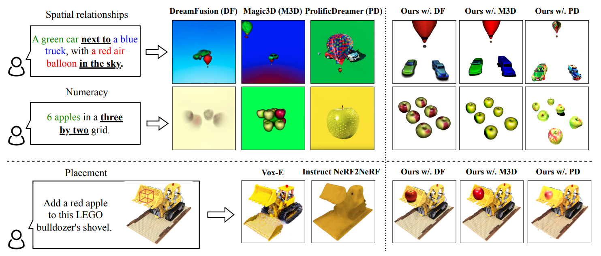  

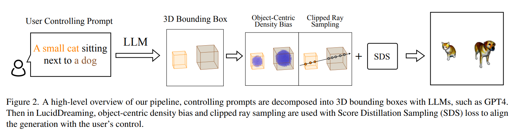  

**研究背景**

这篇论文的研究背景是3D生成模型的发展。随着生成模型的发展，文本到3D生成也有了显著的增长。然而，实现对3D生成的精确控制仍然是一项艰巨的任务，因为使用文本来控制往往会导致缺失的对象和不准确的位置。

**研究动机**

研究的动机是解决现有的3D生成模型在控制精度上的问题。例如，使用文本提示直接在3D生成中施加控制，如“6个苹果排列在一个3乘2的网格中”，扩散模型往往无法理解提示中的逻辑，特别是空间关系或数字。此外，2D模型的蒸馏处理遮挡效果较差。例如，SDS将始终尝试在前面的提示中的每个视图中坚持“六个苹果”，从而导致缺失/额外的对象和错误的位置。

**研究方法**

这篇论文提出了一个名为LucidDreaming的方法，它能够对3D生成进行细粒度的控制。这个方法只需要最小的3D边界框输入，这些边界框可以从简单的文本提示中使用大型语言模型推断出来。具体来说，他们提出了剪切光线采样来分别渲染和优化用户指定的对象。他们还引入了对象中心密度blob偏差，促进生成对象的分离。

**贡献和创新点**

这篇论文的主要贡献和创新点包括：
- 提出了LucidDreaming，这是一个能够对3D生成进行细粒度控制的有效管道。
- 提出了剪切光线采样和对象中心密度blob偏差，用于单独渲染和优化对象。
- 他们的方法不仅在从头开始的控制内容生成中表现出色，而且在预训练的NeRF场景中也表现出色。

**相关工作**

这篇论文的相关工作主要包括2D扩散模型、3D生成与扩散、3D生成的可控性以及3D编辑的可控性。这些工作为本文的研究提供了理论基础和技术支持。本文的方法在这些相关工作的基础上，提出了新的技术和方法，以提高3D生成的控制精度。具体来说，他们提出了剪切光线采样和对象中心密度blob偏差，以实现更精细的3D生成控制。此外，他们还提出了一种新的方法，可以在预训练的NeRF场景中生成新的3D元素，而不会破坏原有的场景。这些都是本文的重要创新点。

## A Video is Worth 10,000 Words: Training and Benchmarking with Diverse Captions for Better Long Video Retrieval
#Video
#long-video-retrieval
#Video-Dataset

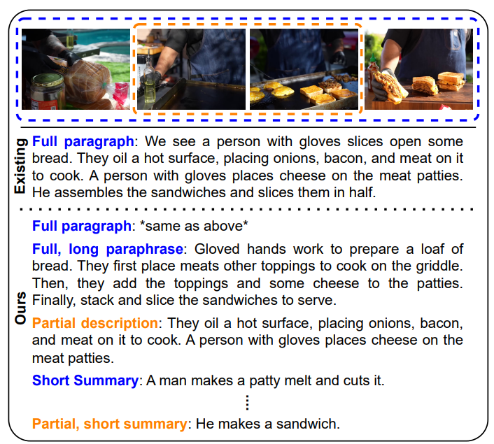  

- **研究背景**：视频检索是一个重要的跨学科任务，它需要一个系统能够理解视频和文本之间的关系，并根据用户的查询返回相关的视频。现有的视频检索系统通常只考虑短视频或者使用单一的段落描述长视频，这忽略了视频的丰富性和多样性，以及用户可能使用不同的语言描述视频的情况。例如，一个视频可以用详细的句子、简短的摘要、不同的复杂度或者部分的内容来描述，而一个好的视频检索系统应该能够处理这些不同的描述方式。
- **研究动机**：为了更全面地评估视频检索系统的能力，作者提出了一个新的视频检索问题，**称为10k Words问题**，**它要求系统能够从一组包含多种描述方式的文本中检索出长视频。这个问题涉及到三个变化的维度，即时长、摘要和简化，它们分别表示描述视频的部分或全部内容、使用不同的长度和复杂度的语言**。这个问题引入了一些挑战性的歧义，因为一些描述可能没有提及区分视频的所有细节。
- **研究方法**：为了实例化10k Words问题，作者利用了最新的大型语言模型（LLM），结合一些简单的自动操作，为现有的长视频数据集（如ActivityNet，QuerYD和LF-VILA）生成了一组多样化的合成描述。作者验证了这些合成描述的质量和有效性，通过人工检查和自动分析。作者还对一些代表性的视频语言模型进行了零样本的基准测试，发现它们在10k Words问题上表现不佳，尤其是在处理短摘要的描述时。
- **贡献和创新点**：作者的主要贡献和创新点有以下几点：
    - 提出了10k Words问题，一个新的视频检索问题，它包含了长视频的多种描述方式，扩展了视频检索的范围和难度。
    - 创建了**ActivityNet10k，QuerYD10k和LF-VILA10k**，三个包含多样化合成描述的长视频数据集，使用了灵活和可靠的数据生成流程。²[2]
    - 对一些最先进的视频语言模型进行了零样本的基准测试，揭示了它们在10k Words问题上的不足。
    - 利用10k Words数据和轻量级的对比损失，提出了一种改进的微调方法，实现了10k Words问题的最佳性能，同时也提升了标准的段落到视频检索任务的性能。
- **相关工作**：作者的工作与以下几个领域的相关工作有联系：
    - 视频语言模型：这些模型旨在建立一个能够理解视频和语言之间关系的多模态基础模型，通常使用一些视频和文本对进行预训练，然后在下游任务上进行零样本或微调。这些模型可以分为使用共享嵌入空间的方法和使用跨模态编码器的方法，也可以分为使用预计算特征的方法和使用原始视频的方法，还可以分为使用对比学习的方法和使用其他学习任务的方法。
    - 长视频理解：这些工作关注处理长视频的复杂性和多样性，通常使用一些包含长视频的数据集，或者使用一些适用于长短视频的方法。这些工作主要集中在视频检索、视频分类、视频摘要、视频问答等任务上。
    - 文本摘要和简化：这些工作关注如何使用不同的语言方式描述相同的内容，通常使用一些控制标记来指导模型生成不同长度和复杂度的摘要或简化。这些标记可以是用户定义的、数据优化的或者基于关键词的，也可以涉及人在环的干预或者强标注的数据。

## Gaussian Grouping: Segment and Edit Anything in 3D Scenes
#scene_editing_3D
#Gaussian_Splatting

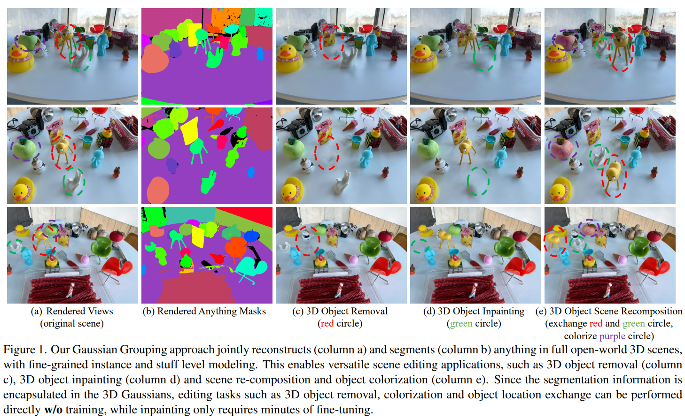  

- **研究背景**：这篇论文的研究背景是3D场景理解，也就是用计算机来分析和处理三维的图像，比如照片或视频。3D场景理解有很多应用，比如机器人，虚拟现实，自动驾驶等。**3D场景理解的一个重要任务是3D场景重建，也就是用计算机来模拟和生成三维的图像**。3D场景重建的一个挑战是如何同时考虑场景的外观，几何和语义，也就是场景中的物体或元素的颜色，形状和类别。
- **研究动机**：这篇论文的研究动机是**提出一种新的3D场景表示方法，可以同时重建和分割3D场景中的任何东西，而不需要人工标注或扫描3D点云。这种方法可以让计算机更好地理解3D场景，也可以让用户更方便地编辑3D场景，比如删除，填补，变色或重组3D场景中的物体。**
- **研究方法**：这篇论文的研究方法是基于最近的一种3D场景重建方法，叫做**3D高斯投影**。**这种方法是用一组有颜色的3D高斯函数来表示3D场景，每个高斯函数代表场景中的一小部分。这种方法可以快速地渲染出不同视角的3D图像，而且有很高的重建质量**。这篇论文在这种方法的基础上，增加了一个新的参数，叫做身份编码，给每个高斯函数赋予一个特征向量，表示它属于哪个物体或元素。这样，就可以把3D场景分成不同的组，每个组代表一个物体或元素。这篇论文用一种可微分的渲染方法，来训练这些高斯函数的参数，包括身份编码。它用一种叫做SAM的模型，来自动地生成2D图像的分割结果，然后用这些结果来指导身份编码的学习。它还用一种叫做3D正则化的方法，来让空间上相邻的高斯函数有相似的身份编码，这样可以提高分割的准确性。
- **贡献和创新点**：这篇论文的贡献和创新点有以下几个：
    - 它提出了一种新的3D场景表示方法，可以同时重建和分割3D场景中的任何东西，而不需要人工标注或扫描3D点云。
    - 它用一种简单而有效的身份编码，来给每个高斯函数赋予语义信息，从而实现3D场景的分组。
    - 它用一种可微分的渲染方法，来训练这些高斯函数的参数，利用了SAM的强大的零样本2D分割能力，并引入了3D正则化来提高分割的准确性。
    - 它基于这种分组的3D场景表示，提出了一种高效的局部高斯编辑方法，可以支持多种场景编辑应用，比如3D物体删除，填补，变色和重组，而且有很高的视觉效果和细节保持。
- **相关工作**：这篇论文的相关工作主要有以下几类：
    - 3D高斯模型：这类工作是用一组3D高斯函数来表示3D场景，主要用于3D场景重建，动态场景跟踪，和3D内容生成。这篇论文在这类工作的基础上，增加了身份编码，来实现3D场景的分割和编辑。
    - 基于辐射场的开放世界场景理解：这类工作是用一种叫做辐射场的方法来表示3D场景，主要用于3D场景重建和语义分割。这类工作通常基于一种叫做NeRF的模型，用神经网络来隐式地表示3D场景。这篇论文与这类工作的区别是，它用高斯函数来显式地表示3D场景，而且可以实现更细粒度的分割和更灵活的编辑。
    - SAM在3D中的应用：这类工作是用一种叫做SAM的模型来实现零样本的2D分割，然后将其扩展到3D分割。这类工作通常基于NeRF或3D点云，但只关注单个或少数的物体，而不是整个场景。这篇论文与这类工作的区别是，它用高斯函数来表示整个场景，而且可以自动地分割场景中的任何东西。
    - 基于辐射场的场景编辑：这类工作是用辐射场的方法来实现3D场景的编辑或操纵，比如改变或补全物体，或者结合物理模拟。这类工作通常需要指定物体的边界框，或者用语言来描述编辑的目标。这篇论文与这类工作的区别是，它用高斯函数来表示场景的组成结构，可以方便地识别，操作或替换场景中的各个部分，而不影响整个场景的结构。

## MD-Splatting: Learning Metric Deformation from 4D Gaussians in Highly Deformable Scenes
#generation_4d
#_4D_Gaussians_splatting

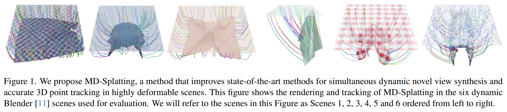  
  

- **研究背景**：在机器人、增强现实和生成式AI等领域，能够准确地跟踪高度变形的物体（如衣服、毛巾等）在阴影和遮挡下的3D运动，以及从任意视角合成逼真的图像，是非常有用的。然而，这是一个非常困难的问题，因为变形物体的运动和外观受到多种因素的影响，如材料张力、空气流动、光照变化等。
- **研究动机**：为了解决这个问题，一些先前的工作使用了神经网络来学习场景的隐式表示，从而能够在静态或动态场景中进行新视角合成。其中，一种流行的方法是使用神经辐射场（NeRF），它可以从一个3D坐标和一个视角方向输出该点的颜色和密度。然而，NeRF的方法在动态场景中的表现不佳，因为它需要大量的计算资源和训练时间，而且对于变形物体的运动和光照变化不够敏感。另一种方法是使用高斯散射（Gaussian Splatting），它使用了一种更显式的场景表示，即一组高斯分布，每个高斯分布由其均值、协方差矩阵和颜色来定义。高斯散射的方法可以实现实时的新视角合成，并且可以通过一个可微分的光栅化器来优化高斯分布的参数。然而，高斯散射的方法在动态场景中也面临着挑战，因为它需要显式地优化每个高斯分布在每个时间步的位置和方向，这会导致训练时间随着视频长度线性增长，而且在大的变形和阴影下容易陷入局部最优。
- **研究方法**：本文提出了一种新的方法，叫做MD-Splatting，它可以同时实现高质量的3D跟踪和新视角合成。MD-Splatting的核心思想是，首先在一个规范空间中学习一组高斯分布的规范状态，包括它们的位置、方向、颜色等，然后学习一个变形函数，将规范空间中的高斯分布映射到度量空间中，从而得到它们在不同时间步的度量状态。这样，就可以通过查询变形函数来跟踪任意一个高斯分布在3D空间中的轨迹，也可以通过光栅化器来合成任意视角的图像。为了让变形函数能够学习到物理上合理的变形，MD-Splatting还引入了一些基于物理的正则化项，如局部刚性、等距性和动量守恒，这些正则化项可以在训练过程中约束高斯分布的运动，使其更加符合变形物体的特性。
- **贡献和创新点**：本文的主要贡献和创新点有以下几点：
    - **提出了一种新的方法**，MD-Splatting，它可以使用4D高斯来实现高度变形场景的3D跟踪和新视角合成。这是第一种能够从规范空间中的高斯分布学习到度量空间中的变形的方法。
    - **在六个合成场景上进行了实验**，这些场景包含了大的变形、强烈的阴影和遮挡等挑战性因素。实验结果表明，MD-Splatting在3D跟踪方面比现有的最先进方法平均提高了23.9%，同时也能够实现高质量的新视角合成。在一个有足够纹理的场景中，MD-Splatting可以在一个1×1米的布料上实现3.39毫米的中位数跟踪误差。
    - **提供了一套合成数据集**，这些数据集是用Blender软件生成的，具有真实感的渲染效果和准确的3D跟踪标注。这些数据集将会与社区共享，以便于其他研究者在同样的条件下进行比较和评估。
- **相关工作**：本文的相关工作主要包括以下几个方面：
    - **神经渲染用于新视角合成**：这一方面的工作主要使用神经网络来学习场景的隐式表示，从而能够从任意视角合成逼真的图像。其中，最具代表性的方法是NeRF [34]，它使用一个多层感知机（MLP）来从一个3D坐标和一个视角方向输出该点的颜色和密度。后续的工作在NeRF的基础上进行了各种改进，如提高训练和推理的速度 [19, 31, 32, 35, 36, 44, 50, 68]，利用深度监督 [1, 12, 37, 49, 63]，适应更具挑战性的条件，如稀疏的相机视角 [10, 39, 54, 69]，缺少外部相机标定 [9, 24, 29, 66]，透明物体 [23, 26]和反射表面 [57]等。
    - **基于粒子的方法**：这一方面的工作使用了一种更显式的场景表示，即一组粒子，每个粒子有自己的状态，如颜色、位置、方向等。本文所采用的高斯散射 [25]就是一种基于粒子的方法，它使用了一组高斯分布来表示场景，并且使用了一个可微分的光栅化器来渲染和优化高斯分布的参数。
    - **动态新视角合成**：这一方面的工作主要关注如何在动态场景中进行新视角合成，即场景中的物体或人物会发生运动和变形。一种常见的方法是在NeRF的基础上增加一个时间维度，从而能够对动态场景进行建模 [15, 18, 27, 65]。另一种方法是学习一个变形函数，将度量空间中的点映射到一个规范空间中，从而能够在一个静态的NeRF中表示动态场景 [41, 43, 52]。本文的方法也是基于变形函数的，但是与之前的工作不同的是，本文的变形函数是从规范空间到度量空间的，而且是基于高斯分布的，而不是基于NeRF的。

## VideoBooth: Diffusion-based Video Generation with Image Prompts
#video_generation
#Video
#Video_Customization
#Img_guided_Video_generation

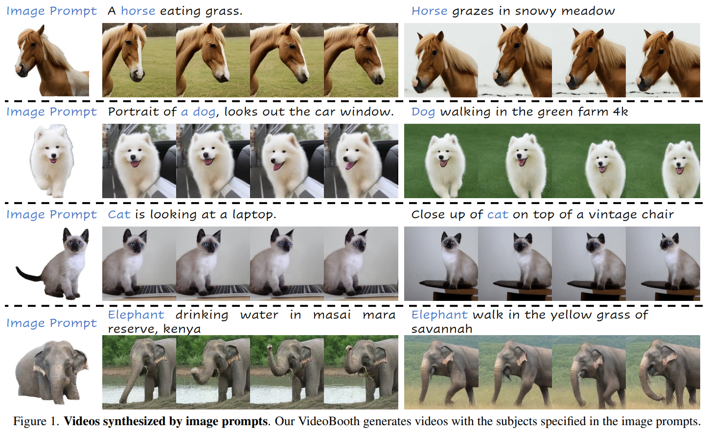  

- **研究背景**：随着人工智能技术的发展，文本到图像和文本到视频的生成任务受到了广泛的关注。这些任务的目的是根据给定的文本描述，生成与之相符的图像或视频。然而，仅仅使用文本作为输入，**往往不能够准确地表达用户想要的目标物体的外观，尤其是对于定制化的内容生成。因此，一些研究者提出了使用图像提示作为辅助输入的方法，图像提示可以提供更直观和精确的内容控制，超越文本提示的限制。目前，已经有一些方法实现了使用图像提示的文本到图像生成，但是使用图像提示的文本到视频生成还是一个较少探索的问题，它比文本到图像生成更具挑战性，因为它需要考虑目标物体的动态运动和时间一致性。**
- **研究动机**：为了解决使用图像提示的文本到视频生成的问题，本文提出了一个新的框架，叫做**VideoBooth**。VideoBooth的灵感来源于照相亭的概念，**用户可以提供一张图像和一段文本**，**然后得到一段包含图像中指定物体的视频**。**VideoBooth的目标是在保证视频质量和时间一致性的同时，尽可能地保留图像提示中的视觉细节，使得生成的视频能够满足用户的定制化需求。**
- **研究方法**：VideoBooth的核心思想是**将图像提示以粗到细的方式嵌入到文本到视频的生成过程中**。具体来说，VideoBooth包含两个主要的模块：**粗粒度的图像编码器**和**细粒度的注意力注入**。**粗粒度的图像编码器的作用是将图像提示的高层语义信息映射到文本嵌入的空间中，然后将其与文本嵌入融合，作为交叉注意力模块的输入**。**细粒度的注意力注入的作用是将图像提示的多尺度空间信息注入到交叉帧注意力模块中，作为额外的键和值，从而在生成过程中细化图像提示中的视觉细节，并将其传播到所有帧中，保证时间一致性**。VideoBooth的基础是一个预训练的文本到视频模型，它使用了扩展的二维卷积、交叉帧注意力和时间注意力来处理视频数据和捕捉时间相关性。VideoBooth的训练采用了粗到细的策略，即先训练图像编码器和交叉注意力模块，再训练注意力注入模块，避免了两个模块之间的干扰。
- **贡献和创新点**：本文的主要贡献和创新点有以下几点：
    - 本文是首次探索使用图像提示的文本到视频生成的任务，提出了一个通用的框架VideoBooth，可以在不需要微调的情况下，通过前向传播生成包含图像提示中指定物体的视频。
    - 本文提出了一个新的粗到细的图像嵌入策略，通过图像编码器和注意力注入两个模块，将图像提示中的视觉信息有效地融合到视频生成过程中，提高了视频的视觉质量和时间一致性。
    - 本文提出了一个新的注意力注入方法，使用图像提示的多尺度空间信息来细化生成的细节，并通过更新第一帧的值来传播到后续的帧中，保证了视频的时间一致性。
- **相关工作**：本文的相关工作主要涉及以下几个方面：
    - 文本到视频模型：这些模型的目的是根据给定的文本描述，生成与之相符的视频。早期的探索基于VQVAE的思想，后来的研究引入了扩展的二维卷积、交叉帧注意力和时间注意力等技术，以及基于扩散模型的方法，来提高视频的质量和一致性。
    - 定制化内容生成：这些方法的目的是使用参考图像来生成图像或视频，实现用户的个性化需求。对于定制化的文本到图像生成，有两类方法：一类是基于优化的方法，它们通过微调部分参数或特殊的文本标记来嵌入图像信息；另一类是基于编码器的方法，它们通过训练一个映射网络来嵌入图像信息，无需微调。对于定制化的视频生成或编辑，有一些早期的尝试，它们通常需要微调扩散模型或者使用已有的视频作为参考。