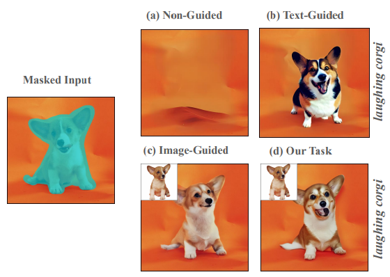

#! https://zhuanlan.zhihu.com/p/671477564
---
id: nywr98agbkv9ez875ybccmv
title: '20231208'
desc: ''
updated: 1702220013536
created: 1702214640516
---

## NeRFiller: Completing Scenes via Generative 3D Inpainting
#_3D_generation
#scene_editing_3D

  

- **研究背景**：3D场景或物体的捕捉和重建是计算机视觉和图形学的重要研究方向，它可以用于虚拟现实、增强现实、游戏、电影等多种应用。然而，很多时候，**捕捉到的3D场景或物体并不完整，可能有一些部分缺失或不理想，比如因为遮挡、观测不足、重建失败等原因。这些缺失的部分会影响3D场景或物体的观感和功能，因此需要一种方法来填补这些空缺，这就是所谓的3D修复或3D修补。**
- **研究动机**：目前，已经有一些方法可以对3D场景或物体进行3D修复，但是它们**通常有一些局限性，比如需要提供精确的遮挡掩码、需要提供文本提示、只能删除前景物体而不能生成新的内容、不能保证多视角的一致性等**。因此，这篇**论文的目标是提出一种更通用、更灵活、更自然的3D修复方法，它可以根据一组多视角的图像，自动地生成3D场景或物体的完整版本，而不需要任何额外的信息或指导**。这种方法可以用于各种3D修复的任务，比如补全缺失的部分、删除不想要的部分、修改某些特征、生成多样的变化等。
- **研究方法**：这篇论文的核心思想是利用一个现成的2D图像生成模型，来为3D场景或物体的缺失部分生成合适的图像内容，然后将这些图像内容融合到一个统一的3D场景表示中，从而实现3D修复。具体来说，这篇论文使用了一种叫做神经辐射场（NeRF）的方法，来表示3D场景或物体的几何和颜色信息，它是一种基于神经网络的连续函数，可以根据空间位置和视角方向，输出对应的颜色和密度。这种方法可以通过一组已知的多视角图像来训练，从而学习到3D场景或物体的隐式表示。然后，这篇论文使用了一种叫做稳定扩散（SD）的方法，来生成2D图像的内容，它是一种基于概率的图像生成模型，可以根据一些条件（比如图像、掩码、文本等），生成多样的图像结果。这种方法可以在测试时对任意的图像和掩码进行修复，而不需要专门的训练或微调。为了让这个2D图像生成模型能够生成更多视角一致的图像内容，这篇论文提出了一种叫做联合多视角修复（Joint Multi-View Inpainting）的方法，它的主要思想是将多个图像和掩码拼接成一个网格，然后用SD模型对这个网格进行修复，从而使得不同视角的图像内容更加协调。这种方法还可以扩展到更多的图像，通过对图像进行随机打乱和分组，然后对每个分组进行网格修复，然后对不同分组的修复结果进行平均，从而实现更大范围的一致性。最后，为了将这些2D图像修复的结果融合到3D场景表示中，这篇论文提出了一种叫做修复数据集更新（Inpaint Dataset Update）的方法，它的主要思想是迭代地更新NeRF的训练数据集，每次用SD模型对一批图像进行修复，然后用修复后的图像替换原来的图像，从而让NeRF逐渐适应新的图像内容。这种方法还可以选择性地使用深度信息，来对3D场景的几何进行约束，从而提高3D修复的质量。
- **贡献和创新点**：这篇论文的主要贡献和创新点有以下几点：
    - 提出了一种通用的3D修复方法，可以根据一组多视角的图像，自动地生成3D场景或物体的完整版本，而不需要任何额外的信息或指导。
    - 发现了一种利用2D图像生成模型的网格先验，来提高多视角图像修复的一致性的技巧，并将其推广到更多的图像，从而实现联合多视角修复。
    - 提出了一种迭代地更新3D场景表示的训练数据集的方法，从而将2D图像修复的结果融合到3D场景中，同时可以选择性地使用深度信息来提高3D修复的质量。
    - 在多种3D场景或物体的修复任务上，展示了该方法的有效性和灵活性，并与相关的基线方法进行了对比和分析。
- **相关工作**：这篇论文的相关工作主要包括以下几个方面：
    - 2D图像修复：这类方法的目的是根据一个图像和一个掩码，补全图像中缺失的内容。早期的方法主要依赖于从已知区域复制纹理到未知区域，后来的方法主要利用神经网络来生成缺失的内容，比如LaMa [47]，SD [43]等。这些方法可以生成多样的图像结果，但是不能保证多视角的一致性。
    - 3D生成：这类方法的目的是根据文本或图像，生成3D场景或物体的内容。有些方法使用2D图像生成模型来逐步构建3D场景或物体，比如SceneScape [14]，Text2Room [23]等。有些方法使用3D场景表示来优化3D场景或物体的内容，比如DreamFusion [39]，Generative NeRF [42]等。这些方法可以生成完整的3D场景或物体，但是不适用于3D修复的任务。
    - 3D修复：这类方法的目的是根据一个已有的3D场景或物体，补全或修改其中的一些部分。最相关的方法是那些使用NeRF作为3D场景表示，并使用2D图像生成模型来修复图像的方法，比如SPIn-NeRF [36]，InpaintNeRF360 [52]等。这些方法主要关注于删除前景物体，而不是生成新的内容，而且需要提供精确的遮挡掩码，而不是任意的缺失区域。

## Visual Geometry Grounded Deep Structure From Motion

- **研究背景**：三维重建是指从一组二维图片中恢复出场景的三维结构和相机的位置和方向的过程。这是一个很重要的问题，因为它可以帮助我们理解和重现真实世界的场景，比如名胜古迹，自然风光，或者物体的形状。传统的三维重建方法通常是基于一些固定的步骤，比如检测图片中的特征点，匹配特征点，计算相机的运动，三角化三维点，以及优化三维点和相机的位置。这些步骤都有很多的技术细节和数学原理，而且很难同时保证效率和精度。近年来，深度学习的方法在很多计算机视觉的问题上取得了很好的效果，比如特征点检测和匹配，但是还没有一个完全基于深度学习的三维重建方法，能够从头到尾地训练和优化。
- **研究动机**：作者的动机是想要提出一个全新的三维重建方法，它是完全基于深度学习的，也就是说，它可以用一个神经网络来表示整个三维重建的过程，而不需要任何人为设计的步骤或者参数。这样的方法有很多的好处，比如可以利用大量的数据来自动学习最优的重建策略，可以避免一些传统方法中的错误或者局限性，可以更好地适应不同的场景和数据，以及可以更容易地与其他的深度学习方法结合，比如神经渲染或者神经场。
- **研究方法**：作者的方法叫做VGGSfM，它是一个完全可微分的神经网络，它可以接受一组任意的二维图片作为输入，然后输出相机的位置和方向，以及场景的三维点云。它的网络结构可以分为四个部分：第一部分是点跟踪，它是用一个深度网络来直接从图片中提取出一些可靠的点轨迹，也就是说，每个点在不同的图片中的位置。这样可以避免传统方法中的两两匹配和轨迹连接的步骤，而且可以提高点的精度和鲁棒性。第二部分是相机预测，它是用一个变换器网络来根据图片的特征和点的特征来估计每个相机的位置和方向，而不需要逐个地注册相机。这样可以简化相机的计算过程，而且可以同时考虑所有的图片的信息。第三部分是三角化，它是用另一个变换器网络来根据点的特征和相机的位置来估计每个点的三维坐标，而不需要用传统的线性代数的方法。这样可以提高三维点的质量和一致性。第四部分是捆绑调整，它是用一个可微分的优化器来对相机的位置和点的坐标进行联合优化，以最小化点的重投影误差，也就是说，点在三维空间和二维图片中的位置的差距。这样可以进一步提高重建的精度和稳定性。
- **贡献和创新点**：作者的方法有以下几个贡献和创新点：
    - 它是第一个完全基于深度学习的三维重建方法，它可以从头到尾地训练和优化，而不需要任何人为设计的步骤或者参数。
    - 它提出了一个新的点跟踪方法，它可以直接从图片中提取出可靠的点轨迹，而不需要两两匹配和轨迹连接的步骤，而且可以提高点的精度和鲁棒性。
    - 它提出了一个新的相机预测方法，它可以根据图片的特征和点的特征来估计每个相机的位置和方向，而不需要逐个地注册相机，而且可以同时考虑所有的图片的信息。
    - 它提出了一个新的三角化方法，它可以根据点的特征和相机的位置来估计每个点的三维坐标，而不需要用传统的线性代数的方法，而且可以提高三维点的质量和一致性。
    - 它提出了一个新的捆绑调整方法，它可以用一个可微分的优化器来对相机的位置和点的坐标进行联合优化，以最小化点的重投影误差，而且可以进一步提高重建的精度和稳定性。
- **相关工作**：作者的方法主要涉及到以下几个方面的相关工作：
    - 传统的三维重建方法，它们通常是基于一些固定的步骤，比如检测图片中的特征点，匹配特征点，计算相机的运动，三角化三维点，以及优化三维点和相机的位置。这些方法有很多的技术细节和数学原理，而且很难同时保证效率和精度。一些经典的方法有[28, 60, 62]，一些流行的框架有[2, 24, 69, 74, 93]。
    - 深度学习的三维重建方法，它们通常是用深度网络来提升传统方法中的某些步骤，比如特征点检测和匹配，或者相机的运动和优化。这些方法可以利用大量的数据来自动学习最优的重建策略，但是还没有一个完全基于深度学习的三维重建方法，能够从头到尾地训练和优化。一些代表性的方法有[18, 31, 37, 46, 47, 67, 71, 82, 96]。
    - 点跟踪的方法，它们是用深度网络来直接从视频中提取出一些可靠的点轨迹，也就是说，每个点在不同的帧中的位置。这些方法可以避免传统方法中的两两匹配和轨迹连接的步骤，而且可以提高点的精度和鲁棒性。一些最新的方法有[19, 20, 27, 39]。

## RAVE: Randomized Noise Shuffling for Fast and Consistent Video Editing with Diffusion Models
#Video
#video_generation

  

- **研究背景**：视频编辑是一种利用计算机技术来修改或创造视频内容的过程，它可以用于娱乐、教育、艺术等多种目的。**视频编辑的一个挑战是如何保持视频中的时间一致性**，也就是说，编辑后的视频**要看起来流畅和自然**，**而不是出现闪烁或抖动的现象**。另一个挑战是**如何让用户用简单的方式来指定想要的编辑效果，比如用文字来描述想要的变化**。
- **研究动机**：目前，有一些基于文本的图像编辑方法，可以利用预训练的文本到图像（T2I）的扩散模型，来根据用户的文字提示来生成或修改图像。扩散模型是一种生成模型，它可以从噪声中逐步恢复出清晰的图像。这些方法在图像编辑方面取得了很好的效果，但是在视频编辑方面还有很大的改进空间。因为视频编辑不仅要考虑每一帧的图像质量，还要考虑帧与帧之间的时间关系。现有的视频编辑方法要么需要大量的训练数据和计算资源，要么需要复杂的优化过程和额外的模块，要么在长视频或复杂的编辑任务上表现不佳。因此，作者提出了一种新的视频编辑方法，既能利用预训练的T2I扩散模型，又能保证时间一致性，而且速度快，内存占用少，编辑能力强。
- **研究方法**：作者的方法叫做RAVE，它是一个零样本的文本引导的视频编辑方法，它可以与任何预训练的T2I扩散模型结合，比如Stable Diffusion（SD）。**RAVE的核心思想是利用一种叫做网格技巧的方法，把输入的视频转换成一个个的网格，每个网格包含多帧图像，然后把这些网格作为一个整体输入到T2I扩散模型中，进行编辑**。这样做的好处是可以让扩散模型通过自身的卷积层和自注意力层，来捕捉网格中的空间和时间的关系，从而实现时间一致性。为了保证不同网格之间的一致性，**作者还提出了一种叫做噪声洗牌的方法，它是在每个扩散步骤中，随机打乱网格中的帧的顺序，让每个网格都包含不同的帧，这样可以让扩散模型在每个步骤中都能够感知到全局的风格**。除此之外，作者还使用了**ControlNet**，它是一种控制机制，可以让扩散模型接受除了文字提示之外的其他条件，比如线条、深度、姿态等，从而提高视频编辑的灵活性和可控性。
- **贡献和创新点**：作者的方法有以下几个贡献和创新点：
    - 提出了一种新的零样本的文本引导的视频编辑框架，可以与任何预训练的T2I扩散模型结合，实现视频的风格、属性和形状的编辑。
    - 提出了一种新的噪声洗牌方法，利用空间和时间的交互，有效地实现了时间一致性，而且比现有的方法快了约25%。
    - 提出了一种新的视频评估数据集，包含了多种视频，从物体为中心的场景到复杂的人类动作，如跳舞和打字，以及动态的场景，如游泳的鱼和船只。
- **相关工作**：作者的方法主要涉及到以下几个方面的相关工作：
    - 文本驱动的图像编辑，这些方法利用预训练的T2I扩散模型，来根据用户的文字提示来生成或修改图像，比如Prompt-to-Prompt，DiffEdit，Blended Diffusion等。
    - 文本驱动的视频编辑，这些方法分为两类，一类是需要训练的方法，它们利用大量的文本视频数据来训练视频生成或编辑的模型，比如Video Diffusion Models，Dreamix，Make-A-Video等。另一类是不需要训练的方法，它们利用预训练的T2I扩散模型来实现视频编辑，比如Pix2Video，FateZero，Text2Video-Zero等。
    - 扩散模型，这些模型是一种生成模型，它们可以从噪声中逐步恢复出清晰的图像，比如DDPM，LDM，DDIM等。
    - ControlNet，这是一种控制机制，可以让扩散模型接受除了文字提示之外的其他条件，比如线条、深度、姿态等，从而提高图像或视频生成的灵活性和可控性。

## Free3D: Consistent Novel View Synthesis without 3D Representation
#_3D_generation

  

- **研究背景**：**新视角合成（NVS）是一种从一个或多个图像生成不同视角的图像的技术**，它有很多应用，比如虚拟现实、增强现实、3D建模等。**NVS的难点在于从有限的信息中推断出未知的3D结构和外观，这是一个不确定的问题，需要借助先验知识或额外的约束。**
- **研究动机**：目前的NVS方法大致可以分为**两类**：**一类是基于3D表示的方法，它们利用显式或隐式的3D模型来重建场景或物体，然后根据目标视角进行渲染**；**另一类是基于2D生成的方法，它们直接从2D图像生成新的图像，不需要3D模型。基于3D表示的方法可以生成高质量和一致的图像，但是它们需要大量的计算资源和内存，或者需要针对每个场景或物体进行优化，这限制了它们的泛化能力和实用性**。**基于2D生成的方法可以利用大规模的2D图像数据作为先验，从而实现开放集的NVS，但是它们往往缺乏对目标视角的精确控制，以及在多视角之间的一致性**。因此，本文的目标是提出一种简单、灵活和高效的方法，既能实现开放集的NVS，又能保证视角的准确性和一致性，而不需要依赖于复杂的3D表示。
- **研究方法**：本文的方法叫做**Free3D**，它基于一种预训练的2D图像生成模型，叫做稳定扩散模型（SD）[57]，它可以从一个随机噪声生成任意类别的图像。Free3D在SD的基础上，引入了三个主要的改进：**（1）射线条件归一化（RCN），它是一种新的层，用于将每个像素的视角信息注入到图像特征中，从而提高对目标视角的捕捉能力；（2）伪3D跨视角注意力（Pseudo-3D attention），它是一种轻量级的模块，用于在不同的视角之间交换信息，从而提高多视角的一致性；（3）多视角噪声共享（Multi-view noise sharing），它是一种采样策略，用于在生成不同的视角时使用相同的噪声向量，从而减少视角之间的变化。**Free3D的整体流程如图2所示。
- **贡献和创新点**：本文的主要贡献和创新点有以下几点：（1）本文提出了一种新的射线条件归一化（RCN）层，并且证明了使用分布式的射线条件和集中式的姿态标记相结合，可以显著提高NVS的视角准确性；（2）本文提出了一种轻量级的伪3D跨视角注意力模块，可以有效地在多个视角之间传递信息，提高多视角的一致性；（3）本文发现了多视角噪声共享的作用，可以进一步提高多视角的一致性，由于去噪函数的连续性，减少了视角之间的随机变化；（4）本文在多个NVS的基准数据集上进行了实验，证明了本文的方法可以实现一致的NVS，而不需要使用3D表示，并且超越了现有的最先进的模型，无论是在视角准确性还是视角一致性方面。
- **相关工作**：本文的相关工作主要包括以下几个方面：（1）基于3D表示的NVS方法，它们利用显式或隐式的3D模型来重建场景或物体，然后根据目标视角进行渲染，例如SRN [65]，DeepSDF [51]，NeRF [48]，LFN [66]等；（2）基于2D生成的NVS方法，它们直接从2D图像生成新的图像，不需要3D模型，例如3DiM [76]，RenderDiffusion [3]，HoloDiffusion [36]，GeNVS [9]，Viewset Diffusion [69]，LFD [82]等；（3）开放集的NVS方法，它们利用大规模的2D图像数据作为先验，从而实现开放集的NVS，例如Zero-1-to-3 [43]，Zero123-XL [17]，SyncDreamer [44]，Consistent123 [77]等。本文的方法与这些方法的主要区别在于，本文不需要使用3D表示，而是通过射线条件归一化，伪3D跨视角注意力和多视角噪声共享，来实现一致的NVS。

## GenDeF: Learning Generative Deformation Field for Video Generation
#Video
#video_generation

  

- **研究背景**：视频是一种高维度的信号，它包含了时间和空间上的变化。视频生成是指从随机噪声中生成新的视频，这是一种很有用的技术，可以用于电影制作，游戏开发，虚拟现实等领域。但是视频生成也是一种很困难的任务，因为要同时考虑视频中的内容和运动，以及保持视频的质量和连贯性。
- **研究动机**：**为了简化视频生成的难度，现有的方法通常会把视频的潜在空间分解为内容和运动两部分**，也就是说，**用一个低维度的变量来表示视频中的物体和场景**，**用另一个低维度的变量来表示视频中的动作和变化**。但是这种方法有一些缺点，比如难以解释和操作，以及忽略了视频中的空间结构。因此，**这篇论文提出了一种新的视频生成方法，它把视频分解为一个共享的静态图像和一个逐帧的变形场，也就是说，用一个高维度的图像来表示视频中的内容，用一个高维度的矩阵来表示视频中的运动**。
- **研究方法**：**这篇论文的方法叫做GenDeF，它是基于生成对抗网络（GAN）的视频生成框架，它包含了一个静态图像分支和一个变形场分支，以及一个判别器。静态图像分支用于生成一个静态图像，它包含了视频中的所有内容信息，而且不随时间变化。变形场分支用于生成一个变形场，它描述了静态图像中的每个像素在每一帧中的位置变化，而且随时间变化。判别器用于区分真实视频和生成视频，以及提供反馈信号给生成器。生成视频的过程是，先从噪声中采样一个静态图像，然后用变形场分支生成一个变形场，最后用变形场把静态图像变形成每一帧的图像。**
- **贡献和创新点**：这篇论文的贡献和创新点有以下几点：
    - 提出了一种新的视频生成方法，它在高维度的空间上显式地分解视频的内容和运动，而不是在低维度的空间上隐式地分解。
    - 充分利用了静态图像的像素信息，减少了生成视频的难度，提高了视频的质量。
    - 利用了变形场的空间结构，可以对变形场施加结构化的约束，提高了视频的连贯性。
    - 实现了内容和运动的解耦，可以通过操作静态图像和变形场来实现多样化的视频生成和处理应用，比如视频编辑，点追踪，视频分割等。
- **相关工作**：这篇论文的相关工作主要包括以下几类：
    - 基于GAN的视频生成方法，比如TGAN，VGAN，MoCoGAN，StyleGAN-V等，它们都是直接从噪声中生成视频的每一帧，或者在潜在空间中分解内容和运动。
    - 基于其他生成模型的视频生成方法，比如VideoGPT，TATS，VDM等，它们都是用VQ-VAE或VQ-GAN来压缩视频到一个离散的潜在空间，然后用Transformer或扩散模型来生成视频。
    - 图像到视频的生成方法，比如IPoke，Make It Move，VideoGPT等，它们都是从一个输入的图像生成一个相关的视频，有些是直接生成像素，有些是生成空间变换。
    - 神经地图的视频分解方法，比如Layered Neural Atlas，Deformable Sprites，CoDeF，INVE等，它们都是把视频分解为一个静态图像和一个变形场，但是它们的目的是为了实现视频的编辑和处理，而不是视频的生成。

## Delving Deep into Diffusion Transformers for Image and Video Generation
#Video
#video_generation

  

- **研究背景**：图像和视频生成是人工智能的一个重要领域，它可以根据一些条件（比如文字、类别、音频等）来创造出逼真的视觉内容。图像和视频生成有很多应用，比如艺术创作、娱乐、教育、医疗等。目前，有一种流行的图像和视频生成方法叫做扩散模型（Diffusion Model），它是一种从随机噪声逐步去除噪声的过程，最终得到清晰的图像或视频。扩散模型的优点是可以生成高质量的视觉内容，而且可以很容易地加入不同的条件。扩散模型的核心部分是一个去噪网络（Denoising Network），它是一个可以学习如何去除噪声的神经网络。目前，大多数的去噪网络都是基于卷积神经网络（CNN）的U-Net结构，它是一种可以提取图像特征的网络。然而，卷积神经网络有一些局限性，比如它不能很好地处理长距离的依赖关系，而且它的计算效率不高。
- **研究动机**：**为了克服卷积神经网络的局限性，这篇论文提出了使用变换器（Transformer）来替代U-Net作为去噪网络的想法。**变换器（Transformer）是一种基于自注意力（Self-Attention）的神经网络，它可以很好地处理长距离的依赖关系，而且它的计算效率很高。变换器（Transformer）在自然语言处理（NLP）和计算机视觉（CV）领域都取得了很好的效果，但是在图像和视频生成领域还没有被广泛探索。这篇论文的目的是探索变换器（Transformer）在图像和视频生成领域的潜力，以及如何设计合适的变换器（Transformer）结构和条件机制来适应扩散模型的特点。
- **研究方法**：这篇论文的主要方法是提出了一种叫做GenTron的生成模型，它是一种使用变换器（Transformer）的扩散模型。GenTron的去噪网络是一个简单的非层次的变换器（Transformer）结构，它可以将图像或视频的像素或隐变量转换成一系列的非重叠的标记（Token），然后对这些标记进行自注意力（Self-Attention）和多层感知机（MLP）的处理，最后再将这些标记转换回图像或视频的像素或隐变量。GenTron的条件机制有两种选择，一种是自适应层归一化（Adaptive LayerNorm），它是一种将条件嵌入（Condition Embedding）作为归一化参数的方法；另一种是交叉注意力（Cross-Attention），它是一种将图像或视频特征作为查询（Query），将条件嵌入（Condition Embedding）作为键（Key）和值（Value）的方法。GenTron的条件嵌入（Condition Embedding）可以来自不同的文本编码器（Text Encoder），比如多模态模型（Multimodal Model）的语言塔（Language Tower），或者纯粹的大型语言模型（Large Language Model），或者它们的组合。GenTron的扩展方法是根据一些规则来增加变换器（Transformer）的深度（Depth）、宽度（Width）和MLP的宽度（MLP-Width），从而提高模型的参数量和表达能力。
- **贡献和创新点**：这篇论文的主要贡献和创新点有以下几点：
    - **首次探索了变换器（Transformer）在图像和视频生成领域的应用**，并提出了一种叫做GenTron的生成模型，它是一种使用变换器（Transformer）的扩散模型，可以生成高质量的图像和视频。²[2]
    - **系统地研究了不同的条件机制和文本编码器对变换器（Transformer）的影响**，并发现交叉注意力（Cross-Attention）和大型语言模型（Large Language Model）的组合可以提供最好的条件效果。
    - **探索了变换器（Transformer）的扩展策略**，并提出了一种叫做GenTron-G/2的超大型模型，它有超过30亿的参数，是目前最大的变换器（Transformer）扩散模型。
    - **首次尝试了纯粹的变换器（Transformer）扩散模型用于文本到视频的生成**，并提出了一种叫做运动自由引导（Motion-Free Guidance）的创新技术，它可以有效地提高视频的视觉质量。
- **相关工作**：这篇论文的相关工作主要包括以下几个方面：
    - **扩散模型**：扩散模型是一种从随机噪声逐步去除噪声的生成模型，它可以生成高质量的图像和视频。扩散模型的相关工作有[25, 39, 51, 53, 54, 58]等。
    - **变换器（Transformer）**：变换器（Transformer）是一种基于自注意力（Self-Attention）的神经网络，它可以很好地处理长距离的依赖关系，而且它的计算效率很高。变换器（Transformer）的相关工作有[7, 10, 15, 17, 18, 34, 45, 46, 49, 60, 61, 67]等。
    - **变换器（Transformer）扩散模型**：变换器（Transformer）扩散模型是一种使用变换器（Transformer）作为去噪网络的扩散模型，它可以利用变换器（Transformer）的优势来提高生成效果。变换器（Transformer）扩散模型的相关工作有[3, 9, 20, 41, 64, 69]等。
    - **文本到图像和视频的生成**：文本到图像和视频的生成是一种根据文本条件来生成图像和视频的任务，它可以用于艺术创作、娱乐、教育、医疗等领域。文本到图像和视频的生成的相关工作有[2, 4, 6, 8, 13, 14, 26, 28, 29, 32, 38, 43, 44, 57, 63, 65, 70]等。

## Diffusing Colors: Image Colorization with Text Guided Diffusion
#Image_Colorization

  

- **研究背景**：图像着色是一个多模态的问题，也就是说，一个灰度图像可以有很多种可能的着色结果，而没有一个是绝对正确或错误的。因此，如何生成自然而有吸引力的着色结果是一个难点。**目前的图像着色方法主要分为两类：全自动着色方法和用户引导着色方法**。全自动着色方法不需要用户提供任何额外的输入，但是往往会产生过于平淡或不符合语义的结果。用户引导着色方法需要用户提供一些输入，比如颜色涂抹或文本提示，来指导着色过程，但是这会增加用户的操作成本和难度。因此，如何在自动化和控制之间找到一个平衡点，是图像着色领域的一个重要问题。

- **研究动机**：**本文的研究动机是提出一种新的图像着色框架，它利用图像扩散技术和可选的细粒度文本提示，来产生更鲜艳和语义一致的着色结果，同时也提供了用户的易用性**。图像扩散技术是一种生成模型，它可以通过迭代地向图像添加噪声，来模拟图像的概率分布。文本提示是一种简单而直观的用户输入方式，它可以用自然语言来描述用户期望的着色效果。本文的方法提供了一个在自动化和控制之间的折中方案，超越了现有的技术在着色质量，视觉吸引力和语义一致性方面的表现。

- **研究方法**：本文的研究方法主要包括以下几个步骤：
    - 首先，本文利用一个预训练的变分自编码器（VAE），将灰度图像和彩色图像编码到一个低维的隐空间中，得到它们的隐向量。
    - 然后，本文计算彩色图像和灰度图像的隐向量之间的残差，称为颜色向量，它表示了图像在隐空间中的颜色信息。
    - 接着，本文使用一个预训练的生成扩散模型（GDM），并对其进行微调，使其能够根据给定的文本提示，从灰度图像的隐向量中恢复出颜色向量。
    - 最后，本文使用VAE的解码器，将恢复出的颜色向量和灰度图像的隐向量相加，得到着色图像的隐向量，然后解码成像素空间，得到最终的着色结果。

- **贡献和创新点**：本文的主要贡献和创新点有以下几个方面：
    - 本文提出了一种基于扩散的图像着色方法，实现了着色领域的最新水平。
    - 本文展示了本文的方法可以通过文本提示来实现细粒度的着色控制，从而生成多样化和个性化的着色结果。
    - 本文分析了VAE隐空间中的颜色属性，发现了颜色向量和图像的鲜艳度之间的线性关系，从而可以通过调节颜色向量的尺度来控制着色的强度。
    - 本文提出了一种基于CLIP的评分模型，可以自动选择最合适的鲜艳度水平，从而生成更自然和美观的着色结果。
    - 本文在标准的基准数据集和广泛的用户调查上验证了本文方法的有效性和优越性。

- **相关工作**：本文的相关工作主要涉及以下几个方面：
    - 图像着色方法：本文综述了现有的图像着色方法，包括全自动着色方法和用户引导着色方法，分析了它们的优缺点和挑战。
    - 文本引导着色方法：本文回顾了一些使用文本提示来指导着色过程的方法，讨论了它们的表达能力和控制粒度。
    - 隐扩散模型：本文介绍了近年来扩散模型在各种生成任务中的进展，特别是隐扩散模型在提高效率和质量方面的优势，以及本文如何利用它们来实现图像着色。

## HyperDreamer: Hyper-Realistic 3D Content Generation and Editing from a Single Image

#_3D_generation

  

- **研究背景**：三维内容的生成和编辑是一个非常有用和有趣的任务，它可以应用在游戏，虚拟现实，电影等领域。然而，传统的三维内容的创建和修改需要专业的技能和工具，而且很耗时和昂贵。因此，人们希望能够利用人工智能的技术，从简单的输入，如文字或图片，自动地生成和编辑高质量的三维内容。
- **研究动机**：近年来，有一些方法已经提出了从文字或图片生成三维内容的技术，但是它们还存在一些问题和局限性。例如，有些方法只能生成特定类别的物体，如椅子或汽车，而不能处理任意的物体。有些方法生成的三维内容的质量不够高，缺乏细节和真实感。有些方法生成的三维内容不能被自由地观看，渲染和编辑，因为它们使用了隐式的三维表示，而不是显式的三维网格。有些方法没有考虑物体的材质和光照的影响，导致生成的三维内容的外观不符合物理规律。有些方法没有提供用户友好的交互方式，让用户可以根据自己的喜好和需求来修改生成的三维内容。
- **研究方法**：**为了解决上述的问题和挑战，这篇论文提出了一个新的框架，叫做HyperDreamer，它可以从单张图片生成和编辑超现实的三维内容**。HyperDreamer有以下几个关键的设计和特点：
    - **全方位可观看**：HyperDreamer使用了一个新的自定义的超分辨率模块，它可以利用伪多视图图片来提供高分辨率的监督。这个模块可以生成高分辨率的纹理，让生成的三维内容可以从任意的角度观看，而不会失真或模糊。
    - **全方位可渲染**：HyperDreamer集成了一个语义分割模型，叫做Segment Anything Model (SAM)，它可以在线地对三维网格进行全局一致的语义分割。利用分割的结果，HyperDreamer引入了一个语义感知的反射率正则化损失，来减少二维扩散模型的偏差。为了在下游的应用中实现更真实的渲染，HyperDreamer使用了一个空间变化的双向反射分布函数(BRDF)，并学习了物体表面的反射率，粗糙度和高光属性，实现了语义感知的任意材质估计。
    - **全方位可编辑**：HyperDreamer提出了一个交互式的编辑方法，让用户可以轻松地在三维网格上选择任意的区域，并用文字指导来修改纹理。只需要几次点击，用户就可以高效地改变目标区域的外观，提高了三维内容的可编辑性和灵活性。
- **贡献和创新点**：这篇论文的主要贡献和创新点有以下几个方面：
    - **提出了一个新的框架，HyperDreamer，它可以从单张图片生成和编辑超现实的三维内容，具有全方位的可观看，可渲染和可编辑的特性。**
    - **提出了一个新的自定义的超分辨率模块，它可以利用伪多视图图片来提供高分辨率的监督，生成高质量的纹理。**
    - **集成了一个语义分割模型，SAM，它可以在线地对三维网格进行全局一致的语义分割，并引入了一个语义感知的反射率正则化损失，来减少二维扩散模型的偏差。**
    - **使用了一个空间变化的BRDF，来模拟物体表面的材质和光照的影响，并学习了物体表面的反射率，粗糙度和高光属性，实现了语义感知的任意材质估计。**
    - **提出了一个交互式的编辑方法，让用户可以轻松地在三维网格上选择任意的区域，并用文字指导来修改纹理，提高了三维内容的可编辑性和灵活性。**
- **相关工作**：这篇论文的相关工作主要包括以下几个方面：
    - **文字引导的三维生成**：这类方法利用文字作为输入条件，来生成三维内容，如Dream Fields [Jain et al. 2022]，DreamFusion [Poole et al. 2022]，Magic3D [Lin et al. 2023]，Fantasia3D [Chen et al. 2023]等。这篇论文使用图片作为输入条件，提供了更详细和具体的信息，也带来了更多的挑战。
    - **单张图片重建**：这类方法从单张图片重建三维模型，如3D-R2N2 [Choy et al. 2016]，Pixel2Mesh [Wang et al. 2018]，RealFusion [Melas-Kyriazi et al. 2023b]，Make-it-3D [Tang et al. 2023]，Zero-1-to-3 [Liu et al. 2023]等。这篇论文使用Zero-1-to-3作为引导模型，并加入了一些关键的设计来提高生成的质量和可用性。
    - **材质和光照估计**：这类方法从单张图片估计物体表面的材质和光照属性，如SIRFS [Barron and Malik 2015]，Deep Reflectance Maps [Rematas et al. 2016]，Deep Material [Sang and Chandraker 2020]，Single-Image SVBRDF [Wimbauer et al. 2022]等。这篇论文利用单张图片的材质估计结果作为初始化，并引入了语义感知的正则化来学习空间变化的BRDF。
    - **文字引导的三维编辑**：这类方法利用文字作为输入指导，来编辑三维模型，如Text2Mesh [Michel et al. 2022]，TANGO [Chen et al. 2022]，TEXTure [Richardson et al. 2023]等。这篇论文提出了一个交互式的编辑方法，让用户可以在三维网格上选择任意的区域，并用文字指导来修改纹理。

## DreamVideo: Composing Your Dream Videos with Customized Subject and Motion
#Video
#video_generation
#Video_Customization

  

- **研究背景**：视频生成是一种利用人工智能技术来创造新的视频内容的方法，它有很多有趣和有用的应用，比如娱乐、教育、广告等。目前，已经有很多强大的视频生成模型，它们可以根据文本描述来生成高质量和多样化的视频。但是，这些模型通常不能满足用户的个性化需求，比如用户可能想要生成一个特定的主题或者动作的视频，或者想要在视频中出现自己喜欢的物品或者人物。因此，如何实现自定义视频生成是一个具有挑战性和价值的研究问题。
- **研究动机**：为了解决自定义视频生成的问题，这篇论文提出了一个新的方法，叫做DreamVideo。**DreamVideo的目标是让用户可以用任意的主题和动作来组合出自己梦想的视频**。比如，**用户可以用一些静态图片来表示自己想要的主题，比如一只狗、一只猫、一个玩具等，然后用一些视频来表示自己想要的动作，比如弹吉他、举重、跳舞等。DreamVideo可以根据这些输入，生成一个既保留了主题的外观，又符合了动作的规律的视频**。这样，用户就可以创造出各种有趣和惊奇的视频，比如一只狗弹吉他、一只猫吃草、一个玩具跑步等。
- **研究方法**：DreamVideo的核心思想是将视频生成分解为两个阶段，分别是主题学习和动作学习。主题学习的目的是从用户提供的图片中，准确地捕捉主题的外观特征，比如颜色、形状、纹理等。动作学习的目的是从用户提供的视频中，有效地模拟动作的时空规律，比如速度、方向、节奏等。为了实现这两个阶段，DreamVideo利用了一种先进的视频生成模型，叫做视频扩散模型（Video Diffusion Model）。视频扩散模型是一种通过逐步去噪来生成视频的方法，它可以根据文本描述来生成高质量和多样化的视频。DreamVideo在视频扩散模型的基础上，设计了两个轻量级的适配器（Adapter），分别是主题适配器（Identity Adapter）和动作适配器（Motion Adapter）。主题适配器的作用是在视频扩散模型的空间层面，加入一个额外的模块，来调整视频的主题外观。动作适配器的作用是在视频扩散模型的时间层面，加入一个额外的模块，来调整视频的动作规律。这两个适配器都是通过在训练过程中，使用用户提供的图片和视频来优化的。在生成过程中，DreamVideo将这两个适配器结合起来，同时使用一个随机选择的图片作为外观指导，来生成自定义的视频。
- **贡献和创新点**：这篇论文的主要贡献和创新点有以下几点：
    - 这是第一篇尝试同时自定义主题和动作的视频生成的研究，它为用户提供了更多的创造性和灵活性。
    - 这是第一篇利用视频扩散模型来实现自定义视频生成的研究，它充分利用了视频扩散模型的强大性能和优良特性。
    - 这是第一篇将视频生成分解为主题学习和动作学习的研究，它通过设计两个轻量级的适配器，有效地降低了模型的复杂度和参数量，提高了自定义的效率和灵活性。
    - 这是第一篇引入外观指导来解耦空间和时间信息的研究，它通过使用图片的特征来指导动作适配器，避免了外观和动作的混合和冲突，提升了视频的质量和一致性。
- **相关工作**：这篇论文的相关工作主要包括以下三个方面：
    - 文本到视频生成（Text-to-Video Generation）：这是一种根据文本描述来生成视频的方法，它有很多有趣和有用的应用。目前，已经有很多基于生成对抗网络（GAN）或者自回归变换器（Transformer）的文本到视频生成模型，它们可以生成高质量和多样化的视频。最近，一些研究开始使用扩散模型（Diffusion Model）来实现文本到视频生成，它们可以生成更高分辨率和更真实的视频。
    - 自定义生成（Customized Generation）：这是一种根据用户的偏好和需求来生成内容的方法，它可以更好地满足用户的个性化需求。目前，大部分的自定义生成研究都集中在图像生成领域，它们可以根据用户提供的一些图片来生成自定义的图像。自定义视频生成相比自定义图像生成更具有挑战性，因为视频涉及到空间和时间两个方面的信息。目前，已经有一些研究尝试实现自定义视频生成，但它们通常只关注视频的一个方面，比如主题或者动作，而没有同时考虑两者的组合。
    - 参数高效微调（Parameter-Efficient Fine-Tuning）：这是一种在预训练模型的基础上，通过添加一些额外的模块或者层来实现特定任务的方法，它可以提高模型的效率和灵活性。这种方法在自然语言处理（NLP）和计算机视觉（CV）领域都有很多成功的应用。最近，一些研究开始使用参数高效微调的方法来实现视频生成和编辑的任务，它们通过设计一些轻量级的适配器来调整视频的内容和风格。

## Hierarchical Spatio-temporal Decoupling for Text-to-Video Generation
#Video
#video_generation

  

- **研究背景**：文本到视频生成（Text-to-Video Generation，简称T2V）是一种根据输入的文本提示，生成对应的视频的技术。这种技术有很多潜在的应用，比如电影、游戏、娱乐短视频等。目前，已经有一些方法可以实现这种技术，但是它们都面临着一个共同的挑战，就是如何同时保证生成的视频在空间上（即每一帧的画面）和时间上（即帧与帧之间的动态变化）都是真实和多样的。这是因为视频数据的分布非常复杂，直接生成视频需要处理很高的维度和难度。
- **研究动机**：为了解决这个挑战，作者提出了一个新的思路，就是将视频的空间和时间因素在结构层面和内容层面进行分离，从而降低T2V任务的复杂度。具体来说，作者首先将T2V任务分解为两个步骤，分别是空间推理（Spatial Reasoning）和时间推理（Temporal Reasoning）。空间推理的目的是利用文本信息生成空间上合理的先验（Prior），即每一帧的潜在表示（Latent Representation）。时间推理的目的是利用空间先验生成时间上连贯的动作（Motion），即视频的潜在表示。其次，作者在内容层面，提出了运动分析（Motion Analysis）和外观分析（Appearance Analysis）两种方法，分别提取视频内容中的运动和外观变化的线索（Cue），并将它们作为条件（Condition）引导去噪过程（Denoising Process）。通过这样的内容层面的分离，作者可以灵活地控制生成视频的空间和时间变化，从而提高视频的稳定性和多样性。
- **研究方法**：作者基于扩散模型（Diffusion Model）来实现他们的方法。扩散模型是一种生成模型，它的基本思想是将一个干净的数据（比如图片或视频）逐渐加入噪声，使其变得模糊不清，然后再用一个去噪器（Denoiser）逐步恢复原始的数据。作者使用了一个统一的去噪器，来完成空间推理和时间推理的两个步骤。在空间推理中，作者只使用去噪器的空间层（Spatial Layer），忽略其时间层（Temporal Layer），来生成空间先验。在时间推理中，作者在去噪器的第一个卷积层（Convolutional Layer）后，将空间先验重复F次（F是视频的帧数）并加入到噪声视频中，然后使用去噪器的所有层来生成视频。在内容层面的分离中，作者使用了两种方法来构造运动和外观的引导。对于运动引导，作者使用了帧差分（Frame Differencing）的方法，来计算相邻帧之间的像素差异，作为运动因子（Motion Factor）。对于外观引导，作者使用了一些视觉语义模型（Visual Semantic Model），比如DINO [8, 37]或CLIP [41]，来计算每一帧的语义表示（Semantic Representation），然后计算所有帧之间的余弦相似度（Cosine Similarity），作为外观因子（Appearance Factor）。¹[1]作者将这两种因子分别映射到一个C维的空间（C是去噪器的通道数），并加入到去噪器的时间步嵌入（Time-Step Embedding）中，从而影响去噪过程。
- **贡献和创新点**：作者的主要贡献和创新点有以下几点：
    - 作者提出了一个层次化的空间和时间分离的范式，来降低T2V任务的复杂度，提高生成视频的真实性和多样性。
    - 作者提出了一个统一的去噪器，来完成空间推理和时间推理的两个步骤，有效地利用了空间先验和文本信息，提高了视频的语义一致性和动态连贯性。
    - 作者提出了运动分析和外观分析两种方法，来提取视频内容中的运动和外观变化的线索，并将它们作为条件引导去噪过程，提高了视频的稳定性和多样性。
    - 作者在公开的数据集上进行了大量的实验，证明了他们的方法的有效性和优越性，与当前的最先进的方法进行了定量和定性的比较。
- **相关工作**：作者的工作主要涉及到以下几个方面的相关工作：
    - 基于扩散模型的文本到图像生成（Text-to-Image Generation）。这方面的工作主要是利用扩散模型来根据输入的文本生成对应的图像。早期的工作主要是生成低分辨率的图像，后来的工作则使用了超分辨率（Super-Resolution）或解码器（Decoder）的技术来生成高分辨率的图像。还有一些工作则探索了如何实现灵活和可控的图像生成，比如使用可组合的条件（Composable Condition）或专家去噪器（Expert Denoiser）等。
    - 基于扩散模型的文本到视频生成（Text-to-Video Generation）。这方面的工作主要是利用扩散模型来根据输入的文本生成对应的视频。目前，主要有两种范式：一种是在扩散模型的基础上引入额外的时间层（Temporal Layer）或操作（Operation）来进行微调（Fine-Tuning）。这种方法可以生成具有时间连续性的视频，但是也增加了训练的难度和复杂度。另一种是通过控制推理过程（Inference Process）来实现无训练（Training-Free）的设计。这种方法不需要训练，但是通常会导致较低的时间连续性。
    - 视频分析（Video Analysis）。这方面的工作主要是利用一些方法来分析视频中的空间和时间信息，比如使用帧差分或光流（Optical Flow）来计算视频的运动，或者使用自监督（Self-Supervised）或多模态（Multimodal）的模型来计算视频的语义表示。这些方法可以为视频生成提供有用的线索

## Prompt Highlighter: Interactive Control for Multi-Modal LLMs
#MLLM
  

- **研究背景**：多模态大型语言模型（multi-modal LLMs）是一种能够处理文本和图像等不同类型数据的人工智能模型，它们可以根据输入的内容来生成相应的文本或图像。这些模型有很多应用，比如图像描述，问答，故事生成等。但是，这些模型的生成结果往往不容易被人类控制，因为它们主要依赖于输入的上下文（context），而上下文的格式和内容很难被人类精确地设计和修改。因此，人们需要一种更简单和直观的方式来和这些模型进行交互，让它们能够根据人类的意图来生成更符合需求的结果。

- **研究动机**：为了解决这个问题，作者提出了一种新的交互方法，叫做Prompt Highlighter。这种方法允许用户在输入的上下文中用高亮的方式来标记出自己想要强调或忽略的部分，比如文本中的某些词或图像中的某些区域。然后，这种方法会利用一种叫做分类器无关引导（classifier-free guidance）的技术，来调整模型在生成过程中对高亮部分的关注程度。同时，这种方法还会利用一种叫做注意力激活（attention activation）的策略，来改变模型内部的注意力分布，让模型更专注于高亮部分的语义关系。这样，用户就可以用高亮的方式来控制模型的生成结果，让它们更贴近用户的需求。

- **研究方法**：这种方法的具体实现如下：首先，用户输入一个包含文本和图像的上下文，然后用高亮的方式来标记出自己想要强调或忽略的部分，形成一个高亮掩码（highlight mask）。其次，这种方法会根据高亮掩码，构造两个分支的上下文：一个是正常的上下文，另一个是非条件的上下文（unconditional context），它是通过对高亮部分的嵌入（embedding）进行缩放来得到的。然后，这种方法会利用分类器无关引导的技术，对两个分支的上下文进行加权，从而影响模型对下一个词的预测概率。同时，这种方法还会利用注意力激活的策略，对模型内部的注意力分数进行调整，从而增强或减弱模型对高亮部分的注意力。最后，这种方法会根据调整后的预测概率和注意力分数，逐个生成输出的词，直到生成结束符为止。

- **贡献和创新点**：这种方法的主要贡献和创新点有以下几个方面：
    - 这种方法是第一个探索多模态大型语言模型中细粒度人机交互的研究，它提出了一种插入式的流程，可以让用户用高亮的方式来控制生成结果，而不需要额外的训练或数据。
    - 这种方法是第一个将分类器无关引导的技术应用到多模态大型语言模型中的研究，它可以用一种无分类器的方式来引导模型的生成过程，而不需要设计特定的条件或格式。
    - 这种方法是第一个利用注意力激活的策略来调整模型内部的注意力分布的研究，它可以用一种直观的方式来改变模型对高亮部分的关注程度，而不需要修改模型的结构或参数。
    - 这种方法是第一个能够兼容当前主流的多模态大型语言模型的研究，它可以适用于不同的图像-文本对齐方式，比如直接的补丁-词映射（patch-token mapping）或基于查询的补丁-词映射（query-based mapping）。

- **相关工作**：这种方法的相关工作主要包括以下几个方面：
    - 多模态大型语言模型：这些模型是指能够处理文本和图像等不同类型数据的人工智能模型，它们可以根据输入的内容来生成相应的文本或图像。一些代表性的模型有LLaVA [10]，BLIP-2 [13]，InstructBLIP [15]等。
    - 与多模态大型语言模型的交互和控制：这些研究是指探索如何用不同的方式来和多模态大型语言模型进行交互和控制，让它们能够根据人类的意图来生成更符合需求的结果。一些代表性的研究有提示工程（prompt engineering）[16-19]，分类器无关引导（classifier-free guidance）[20-22]，注意力激活（attention activation）[37, 38]等。

## AVID: Any-Length Video Inpainting with Diffusion Model
#Video
#video_generation

  

- **研究背景**：视频修复是一种基于文本的视频生成技术，它可以让用户用自然语言来控制视频中的内容。这种技术有很多应用场景，比如视频编辑，视频增强，视频创作等。目前，有很多基于概率模型的图像生成技术，比如扩散模型，它们可以根据文本描述生成高质量的图像。但是，将这些技术扩展到视频领域，就需要考虑视频的时间连续性，结构一致性，和长度可变性等问题。
- **研究动机**：**作者的研究动机是提出一个通用的视频修复框架，它可以在不改变原始视频的背景和结构的情况下，根据文本描述修改视频中的目标区域，而且可以处理任意长度的视频。**作者认为，这样的框架可以为用户提供更多的创意空间，让他们可以用简单的文本来编辑视频，而不需要复杂的操作和工具。
- **研究方法**：作者的研究方法是基于扩散模型的，它是一种概率模型，可以通过逆向扩散过程来生成图像。作者首先利用一个预训练的文本引导的图像修复模型，然后在其基础上增加了运动模块和结构引导模块，来适应视频的时间和结构特征。运动模块是用来学习视频帧之间的运动关系，保证视频的时间连续性。结构引导模块是用来控制视频的结构保真度，让用户可以根据不同的修复类型，调节视频的结构相似性。此外，作者还提出了一个零样本推理流程，它可以通过分段和注意力引导的方式，来处理不同长度的视频，而不需要额外的训练。
- **贡献和创新点**：作者的贡献和创新点主要有以下几点：
    - 他们提出了一个通用的视频修复框架，它可以在不改变原始视频的背景和结构的情况下，根据文本描述修改视频中的目标区域，而且可以处理任意长度的视频。
    - 他们在一个预训练的文本引导的图像修复模型的基础上，增加了运动模块和结构引导模块，来适应视频的时间和结构特征，提高了视频的时间连续性和结构保真度。
    - 他们提出了一个零样本推理流程，它可以通过分段和注意力引导的方式，来处理不同长度的视频，而不需要额外的训练，提高了视频的身份一致性和生成效率。
- **相关工作**：作者的相关工作主要包括以下几个方面：
    - 文本引导的图像生成和修复技术，它们可以根据文本描述生成或修改图像，比如扩散模型，GAN模型，和变分自编码器模型等。
    - 文本引导的视频生成和编辑技术，它们可以根据文本描述生成或修改视频，比如基于概率模型的视频生成，基于逆向扩散的视频编辑，和基于变换器的视频合成等。
    - 视频修复的评估指标，它们可以用来衡量视频修复的质量，比如背景保持，文本视频对齐，和时间一致性等。

## AnimateZero: Video Diffusion Models are Zero-Shot Image Animator
#Video
#video_generation

  

- **研究背景**：视频生成是一种利用人工智能技术，根据一些输入条件，如文字、图片或音频，来创造新的视频内容的方法。视频生成有很多应用场景，比如娱乐、教育、广告等。**图像动画是一种特殊的视频生成，它的目的是让一张静态的图片变得有生命，产生动态的效果**。图像动画也有很多有趣的用途，比如制作卡通、表情包、艺术作品等。
- **研究动机**：目前，有很多基于深度学习的视频生成方法，其中一种比较先进的方法是基于扩散模型的视频生成。扩散模型是一种概率模型，它可以从噪声中逐步恢复出清晰的图像或视频。扩散模型有很多优点，比如高质量、高分辨率、高多样性等。但是，扩散模型的视频生成也有一些缺点，比如缺乏可控性、难以修改、需要大量的训练数据等。因此，**这篇论文的研究动机是，如何利用已经训练好的扩散模型，来实现更可控、更灵活、更个性化的视频生成和图像动画**。
- **研究方法**：**这篇论文的研究方法是，将视频生成看作是图像动画的问题，也就是说，将视频看作是由一个关键帧的外观和对应的运动组成的。这样，就可以分别控制视频的外观和运动，而不是将它们混在一起**。具体来说，这篇论文提出了两个技术，分别是空间外观控制和时间一致性控制。空间外观控制是指，利用一个预训练的文本到图像的扩散模型，先生成一个满意的图片，然后将这个图片的中间特征插入到视频生成的过程中，保证视频的第一帧和这个图片完全一致。时间一致性控制是指，修改视频生成的扩散模型中的运动模块，使得其他帧和第一帧在位置和风格上保持一致，避免出现跳变或模糊的现象。
- **贡献和创新点**：这篇论文的主要贡献和创新点有以下几点：
    - 提出了一种新的可控视频生成方法，称为AnimateZero，它可以解开预训练的扩散模型的生成过程，实现从文本到图像到视频的逐步生成。
    - 提出了空间外观控制和时间一致性控制，分别用于控制视频的外观和运动，实现了零样本的图像动画，也就是说，不需要额外的训练数据或模型。
    - 实验结果表明，AnimateZero在多个个性化的图像领域上，都能生成高质量、高一致性、高相似性的视频，超过了现有的视频生成和图像动画的方法。
- **相关工作**：这篇论文的相关工作主要包括以下几个方面：
    - 文本到视频的扩散模型，这是一类利用扩散模型来根据文本描述生成视频的方法，比如AnimateDiff [11]，ImageN Video [17]，SEINE [10]等。这些方法都需要额外的训练数据和模型，而且缺乏可控性和灵活性。
    - 零样本的扩散模型修改，这是一类利用预训练的扩散模型来实现各种下游任务的方法，比如Prompt-to-Prompt [15]，ScaleCrafter [14]，MasaCtrl [8]等。这些方法都是直接修改扩散模型的结构或参数，来实现新的功能，而不需要再训练。
    - 图像到视频的扩散模型，这是一类利用扩散模型来根据一张图片生成视频的方法，比如VideoCrafter [9]，I2VGen-XL [5]等。这些方法都需要针对图像动画进行专门的训练，而且受限于特定的图像领域。

## MTVG : Multi-text Video Generation with Text-to-Video Models
#Video
#video_generation

  

- **研究背景**：视频是一种能够表达丰富信息和情感的媒体，它可以用来记录生活中的各种场景和故事。然而，视频的制作是一项耗时耗力的工作，需要专业的设备和技术。因此，如果能够通过简单的文本描述来自动地生成视频，那么就可以大大降低视频创作的门槛，提高视频的可用性和多样性。
- **研究动机**：**目前，已经有一些研究方法可以实现从单个文本生成单个视频的任务，也就是所谓的文本到视频（Text-to-Video，T2V）生成。然而，这些方法都有一些局限性，比如只能生成短时长的视频，或者只能生成单一事件的视频。而在真实的视频中，往往包含了多个文本描述的多个事件，这些事件在时间上是连续的，而在语义上是变化的。因此，如何从多个文本生成多个视频，同时保持视频的时间连贯性和语义一致性，是一个具有挑战性和价值性的问题。**
- **研究方法**：这篇论文提出了一种新颖的多文本视频生成（Multi-Text Video Generation，MTVG）的方法，它可以直接利用一个预训练的文本到视频（T2V）生成模型，而不需要额外的训练或微调。为了生成连续的视频片段，这个方法使用了两个关键的技术：动态噪声（Dynamic Noise）和最后一帧感知的逆向（Last Frame Aware Inversion），它们可以在保持视频的视觉一致性的同时，增加视频的运动和内容的多样性。此外，这个方法还使用了结构引导的采样（Structure Guided Sampling），它可以在采样过程中更新潜在的编码，从而保持视频帧之间的全局外观。最后，这个方法还使用了一个提示生成器（Prompt Generator），它可以利用一个大型的语言模型（Large Language Model，LLM），将一个复杂的故事分割成多个提示（Prompt），每个提示只包含一个事件。
- **贡献和创新点**：这篇论文的主要贡献和创新点有以下几个方面：
    - 这是第一篇提出多文本视频生成（MTVG）的研究，它可以从多个文本描述生成多个视频片段，同时考虑视频的时间连贯性和语义一致性。
    - 这是第一篇直接利用预训练的文本到视频（T2V）生成模型，而不需要任何训练或微调，来实现多文本视频生成（MTVG）的研究，它节省了大量的数据和计算资源。
    - 这篇论文提出了两个新颖的技术：动态噪声（Dynamic Noise）和最后一帧感知的逆向（Last Frame Aware Inversion），它们可以在保持视频的视觉一致性的同时，增加视频的运动和内容的多样性。
    - 这篇论文提出了一个新颖的技术：结构引导的采样（Structure Guided Sampling），它可以在采样过程中更新潜在的编码，从而保持视频帧之间的全局外观。
    - 这篇论文提出了一个新颖的技术：提示生成器（Prompt Generator），它可以利用一个大型的语言模型（Large Language Model，LLM），将一个复杂的故事分割成多个提示（Prompt），每个提示只包含一个事件。
- **相关工作**：这篇论文的相关工作主要包括以下几个方面：
    - 文本到视频（Text-to-Video，T2V）生成：这是一种利用文本描述来自动地生成视频的任务，它涉及到多个领域，如计算机视觉，自然语言处理，和多媒体。目前，已经有一些研究方法可以实现这个任务，它们主要可以分为三类：基于生成对抗网络（Generative Adversarial Network，GAN）的方法，基于自回归变换器（Auto-Regressive Transformer）的方法，和基于扩散概率模型（Diffusion Probabilistic Model）的方法。这些方法各有优缺点，比如GAN可以生成多样的视频，但是容易出现模糊和失真的现象；自回归变换器可以生成清晰的视频，但是需要大量的数据和计算资源；扩散概率模型可以生成高保真的视频，但是只能生成短时长的视频。
    - 长期视频生成（Long-term Video Generation）：这是一种生成长时长的视频的任务，它需要考虑视频的运动动态和场景转换。目前，已经有一些研究方法可以实现这个任务，它们主要可以分为两类：基于自回归变换器（Auto-Regressive Transformer）的方法，和基于扩散概率模型（Diffusion Probabilistic Model）的方法。这些方法主要利用关键帧（Keyframe）的概念，来生成视频的全局内容和局部细节。然而，这些方法都只能处理单个文本描述的单个事件，而不能处理多个文本描述的多个事件。
    - 零样本视频生成（Zero-shot Video Generation）：这是一种不需要额外的训练或微调，就可以利用预训练的模型来生成视频的任务，它可以节省大量的数据和计算资源。目前，已经有一些研究方法可以实现这个任务，它们主要可以分为两类：基于文本到图像（Text-to-Image，T2I）模型的方法，和基于文本到视频（Text-to-Video，T2V）模型的方法。这些方法主要利用注意力机制（Attention Mechanism）和潜在编码（Latent Code）来保持视频的结构和内容的一致性。然而，这些方法都只能生成单个文本描述的单个视频，而不能生成多个文本描述的多个视频。

## DreamInpainter: Text-Guided Subject-Driven Image Inpainting with Diffusion Models

#image_editing
#image_inpainting

  

- **研究背景**：图像修复（image inpainting）是一种图像生成（image generation）的任务，它的目的是用合适的内容填补图像中的缺失区域。图像修复有很多应用，比如图像恢复，物体移除，和增强现实等。图像修复可以根据不同的条件来生成内容，比如文本描述（text description）或者参考图像（reference image）。文本描述可以提供创造性的指导，让用户可以自由地想象想要生成的内容。参考图像可以提供精确的指导，让用户可以控制生成内容的外观和细节。
- **研究动机**：现有的图像修复方法通常只能使用一种条件来生成内容，要么是文本描述，要么是参考图像。但是，**如果用户既想保留参考图像中的特定对象，又想根据文本描述来修改对象的姿态或者属性，那么这些方法就无法满足用户的需求**。因此，这篇论文提出了一个新的任务，叫做文本引导的主体驱动的图像修复（text-guided subject-driven image inpainting），它的目标是同时使用文本描述和参考图像来生成内容，既保留对象的身份，又遵循文本的指示。
- **研究方法**：这篇论文使用了一种基于扩散模型（diffusion model）的方法来解决这个任务。扩散模型是一种概率模型，它可以通过逐渐去除图像中的噪声来生成图像。这篇论文使用了一个预训练的扩散模型，它可以根据文本描述来生成图像。为了让这个模型能够同时使用参考图像，这篇论文提出了两个关键的技术：一是判别性的主体特征（discriminative subject feature），二是解耦的正则化（decoupling regularization）。判别性的主体特征是指从参考图像中提取出最能表达对象身份的信息，而过滤掉多余的信息，这样可以避免直接复制对象，也可以增加可编辑性。解耦的正则化是指在训练过程中，使用整个图像而不是只使用缺失区域来计算损失函数，这样可以迫使模型使用文本描述来恢复图像中的细节，而不是只依赖于参考图像，这样可以提高文本的控制力。
- **贡献和创新点**：这篇论文的主要贡献和创新点有以下几点：
    - 提出了一个新的图像修复任务，即文本引导的主体驱动的图像修复，它可以同时使用文本描述和参考图像来生成内容，既保留对象的身份，又遵循文本的指示。
    - 提出了一个基于扩散模型的方法来解决这个任务，它使用了判别性的主体特征和解耦的正则化两个技术，可以有效地平衡对象的复制和编辑，以及文本和图像的影响。
    - 在两个数据集上进行了广泛的实验，证明了该方法在视觉质量，身份保留，和文本控制方面的优越性，展示了该方法在文本引导的主体驱动的图像修复任务上的有效性。
- **相关工作**：这篇论文的相关工作主要包括以下几个方面：
    - 扩散模型：扩散模型是一种近年来受到广泛关注的图像生成模型，它可以通过逐渐去除图像中的噪声来生成图像，而不需要对抗训练。扩散模型已经被应用于不同的任务，比如文本到图像的生成，视频的生成，和图像的编辑等。
    - 扩散模型用于图像修复：图像修复是一种图像生成的任务，它的目的是用合适的内容填补图像中的缺失区域。扩散模型用于图像修复的方法通常是在预训练的文本到图像的扩散模型的基础上进行微调，让模型能够根据文本描述来生成内容。一些方法还使用了多模态的嵌入或者考虑了缺失区域的形状，来提高内容的控制精度。
    - 参考图像用于图像修复：参考图像是一种有价值的条件，它可以提供精确的指导，让用户可以控制生成内容的外观和细节。一些方法使用了预训练的模型，比如CLIP，来提取参考图像的特征，然后用它来生成内容。一些方法使用了高频图，来保留参考图像的细节信息。
    - 主体驱动的图像生成和编辑：主体驱动的图像生成是一种个性化的图像生成任务，它的目的是根据少量的包含同一对象的图像来学习对象的概念，然后用它来生成不同场景的图像。一些方法使用了正则化或者解耦的技术，来避免模型遗忘或者混淆对象的信息。一些方法使用了投影或者交叉注意力的技术，来注入对象的特征到生成模型中。主体驱动的图像编辑是一种在主体驱动的图像生成的基础上的任务，它的目的是根据文本描述来修改对象的姿态或者属性。一些方法使用了掩码或者注意力图来定位和替换对象。

## DiffusionAtlas: High-Fidelity Consistent Diffusion Video Editing
#Video
#video_generation

  

- **研究背景**：视频编辑是一种可以改变视频内容的技术，它有很多应用，比如娱乐、教育、广告等。视频编辑的难点在于要保持视频的连贯性和真实性，也就是说，编辑后的视频要看起来像是真实拍摄的，而不是人为制造的。目前，有很多基于深度学习的视频编辑方法，它们可以利用文本或图像作为输入条件，来生成或修改视频中的对象。但是，**这些方法还存在一些问题，比如对象的形状和纹理可能会变形或失真，对象的身份和外观可能会不符合输入条件，对象的运动和背景可能会不协调等。**
- **研究动机**：为了解决这些问题，作者提出了一种新的视频编辑框架，叫做DiffusionAtlas。**它的主要思想是利用一种叫做Layered Neural Atlases的技术，把视频分解成二维的图层，每个图层代表视频中的一个对象或背景**。然后，作者使用一种叫做Diffusion Model的生成模型，**直接在图层上进行编辑**，使得对象的外观可以根据文本和图像的输入条件进行改变。最后，作者使用一种优化方法，**把编辑后的图层重新映射回视频的帧**，使得对象的形状和纹理可以更自然地适应视频的结构。
- **研究方法**：作者的研究方法主要包括三个部分：
    - **DiffusionAtlas生成**：作者使用一个预训练的Diffusion Model，它可以根据文本和图像的输入条件，生成或编辑图像。作者对这个模型进行了微调，使得它可以适应图层的结构，然后用它来编辑图层的像素值。作者还使用了一种叫做DDIM的采样方法，它可以控制图层的像素变化，使得编辑后的图层可以保持输入图层的分布。
    - **UV映射优化**：作者使用了一个额外的网络，叫做MAt，它可以预测每个视频帧中的每个像素点，对应到图层上的哪个位置。作者使用了一个损失函数，它包括了重建损失、坐标结构损失和梯度引导损失，来优化这个网络的参数。这样，作者就可以把编辑后的图层，更自然地映射回视频的帧，避免了形状和纹理的失真。
    - **梯度引导**：作者还使用了一个预训练的Diffusion Model，它可以给出每个像素点的梯度信息，指导图层的生成。作者使用了一种叫做Score Distillation Sampling的方法，它可以把梯度信息反向传播到MAt网络，从而提高视频的真实性和质量。
- **贡献和创新点**：作者的贡献和创新点主要有以下几点：
    - 作者提出了一种新的视频编辑框架，它可以直接在图层上进行编辑，保持视频的连贯性和高保真度。
    - 作者设计了一种新的图层生成方法，它可以根据文本和图像的输入条件，改变对象的外观，同时保持对象的身份。
    - 作者开发了一种新的UV映射优化方法，它可以利用图层的结构信息，更自然地把图层映射回视频的帧，避免形状和纹理的失真。
    - 作者采用了一种新的梯度引导方法，它可以利用预训练的Diffusion Model，提高视频的真实性和质量。

## TOWARDS 4D HUMAN VIDEO STYLIZATION

#Video
#video_generation
#generation_4d

  

- **研究背景**：视频风格化是指将一种艺术风格（比如油画、水彩画、漫画等）应用到视频中，使视频看起来更有艺术感和创意。视频风格化的难点在于如何保持视频中的内容和结构不变，同时又能够表现出风格的特征和效果。此外，视频风格化还需要考虑时间上的连贯性，避免出现画面抖动或闪烁的现象。目前已有很多视频风格化的方法，但是它们都是基于二维的网络，只能对视频的原始视角进行风格化，不能生成新的视角或者人物姿态的风格化画面。这就限制了视频风格化的创造性和多样性。
- **研究动机**：为了解决视频风格化的局限性，**作者提出了一个全新的研究问题，即如何对人类视频进行四维（3D和时间）的风格化，即不仅能够对视频的原始视角进行风格化，还能够生成新的视角和人物姿态的风格化画面**。这样，就可以实现更多的创意效果，比如让人物在不同的场景中变换风格，或者让人物在不同的姿态中展示风格。
- **研究方法**：作者的研究方法是基于神经辐射场（Neural Radiance Fields，简称NeRFs）的，NeRFs是一种用于表示三维场景的神经网络，可以根据任意的视角和光照条件生成逼真的图像。作者的创新之处在于将NeRFs扩展到动态的人类场景中，同时在NeRFs的特征空间中进行风格化。具体来说，作者的方法包括以下几个步骤：
    - 首先，作者利用一个人体模型（SMPL）来将视频中的人物从观察空间变换到一个共享的规范空间，这样就可以用一个NeRFs来表示不同姿态的人物，也可以方便地对人物进行动画驱动。
    - 其次，作者引入了一个几何引导的三平面表示，来提高NeRFs的特征表示能力。三平面表示是指用三个正交的平面来描述三维空间中的任意点，这样可以减少内存消耗和加速训练和渲染的过程。作者在三平面上加入了三维坐标的编码，来增强三平面的特征学习能力。
    - 然后，作者用两个NeRFs来分别表示人物和背景，对于每个像素，作者投射两条相机光线到两个NeRFs中，提取出特征向量，并用体积渲染的方法来融合前景和背景的特征。
    - 最后，作者在NeRFs的特征空间中进行风格化，使用了一个自适应的注意力归一化（AdaAttN）的层，来根据输入的风格图像来调节NeRFs的特征分布，然后用一个轻量级的解码器来生成风格化的图像。
- **贡献和创新点**：作者的方法有以下几个贡献和创新点：
    - 作者提出了一个全新的研究问题，即四维人类视频风格化，这是一个具有挑战性和创造性的问题，也是一个有实际应用价值的问题。
    - 作者提出了一个统一的框架，将NeRFs和风格化结合起来，可以在保持风格化质量和时间连贯性的同时，生成新的视角和人物姿态的风格化画面，这是现有的视频风格化方法所不能做到的。
    - 作者提出了一个几何引导的三平面表示，有效地提高了NeRFs的特征表示能力，同时降低了计算成本和内存消耗。
- **相关工作**：作者的方法主要涉及到两个方面的相关工作，分别是视频风格化和NeRFs的风格化。视频风格化的方法主要有两类，一类是基于图像空间的约束，比如光流或者时间相关性，来保证风格化的平滑性；另一类是基于特征空间的变换，比如自适应的归一化或者注意力机制，来保证风格化的效果。但是这些方法都是基于二维的网络，只能对视频的原始视角进行风格化，不能生成新的视角或者人物姿态的风格化画面。NeRFs的风格化的方法主要有三类，一类是将风格嵌入到NeRFs的权重中，但是这样需要为每种风格训练一个模型，不具有通用性；另一类是将风格嵌入到NeRFs的特征中，但是这样需要一个复杂的编码器和解码器，计算成本较高；第三类是将风格嵌入到NeRFs的渲染结果中，但是这样只能处理静态的场景，不能处理动态的人类场景。作者的方法属于第三类，但是通过引入人体模型和三平面表示，可以处理动态的人类场景，并且实现人物的动画驱动。、