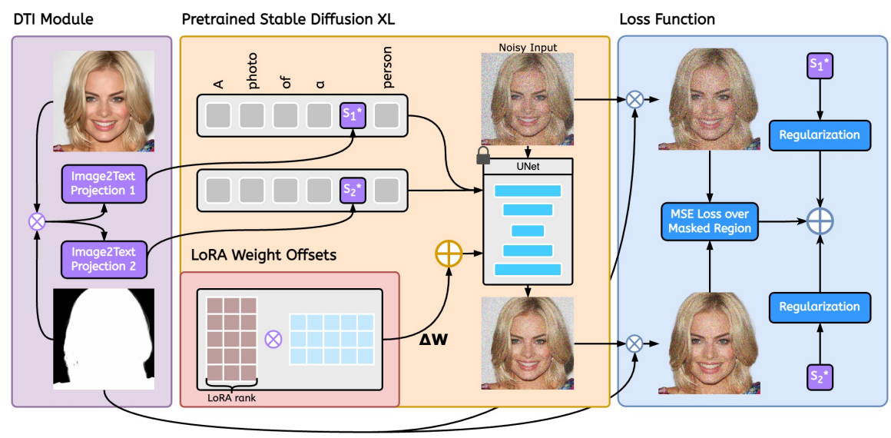

---
id: y2hjuvj1uysw0i7wtq0o4s9
title: '20231212'
desc: ''
updated: 1702360864306
created: 1702358634771
---

> 今天临时有事，没法详细总结，大家当看个list吧。

## MotionCrafter: One-Shot Motion Customization of Diffusion Models

  

## Disentangled Representation Learning for Controllable Person Image Generation
#解耦
#human

  

## HumanCoser: Layered 3D Human Generation via Semantic-Aware Diffusion Model
#human
#_3D_generation

  

## R2Human: Real-Time 3D Human Appearance Rendering from a Single Image
#human
#_3D_generation

  

## InteractDiffusion: Interaction Control in Text-to-Image Diffusion Models
#interaction
#text2img

  

## A Video is Worth 256 Bases: Spatial-Temporal Expectation-Maximization Inversion for Zero-Shot Video Editing
#Video
#video_generation
#video_editing

  

## CONFORM: Contrast is All You Need For High-Fidelity Text-to-Image Diffusion Models
#text2img
#Diffusion_contrastive

  

## Stellar: Systematic Evaluation of Human-Centric Personalized Text-to-Image Methods
#human
#Customization

  

## DisControlFace: Disentangled Control for Personalized Facial Image Editing
#face
#Customization

  

## PortraitBooth: A Versatile Portrait Model for Fast Identity-preserved Personalization
#Customization
#身份保存

  

## DreamControl: Control-Based Text-to-3D Generation with 3D Self-Prior
#Text23D

  

## HOI-Diff: Text-Driven Synthesis of 3D Human-Object Interactions using Diffusion Models
#human
#interaction
#_3D_generation

  

## ControlNet-XS: Designing an Efficient and Effective Architecture for Controlling Text-to-Image Diffusion Models
#controlNet

  

## Flexible visual prompts for in-context learning in computer vision
#In-context-Learning

  

## CAD : Photorealistic 3D Generation via Adversarial Distillation
#_3D_generation
#Text23D

  

## Photorealistic Video Generation with Diffusion Models
#video_generation
#Video

  

## Learning Naturally Aggregated Appearance for Efficient 3D Editing
#scene_editing_3D

  

## Sherpa3D: Boosting High-Fidelity Text-to-3D Generation via Coarse 3D Prior
#_3D_generation

  

## 4M: Massively Multimodal Masked Modeling
#MLLM

  

