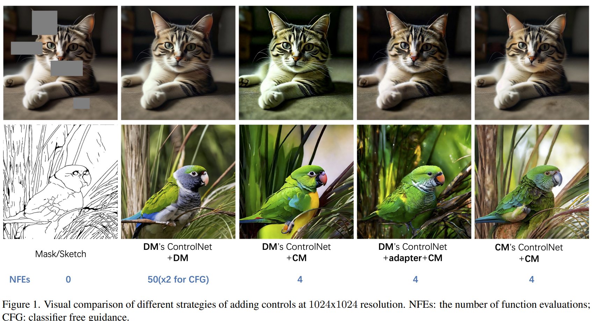

#! https://zhuanlan.zhihu.com/p/671988914
---
id: hzru27uvv2u47t9p3bqgr9m
title: '20231213'
desc: ''
updated: 1702445170760
created: 1702442647589
---

## FreeControl: Training-Free Spatial Control of Any Text-to-Image Diffusion Model with Any Condition
#image_generation
#controlNet

  

- **研究背景**：文本到图像（T2I）扩散模型是一种可以根据文本描述生成高质量图像的人工智能技术。然而，仅仅使用文本描述往往不能满足人类在视觉内容创作中的多样化需求和偏好。因此，一些研究人员提出了可控的T2I扩散方法，它们可以让用户通过提供一个额外的空间条件（例如，草图、深度图、人体姿态等）来指定期望的图像布局和组合。但是，这些方法的一个缺点是，**它们需要对每种空间条件、模型结构和模型检查点进行额外的训练，这是非常耗时和浪费的，甚至有时是不可行的。**
- **研究动机**：为了解决这个问题，这篇论文的**作者提出了一个通用的零样本（training-free）方法，它可以在不修改预训练的T2I扩散模型的情况下，实现对任何空间条件、模型结构和模型检查点的可控图像生成**。他们的**动机是，预训练的T2I扩散模型在生成过程中的中间特征已经捕捉了文本描述中的空间结构和局部外观信息。通过对这些特征进行线性子空间建模和引导，他们可以有效地将生成过程引向与空间条件相似的结构，同时保留文本描述中的外观信息。**
- **研究方法**：这篇论文的方法分为两个阶段：分析阶段和合成阶段。在分析阶段，他们使用预训练的T2I扩散模型生成一些种子图像，这些图像与文本描述中的目标概念相关，然后对这些图像的扩散特征进行主成分分析（PCA），得到一组时间相关的语义基（semantic bases），它们可以表示图像的语义结构。然后，他们对空间条件图像进行扩散反演（DDIM inversion），并将其扩散特征投影到语义基上，得到其语义坐标（semantic coordinates）。在合成阶段，他们使用结构引导（structure guidance）在语义子空间中促进生成图像的结构与空间条件图像的结构对齐，同时使用外观引导（appearance guidance）从一个没有结构控制的兄弟图像（sibling image）中借用外观细节，使生成图像的外观与文本描述相符。
- **贡献和创新点**：这篇论文的主要贡献和创新点有以下几点：
    - **提出了一种新颖的零样本方法，通过对预训练的T2I扩散模型的特征空间进行建模和引导，实现了对任何空间条件、模型结构和模型检查点的可控图像生成。**
    - **提出了一种结构引导和外观引导的组合方法，可以在保证结构对齐的同时，避免外观泄露的问题，生成与文本描述相符的高质量图像。**
    - **展示了方法的通用性和灵活性，支持多种空间条件类型（包括一些难以构造训练对的条件），多种模型结构（包括最新的稳定扩散模型），以及多种定制化的模型检查点（包括使用DreamBooth和LoRA等技术定制的模型）。**
    - **在广泛的定性和定量实验中，证明了方法的优越性，与之前的零样本方法相比，在结构保留、图文对齐和外观多样性方面都有显著提升，与之前的训练方法相比，在图文对齐方面有更强的表现，同时在结构保留和外观多样性方面也有竞争力。**
- **相关工作**：这篇论文的相关工作主要包括以下几个方面：
    - **文本到图像扩散**：这是一种将图像生成建模为一个迭代去噪任务的人工智能技术，它可以根据文本描述生成高质量的图像。这种技术的代表性工作有[4, 42]等。
    - **可控的文本到图像扩散**：这是一种在文本到图像扩散的基础上，增加了一个额外的空间条件输入，让用户可以指定期望的图像布局和组合的技术。这种技术的代表性工作有[6, 30, 33, 55, 59, 62]等，它们都需要对每种空间条件进行额外的训练，有较高的训练成本和较差的可扩展性。
    - **文本驱动的图像到图像转换**：这是一种将图像从一个源域转换到一个目标域的技术，它可以使用文本描述来指定目标域。这种技术的代表性工作有[8, 26, 33, 59, 61, 62]等，它们都需要对预训练的模型进行微调，以使其适应输入图像的条件。另一方面，一些零样本的方法[20, 31, 37, 53]可以直接对预训练的模型进行操作，实现零样本的图像转换，但是它们需要输入图像具有丰富的纹理，而不能处理抽象的布局（例如，深度图）。
    - **定制化的文本到图像扩散**：这是一种通过对预训练的模型在自定义对象或风格的图像上进行微调，来实现定制化图像生成的技术。这种技术的代表性工作有[5, 17, 27, 46]等，它们通过在文本描述中插入专用的标记来指定自定义的概念。

## FreeInit: Bridging Initialization Gap in Video Diffusion Models
#Video
#video_generation

  

- **研究背景**：视频生成是一种用人工智能来创造视频的技术，它可以根据一些输入的信息，比如文字、图片、音乐等，来合成一段视频。视频生成有很多应用，比如娱乐、教育、广告等。但是**视频生成也是一项非常困难的任务，因为视频不仅要在画面上清晰逼真，还要在时间上连贯一致**。目前有很多方法来做视频生成，其中一种叫做扩散模型（diffusion models），它是一种用概率的方式来生成视频的方法，它可以生成很高分辨率的视频，但是它的缺点是生成的视频在时间上不够稳定，有时候会出现抖动或者变形的现象，这就影响了视频的质量。
- **研究动机**：这篇论文的作者发现，**扩散模型在生成视频的时候，有一个很重要的步骤叫做初始化（initialization），就是在开始生成视频之前，先给一个随机的噪声（noise），然后用扩散模型来逐渐把这个噪声变成视频**。但是**这个噪声的选择对视频的质量有很大的影响，如果这个噪声太随机，就会导致生成的视频在时间上不连贯，如果这个噪声太有规律，就会导致生成的视频太单调**。所以，这篇论文的**动机就是要找到一种合适的噪声，既能保证视频的多样性，又能保证视频的稳定性。**
- **研究方法**：这篇论文**提出了一种新的方法，叫做FreeInit，它的思路是在生成视频的过程中，不断地改进噪声的质量，让它更适合生成视频**。具体来说，它的方法分为三个步骤：
    - 第一步，先用一个随机的噪声开始生成视频，这个噪声是没有任何规律的，所以生成的视频也会很不稳定，但是这个噪声可以保证视频的多样性。
    - 第二步，用扩散模型把生成的视频反过来变成噪声，这个噪声就会包含一些视频的信息，比如颜色、形状、运动等，所以这个噪声就会有一些规律，这些规律可以帮助生成更稳定的视频。
    - 第三步，用一个特殊的方法，把第二步得到的噪声和一个新的随机噪声混合在一起，这样就可以得到一个既有规律又有随机性的噪声，这个噪声就是更好的初始化，然后用这个噪声再次生成视频，这样就可以得到更高质量的视频。
    - 这三个步骤可以重复多次，每次都可以得到更好的噪声和更好的视频，这就是FreeInit的方法。
- **贡献和创新点**：这篇论文的主要贡献和创新点有以下几点：
    - 它是第一篇系统地分析了扩散模型的噪声初始化问题的论文，它发现了噪声初始化在频率域上存在一个训练和推理的差距，这个差距会导致生成视频的质量下降。
    - 它提出了一种简单而有效的方法，FreeInit，来在推理时改进噪声的质量，它通过迭代地优化噪声的空间和时间的低频成分，来弥补训练和推理的差距，从而有效地提高了生成视频的稳定性和外观。¹[1]
    - 它在多个文本到视频的扩散模型上进行了广泛的实验，证明了FreeInit的方法可以一致地提高生成视频的质量，而且不需要额外的训练或者调整参数。
- **相关工作**：这篇论文的相关工作主要包括以下几个方面：
    - 视频生成模型：有很多方法来做视频生成，其中一种叫做GAN（生成对抗网络），它是一种用两个网络互相竞争来生成视频的方法，比如StyleGAN-V，MoCoGAN-HD等。还有一种叫做变换器（transformer），它是一种用自回归的方式来生成视频的方法，比如Phenaki，CogVideo，NUWA等。最近，扩散模型也在文本到图像的生成上取得了很好的效果，比如GLIDE，SDXL等，所以很多研究者也尝试把扩散模型用在文本到视频的生成上，比如VideoCrafter，AnimateDiff，ModelScope等。这篇论文的方法是建立在扩散模型的基础上的，它可以改进扩散模型的视频生成质量。
    - 扩散模型的噪声问题：只有很少的一些论文提到了扩散模型的噪声问题，比如有些论文发现，扩散模型在训练的时候，不能完全地把图像的信息破坏掉，导致生成的图像的亮度和颜色有限制，所以提出了一些方法来调整训练的噪声分布，比如Rescale，Exploit等。还有一些论文关注了扩散模型的推理的噪声问题，比如有些论文设计了一些特殊的噪声分布来生成更长的视频，比如Reuse，Freenoise等。这篇论文的方法也是关注了推理的噪声问题，但是它的目的是提高视频的质量，而且它提出了一种在频率域上操作噪声的方法，这是一个新的思路。

## Separate-and-Enhance: Compositional Finetuning for Text2Image Diffusion Models
#text2img
#重点关注

  

- **研究背景**：生成图片是人工智能的一个重要领域，它可以帮助人们实现很多有趣的应用，比如创作艺术作品，设计产品，或者做教育和娱乐。其中，根据文字描述生成图片是一个很具有挑战性的任务，因为文字描述可以包含很多复杂的信息，比如不同的物体，属性，和关系。要生成一张符合文字描述的图片，需要让图片中的每个物体都和文字描述中的每个词语相对应，这就是所谓的**text-image alignment**（文字-图片对齐）。目前，有一种很强大的方法来生成图片，叫做**diffusion models**（扩散模型），它们可以生成很逼真的图片，但是它们在处理多个物体的情况下，往往会出现**compositional misalignment**（组合失配）的问题，**就是说图片中的物体和文字描述中的物体不一致，或者位置和形状不正确，或者缺少一些物体，或者多出一些物体。**

- **研究动机**：为了解决这个问题，这篇论文的作者分析了扩散模型中的一个重要的部分，叫做**cross-attention**（交叉注意力），它是用来让图片中的每个像素和文字描述中的每个词语进行交互的。作者发现，交叉注意力有两个主要的问题，导致了组合失配：（1）**attention mask overlap**（注意力掩码重叠），就是说不同的物体的注意力掩码会互相覆盖，导致物体的边界模糊，或者物体融合在一起；（2）**low attention activation**（注意力激活低），就是说某些物体的注意力激活值很低，导致物体的细节丢失，或者物体消失不见。作者认为，要解决这个问题，需要同时考虑这两个方面，而不是只关注其中一个。

- **研究方法**：基于这个分析，作者提出了一种新的方法，叫做**Separate-and-Enhance**（分离和增强），它的目的是在**finetuning**（微调）的过程中，对扩散模型进行改进，让它能够更好地处理多个物体的情况。微调的意思是在一个已经训练好的模型的基础上，进行一些小的调整，让它适应新的任务或数据。作者提出了两个新的目标函数，分别是**Separate loss**（分离损失）和**Enhance loss**（增强损失），它们分别对应了上面提到的两个问题。分离损失的作用是让不同的物体的注意力掩码尽量分开，不要重叠，这样就可以保持物体的独立性和完整性。增强损失的作用是让每个物体的注意力激活值尽量高，不要太低，这样就可以保持物体的清晰度和可见性。作者还设计了一种有效的微调方案，只对交叉注意力中的一部分参数进行微调，这样就可以节省计算资源，而且不会影响模型的其他功能。

- **贡献和创新点**：这篇论文的主要贡献和创新点有以下几点：（1）它分析了扩散模型中的交叉注意力的问题，揭示了组合失配的根本原因；（2）它提出了两个新的目标函数，分别针对注意力掩码重叠和注意力激活低这两个问题，提高了文字-图片对齐的能力；（3）它设计了一种有效的微调方案，只对交叉注意力中的关键参数进行微调，提高了模型的可扩展性和泛化性；（4）它在多个实验中，验证了它的方法在生成图片的真实性，文字-图片对齐，和适应性方面，都优于现有的方法，特别是在处理多个物体和新颖的物体的情况下，表现出了很强的组合能力。

- **相关工作**：这篇论文的相关工作主要有两个方面：（1）根据文字描述生成图片的方法，这是一个很热门的研究话题，有很多不同的方法，比如基于生成对抗网络（GANs）[4, 11, 44, 46, 50]，基于变分自编码器（VAEs）[28]，和基于扩散模型[12, 24, 29, 31, 33, 45]。其中，扩散模型是最近最有前景的方法，它可以生成很高质量的图片，但是它也有一些缺点，比如组合失配的问题，这就是这篇论文要解决的问题；（2）改进扩散模型的组合能力的方法，这是一个很具有挑战性的任务，有一些现有的方法，比如在测试的时候对潜在特征进行调整[2, 6, 21, 22]，或者在训练的时候使用额外的输入或监督[10, 17, 23, 35]。这些方法都有一些局限性，比如缺乏泛化性，增加了计算时间，或者需要更多的数据。这篇论文的方法不需要这些，它只需要对模型的一部分参数进行微调，就可以提高模型的组合能力。

## COLMAP-Free 3D Gaussian Splatting

  

- **研究背景**：在计算机视觉和图形学领域，有一个很重要的任务就是从图片中恢复出三维的信息，比如物体的形状、颜色、光照等。这样就可以用计算机来模拟真实的场景，或者创造出虚拟的场景。这对于很多应用，比如游戏、电影、教育、医疗等都有很大的价值。但是，要从图片中恢复出三维信息，通常需要知道每张图片的相机位置，也就是相机在空间中的方向和距离。这些信息可以用一些特殊的算法来计算，比如COLMAP [37]，但是这些算法很耗时，而且有时候会失败，比如当图片中的物体没有明显的特征或者有重复的部分的时候。所以，有些研究者想要找到一种方法，可以不用预先计算相机位置，就能从图片中恢复出三维信息。

- **研究动机**：最近，有一种新的方法叫做Neural Radiance Fields (NeRFs [25])，它可以用神经网络来表示三维场景，并且可以用光线追踪的技术来从任意视角生成高质量的图片。这种方法在重建真实场景和生成新视角的图片方面取得了很好的效果，但是它也需要预先计算相机位置。虽然有一些工作尝试在训练NeRFs的同时估计相机位置，但是它们都有一些限制，比如需要一些额外的信息，比如深度图或者光流图，或者只能处理一些简单的相机运动，比如正面的旋转，或者需要很长的训练时间，比如30个小时。所以，这篇论文的动机是提出一种新的方法，可以不用预先计算相机位置，就能用NeRFs来重建三维场景并生成新视角的图片，并且可以处理复杂的相机运动，比如360度的旋转，并且可以快速地训练和渲染。

- **研究方法**：这篇论文的方法是基于一种叫做3D Gaussian Splatting的技术，它是一种用点云来表示三维场景的方法，不同于NeRFs用神经网络来表示三维场景。点云是一种由很多三维的点组成的数据结构，每个点可以有自己的颜色、形状、透明度等属性。3D Gaussian Splatting是一种用高斯函数来描述每个点的属性的方法，高斯函数是一种常见的数学函数，它可以用一个中心点和一个协方差矩阵来定义，协方差矩阵可以描述高斯函数的形状和方向。用高斯函数来描述点云的好处是，它可以用一种可微分的方式来渲染点云到图片，也就是说，可以用梯度下降的方法来优化点云的参数，使得渲染出来的图片和真实的图片尽量接近。这篇论文的方法是用3D Gaussian Splatting来表示三维场景，并且用一种分步的方式来估计相机位置和优化点云的参数。具体来说，它有两个步骤：（1）用局部的3D Gaussian Splatting来估计相邻两帧图片之间的相对相机位置，这个步骤是通过把前一帧的点云用一个可学习的仿射变换（包括平移和旋转）变换到后一帧的视角，然后用渲染的图片和真实的图片的差异来优化这个变换。（2）用全局的3D Gaussian Splatting来重建整个场景，这个步骤是通过把每一帧的点云和相机位置都加入到一个全局的点云模型中，然后用所有的图片和相机位置来优化这个模型。这个步骤还会不断地增加点云的密度，也就是增加更多的高斯函数，来覆盖更多的场景细节。这两个步骤是交替进行的，每次处理一个新的图片，就会更新一次全局的点云模型，这样就可以逐渐地从图片中恢复出三维场景和相机位置。

- **贡献和创新点**：这篇论文的主要贡献和创新点有以下几点：（1）它提出了一种新的方法，可以不用预先计算相机位置，就能用3D Gaussian Splatting来重建三维场景并生成新视角的图片。（2）它利用了视频中的时间连续性，用一种分步的方式来估计相机位置和优化点云参数，这样可以提高优化的稳定性和效率。（3）它用了一种显式的点云表示，不同于NeRFs用的隐式的神经网络表示，这样可以直接对点云进行变换和渲染，而不需要通过光线追踪的过程。（4）它在两个真实的数据集上进行了实验，分别是Tanks and Temples [17]和CO3D [32]，并且在重建质量和相机位置精度方面都超过了之前的方法，而且训练和渲染的速度都很快。¹[1]

## CCM: Adding Conditional Controls to Text-to-Image Consistency Models
#text2img
#可控

  

- **研究背景**：一致性模型是一种可以快速高质量地生成图像的模型，它可以从文本描述中生成对应的图像。但是，目前还没有探索如何给这种模型添加新的条件控制，比如边缘、深度、人体姿态等，来让生成的图像更符合用户的需求和偏好。
- **研究动机**：作者受到了ControlNet的启发，它是一种可以给另一种图像生成模型——扩散模型——添加条件控制的方法。**作者想要探索是否有有效的方法可以训练ControlNet来给一致性模型添加条件控制，从而提高一致性模型的灵活性和可定制性。**
- **研究方法**：作者提出了三种训练ControlNet的策略。第一种是直接使用基于扩散模型的ControlNet来给一致性模型添加条件控制，这种方法的优点是可以复用现有的ControlNet，但是缺点是可能会有性能损失和训练不直接的问题。第二种是使用一致性训练的技术，把预训练的文本到图像的一致性模型和ControlNet作为一个新的条件一致性模型，只训练ControlNet的参数，这种方法的优点是可以直接基于一致性模型训练定制的ControlNet，但是缺点是需要从头开始训练。第三种是在第二种的基础上，增加了一个轻量级的适配器，可以在多个条件下联合优化，从而实现快速地把扩散模型的ControlNet转移到一致性模型上，这种方法的优点是可以平衡效果和便利性，但是缺点是需要额外的适配器参数。
- **贡献和创新点**：作者的主要贡献和创新点有以下几点：
    - **首次探索了给一致性模型添加条件控制的问题**，并提出了三种不同的策略，分别利用了扩散模型和一致性模型的联系和差异。
    - **提出了一致性训练的技术来训练ControlNet**，并证明了这种方法可以从零开始训练出高质量的条件控制，而不依赖于扩散模型。
    - **提出了一个统一的适配器来实现多条件的快速转移**，并展示了这种方法可以提高直接使用扩散模型的ControlNet的效果，同时保持一致性模型的速度优势。
- **相关工作**：作者的工作主要涉及到以下几个方面的相关工作：
    - **实时图像生成**：这方面的工作主要是通过各种方法来加速扩散模型的采样过程，比如渐进式蒸馏、引导蒸馏、InstaFlow等，还有一些工作是通过对抗训练来增强蒸馏的效果，比如UFOGen、CTM、ADD等。
    - **一致性模型**：这方面的工作主要是提出了一种新的图像生成模型，它可以通过沿着一个概率流微分方程的轨迹来实现自我一致性，比如CM、LCM、LCM LoRA等。
    - **可控制的图像生成**：这方面的工作主要是利用不同的条件控制来实现图像生成的定制化，比如ControlNet、Composer、UniControl、Uni-ControlNet等，还有一些工作是针对特定的用户需求和场景来设计的，比如DreamBooth、Custom Diffusion、Cones、Anydoor等。

## NVS-Adapter: Plug-and-Play Novel View Synthesis from a Single Image
#NVS

  

- **研究背景**：从一张图片生成多个不同角度的图片，也就是所谓的**新视角合成**（Novel View Synthesis，简称NVS），是一项非常有用的技术，它可以让我们更好地理解图片中的物体或场景的三维结构，也可以用于增强现实、虚拟现实、游戏等领域。然而，这项技术也非常困难，因为图片中只包含了有限的信息，而生成的图片需要填补一些看不见或被遮挡的部分。为了解决这个问题，一些研究人员利用了**文本到图片**（Text-to-Image，简称T2I）的模型，这些模型可以根据一段文字描述生成一张图片。他们认为，这些模型已经学习了很多关于不同物体和场景的知识，所以可以用来生成新的视角的图片。但是，这些方法通常需要对原来的模型进行大量的调整，这样会增加计算成本，也会降低模型的泛化能力，也就是说，模型可能会忘记如何生成其他类型的图片。

- **研究动机**：基于上述背景，这篇论文的研究动机是提出一种**插入式**（plug-and-play）的方法，可以在不改变原来的T2I模型的参数的情况下，**让它能够从一张图片生成多个不同角度的图片**。这样，既可以保留T2I模型的原有能力，也可以提高NVS的效果。**这种方法的核心思想是在T2I模型的每一层中加入一个****适配器**（adapter），**这个适配器可以学习如何根据图片的内容和角度，调整模型的特征，使得生成的图片能够与原图片保持一致的几何和语义信息。**

- **研究方法**：这篇论文的研究方法主要包括两个部分：**视角一致性交叉注意力**（view-consistency cross-attention）和**全局语义调节**（global semantic conditioning）。视角一致性交叉注意力是指在每一层中，让每一个目标视角的特征与其他目标视角和参考视角的特征进行交互，从而学习视角之间的对应关系，同时聚合多个视角的信息。全局语义调节是指在每一层中，利用参考视角的图像特征作为全局的条件，来调节每一个目标视角的特征，从而保证生成的图片与参考图片有相同的物体和场景。这两个部分都是通过多头注意力机制（multi-head attention）来实现的，这是一种常用的人工智能技术，可以让模型关注不同的信息。

- **贡献和创新点**：这篇论文的主要贡献和创新点有以下几点：
    - 提出了一种插入式的NVS适配器，可以在不改变T2I模型的参数的情况下，让它能够从一张图片生成多个不同角度的图片。
    - 提出了一种视角一致性交叉注意力，可以有效地对齐不同视角的特征，提供几何一致的多视角合成。
    - 提出了一种全局语义调节，可以利用参考视角的图像特征，调节目标视角的特征，保证生成的图片与参考图片有相同的物体和场景。
    - 在多个数据集上进行了实验，证明了NVS适配器的有效性和优越性，同时展示了它与其他插入式模块的兼容性。

- **相关工作**：这篇论文的相关工作主要包括以下几类：
    - 生成模型用于三维物体合成：这类工作主要是利用生成对抗网络（GAN）或扩散模型（diffusion model）来学习三维物体的隐式或显式表示，从而生成高质量的三维物体。
    - 文本到三维合成：这类工作主要是利用T2I模型来生成三维物体的表示，然后用一些技术如分数采样（score distillation sampling）或神经场（neural field）来重建三维物体的几何结构。
    - T2I模型用于新视角合成：这类工作主要是对T2I模型进行一些修改或微调，让它能够根据一张图片和一个相机角度，生成一个新的视角的图片。这类工作通常需要大量的计算资源，也会降低T2I模型的泛化能力。

## PEEKABOO: Interactive Video Generation via Masked-Diffusion
#Video
#video_editing
#video_generation

  

- **研究背景**：视频是一种非常流行和有趣的媒体形式，它可以展示各种各样的场景和故事。但是，视频的制作是一项非常复杂和耗时的工作，需要很多的设备和技术。如果我们能够用人工智能技术来自动地生成视频，那么我们就可以更容易地创造出我们想要的视频内容，而不需要花费太多的时间和精力。这就是这篇论文要解决的问题。
- **研究动机**：目前，已经有一些人工智能技术可以根据文字描述来生成视频，这些技术叫做文本到视频生成（Text-to-Video Generation）。这些技术可以根据文字的含义来生成相关的视频画面，但是它们**缺乏用户的交互和控制**。也就是说，**用户不能够指定视频中的物体的位置，大小，姿态和运动，而只能接受人工智能生成的结果**。这样的话，用户就不能够表达他们的创意和偏好，也不能够生成更符合他们期望的视频。因此，**这篇论文的动机是要让用户能够通过输入一些简单的边界框（Bounding Box）来控制视频中的物体的空间和时间属性，从而实现交互式的视频生成（Interactive Video Generation）。**
- **研究方法**：这篇论文的研究方法是基于一种叫做扩散模型（Diffusion Model）的人工智能技术。扩散模型是一种可以从噪声中逐步恢复出清晰图像或视频的技术，它可以根据文字描述来生成视频。这篇论文提出了一种叫做PEEKABOO的模块，它可以在扩散模型的基础上增加用户的控制能力。PEEKABOO的原理是通过在扩散模型的三种注意力层（Attention Layer）中加入一些掩码（Mask），来控制视频中的物体的空间和时间属性。这些掩码可以让视频中的前景物体和背景物体在一定的步骤内相互隔离，从而实现空间和时间的控制。这就像是一个捉迷藏的游戏，前景物体和背景物体在一开始是看不到对方的，然后在后面的步骤中才能看到对方，从而融合在一起。
- **贡献和创新点**：这篇论文的主要贡献和创新点有以下几点：
    - 它是第一篇提出交互式视频生成的论文，它让用户能够通过输入边界框来控制视频中的物体的空间和时间属性，从而实现更多样化和个性化的视频生成。
    - 它提出了一种叫做PEEKABOO的模块，它是一种无需训练，无需额外计算的方法，它可以给任何基于扩散模型的视频生成模型增加用户的控制能力。
    - 它提出了一种新的评估交互式视频生成的基准和策略，它使用了两个数据集和四个指标来评估视频生成的质量和控制能力。
    - 它在多个数据集和模型上进行了广泛的实验，证明了PEEKABOO的有效性和通用性，它可以生成高质量和高控制的视频，甚至可以克服一些模型本身的缺陷和失败案例。
- **相关工作**：这篇论文的相关工作主要包括以下两个方面：
    - 文本到视频生成：这是一种利用人工智能技术根据文字描述来生成视频的技术，它有很多的应用场景和挑战。目前，最先进的文本到视频生成技术是基于扩散模型的，它们可以生成高质量和多样化的视频，但是它们缺乏用户的交互和控制能力。
    - 可控制的文本到图像生成：这是一种利用人工智能技术根据文字描述和一些额外的输入来生成图像的技术，它可以让用户控制图像中的物体的位置，大小，姿态和风格等属性。目前，有一些基于扩散模型的可控制的文本到图像生成技术，它们可以通过一些优化或掩码的方法来实现空间和风格的控制，但是它们不能直接应用到视频生成的场景，因为视频生成涉及到更复杂的时间和运动的控制。

## Learned representation-guided diffusion models for large-image generation
#text2img

  

- **研究背景**：这篇论文研究的是如何用人工智能生成高质量的大尺寸图片，比如医学上的组织切片图像和卫星上的地图图像。这些图片通常有很多细节和信息，所以用传统的方法生成它们很困难，需要很多的计算资源和人工标注。这篇论文想要找到一种更简单和有效的方法，来生成这些图片。
- **研究动机**：这篇论文的动机是利用一种叫做扩散模型的人工智能技术，来生成图片。扩散模型是一种可以从噪声中逐步恢复出清晰图片的技术，它可以生成很高质量和多样性的图片，而且不需要人工标注。但是，扩散模型也有一些限制，比如它需要一些额外的信息来指导生成的过程，比如图片的类别或者文字描述。这些信息在一些专业领域，比如医学和遥感，很难获取，而且不够细致。所以，这篇论文想要找到一种不需要人工标注，而且可以捕捉图片中细微差别的信息，来指导扩散模型生成图片。
- **研究方法**：这篇论文的方法是使用一种叫做自监督学习的人工智能技术，来提取图片中的特征。自监督学习是一种可以从图片本身学习有用信息的技术，它不需要人工标注，而是利用图片中的结构和模式，来训练一个特征提取器。这些特征可以表示图片中的语义和视觉信息，比如颜色，形状，纹理等。这篇论文使用了一些现有的自监督学习模型，比如HIPT，CTransPath，iBOT等，来提取图片中的特征，然后用这些特征作为扩散模型的指导信息，来生成图片。这样，扩散模型就可以根据自监督特征，来复原出图片中的细节和结构，而不需要人工标注。
- **贡献和创新点**：这篇论文的主要贡献和创新点有以下几点：
    - 它提出了一种新的方法，来训练扩散模型在大尺寸图片领域，比如医学和遥感，它不需要人工标注，而是使用自监督学习特征作为指导信息，这样可以节省很多的人力和资源，而且可以捕捉图片中的细微差别。
    - 它提出了一种新的框架，来生成任意大小的图片，它使用一个基于小块的扩散模型，然后根据一个空间排列的自监督特征网格，来合成大图片，这样可以保持图片中的局部和全局的一致性，而且不需要增加很多的计算量。
    - 它展示了它的方法在多种任务上的有效性，比如图片生成，图片增强，图片分类等，它可以生成高质量和多样性的图片，而且可以提高下游任务的性能，甚至可以生成一些没有见过的数据集的图片。
    - 它介绍了一种新的范式，叫做文本到大图片的生成，它可以利用文本描述，来生成医学和遥感的大图片，这样可以增加图片生成的可控性和可解释性，而且可以结合多模态的信息，比如类别，文字，基因等。
- **相关工作**：这篇论文的相关工作主要有以下几类：
    - 扩散模型：这是一种可以从噪声中逐步恢复出清晰图片的技术，它可以生成很高质量和多样性的图片，而且不需要人工标注。它的一些代表性的工作有[8, 24, 29, 38, 43]等。
    - 自监督学习：这是一种可以从图片本身学习有用信息的技术，它不需要人工标注，而是利用图片中的结构和模式，来训练一个特征提取器。它的一些代表性的工作有[5, 6, 11, 46]等。
    - 大图片生成：这是一种可以生成超过原始图片尺寸的图片的技术，它通常需要一些额外的信息来指导生成的过程，比如图片的类别或者文字描述。它的一些代表性的工作有[1, 3, 33, 40, 50]等。

## Neutral Editing Framework for Diffusion-based Video Editing
#video_editing
#Video

  

- **研究背景**：视频编辑是一种利用计算机技术对视频进行修改或创造的过程，它可以用于娱乐、教育、艺术等多种目的。视频编辑的难度在于要保持视频的连贯性、自然性和质量，同时满足用户的编辑需求。目前，有一种基于扩散模型的视频编辑方法，它可以利用文本作为输入条件，来指导视频的生成或修改。扩散模型是一种概率模型，它可以从随机噪声逐步恢复出清晰的图像或视频，它有很强的生成能力和灵活性。
- **研究动机**：尽管基于扩散模型的视频编辑方法有很多优点，但它们也存在一些局限性。首先，它们需要额外的输入信息，比如视频的原始文本描述，来进行视频的调整，这样才能保证视频的质量和语义。但是，这样的输入信息往往不容易获得，而且可能会影响编辑的效果。其次，它们很难进行复杂的非刚性编辑，比如改变视频中人或物体的动作，因为这样的编辑会与视频的原始内容产生冲突，导致不自然或不合理的结果。
- **研究方法**：为了解决这些问题，这篇论文提出了一种新的视频编辑框架，叫做中性编辑（Neutral Editing，简称NeuEdit）。这个框架的核心思想是引入一个新的概念，叫做中性化（neutralization）。中性化的目的是在视频和文本中去除或减弱与编辑相关的因素，从而使得视频编辑更加有效和灵活。中性化包括两个步骤：（1）因素识别，即在视频和文本中定位与编辑相关的因素，比如特定的像素或单词；（2）语义解耦，即在视频和文本中通过一些变换，来降低与编辑相关的因素的语义含义，比如模糊或替换。中性化的结果是一个中性视频和一个中性文本，它们可以作为扩散模型的输入，来进行视频的调整和编辑。
- **贡献和创新点**：这篇论文的主要贡献和创新点有以下几点：
    - 提出了一种新的视频编辑框架，NeuEdit，它可以实现复杂的非刚性编辑，比如改变视频中人或物体的动作，而不需要额外的输入信息，只需要一个目标文本描述。
    - 提出了一个新的概念，中性化，它可以在视频和文本中去除或减弱与编辑相关的因素，从而使得视频编辑更加有效和灵活。
    - 提出了两种中性化的方法，分别是文本中性化和视觉中性化，它们可以分别对文本和视频进行因素识别和语义解耦，从而生成中性文本和中性视频。
    - 在多个视频编辑数据集上进行了广泛的实验，验证了NeuEdit框架的适应性和视觉效果，以及中性化的有效性和敏感性。
- **相关工作**：这篇论文的相关工作主要包括以下几个方面：
    - 基于扩散模型的生成模型，它们可以从随机噪声逐步恢复出清晰的图像或视频，它们有很强的生成能力和灵活性。
    - 基于文本的图像和视频编辑，它们可以利用文本作为输入条件，来指导图像或视频的生成或修改，它们可以实现多样的编辑效果，比如风格转换、物体叠加、动作变化等。
    - 视频编辑的技术挑战，它们主要包括如何保持视频的连贯性、自然性和质量，以及如何满足用户的编辑需求，它们需要考虑视频的时空特性、语义一致性和用户交互等因素。