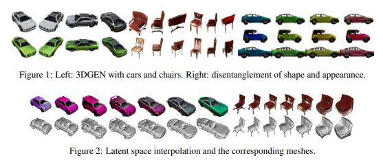
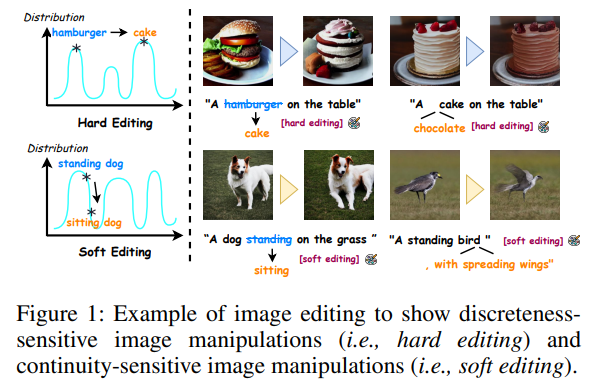
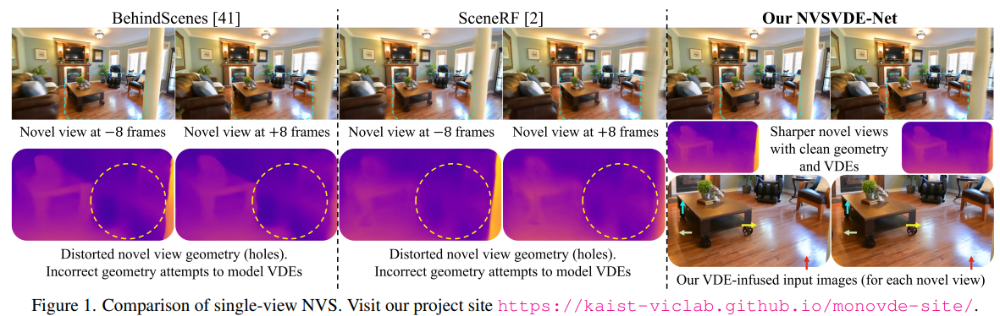
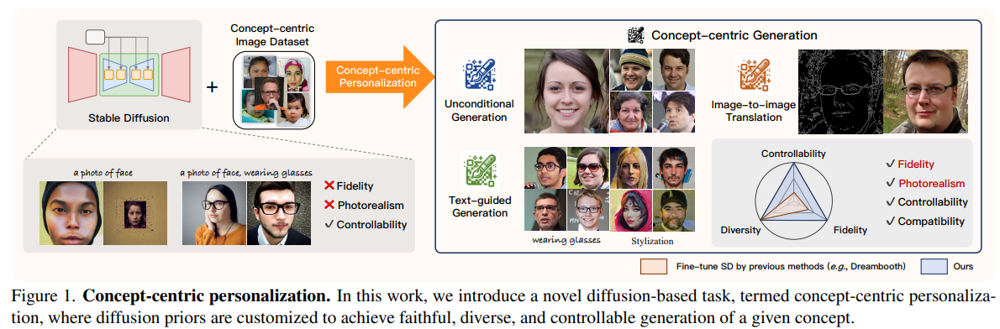
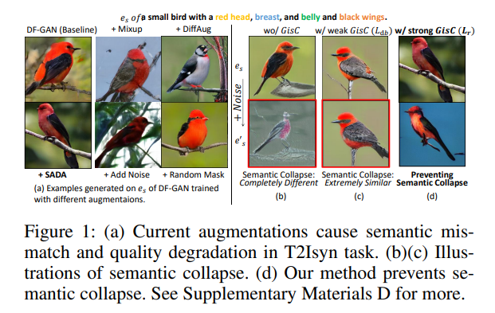
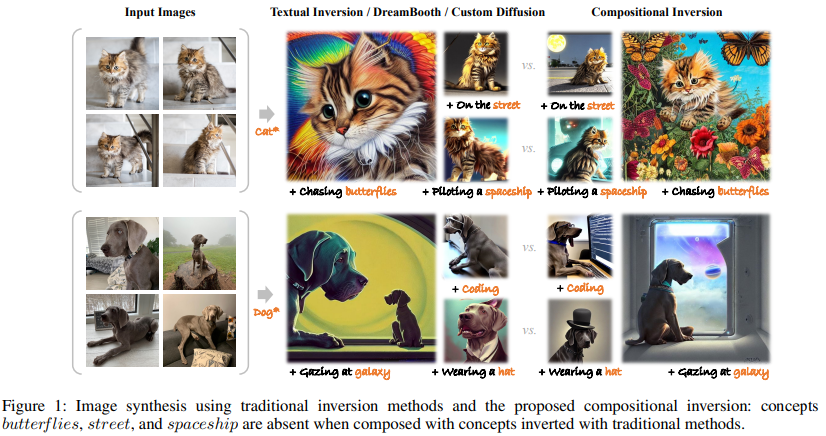
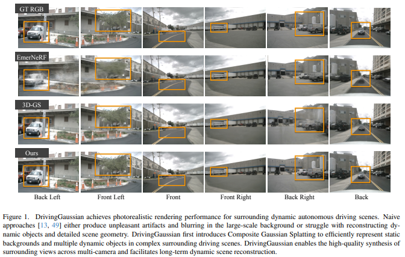

## STABLE RIVERS: A CASE STUDY IN THE APPLICATION OF TEXT-TO-IMAGE GENERATIVE MODELS FOR EARTH SCIENCES
#diffusion_应用

- **研究背景**
  - 论文探讨了**Text-to-Image (TTI) 生成模型**在地球科学领域的应用，特别是在**河流地貌学**领域。TTI模型能够根据文本提示生成逼真的图像，对于机器学习在地球科学中的应用具有潜在的促进作用。

- **研究动机**
  - 由于地球科学领域的数据挑战，如编码领域知识的困难、缺乏基准数据集和大量未标记数据，研究者提出利用TTI模型生成合成数据来增强现有数据集。

- **研究方法**
  - 研究团队使用**Stable Diffusion (v1.5)** 模型评估了训练数据中的偏见，并探索了**ControlNet**技术如何通过条件控制图来约束输出图像，以生成包含关键地貌和环境特征的河流图像。

- **贡献和创新点**
  - 论文提出了在TTI模型中使用条件控制技术的新方法，并强调了在敏感应用中使用这些模型时需要谨慎，以及进行领域特定的训练数据和图像生成偏见评估的重要性。

- **相关工作**
  - 论文回顾了多模态模型在地球科学研究中的潜力，以及TTI模型在生成逼真图像方面的最新进展，同时也指出了这些模型在实际和安全使用方面的局限性。

## 3DGEN: A GAN-based approach for generating novel 3D models from image data
#_3D_generation

  

当然可以，这篇论文介绍了一个名为**3DGEN**的模型，它是用于从图像数据生成新颖的3D模型的一种基于GAN的方法。以下是对这篇论文的简要介绍：

- **研究背景**: 这项研究是在**Neural Radiance Fields (NeRF)** 和**GAN-based image generation**的最新工作基础上进行的。NeRF用于从部分视图重建逼真的3D模型/场景，而GAN用于图像合成。

- **研究动机**: 尽管已有的如**Generative Radiance Fields (GRAF)** 开始将重建和生成结合起来，但它们无法生成适合3D原生创意环境的可信物体网格。因此，提出了3DGEN模型。

- **研究方法**: 3DGEN建立在GRAF和**UNISURF**之上，能够生成具有相应隐式表面的体积对象，从而容易导出到3D网格。

- **贡献和创新点**: 3DGEN能够学习仅由2D图像组成的数据集的辐射场和表面的潜在分布，并因此生成新的对象。它在推理时既能渲染任意角度的视图，也能轻松导出到网格表示。

- **相关工作**: 论文提到了**GRAF**和**UNISURF**，以及其他一些在3D模型重建和生成领域的工作，如**StableDiffusion**和**DALLE2**。

## AdapEdit: Spatio-Temporal Guided Adaptive Editing Algorithm for Text-Based Continuity-Sensitive Image Editing
#image_editing

  

- **研究背景**
  这项研究关注的是基于文本的图像编辑，特别是那些与主题绑定但语义上微妙变化的指令，如动作、姿势或形容词等（即“软编辑”）。这种编辑对于生成用户定制的视觉内容至关重要。

- **研究动机**
  现有的文本驱动图像编辑方法主要集中在简单的编辑指令上，如添加、移除或替换特定对象（即“硬编辑”），而忽略了“软编辑”。此外，之前的方法在编辑过程中对每个像素和文本词汇使用相同的引导程度，可能导致不期望区域的错误和语义不连贯性。

- **研究方法**
  本研究提出了一种空间-时间引导的自适应编辑算法**AdapEdit**，通过引入软注意力策略，动态地从编辑条件到视觉像素的引导程度，从空间和时间两个角度进行自适应图像编辑。

- **贡献和创新点**
  - **软编辑能力增强**：增强了支持更复杂编辑任务的能力，如软编辑任务，以更好地生成用户定制的图像场景。
  - **编辑自然性和上下文连续性改进**：通过分配可变的空间-时间引导尺度，显著提高了编辑图像的自然性和上下文语义连贯性。
  - **无需训练且不破坏模型先验**：由于开发了确定性自适应算法，几乎不需要训练成本，如训练数据、注释、额外的优化目标和巨大的GPU开销。

- **相关工作**
  论文回顾了基于扩散的生成模型、文本引导的图像合成模型和文本引导的图像编辑模型的相关研究。特别提到了Stable Diffusion和ControlNet等领先研究，以及Prompt-to-Prompt、DreamBooth等一系列图像编辑方法。

## Novel View Synthesis with View-Dependent Effects from a Single Image
#NVS
  

- **研究背景**
  这项研究考虑了将**视觉依赖效果**（View-Dependent Effects, VDEs）纳入基于单张图片的新视角合成（Novel View Synthesis, NVS）问题中。作者提出了一种新方法，利用相机运动先验来模拟场景中的负视差，从而实现VDEs。

- **研究动机**
  传统的NVS方法在只有单一视图可用时受到限制，因为它们不能利用自然场景中常见的纹理和深度线索。**本研究旨在通过仅使用图像序列来学习NVS，这是一种完全自监督的学习方法，不需要深度或相机姿态注释。**

- **研究方法**
  本文提出了一种名为**NVSVDE-Net**的网络，它通过聚合输入像素颜色来融入VDEs，并提出了一种新的“放松体积渲染”近似方法，允许从单张图片高效渲染新视角。

- **贡献和创新点**
  - 首次提出了一种带有VDEs的单视图NVS方法。
  - NVSVDE-Net是第一个完全自监督训练的网络，不需要深度或姿态注释。
  - 提出了一种新的放松体积渲染近似方法，提高了渲染效率。

- **相关工作**
  论文回顾了与单视图NVS相关的工作，包括基于多平面图像（MPI）的方法、基于NeRF的方法和生成模型，以及如何处理VDEs。这些工作为本研究提供了理论和技术背景。

## Concept-centric Personalization with Large-scale Diffusion Priors
#Customization

  

- **研究背景**
  - 这项研究关注于**大规模扩散模型**（large-scale diffusion models）在生成多样化内容方面的能力，同时指出这些模型在生成特定概念（specific concepts）的**真实性**（photorealism）和**忠实度**（fidelity）方面存在不足。

- **研究动机**
  - 作者提出了**概念中心个性化**（concept-centric personalization）的任务，旨在通过定制大规模扩散先验来生成高质量的概念中心图像，同时保持开放世界模型固有的多样化控制能力。

- **研究方法**
  - 提出了一种**指导解耦个性化框架**（guidance-decoupled personalization framework），通过将条件指导分为**概念指导**（concept guidance）和**控制指导**（control guidance），并引入**广义无分类指导**（Generalized Classifier-free Guidance, GCFG）理论。

- **贡献和创新点**
  - 引入了概念中心个性化任务，并提出了**空文本概念中心扩散模型**（null-text Concept-centric Diffusion Model），无需文本注释即可学习概念指导。
  - 探索了GCFG在扩散模型中的潜力，包括解释和扩展**负提示**（negative prompt）机制，以及提出**条件解耦**（condition decoupling）技术。

- **相关工作**
  - 论文回顾了**文本到图像生成**（Text-to-image Generation）、**主题中心个性化**（Subject-centric Personalization）、**真实性和控制权的权衡**（Fidelity and Controllability tradeoff）以及**扩散模型的指导**（Guidance of Diffusion Models）等领域的相关研究。

## Semantic-aware Data Augmentation for Text-to-image Synthesis
#text2img

  

**研究背景**
- **Text-to-image synthesis (T2Isyn)** 是视觉语言学习社区的一个主流任务，已经取得了巨大的成果。¹[1]

**研究动机**
- 尽管图像和文本增强是正规化视觉语言模型的两种流行方法，但现有的T2I方法在语义匹配和避免语义崩溃方面仍存在局限性。

**研究方法**
- 本文提出了一种新颖的**Semantic-aware Data Augmentation (SADA)** 框架，包括**Implicit Textual Semantic Preserving Augmentation (IT A)** 和**Generated Image Semantic Conservation (GisC)**。²[2]³[3]

**贡献和创新点**
- SADA能够改善文本-图像一致性，并通过理论保证避免语义崩溃，提高图像质量。
- **IT A** 通过在语义空间中增强文本来保持语义，而**Lr** 作为GisC的一部分，通过限制生成图像的语义偏移来防止语义崩溃。

**相关工作**
- 相关研究包括使用预训练编码器产生的感知损失的注意力堆叠GANs、单向输出融合GANs、带有变压器的VAE-GANs，以及扩散模型（DMs）。

## Compositional Inversion for Stable Diffusion Models
#Customization

  

- **研究背景**
  这篇论文讨论了**稳定扩散模型**中的**组合反演**问题。稳定扩散模型是一种用于图像合成的技术，可以根据文本提示生成图像。

- **研究动机**
  作者指出，现有的**文本反演方法**在合成个性化图像时，会遇到过拟合问题，导致其他想要的概念缺失。这是因为在反演过程中，用户图像中的不相关语义也被编码，影响了概念的组合性。

- **研究方法**
  为了解决这个问题，作者提出了一种新的方法，引导反演过程更接近于嵌入空间的核心分布，并引入了空间正则化方法来平衡被组合概念的注意力。

- **贡献和创新点**
  该方法作为一个**后训练方法**，可以与其他反演方法无缝集成。实验结果显示，这种方法能够减轻过拟合问题，并生成更多样化和平衡的概念组合图像。

- **相关工作**
  论文还讨论了**文本到图像合成**的相关工作，包括生成对抗网络（GANs）、扩散模型等，并对比了其他一些反演方法，如**DreamBooth**和**Custom Diffusion**。

## DrivingGaussian: Composite Gaussian Splatting for Surrounding Dynamic Autonomous Driving Scenes

  

- **研究背景**
  这篇论文介绍了一个名为**DrivingGaussian**的框架，它用于高效且有效地处理周围动态自动驾驶场景。在自动驾驶领域，理解和建模大规模动态场景对于3D场景理解和一系列自动驾驶任务至关重要。

- **研究动机**
  作者指出，从车载传感器的稀疏数据中重建复杂的3D场景是具有挑战性的，尤其是在自我车辆高速移动的情况下。此外，现有的基于NeRF的方法在处理多摄像头设置和高速场景时存在计算密集和视图重叠不足的问题。

- **研究方法**
  论文提出了**Composite Gaussian Splatting**，这是一种新颖的方法，用于分解整个场景为静态背景和动态对象，并分别重建每个部分。它包括**Incremental Static 3D Gaussians**和**Composite Dynamic Gaussian Graph**两个模块，以及利用**LiDAR prior**来增强场景细节和全景一致性。

- **贡献和创新点**
  DrivingGaussian是第一个基于Composite Gaussian Splatting来表示大规模动态驾驶场景的框架。它通过两个新颖的模块来重建静态背景和模拟多个动态对象，并通过LiDAR先验来恢复完整的几何结构。

- **相关工作**
  论文讨论了NeRF在有界和无界场景中的应用，以及3D Gaussian Splatting在静态场景中的应用。同时，它也提到了一些扩展到动态对象/场景的工作，但这些方法在处理快速移动的动态对象和复杂的遮挡关系时存在挑战。

## A COMPACT AND SEMANTIC LATENT SPACE FOR DISENTANGLED AND CONTROLLABLE IMAGE EDITING

  
    

- **研究背景**
  这篇论文讨论了**生成对抗网络**（GANs）在图像编辑方面的应用。特别是，它关注于如何通过控制GANs的潜在空间来独立编辑图像的不同属性。

- **研究动机**
  尽管GANs能够实现逼真的图像修改，但它们通常缺乏**属性解耦**（即能够独立编辑各个属性）的能力。因此，研究者提出了一种方法来改进这一点。

- **研究方法**
  他们提出了一个**自动编码器**，用于重新组织StyleGAN的潜在空间，使得每个想要编辑的属性都对应一个轴，并且这些轴是**去相关的**，以鼓励属性解耦。

- **贡献和创新点**
  该方法通过使用**主成分分析**（PCA）在压缩的潜在空间中工作，并通过特定的**损失函数**训练自动编码器，实现了更好的属性解耦和控制，同时保持了图像的真实性。

- **相关工作**
  论文还讨论了其他一些方法，如InterfaceGAN和GANSpace，它们也尝试通过操纵潜在空间来编辑图像，但这些方法通常与本文提出的方法相比，要么不够通用，要么在训练时算法成本较高。

这篇论文的核心在于提出了一种新的方法，通过对GANs的潜在空间进行有效的重组和控制，来改善图像编辑的质量和灵活性。