---
id: 8lihbgmiit53ir9zx6xipsg
title: '20231215'
desc: ''
updated: 1702621122318
created: 1702619189038
---

## FineControlNet: Fine-level Text Control for Image Generation with Spatially Aligned Text Control Injection
#可控
#controlNet

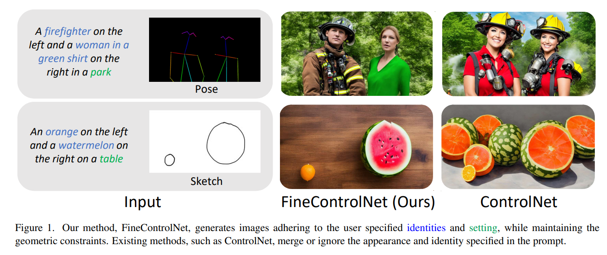  

## SHAP-EDITOR: Instruction-guided Latent 3D Editing in Seconds
#scene_editing_3D
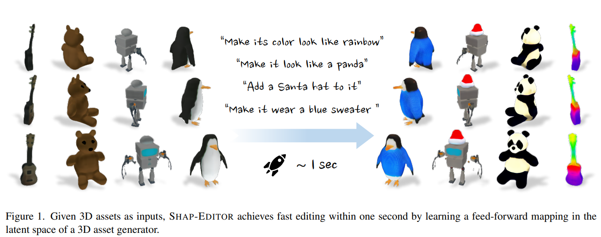  

## Text2Immersion: Generative Immersive Scene with 3D Gaussians
#Text23D
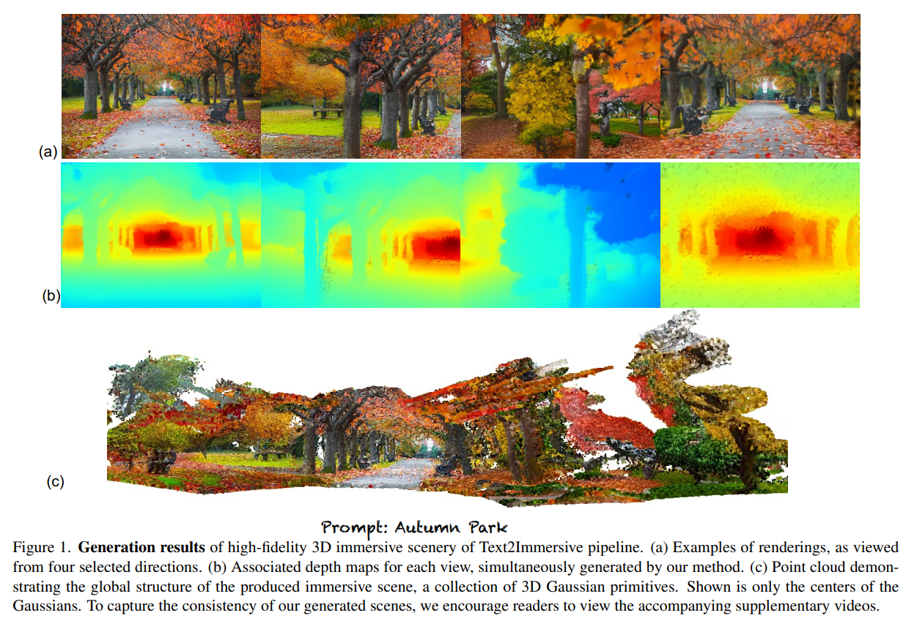  

## Mosaic-SDF for 3D Generative Models
#_3D_generation
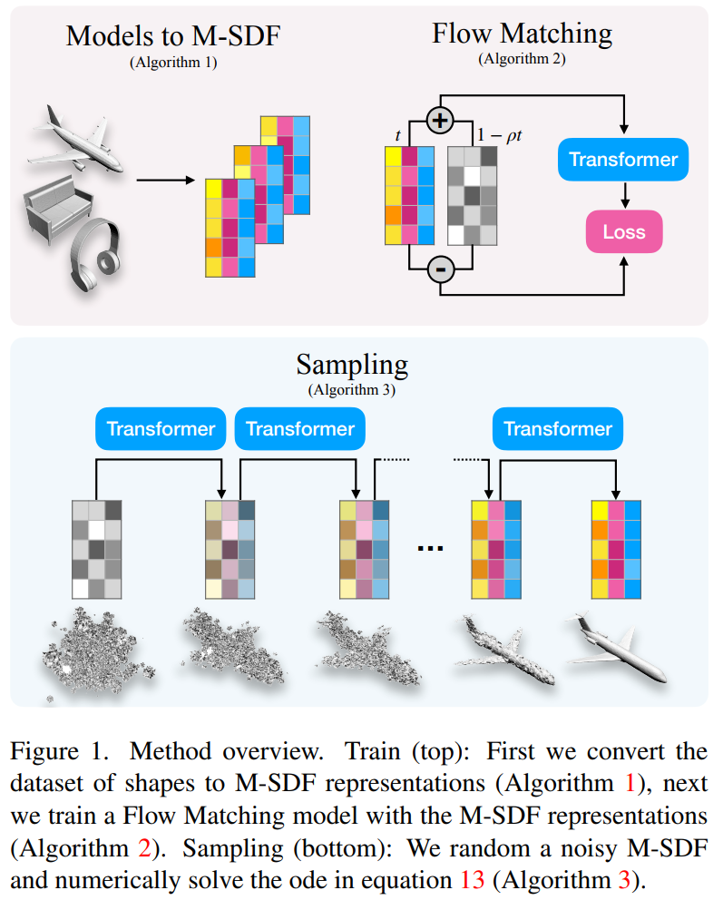  

## Triplane Meets Gaussian Splatting: Fast and Generalizable Single-View 3D Reconstruction with Transformers
#NVS
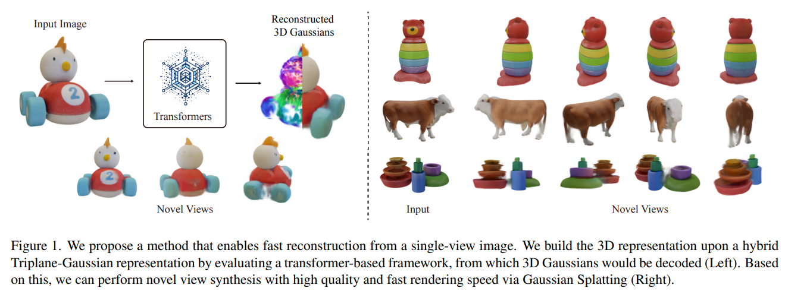  

## VideoLCM: Video Latent Consistency Model
#Video
#video_generation

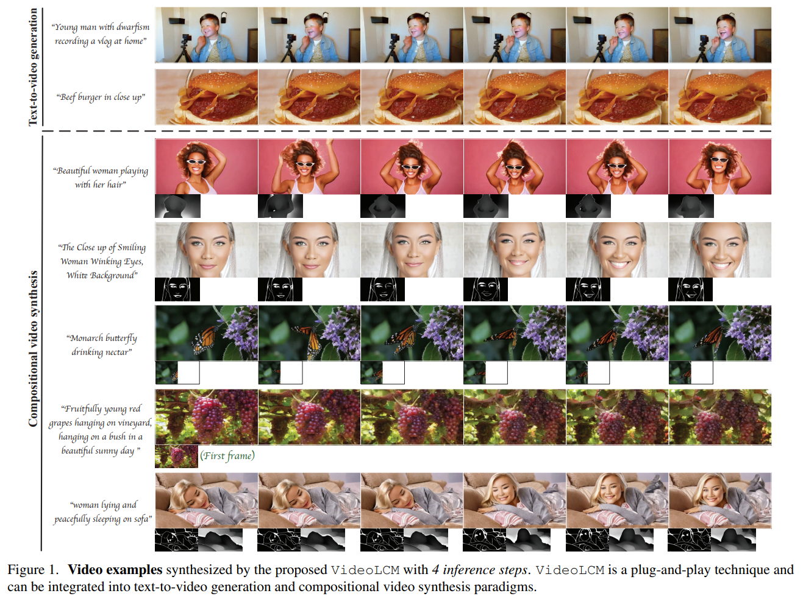  

## PI3D: Efficient Text-to-3D Generation with Pseudo-Image Diffusion
#Text23D
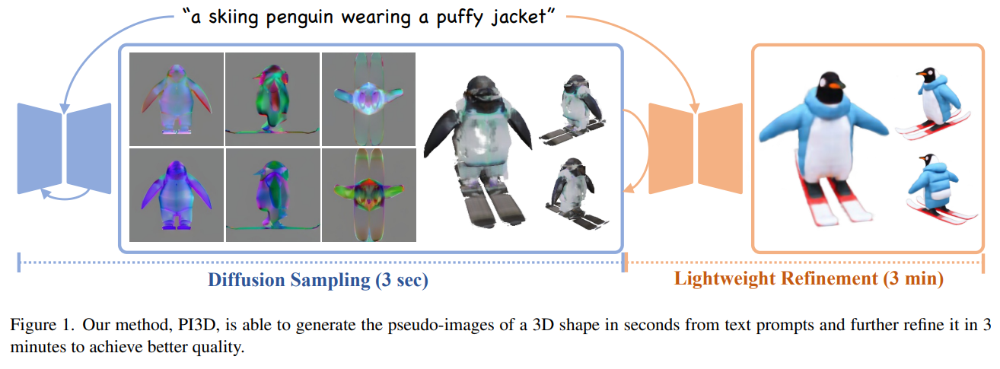  

## LEMON: Learning 3D Human-Object Interaction Relation from 2D Images
#interaction

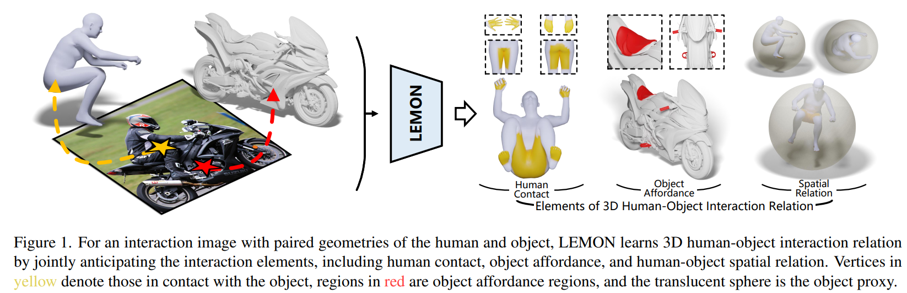  

## Motion Flow Matching for Human Motion Synthesis and Editing
#Video
#motion

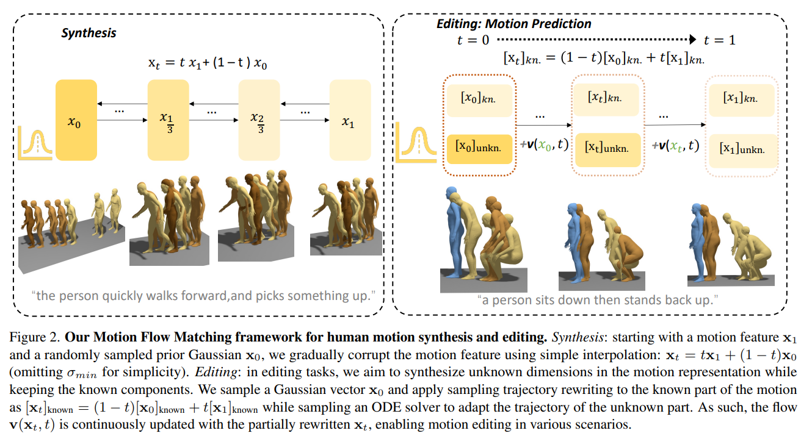  

## SEEAvatar: Photorealistic Text-to-3D Avatar Generation with Constrained Geometry and Appearance
#Avatar_3D

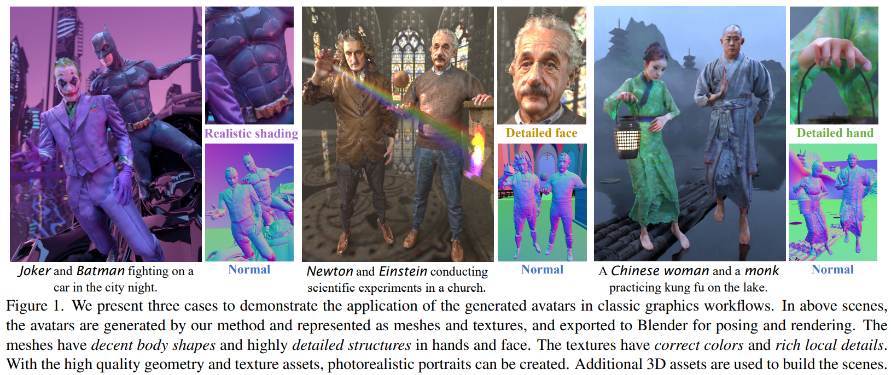  

## SpeedUpNet: A Plug-and-Play Hyper-Network for Accelerating Text-to-Image Diffusion Models
#Diffusion_加速

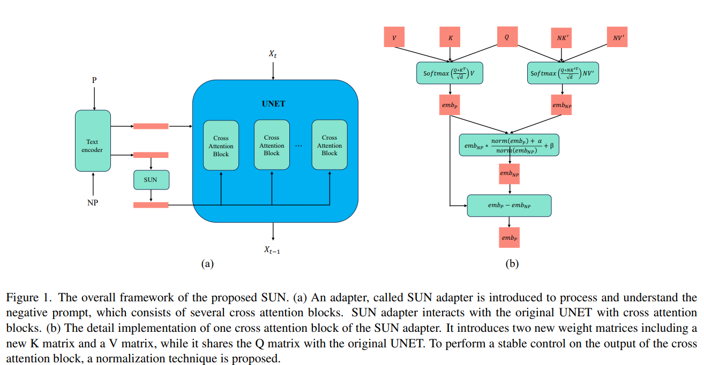  

## Neural Video Fields Editing
#Video
#video_editing
#指令

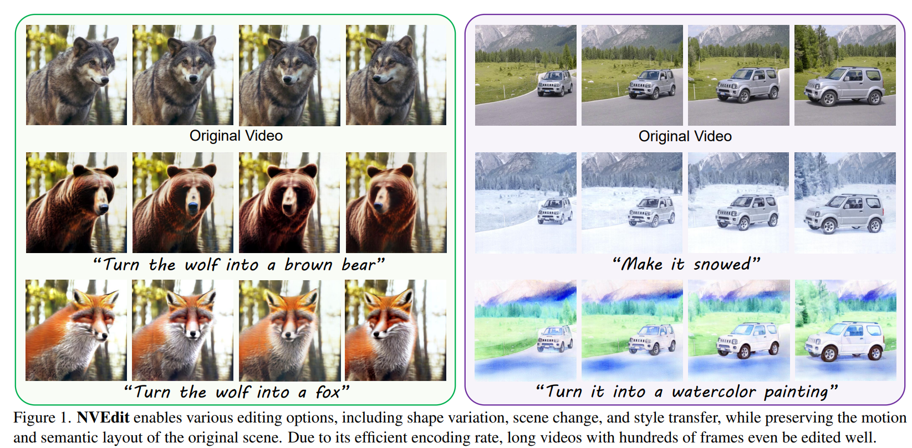  

## Semantic-Driven Initial Image Construction for Guided Image Synthesis in Diffusion Model
#噪音初始化
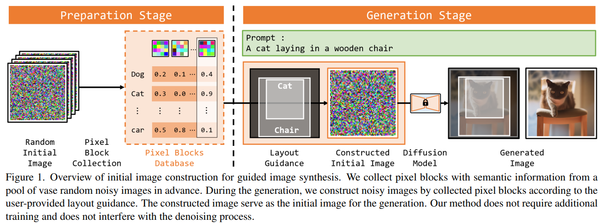  

## Guided Diffusion from Self-Supervised Diffusion Features
#Diffusion_加速
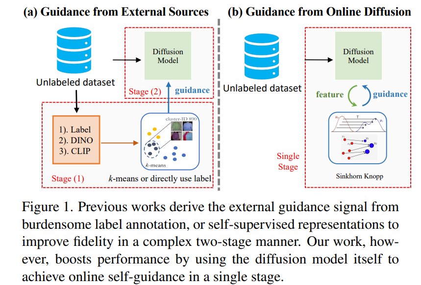  

## Local Conditional Controlling for Text-to-Image Diffusion Models
#可控
#controlNet
#image_editing
#text2img

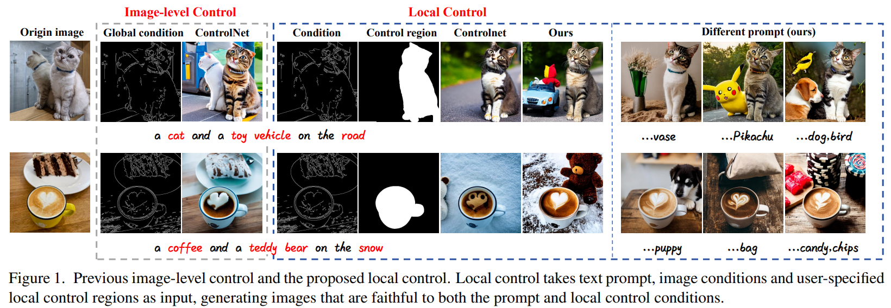  
