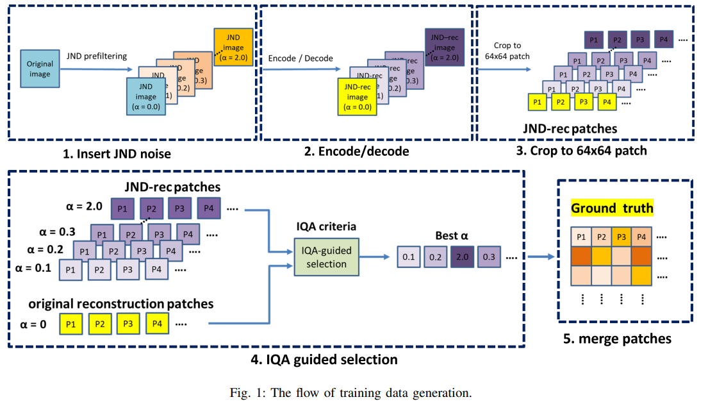
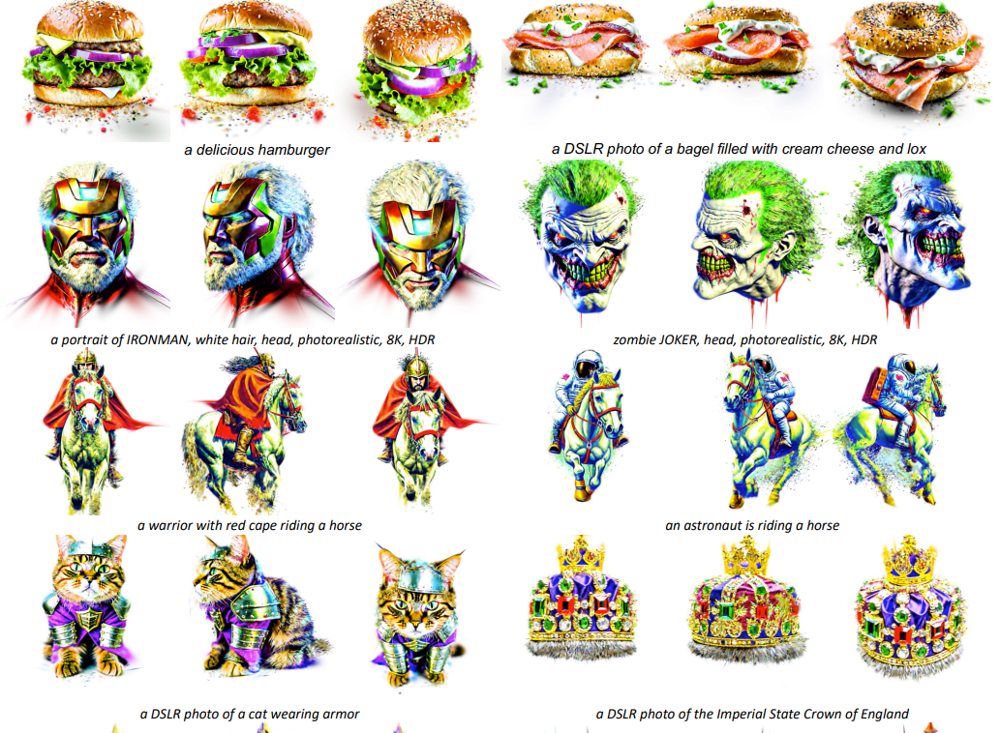
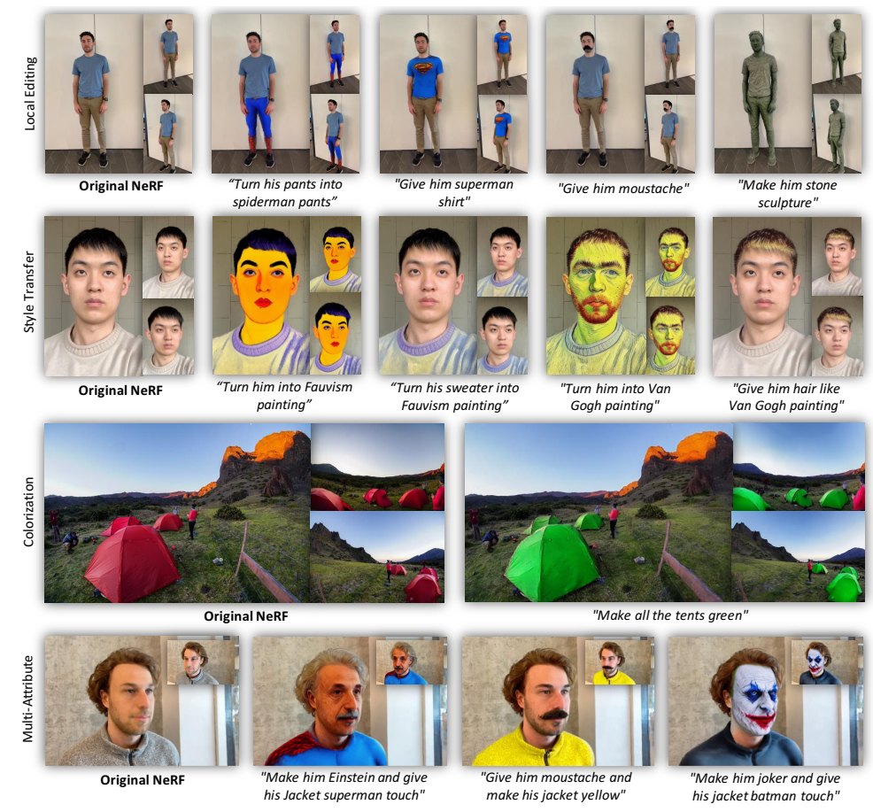
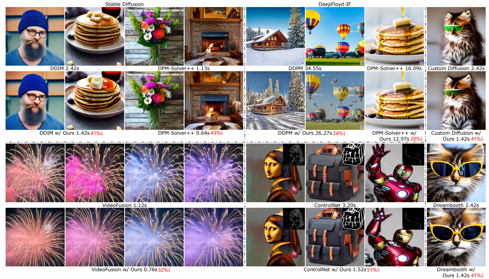
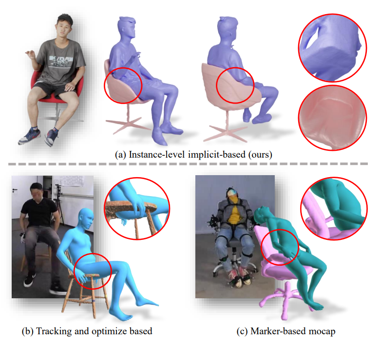
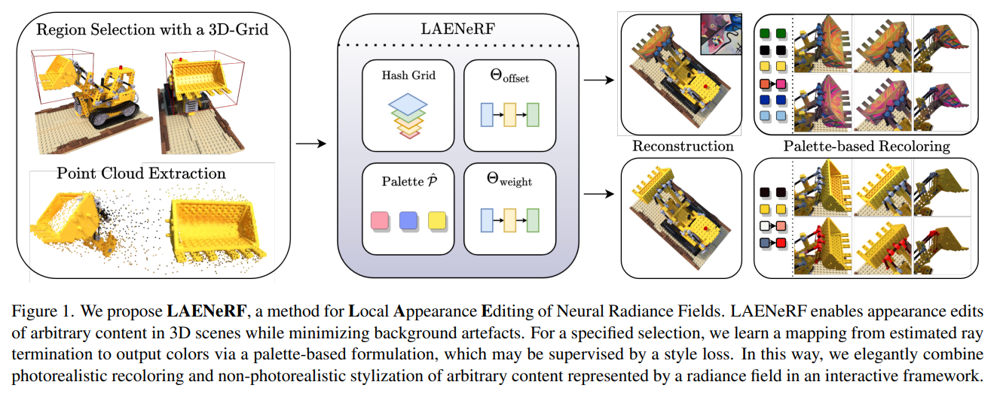

## IQNet: Image Quality Assessment Guided Just Noticeable Difference Prefiltering For Versatile Video Coding
#Video

  

## Stable Score Distillation for High-Quality 3D Generation
#_3D_generation

  

## LatentEditor: Text Driven Local Editing of 3D Scenes
#scene_editing_3D

  

## Faster Diffusion: Rethinking the Role of UNet Encoder in Diffusion Models
#Diffusion_加速

  

## Ins-HOI: Instance Aware Human-Object Interactions Recovery
#interaction

  

## LAENeRF: Local Appearance Editing for Neural Radiance Fields
#nerf

  
