## Paint-it: Text-to-Texture Synthesis via Deep Convolutional Texture Map Optimization and Physically-Based Rendering
#_3D纹理

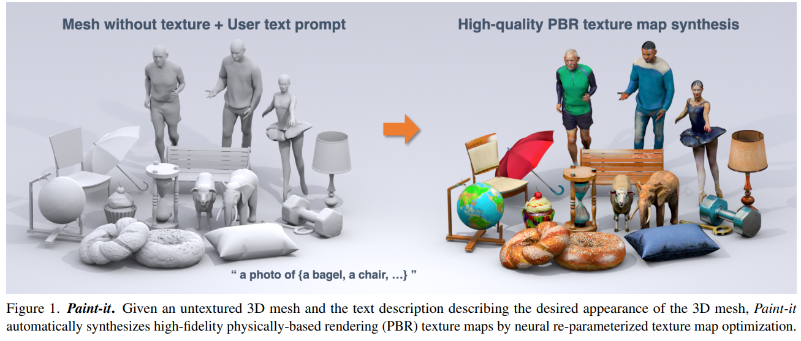  

## SCEdit: Efficient and Controllable Image Diffusion Generation via Skip Connection Editing
#可控

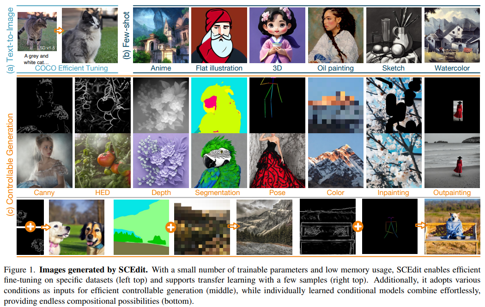  

## Language-Assisted 3D Scene Understanding
#MLLM
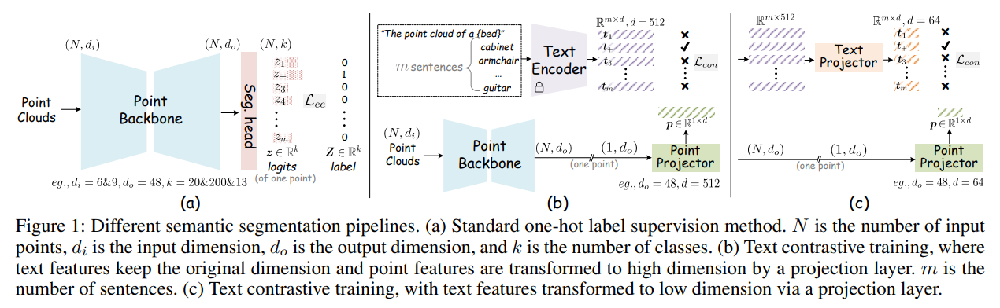  

## VolumeDiffusion: Flexible Text-to-3D Generation with Efficient Volumetric Encoder
#Text23D
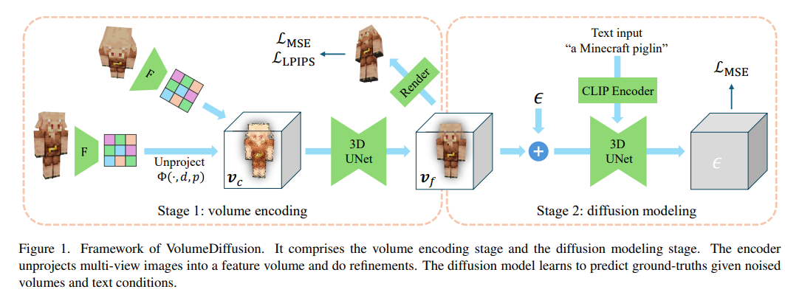  

## Plasticine3D: Non-rigid 3D editting with text guidance
#Non-rigid-3D-editting
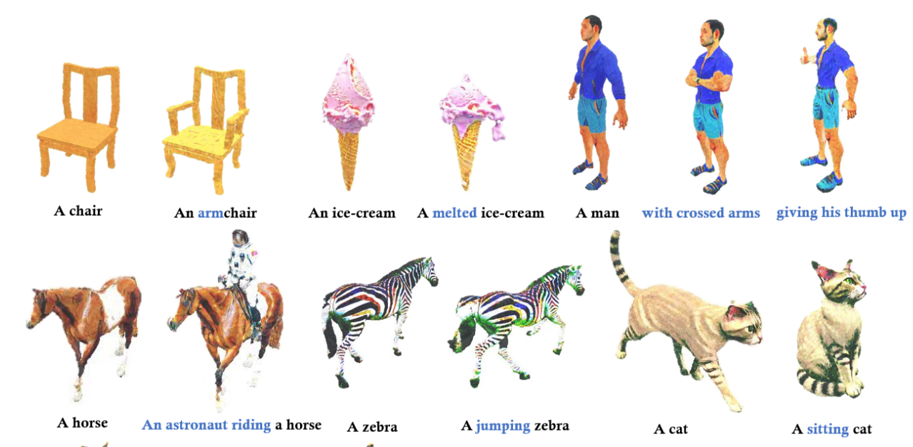  

## MVHuman: Tailoring 2D Diffusion with Multi-view Sampling For Realistic 3D Human Generation
#human
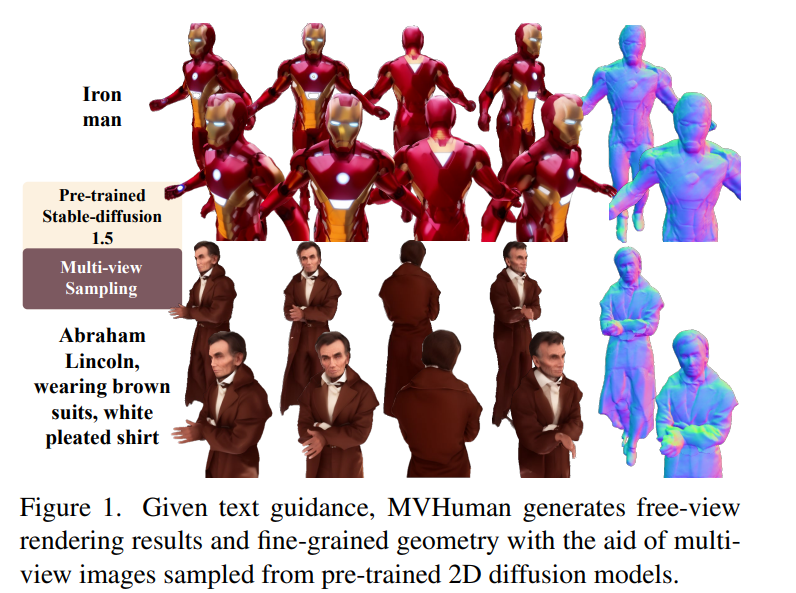  

## Rich Human Feedback for Text-to-Image Generation
#text2img
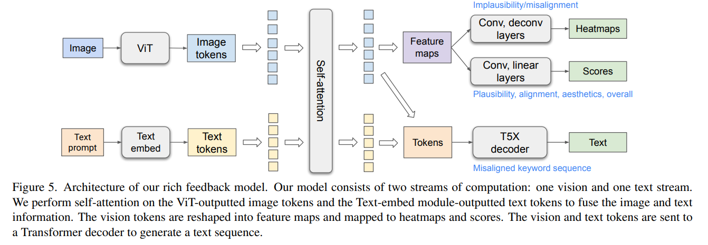  

## VidToMe: Video Token Merging for Zero-Shot Video Editing
#Video
#video_editing

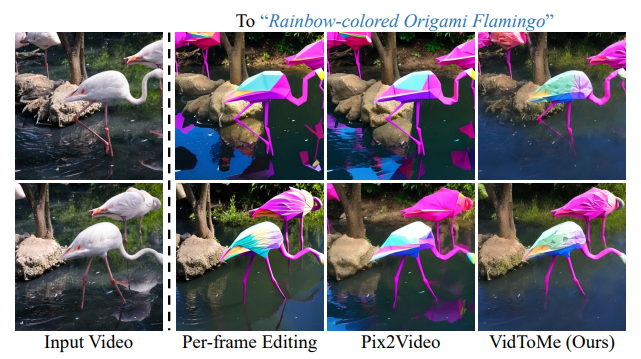  

## Silkie: Preference Distillation for Large Visual Language Models
#MLLM
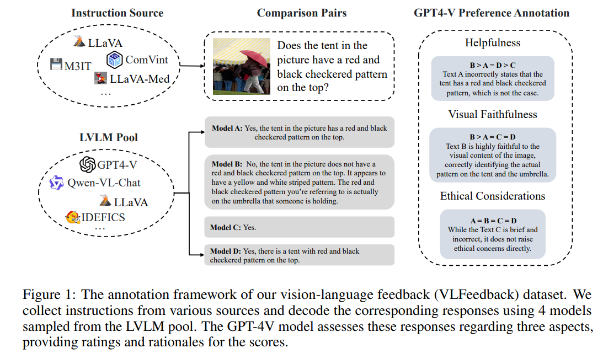  

## Primitive-based 3D Human-Object Interaction Modelling and Programming
#interaction
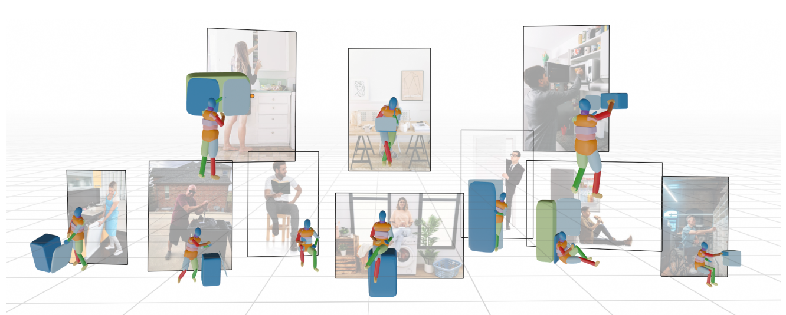  

## Your Student is Better Than Expected: Adaptive Teacher-Student Collaboration for Text-Conditional Diffusion Models
#text2img
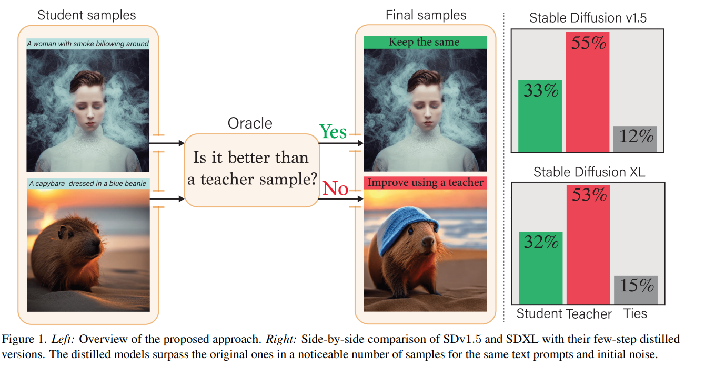  

## Towards Detailed Text-to-Motion Synthesis via Basic-to-Advanced Hierarchical Diffusion Model
#motion
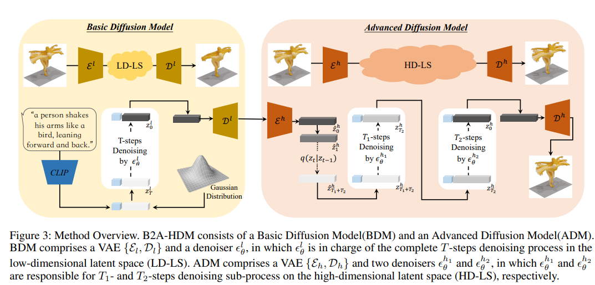  
