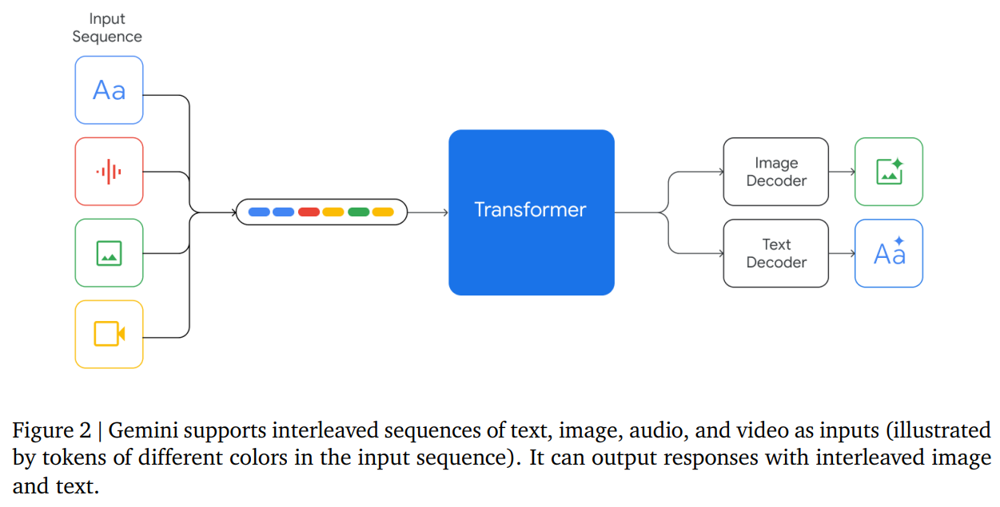
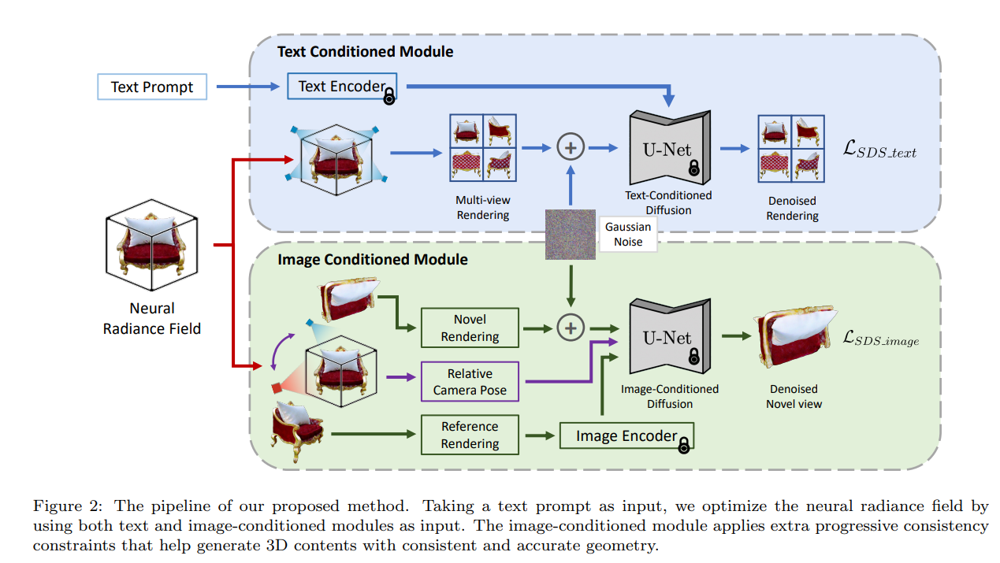
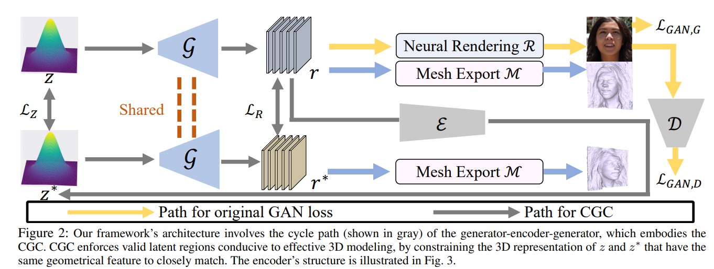
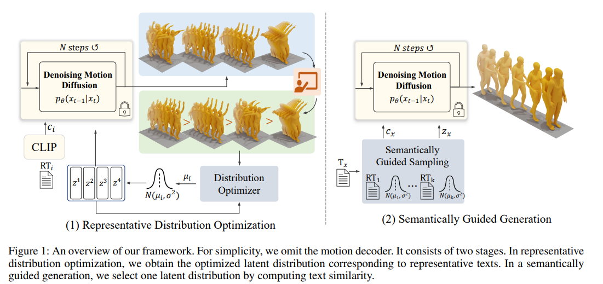
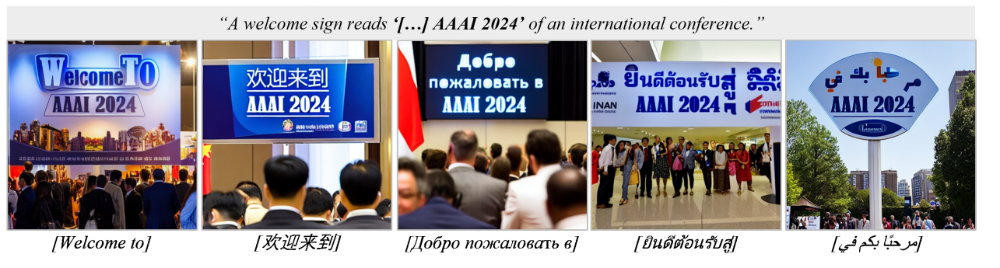
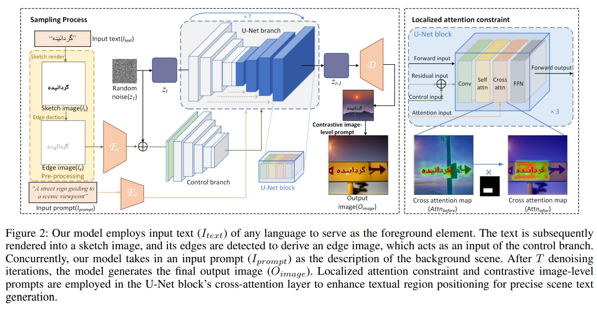
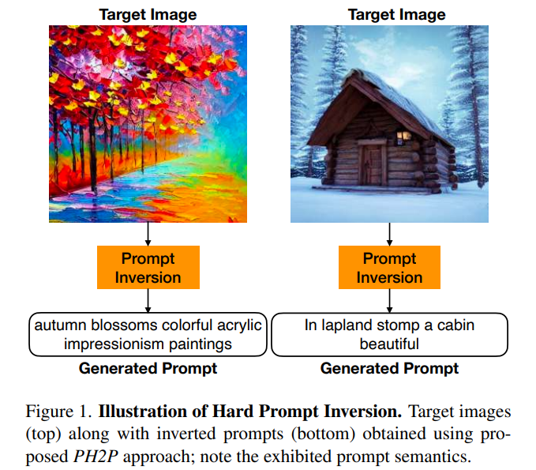

## Gemini: A Family of Highly Capable Multimodal Models
#MLLM

  

## Text-Image Conditioned Diffusion for Consistent Text-to-3D Generation
#Text23D

  

## Self-supervised Learning for Enhancing Geometrical Modeling in 3D-Aware Generative Adversarial Network
#_3D_generation

  

## HuTuMotion: Human-Tuned Navigation of Latent Motion Diffusion Models with Minimal Feedback
#motion
#human
  

## Brush Your Text: Synthesize Any Scene Text on Images via Diffusion Model
#scene_text_generation

  

  

## Prompting Hard or Hardly Prompting: Prompt Inversion for Text-to-Image Diffusion Models
#inversion
#Customization

  

