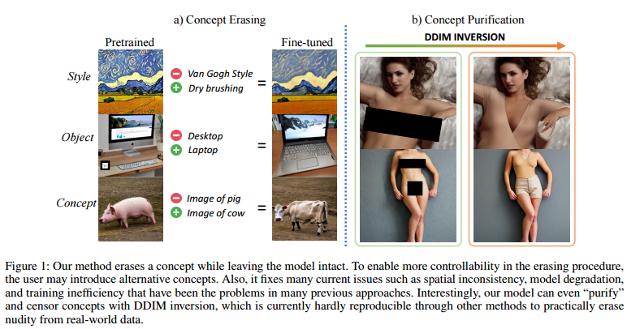

## All but One: Surgical Concept Erasing with Model Preservation in Text-to-Image Diffusion Models

  

本文提出了一种新的技术，使用Diffusion模型实现文本到图像扩散。研究人员提出了一种新的手术概念，称为"Surgical Concept Erasing"，该方法可以针对文本输入中的关键字来移除生成图像中的具有挑战性的概念，而保留其他模式和特征。

