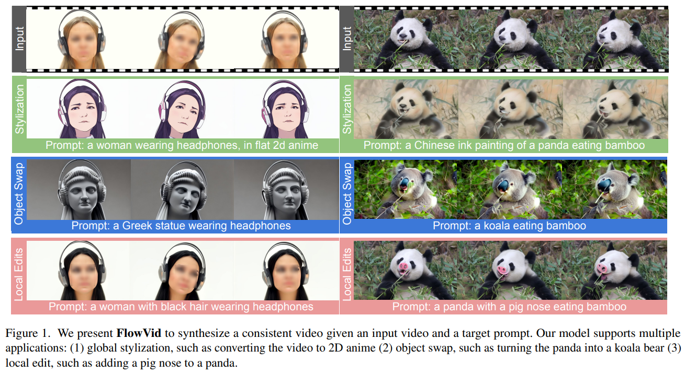
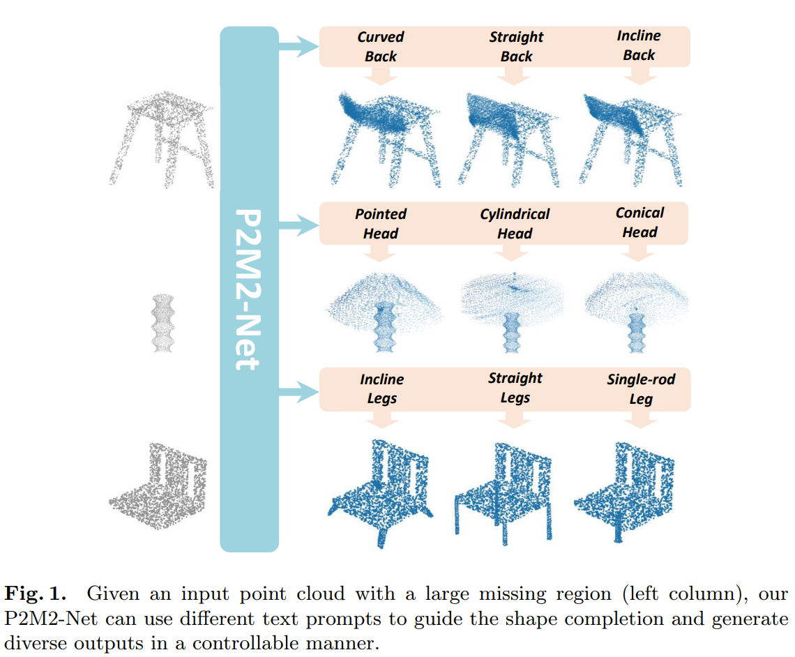
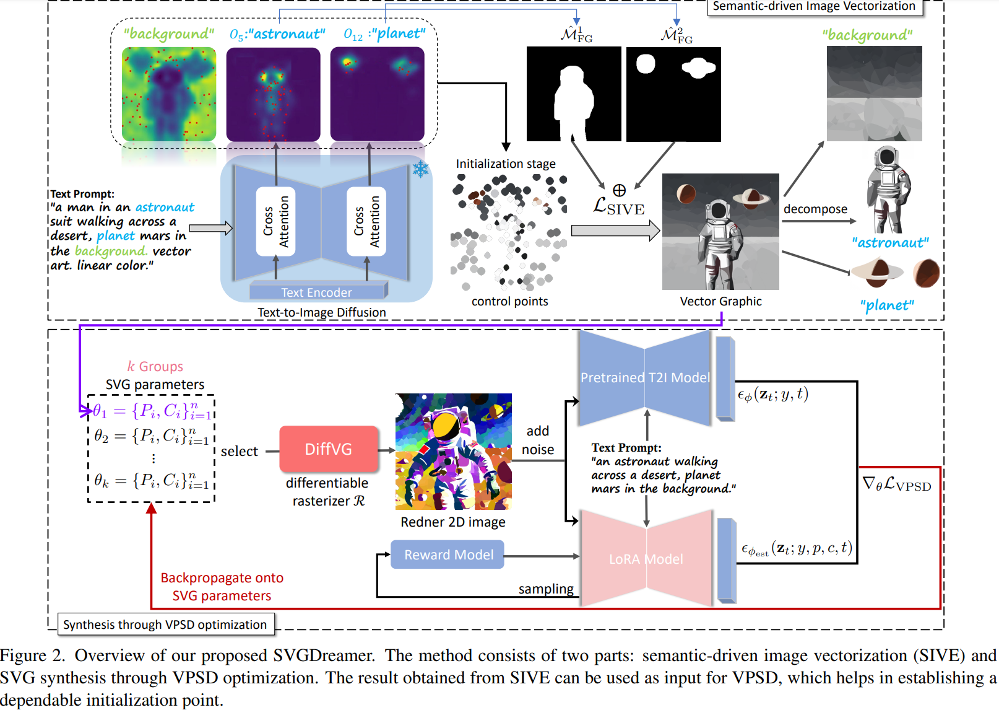
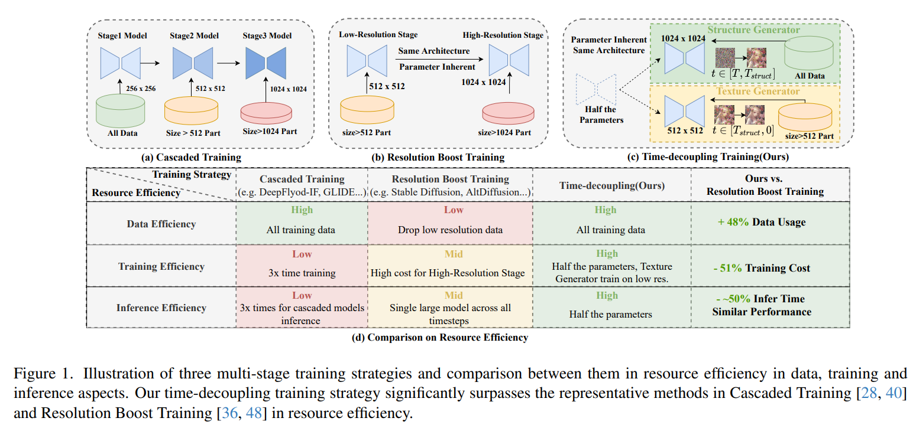
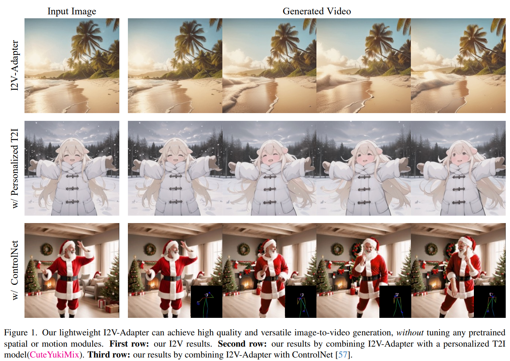
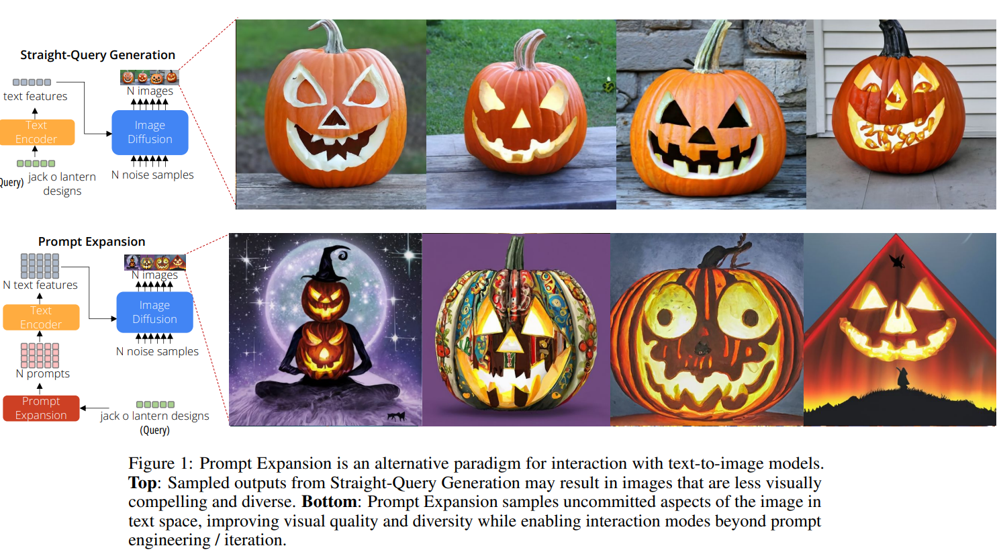
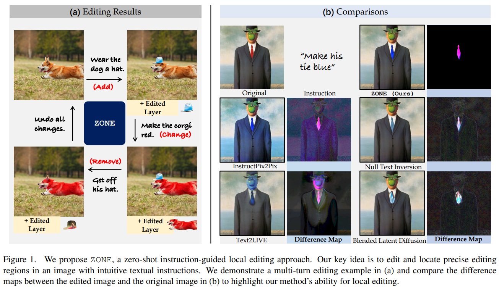
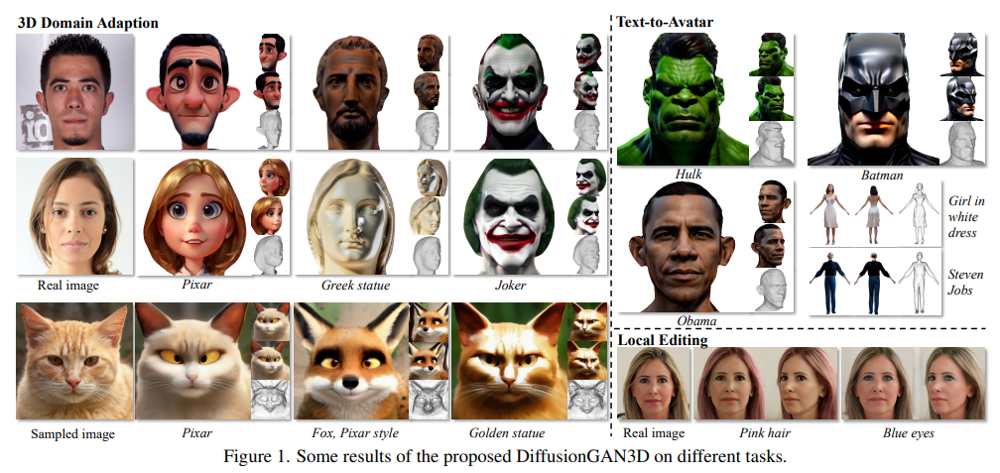
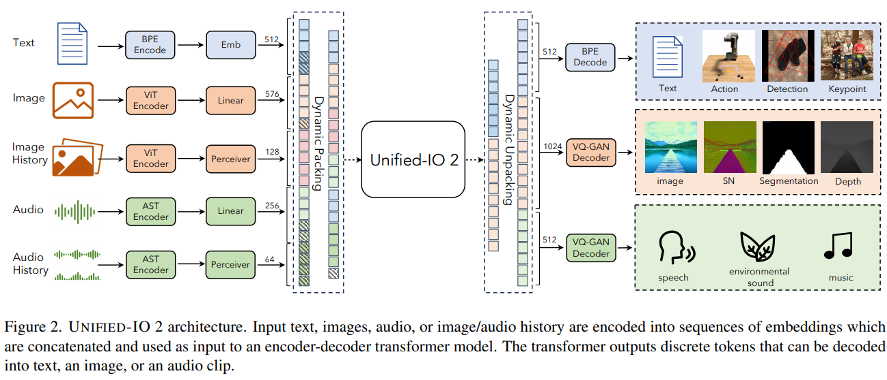
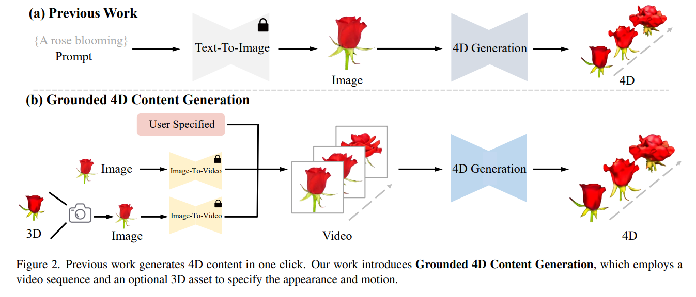

## FlowVid: Taming Imperfect Optical Flows for Consistent Video-to-Video Synthesis

#Video
#video_editing
#video_generation

  

## P2M2-Net: Part-Aware Prompt-Guided Multimodal Point Cloud Completion
#点云编辑

  

## SVGDreamer: Text Guided SVG Generation with Diffusion Model
#SVG

  

## PanGu-Draw: Advancing Resource-Efficient Text-to-Image Synthesis with Time-Decoupled Training and Reusable Coop-Diffusion

#text2img

  

## I2V-Adapter: A General Image-to-Video Adapter for Video Diffusion Models
#Video
#video_editing
#video_generation

  

## PROMPT EXPANSION FOR ADAPTIVE TEXT-TO-IMAGE GENERATION
#text2img

  

## ZONE: Zero-Shot Instruction-Guided Local Editing
#image_editing

  

## DiffusionGAN3D: Boosting Text-guided 3D Generation and Domain Adaption by Combining 3D GANs and Diffusion Priors

#_3d生成

  

## Unified-IO 2: Scaling Autoregressive Multimodal Models with Vision, Language, Audio, and Action
#MLLM

  

## 4DGen: Grounded 4D Content Generation with Spatial-temporal Consistency
#_4D

  
