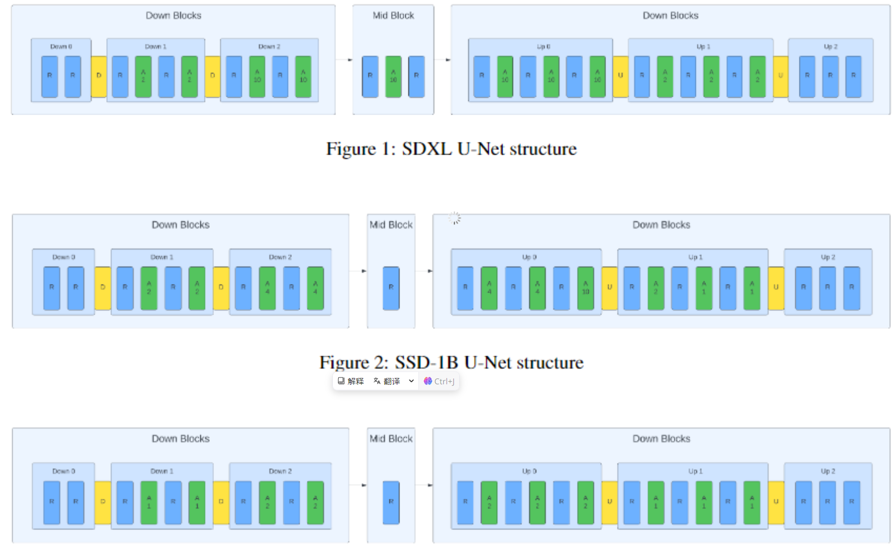

## Diffbody: Diffusion-based Pose and Shape Editing of Human Images
#human

  

这篇论文试图解决的问题是人体图像中姿势和体型编辑的挑战，特别是在进行大幅度编辑时如何保持人物的身份特征（如面部特征和服装纹理）不变。现有的方法在进行大幅度编辑时往往难以处理数据集偏差，导致现实感和人物身份的恶化。论文提出了一种一次性方法，通过使用3D身体模型和扩散模型进行迭代细化，以实现在保持身份特征的同时进行大幅度的姿势和体型编辑。

## Progressive Knowledge Distillation Of Stable Diffusion XL Using Layer Level Loss
#diffusion_efficient

  

这篇论文试图解决的问题是如何降低Stable Diffusion XL (SDXL) 模型的计算需求，同时保持或提升其高质量图像合成的性能。SDXL是一个非常强大的开源文本到图像（T2I）模型，但其庞大的模型规模和计算需求限制了其在资源受限环境中的广泛应用。为了解决这个问题，作者提出了一种知识蒸馏方法，通过层级损失（layer-level losses）逐步移除模型中的冗余部分，从而创建了两个较小规模的模型变体：Segmind Stable Diffusion (SSD-1B) 和 Segmind-Vega。这些变体在保持生成质量的同时，显著减少了模型大小和计算延迟，使得SDXL能够在资源受限的环境中更容易部署。

## CoCoT: Contrastive Chain-of-Thought Prompting for Large Multimodal Models with Multiple Image Inputs

#MLLM

  

这篇论文试图解决大型多模态模型（Large Multimodal Models, LMMs）在处理多图像输入时面临的两个主要问题：

缺乏细粒度感知（Lack of fine-grained perception）：使用自然语言处理视觉内容时，往往会丢失图像细节。复杂的视觉信息，如微妙的光照变化或复杂的图案，通常需要全面的口头描述。然而，当前的多模态模型在提取这些细节信息方面存在不足。

跨多图像信息融合（Tendency to blend information across multiple images）：在处理多图像输入时，LMMs往往难以理解图像之间的关系和互动。基于语言的描述在描述图像内部和跨图像的关系时可能会变得复杂，需要同时解释各个元素及其空间和上下文联系，这通常导致解释模糊或过于冗长。

为了解决这些问题，论文提出了一种名为对比链式思维（Contrastive Chain-of-Thought, CoCoT）的多模态提示策略。这种策略通过引导LMMs比较多图像输入之间的相似性和差异性，然后基于这些相似性和差异性回答关于多图像输入的详细问题，从而增强了LMMs在多图像任务中的表现。

## VASE: Object-Centric Appearance and Shape Manipulation of Real Videos
#Video
#video_editing
#video_generation

  

这篇论文试图解决的问题是如何在真实视频中对单个对象的外观和形状进行精确的编辑和操控。具体来说，论文提出了一个名为VASE（Video Object-centric Appearance and Shape Editing）的框架，旨在实现以下目标：

对象中心的视频编辑：VASE框架专注于对视频中单个对象的编辑，而不是对整个视频帧进行整体编辑。这允许用户在保持视频其余部分不变的情况下，对特定对象进行编辑。

精确的结构修改：除了外观编辑，VASE还允许用户通过操纵单个关键帧的形状来执行精确和明确的结构修改。这通过将期望的关键帧形状输入到一个名为ControlNet的网络中来实现。

无需测试时优化：VASE模型在训练一次后即可应用于推理阶段，无需在测试时进行优化，这提高了其在各种编辑场景中的实用性。

论文通过提出联合流-结构增强（Joint Flow-Structure Augmentation, JFSA）的流程、引入流完成网络（Flow-Completion Network, wFCN）和辅助分割头（Auxiliary Segmentation Head, SH）来解决在推理时模型可能忽视形状编辑的问题，并确保形状编辑的有效性。

总的来说，VASE旨在提供一个灵活且用户友好的视频编辑工具，允许用户通过提供驱动图像来指定单个编辑关键帧的外观和形状，从而在视频中对特定对象进行精确的编辑。