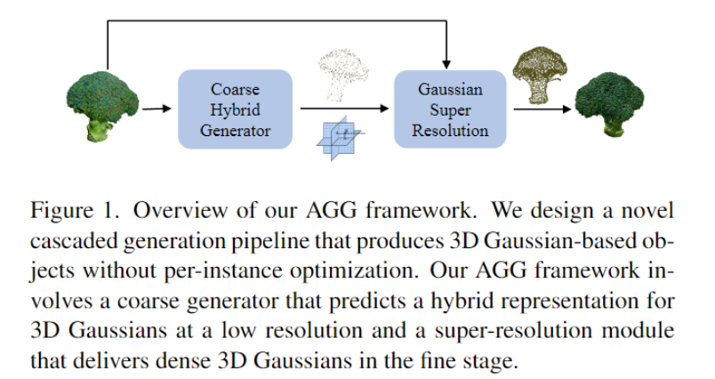
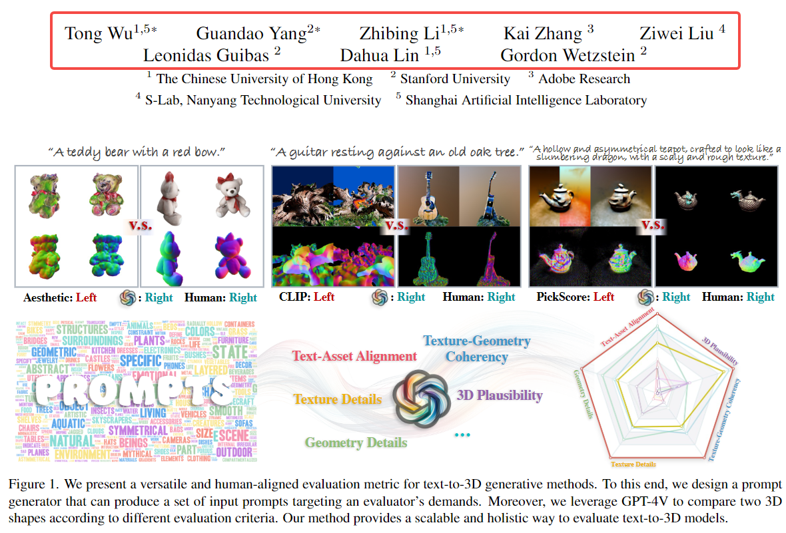
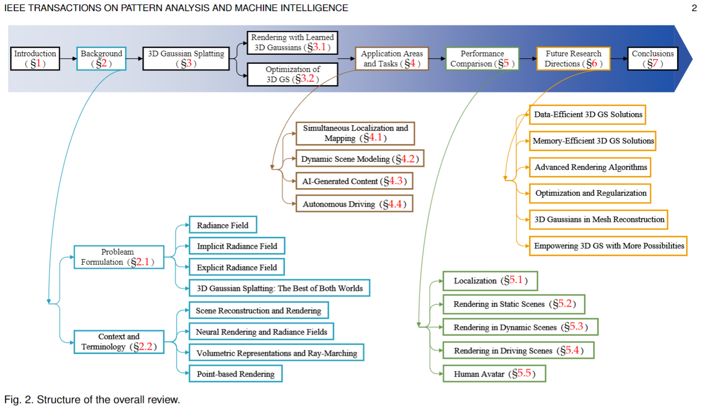
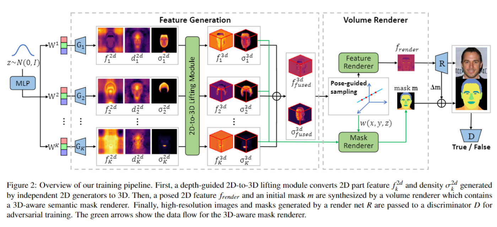
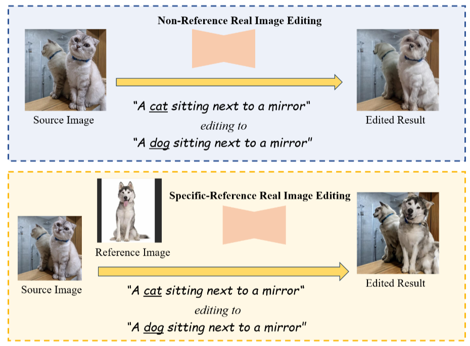
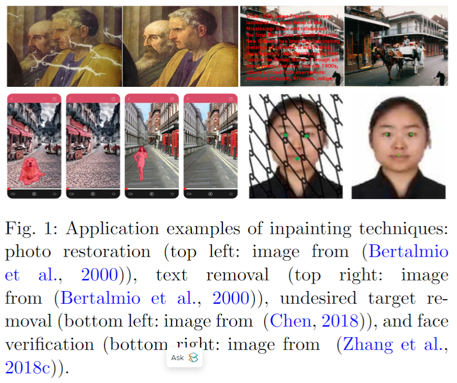
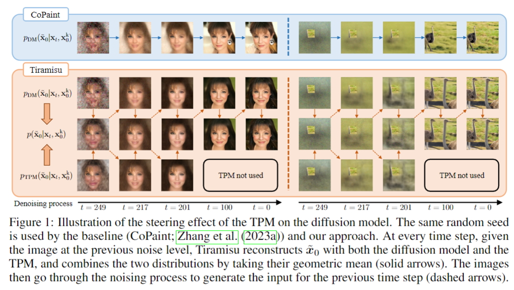
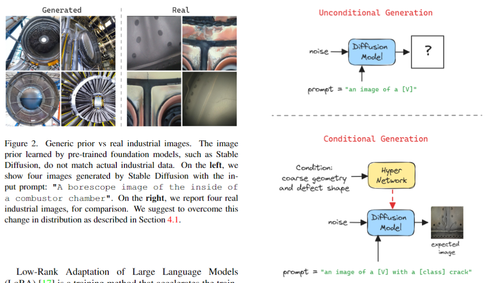
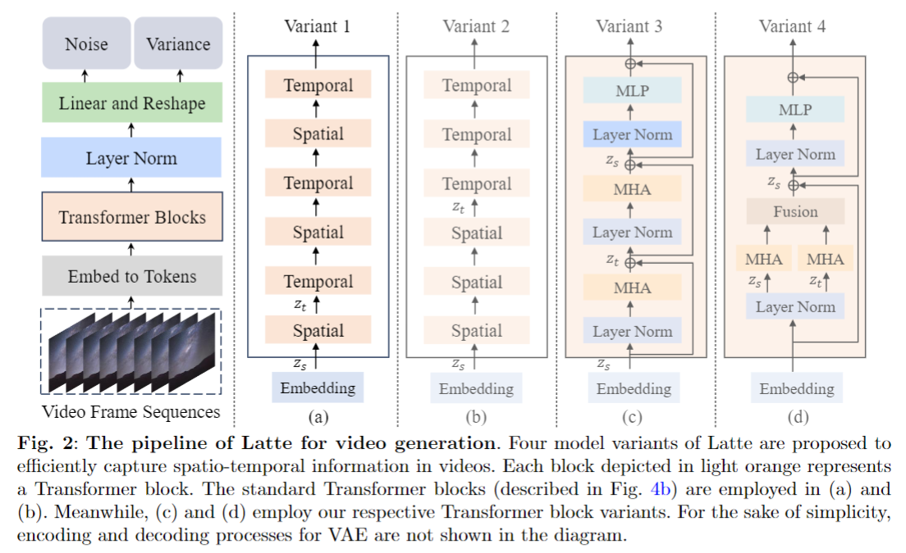

## AGG: Amortized Generative 3D Gaussians for Single Image to 3D
#img23D
#_3d生成

  

这篇论文试图解决的问题是如何从单张图像自动生成3D内容，特别是如何有效地从单张图像生成3D高斯点（3D Gaussians）。现有的3D高斯点生成方法通常基于优化，需要进行多次计算昂贵的得分蒸馏步骤。为了克服这些挑战，论文提出了一个名为AGG（Amortized Generative 3D Gaussians）的框架，该框架能够从单张图像即时生成3D高斯点，消除了每个实例优化的需要。

## GPT-4V(ision) is a Human-Aligned Evaluator for Text-to-3D Generation

#Text23D
#GPT-4

  

大佬云集的工作。

这篇论文试图解决的主要问题是缺乏可靠的评价指标来评估文本到3D生成（text-to-3D generation）模型的性能。现有的评价指标通常只关注单一标准，例如资产与输入文本的一致性，但缺乏灵活性以适应不同的评价要求，并且可能与人类偏好不一致。此外，虽然用户偏好研究可以提供适应性和人类对齐的结果，但它们在扩展时成本高昂、耗时且难以进行。因此，论文提出了一种自动、通用且人类对齐的评价指标，用于评估文本到3D生成模型。

## A Survey on 3D Gaussian Splatting
#Gaussian_Splatting

  

## 3D-SSGAN: Lifting 2D Semantics for 3D-Aware Compositional Portrait Synthesis
#gan_face

  

篇论文旨在解决3D感知肖像合成中的两个主要问题：

细粒度部分级控制：现有的3D感知肖像合成方法可以生成高质量的图像并保持强烈的3D一致性，但大多数方法无法支持对合成图像的细粒度部分级控制。

视图一致性：一些基于GAN的2D肖像合成方法可以实现清晰的面部区域解缠，但由于缺乏3D建模能力，它们无法保持视图一致性。

为了解决这些问题，论文提出了3D-SSGAN，一个新颖的框架，用于3D感知的组合肖像图像合成。

## SpecRef: A Fast Training-free Baseline of Specific Reference-Condition Real Image Editing
#image_editing
#paper_idea

  

这篇论文试图解决的问题是现有基于文本条件图像编辑方法的局限性，特别是在用户对编辑结果特性的控制方面。具体来说，现有方法大多采用非参考编辑（non-reference editing），用户只能提供源图像和文本提示，这限制了用户对编辑结果的控制能力。为了增加用户的自由度，论文提出了一个新的任务，称为特定参考条件真实图像编辑（Specific Reference Condition Real Image Editing），允许用户通过提供参考图像来进一步控制编辑结果，例如替换特定对象。

## Deep Learning-based Image and Video Inpainting: A Survey
#Video

  

这篇论文试图解决的问题是图像和视频修复（inpainting）领域中，如何利用深度学习方法来填充图像和视频中缺失或损坏区域的合理和逼真内容。论文通过全面回顾基于深度学习的方法，包括不同类别的方法、网络架构、训练目标、常见基准数据集、评估指标以及相关实际应用，旨在提供一个关于图像和视频修复领域最新进展的全面概述。此外，论文还讨论了该领域的开放性挑战，并提出了未来研究的潜在方向。

## Image Inpainting via Tractable Steering of Diffusion Models

#image_inpainting

  

这篇论文试图解决的问题是如何在图像修复（inpainting）任务中有效地控制扩散模型（diffusion models）的采样过程。扩散模型在生成逼真图像方面表现出色，但在约束图像生成任务（如图像修复）中，由于无法高效地计算条件后验分布，因此难以控制模型以生成满足特定约束的图像。论文提出了一种新的方法，利用可处理概率模型（Tractable Probabilistic Models, TPMs）来精确且高效地计算条件后验，并利用这一信号来引导扩散模型的去噪过程，以生成与给定像素相一致的高质量修复图像。

## Controllable Image Synthesis of Industrial Data Using Stable Diffusion

#image_generation

  

 这篇论文试图解决在工业环境中获取大规模完全标注数据集的难题，特别是在缺陷检测和分割任务中。在工业环境中，获取大量高质量的标注数据是困难的，因为工程师们努力优化实际的工业流程，尽量减少缺陷产品的数量。此外，生成高质量的标注数据成本高昂且通常需要专家。为了在工业应用中推广和整合人工智能，论文提出了一种新的方法来重用通用预训练生成模型，通过人工扩大小型工业数据集，从而允许生成自标注的缺陷图像。

## Latte: Latent Diffusion Transformer for Video Generation
#Video
#video_generation

  

这篇论文试图解决的问题是生成高质量视频的挑战。具体来说，它关注于如何利用基于Transformer的潜在扩散模型（Latent Diffusion Transformer）来生成具有高度逼真外观和一致运动的视频。论文指出，与图像生成相比，生成高质量视频面临显著挑战，这主要归因于视频的复杂性和高维度，它们包含了高分辨率帧中的复杂时空信息。